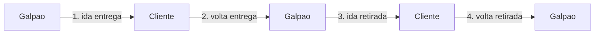
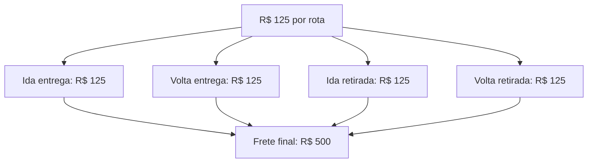

# Motor de Frete: como calcula

O **Motor de Frete** é onde você ensina o LocFlow a calcular o transporte sozinho. Você descreve uma vez **como cobra pelo seu frete** — e, a cada orçamento com endereços preenchidos, o sistema mede a rota e aplica as suas regras, sem você fazer conta.

Esta página é sobre **como o cálculo funciona por dentro**. Onde você **usa** o resultado (a chave "Cobrar frete", as abas automático/manual, o botão "Calcular frete") é assunto de [Valores: mão de obra, frete e descontos](../orcamentos/valores.md). Onde você **liga** o motor, junto dos outros, é [Motores operacionais](motores-operacionais.md).


**Frete automático precisa do Motor de Frete configurado.** Sem ele, o orçamento abre direto no campo de **frete manual** — você digita um valor fechado e segue. O motor é o que troca "digitar à mão" por "calcular sozinho".


## A base de tudo: a Rota Estimada {#a-base-de-tudo-a-rota-estimada}

Antes de qualquer regra, o motor precisa saber **quanto se anda** para atender o pedido. Ele resolve isso com a **Rota Estimada** — e esse é o conceito que destrava tudo o resto.


Texto de ajuda do próprio app (tela do motor):

> O motor calcula o frete sobre uma **Rota Estimada** — a rota considerada no pior cenário possível.
>
> É como se só esse orçamento existisse e o veículo saísse do galpão **exclusivamente para ele**, mesmo que na prática outras entregas saiam juntas no mesmo veículo.


Por que "pior cenário"? Porque, na hora do orçamento, você ainda não sabe se aquele veículo vai sair só para esse cliente ou cheio de outras entregas. O motor assume o caso mais caro — ida e volta dedicadas — para **nunca subfaturar o transporte**. Quando o roteiro for de fato planejado, depois do pedido ganho, o LocFlow otimiza a logística de verdade; mas o **preço** que o cliente vê nasce dessa estimativa conservadora.

### Por que "4 rotas" num aluguel {#a-base-de-tudo-a-rota-estimada}

Cada Rota Estimada é **um trecho fechado** — uma ida tem sempre a sua volta. E um aluguel típico tem **dois movimentos** (a entrega e a retirada), cada um com ida e volta:


Texto de ajuda do app:

> Um aluguel típico envolve **4 rotas estimadas**:
> 1. Ida da entrega (galpão → cliente)
> 2. Volta da entrega (cliente → galpão)
> 3. Ida da retirada (galpão → cliente)
> 4. Volta da retirada (cliente → galpão)
>
> Por isso, valores e limites configurados aqui valem **por rota**, não por orçamento.


Numa **venda** não há devolução: o item sai em definitivo, então sobram **2 rotas** (a ida e a volta da entrega). E se o cliente **retira no galpão**, ou **devolve no galpão**, aquele movimento some — e com ele somem as suas rotas. O motor só conta o que tem deslocamento real.

## Por rota, não por viagem {#por-rota-nao-por-viagem}

Este é o ponto que mais gera confusão — e o que o app mais reforça. **Cada valor que você define é aplicado a cada Rota Estimada**, não ao orçamento inteiro.


Texto de ajuda do app — leia com atenção, porque ele evita a sobrecobrança mais comum:

> Cada cobrança que você cria é aplicada **a cada rota estimada** — não ao orçamento inteiro.
>
> Em um aluguel típico (4 rotas), uma cobrança de **R$ 500 fixo** somaria **R$ 2.000** ao frete final (4 × R$ 500). Por isso é importante pensar **por rota** ao definir valores.


A regra de bolso vem do próprio app:

> Quer cobrar R$ 500 totais no aluguel? Configure **R$ 125 por rota** — o motor aplica nas 4 rotas e o frete final fecha em R$ 500.

Pense sempre em **uma perna do trajeto** ao definir um valor. O motor multiplica pelo número de rotas do cenário — e o [simulador](#o-simulador) mostra a soma final antes de você publicar, justamente para não escorregar nisso.

## Os três perfis {#os-tres-perfis}

Configurar o motor começa por uma pergunta única: **como você cobra pelo seu frete?** A resposta abre um de três perfis — do mais enxuto ao mais flexível. Você escolhe o que descreve a sua operação, e **pode trocar de perfil depois**.

> **Como você cobra pelo seu frete?** Escolha a opção que melhor descreve a sua operação. Você pode mudar de perfil depois.

| Perfil | A pergunta que ele responde | O que ele abre |
| --- | --- | --- |
| **Simples** | "Tenho um método único de cobrança" | **Uma** cobrança que vale para todos os fretes. Mais fácil de configurar. |
| **Intermediário** | "Tenho vários métodos de cobrança" | **Várias** cobranças combinadas — uma por situação (município, distância, época do ano…). |
| **Avançado** | "Quero montar regras manualmente" | Editor de regras com condições aninhadas e múltiplas ações. |


Não sabe qual escolher? O app marca **Simples** como "mais comum". A maioria das operações começa com uma cobrança só e cresce de perfil quando a vida pede — sem perder o que já configurou.


### Perfil Simples {#perfil-simples}

> No perfil simples você configura **uma única cobrança** — aquela que vale para todos os fretes calculados pelo motor.

É o caminho de quem cobra de um jeito só. Exemplo direto do app:

> *"Cobrar R$ 3,50 por km com mínimo de R$ 80"* é uma cobrança simples e suficiente para muitas operações começarem.

E o app já aponta o próximo degrau, para você não se sentir preso:

> Se um dia você precisar tratar situações diferentes (cobrar mais para um município específico, somar uma taxa de combustível, ter preço por época do ano), passe para o perfil **Vários métodos** — lá você adiciona quantas cobranças quiser **sem perder a que já configurou**.

### Perfil Intermediário {#perfil-intermediario}

Aqui você monta uma **lista** de cobranças, e o motor combina todas que se encaixam em cada rota.


Texto de ajuda do app:

> No perfil "vários métodos" você cria uma **lista** de cobranças. Para cada entrega, o motor olha a lista inteira e aplica todas as que se encaixam.
>
> Cobranças com **situações específicas** (como "para Sorocaba" ou "entre 0 e 50 km") são exclusivas: se duas se encaixam, vale só a que aparece primeiro na lista. Reorganize-a para controlar a precedência.
>
> Cobranças com **situações amplas** (como "qualquer entrega" ou "em épocas") sempre somam às demais. Use-as para taxas que valem em cima do valor já calculado.


Em resumo: cobrança **específica** = só a primeira da lista vale (reordene para mandar na prioridade); cobrança **ampla** = sempre soma por cima. O exemplo do app fecha a ideia:

> Duas cobranças para Sorocaba só usam a primeira da lista. Uma "Taxa de combustível" com gatilho "qualquer entrega" sempre soma ao valor final, independentemente.

### Perfil Avançado {#perfil-avancado}

O perfil para quem quer controle total. Em vez de "cobranças", você monta **regras** com condições combinadas por **E / OU**, agrupamentos aninhados, múltiplas ações por regra e limites finos. É o mesmo motor por baixo — só com a porta dos detalhes escancarada.


**Recurso de operação madura.** O editor avançado faz sentido para quem tem regras de frete realmente complexas (por veículo, por faixa, por época cruzada com distância). Para a maioria, **Simples** ou **Intermediário** dão conta — e o Avançado fica reservado para quando você precisar dele.



**Trocar de perfil pode simplificar regras.** Ir de Avançado para Intermediário ou Simples reduz o que não cabe na abstração mais enxuta — o app sempre avisa antes e **preserva a configuração original** até você confirmar. O caminho inverso (subir de perfil) nunca perde nada.


## O que é uma cobrança {#o-que-e-uma-cobranca}

Nos perfis Simples e Intermediário você nunca pensa em "regra" — pensa em **cobrança**, que é uma linguagem bem mais natural.


Texto de ajuda do app:

> Uma **cobrança** é uma situação que você sabe descrever ("para Sorocaba", "no fim de semana", "para entregas longas") com um valor associado ("R$ 500 fixo", "R$ 3/km", "20% a mais").
>
> Você só pensa em **situações e valores**. O motor analisa cada rota estimada e aplica todas as cobranças que se encaixam, somando tudo no final.


Cada cobrança se monta em poucos passos: **quando ela vale** (o gatilho), **quanto cobra** (valor fixo, por km, por minuto) e, se quiser, **limites** (piso, teto, distância mínima).

### Gatilhos e critérios {#gatilhos-e-criterios}

O **gatilho** é a situação que liga a cobrança.

> O **gatilho** define quando a cobrança se aplica: município, distância, tempo de transporte, raio, peso, volume, tipo de rota (ida/volta), épocas do ano ou período do dia.

Para os gatilhos numéricos (km, minutos, kg, m³…), o app faz uma pergunta esperta — **cobrar pela variável** ou **usá-la como filtro**:

> Para variáveis numéricas (km, kg, min, etc.), você decide entre **cobrar por ela** (preço por unidade) ou **usar como critério** (cobrar só quando o valor estiver dentro de um mínimo, máximo ou faixa).

| Você quer… | Escolha | O que acontece |
| --- | --- | --- |
| Multiplicar por quanto andou | **Cobrar por ela** | Define um preço por unidade (ex.: R$ 3 por km). |
| Cobrar só em certos casos | **Usar como critério** | A cobrança só vale se o valor estiver dentro de um mínimo, máximo ou faixa (ex.: "entre 0 e 50 km"). |

Exemplo combinando os dois, direto do app:

> Gatilho "distância" + critério "entre 0 e 50 km" + valor "R$ 100 fixo + R$ 3/km" = cobrança específica para rotas curtas.


Os gatilhos de **sazonalidade** (épocas do ano) e **período do dia** usam as listas que você cadastra em [Horários e sazonalidades](horarios-e-sazonalidades.md). Sem nada cadastrado lá, o app avisa que não há épocas/períodos para escolher.


### Limites da cobrança {#limites-da-cobranca}

Opcionais, para travar valores extremos. Os textos de ajuda do app explicam cada um:

| Limite | Ajuda do app |
| --- | --- |
| **Cobro no mínimo (piso)** | *"Se o cálculo der menos que esse valor, cobro esse mínimo."* |
| **Cobro no máximo (teto)** | *"Se o cálculo der mais que esse valor, cobro esse máximo."* |
| **Distância mínima cobrada** | *"Para cobranças por km: distâncias menores que esse valor são tratadas como esse valor."* |


**Os limites também valem por rota, não por viagem.** Um piso de R$ 80 garante R$ 80 em *cada* rota — num aluguel de 4 rotas, isso é R$ 320 de mínimo no frete. A mesma lógica de [por rota, não por viagem](#por-rota-nao-por-viagem) vale aqui.


## O simulador {#o-simulador}

Antes de publicar — e a qualquer momento depois — você pode **testar o motor com cenários hipotéticos**, sem criar orçamento de verdade e **sem gastar créditos**.


**O simulador é local.** Ele não consulta o mapa nem cria rota real — só roda o seu cálculo de regras com valores que você inventa. Como o próprio app diz: *"Os cálculos são locais — nenhuma rota real é criada."* O cálculo de frete que **consome créditos** é só o do orçamento real, quando mede a rota de verdade.


Como funciona: você escolhe o **cenário logístico** (Aluguel ou Venda; cliente retira/devolve no galpão ou não) e o simulador mostra **quantas rotas** aquele cenário gera. Depois você preenche valores hipotéticos (distância, peso, município…) e vê o **frete final**, com o detalhamento de quais regras foram aplicadas e quantas vezes cada uma.

> Espelha os mesmos controles do orçamento: ajuste para ver como o cenário muda a quantidade de rotas calculadas.

É a melhor forma de pegar o erro de "por rota, não por viagem" antes que ele chegue num cliente: monte um aluguel, veja o frete fechar em 4× o valor por rota, e ajuste se não for o que você esperava.


Se as suas regras dependem de **veículo ou classe veicular**, o simulador avisa que essa seleção ainda não está disponível nele — o cálculo real no orçamento continua funcionando normalmente.


## Por porte {#por-porte}

A mesma tela serve do autônomo ao grande operador — muda só o quanto você mexe.

| Seu porte | Como configurar o frete |
| --- | --- |
| **Autônomo / micro** | Muitas vezes nem precisa do motor: frete **manual**, valor fechado por pedido. Se quiser automatizar, o perfil **Simples** com uma cobrança "R$ X por km, mínimo R$ Y" resolve. |
| **Médio** | Perfil **Simples** ou **Intermediário**: uma cobrança base + uma taxa de combustível que soma sempre, ou preços diferentes por município. Use o simulador para calibrar. |
| **Grande** | Perfil **Intermediário** com várias cobranças por situação, ou o **Avançado** para regras por veículo/faixa e condições cruzadas. Controle fino, real a real. |

A filosofia é a mesma de todo o LocFlow: **abstrair para quem quer simplicidade, revelar números e flexibilidade para quem quer controle.**

---

## Para quem quer os detalhes {#para-quem-quer-os-detalhes}

Daqui para baixo é detalhe de quem gosta de saber a conta por trás. Você **não** precisa disso para usar o motor.

### A Rota Estimada em números {#a-rota-estimada-em-numeros}

Cada Rota Estimada é sempre um **par fechado** (uma ida tem a sua volta). A quantidade de rotas de um orçamento é a soma dos movimentos com deslocamento, vezes dois:

| Cenário | Movimentos com deslocamento | Rotas |
| --- | --- | --- |
| **Venda** com entrega | Entrega (ida + volta) | **2** |
| **Aluguel** com entrega e retirada | Entrega + Retirada | **4** |
| **Aluguel**, cliente retira no galpão | Só retirada | **2** |
| Cliente retira **e** devolve no galpão | Nenhum | **0** (sem frete a calcular) |

O motor avalia **cada regra contra cada rota** e **soma** os resultados. Por isso o valor por rota é a unidade de raciocínio certa.

### Ordem das ações {#ordem-das-acoes}

No perfil **Avançado**, uma regra pode ter várias ações. Independentemente da ordem em que você as cadastrou, o cálculo segue **sempre** esta sequência (texto do app):

> 1. Acréscimo fixo (R$)
> 2. Por unidade (R$/km, R$/min…)
> 3. Acréscimo percentual (%)
> 4. Multiplicador (×)
> 5. Valor fixo (substitui o corrente; ações posteriores atuam sobre ele)

E como as regras se combinam entre si:

> **Primeira compatível** — dentre as regras com esse comportamento, só a de maior prioridade (menor número) é executada. As demais são ignoradas.
>
> **Acumuladora** — sempre executada se as condições baterem, somando ao que as outras regras já calcularam.

(Nos perfis Simples e Intermediário, isso aparece com a linguagem de cobrança "específica" × "ampla" — é a mesma mecânica.)

### Parâmetros disponíveis {#parametros-disponiveis}

O que o motor consegue olhar em cada rota (texto do app, perfil Avançado):

> **Geotemporais** (condição e ação) — distância percorrida, distância radial, tempo de transporte com trânsito e sem trânsito.
>
> **Carga** (condição e ação) — peso bruto e volume. Hoje tratados como constantes por rota: a disposição dos materiais por veículo ainda não é considerada.
>
> **Categóricos** (só condição) — município de origem/destino, classe veicular, veículo e tipo de rota (ida ou volta).
>
> **Temporais** (só condição) — intervalos de tempo do dia e intervalos sazonais anuais. Exigem horários estimados de saída e chegada da Rota.

### Motor versionado {#motor-versionado}

O Motor de Frete guarda histórico (texto do app):

> Toda alteração no motor cria uma nova versão. Versões anteriores ficam preservadas — você consegue auditar exatamente qual configuração foi usada em qualquer frete já calculado.

Na prática: você edita à vontade em **rascunho**, simula, e só quando **publica** o motor passa a valer para os orçamentos novos. Os fretes já calculados continuam atrelados à versão que os gerou — nada muda retroativamente.


**Cálculo do frete × aprovação do frete são dois ajustes diferentes.** Esta página é sobre **quanto** o frete custa. **Se** um frete alto precisa de aval antes de o orçamento seguir é a *política de aprovação*, configurada à parte — veja [Aprovação de orçamento](../orcamentos/aprovacao.md) e [Motores operacionais](motores-operacionais.md).


## Situações reais {#situacoes-reais}

- **"Coloquei R$ 500 e o frete saiu R$ 2.000."** É o motor aplicando os R$ 500 nas 4 rotas do aluguel. Você queria R$ 500 totais? Configure **R$ 125 por rota**. Confira no simulador antes de publicar.
- **Taxa de combustível em cima de tudo.** No perfil Intermediário, crie uma cobrança com gatilho "qualquer rota" e um valor (fixo ou %). Por ser **ampla**, ela sempre soma ao que as outras cobranças já calcularam.
- **Preço diferente por cidade.** Duas cobranças "para Sorocaba" e "para Campinas", cada uma com seu valor. Como são **específicas**, o motor usa a que casar com o destino — e a ordem na lista resolve empates.
- **Frete mínimo para entregas curtas.** Cobrança por km com **piso** de R$ 80: rotas curtas nunca saem abaixo do mínimo operacional. Lembre que o piso vale por rota.
- **Testar sem gastar crédito.** Antes de mexer no motor de verdade, abra o simulador, monte um aluguel típico e veja o frete final — tudo local, zero consumo.

## Próximo passo {#proximo-passo}

- Veja onde o resultado aparece no orçamento em [Valores: mão de obra, frete e descontos](../orcamentos/valores.md).
- Entenda os movimentos que geram as rotas em [Movimentos, janelas e galpão de origem](../orcamentos/movimentos-e-janelas.md).
- Ligue o motor junto dos outros em [Motores operacionais](motores-operacionais.md).
- Cadastre épocas e períodos do dia para os gatilhos temporais em [Horários e sazonalidades](horarios-e-sazonalidades.md).
- Configure **quando** um frete alto trava o orçamento em [Aprovação de orçamento](../orcamentos/aprovacao.md).
- Dúvida em algum termo? Consulte o [glossário](../primeiros-passos/glossario.md).
