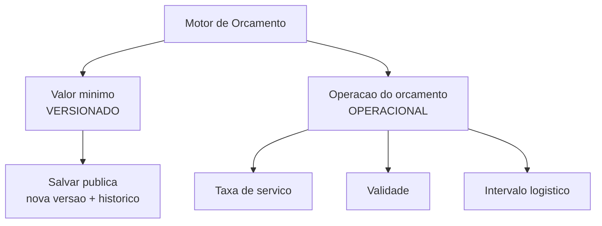

# Motor de Orçamento

O **Motor de Orçamento** é onde você define os **padrões da sua proposta**: a partir de quanto um orçamento vale a pena fechar, qual taxa de serviço já vem sugerida, por quantos dias a proposta fica de pé e qual a folga mínima de horário em cada entrega ou retirada. Configura uma vez, e o LocFlow já monta os orçamentos novos seguindo essas regras.

Por dentro, ele tem **dois lados** que funcionam de maneira diferente — e vale entender a diferença antes de mexer:

| Lado | O que guarda | Como salva |
| --- | --- | --- |
| **Valor mínimo de orçamento** | O **corte** mínimo do orçamento | Tem **histórico de versões** |
| **Operação do orçamento** | Taxa de serviço, validade e intervalo logístico | **Configuração única**, sem histórico |


**Por que dois lados?** O **valor mínimo** é uma regra comercial — vale guardar o registro de quando você mudou esse limite, para relatórios de venda. Os demais são **padrões operacionais**: ajustes do dia a dia que só precisam refletir o estado atual. Por isso um é versionado e o outro é editado direto.


## Valor mínimo de orçamento {#valor-minimo-de-orcamento}

É o **corte**: o **valor que o total do orçamento precisa atingir** para você conseguir fechá-lo. Se o orçamento ficar abaixo desse limite, o sistema **avisa e não deixa criar** até você ajustar o valor — ou revisar o corte.


Este é o texto de ajuda que aparece no "?" da própria tela:

> O corte de orçamento é o valor mínimo que o total do orçamento deve atingir.
>
> Se o valor final ficar abaixo desse limite, o sistema avisa o operador e não permite criar o orçamento até que o valor seja ajustado ou o corte revisado.


Na tela, você digita um valor em reais e salva. Como esse é o lado **versionado** do motor, ao salvar o LocFlow **publica uma nova versão** em vigor para toda a organização. No alto da tela, um cartão **"Configuração em vigor"** mostra desde quando ela vale, com um atalho **"Ver histórico de versões"** para conferir o que estava valendo antes.


**Para que serve na prática:** o corte é um piso de rentabilidade. Ele impede que saia um pedido pequeno demais para compensar o trabalho de separar, entregar e cobrar — um freio simples contra o orçamento que dá mais dor de cabeça do que lucro.


## Operação do orçamento {#operacao-do-orcamento}

Da tela do valor mínimo, o atalho **"Operação do orçamento"** leva aos **padrões operacionais** da proposta. São três parâmetros — e, ao contrário do corte, eles **não guardam histórico**: você edita direto e vale a versão atual.


O próprio LocFlow resume na tela:

> Parâmetros padrão usados ao montar orçamentos. São políticas internas (sem histórico) — diferente do corte, que é versionado no Motor de Orçamento.


### Taxa de serviço {#taxa-de-servico}

Uma **porcentagem padrão** que já vem sugerida ao montar um orçamento, para agilizar. Em alguns negócios ela aparece como **mão de obra** — é a mesma ideia: o acréscimo que cobre o trabalho além dos itens (montagem, instalação, operação). Veja como ela entra no preço em [Valores: mão de obra, frete e descontos](../orcamentos/valores.md#mao-de-obra).

A taxa de serviço é **opcional** — você pode deixar em branco e definir caso a caso.


O texto de ajuda da tela:

> A taxa de serviço é um valor padrão que auxilia na criação de orçamentos com mais agilidade.
>
> Ela serve como referência inicial ao montar um orçamento. Orçamentos com taxa diferente da configurada aqui ainda podem ser criados normalmente.


Ou seja, é **só um padrão**: nada impede um orçamento com taxa diferente. Quando preenchida, precisa ficar entre **0,01% e 100%**.

### Validade do orçamento {#validade-do-orcamento}

Por **quantos dias**, a partir da criação, a proposta continua de pé. Serve para que preços e regras antigas não fiquem valendo eternamente. O padrão de fábrica é **7 dias**, mas você ajusta para o ritmo do seu negócio — e, como os outros, é só um padrão: o operador pode mudar a validade em cada orçamento.


O texto de ajuda da tela:

> A validade do orçamento define por quantos dias, a partir da data de criação, aquele orçamento permanece reservado.
>
> Preços e políticas mudam com frequência; a validade evita orçamentos com regras antigas. O valor aqui definido é apenas um padrão para agilizar novos orçamentos — o operador pode alterar a validade em cada orçamento.
>
> Qualquer pré-reserva de itens deve respeitar o prazo de validade: os itens só ficam pré-reservados enquanto o orçamento não tiver vencido. Para saber se a pré-reserva bloqueia itens do estoque, consulte o Motor de Estoque.



**Validade e estoque andam juntos.** Enquanto a proposta está dentro da validade, qualquer pré-reserva de itens vale; depois de vencer, os itens deixam de ficar segurados. **Se** essa pré-reserva chega a bloquear o item para outro cliente é decisão do **Motor de Estoque** — veja [Duração, cobrança e bloqueio de uso](../orcamentos/duracao-e-bloqueio.md).


Informe um número **inteiro de dias maior que zero**.

### Intervalo mínimo logístico {#intervalo-minimo-logistico}

Toda entrega e retirada acontece **dentro de uma janela de horário** — não dá para garantir chegada num minuto cravado. O intervalo mínimo logístico é a **folga mínima** que cada movimento (entrega ou retirada) precisa ter entre o início e o fim da sua janela, para reduzir o risco de atraso. O padrão de fábrica é **60 minutos (1 hora)**.


O texto de ajuda da tela:

> Toda entrega e retirada ocorre dentro de um intervalo de horários — não é possível garantir chegada em um minuto exato.
>
> O intervalo mínimo logístico define a folga mínima exigida entre o início e o fim de cada movimento (entrega ou retirada), reduzindo risco de atrasos e imprevistos.
>
> Se algum movimento tiver intervalo menor que o mínimo configurado, o sistema alerta o operador, que deve consentir com o risco para prosseguir com a criação do orçamento.


Você informa em **minutos** (número inteiro maior que zero), e a tela mostra o equivalente em horas logo abaixo — por exemplo, **90 min** vira *"Equivalente a 1h30"*. Diferente do corte, aqui o aviso **não trava**: se uma janela for mais apertada que o mínimo, o sistema alerta, mas você pode **consentir com o risco** e seguir.

## Versionado × operacional {#versionado-x-operacional}

Para fixar a diferença entre os dois lados do motor:

| | Valor mínimo | Operação do orçamento |
| --- | --- | --- |
| **Guarda histórico?** | Sim — versões com data | Não — vale a versão atual |
| **Ao salvar** | Publica uma nova versão | Edita direto |
| **Trava o orçamento?** | Sim — abaixo do corte, não cria | Só a taxa/validade; o intervalo **alerta** mas deixa seguir |


**Isto aqui não é a aprovação por frete.** Travar um orçamento à espera do aval de alguém (por exemplo, quando o frete passa de um limite) é outra configuração — vive no **Motor de Frete**, não aqui. Veja [Aprovação de orçamento](../orcamentos/aprovacao.md).


## Por porte {#por-porte}

A mesma tela serve do autônomo ao operador grande — muda o quanto você mexe.

| Seu porte | Como usar o Motor de Orçamento |
| --- | --- |
| **Autônomo / micro** | Deixe no padrão. Sem valor mínimo, taxa de serviço em branco, validade de 7 dias. Você precifica caso a caso e nada trava. |
| **Médio** | Defina um **valor mínimo** que faça o pedido pequeno valer a pena, e uma **taxa de serviço** padrão para não esquecer de cobrar a mão de obra. Ajuste a **validade** ao seu ciclo de fechamento. |
| **Grande** | Use o **histórico do valor mínimo** para acompanhar como o seu piso evoluiu, e aperte o **intervalo logístico** para casar a margem das janelas com a realidade da sua frota. |

---

## Para quem quer os detalhes {#como-aplica}

A partir daqui é detalhe de quem gosta de saber a conta por trás. Você **não** precisa disso para usar o LocFlow.

### Como cada padrão age no orçamento {#como-aplica-numeros}

- **Valor mínimo (corte):** ao tentar criar/fechar, o sistema compara o **total** do orçamento com o corte em vigor. Se o total for **menor** que o corte, **bloqueia** com uma mensagem como *"Valor total do orçamento (R$ …) abaixo do corte mínimo de R$ …"*. Igual ou acima, segue.
- **Taxa de serviço:** quando definida, ela incide **sobre o total dos itens** (não sobre o frete) — `total dos itens × (taxa ÷ 100)` é somado como acréscimo. Sem taxa configurada, não muda nada. É a mesma lógica da mão de obra em porcentagem descrita em [Valores](../orcamentos/valores.md#mao-de-obra).
- **Validade:** conta os dias **a partir da data de criação**. Dentro do prazo, a pré-reserva dos itens vale; vencida, os itens deixam de ficar segurados.
- **Intervalo mínimo logístico:** para cada movimento **agendado** com janela de horário, o sistema compara a **duração da janela** com o mínimo. Se for **menor ou igual**, alerta — mas, com o seu consentimento, deixa prosseguir.

### Sobre o versionamento do valor mínimo {#versionamento}

O **valor mínimo** é o único parâmetro deste motor com versão. Cada vez que você salva, ele **publica uma nova versão em vigor** para a organização e arquiva a anterior, com a data de quando passou a valer. O cartão **"Configuração em vigor"** e o **"Ver histórico de versões"** existem por causa disso. A **operação do orçamento** (taxa, validade, intervalo) é gravada por cima da configuração atual, sem trilha de versões.


Editar o Motor de Orçamento depende de **permissão**. Se você só tem acesso de leitura, vê os valores em vigor mas não consegue salvar; se não encontra a opção, fale com quem administra a conta. Veja [Colaboradores e acessos](colaboradores-e-acessos.md).


## Situações reais {#situacoes-reais}

- **Pedido pequeno demais para valer a pena.** Você define um **valor mínimo** que cobre o custo de separar e entregar. Quando um orçamento fica abaixo dele, o sistema barra — você ajusta o valor ou, conscientemente, revisa o corte.
- **Esquecer de cobrar a montagem.** Configure a **taxa de serviço** padrão em %. Todo orçamento novo já vem com ela sugerida sobre os itens — e você ainda pode mudar caso a caso.
- **Proposta antiga sendo aceita semanas depois.** Com a **validade** ajustada, a proposta vence no prazo certo e você não fica preso a um preço velho. O cliente que demorou recebe um orçamento novo, com preços atuais.
- **Janela de entrega apertada demais.** O operador agenda uma entrega com janela de 30 minutos e o mínimo é 60. O sistema alerta sobre o risco de atraso; o operador confirma que entende e segue.
- **Acompanhar a evolução do seu piso.** Você subiu o valor mínimo no início do ano. Meses depois, o **histórico de versões** mostra desde quando cada piso valeu — útil para entender relatórios de venda.

## Próximo passo

- Veja todos os motores e como se encaixam em [Motores operacionais](motores-operacionais.md).
- Entenda como a taxa de serviço entra no preço em [Valores: mão de obra, frete e descontos](../orcamentos/valores.md).
- Para o **travamento por frete** (que é outro motor), veja [Aprovação de orçamento](../orcamentos/aprovacao.md).
- Para como a validade se relaciona com a reserva de itens, veja [Duração, cobrança e bloqueio de uso](../orcamentos/duracao-e-bloqueio.md).
- Para definir quem pode editar este motor, veja [Colaboradores e acessos](colaboradores-e-acessos.md).
