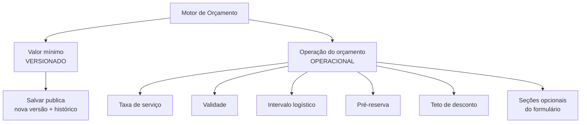

# Motor de Orçamento

O **Motor de Orçamento** é onde você define os **padrões da sua proposta**: a partir de quanto um orçamento vale a pena fechar, qual taxa de serviço já vem sugerida, por quantos dias a proposta fica de pé, qual a folga mínima de horário em cada entrega ou retirada — e quais seções o formulário de orçamento mostra. Configura uma vez, e o LocFlow já monta os orçamentos novos seguindo essas regras.

Por dentro, ele tem **dois lados** que funcionam de maneira diferente — e vale entender a diferença antes de mexer:

| Lado | O que guarda | Como salva |
| --- | --- | --- |
| **Valor mínimo de orçamento** | O **corte** mínimo do orçamento | Tem **histórico de versões** |
| **Operação do orçamento** | Taxa de serviço, validade, intervalo logístico, **pré-reserva**, **teto de desconto** e **seções opcionais do formulário** | **Configuração única**, sem histórico — cada ajuste salva sozinho |


**Por que dois lados?** O **valor mínimo** é uma regra comercial — vale guardar o registro de quando você mudou esse limite, para relatórios de venda. Os demais são **padrões operacionais**: ajustes do dia a dia que só precisam refletir o estado atual. Por isso um é versionado e o outro é editado direto.


## Valor mínimo de orçamento {#valor-minimo-de-orcamento}

É o **corte**: o **valor que o total do orçamento precisa atingir** para você conseguir fechá-lo. Se o orçamento ficar abaixo desse limite, o sistema **avisa e não deixa criar** até você ajustar o valor — ou revisar o corte.


Este é o texto de ajuda que aparece no "?" da própria tela:

> O corte de orçamento é o valor mínimo que o total do orçamento deve atingir.
>
> Se o valor final ficar abaixo desse limite, o sistema avisa o operador e não permite criar o orçamento até que o valor seja ajustado ou o corte revisado.


Na tela, você digita um valor em reais e salva. Como esse é o lado **versionado** do motor, ao salvar o LocFlow **publica uma nova versão** em vigor para toda a organização. No alto da tela, um cartão **"Configuração em vigor"** mostra desde quando ela vale, com um atalho **"Ver histórico de versões"** para conferir o que estava valendo antes.


**Para que serve na prática:** o corte é um piso de rentabilidade. Ele impede que saia um pedido pequeno demais para compensar o trabalho de separar, entregar e cobrar — um freio simples contra o orçamento que dá mais dor de cabeça do que lucro.


## Operação do orçamento {#operacao-do-orcamento}

Da tela do valor mínimo, o atalho **"Operação do orçamento"** leva aos **padrões operacionais** da proposta — e, ao contrário do corte, eles **não guardam histórico**: cada ajuste **salva sozinho** e vale na hora, sem botão de salvar.


A tela tem quatro seções, nesta ordem: **Padrões do orçamento** (taxa de serviço, validade e intervalo mínimo logístico), **Pré-reserva**, **Teto de desconto** e **Formulário do orçamento**. O **?** de cada parâmetro traz a explicação na própria tela.


### Taxa de serviço {#taxa-de-servico}

Uma **porcentagem padrão** que já vem sugerida ao montar um orçamento, para agilizar. Em alguns negócios ela aparece como **mão de obra** — é a mesma ideia: o acréscimo que cobre o trabalho além dos itens (montagem, instalação, operação). Veja como ela entra no preço em [Valores: acréscimos, frete e descontos](../orcamentos/valores.md#acrescimos).

A taxa de serviço é **opcional** — você pode deixar em branco e definir caso a caso.


O texto de ajuda da tela:

> Valor padrão que agiliza a criação de orçamentos.
>
> Serve como referência inicial — orçamentos com taxa diferente continuam permitidos.


Ou seja, é **só um padrão**: nada impede um orçamento com taxa diferente. Quando preenchida, precisa ficar entre **0,01% e 100%**.

### Validade do orçamento {#validade-do-orcamento}

Por **quantos dias**, a partir da criação, a proposta continua de pé. Serve para que preços e regras antigas não fiquem valendo eternamente. O padrão de fábrica é **7 dias**, mas você ajusta para o ritmo do seu negócio — e, como os outros, é só um padrão: o operador pode mudar a validade em cada orçamento.


O texto de ajuda da tela:

> Por quantos dias, a partir da criação, o orçamento permanece válido.
>
> Preços e políticas mudam; a validade evita orçamentos com regras antigas. É só um padrão — o operador pode alterar em cada orçamento.
>
> Qualquer pré-reserva respeita este prazo: os itens só ficam pré-reservados enquanto o orçamento não vencer.



**Validade e estoque andam juntos.** Enquanto a proposta está dentro da validade, qualquer pré-reserva de itens vale; depois de vencer, os itens deixam de ficar segurados. **Se** a sua operação usa a etapa de pré-reserva é decisão da [Pré-reserva](#pre-reserva), logo abaixo; **por quanto tempo**, em volta do uso, o item fica bloqueado é decisão do **Motor de Estoque** — veja [Duração, cobrança e bloqueio de uso](../orcamentos/duracao-e-bloqueio.md).


Informe um número **inteiro de dias maior que zero**.

### Intervalo mínimo logístico {#intervalo-minimo-logistico}

Toda entrega e retirada acontece **dentro de uma janela de horário** — não dá para garantir chegada num minuto cravado. O intervalo mínimo logístico é a **folga mínima** que cada movimento (entrega ou retirada) precisa ter entre o início e o fim da sua janela, para reduzir o risco de atraso. O padrão de fábrica é **60 minutos (1 hora)**.


O texto de ajuda da tela:

> Toda entrega e retirada ocorre dentro de uma janela de horários — não dá para garantir chegada em um minuto exato.
>
> Este é o tamanho mínimo dessa janela. Se um movimento tiver intervalo menor, o sistema alerta o operador, que precisa consentir com o risco para prosseguir.


Você ajusta em **minutos** (os botões de mais e menos andam de 15 em 15), e a tela mostra o resultado em horas logo abaixo — por exemplo, **90 min** aparece como *"Janela de 1h30 em cada movimento"*. Diferente do corte, aqui o aviso **não trava**: se uma janela for mais apertada que o mínimo, o sistema alerta, mas você pode **consentir com o risco** e seguir.

### Pré-reserva {#pre-reserva}

No aluguel, a **pré-reserva** é uma etapa **opcional** do funil, entre *Em negociação* e *Reservado*: segurar os itens antes de o cliente confirmar. A seção **Pré-reserva** pergunta **"Orçamento aberto reserva itens?"**:

| Valor | O que faz |
| --- | --- |
| **Conforme o porte** *(padrão)* | O LocFlow segue a sugestão pelo tamanho da operação — o locador pequeno costuma pular a pré-reserva; o médio e o grande, usar. A tela diz o que vale para você. |
| **Sempre** | A etapa de pré-reserva fica disponível no funil, seja qual for o porte. |
| **Nunca** | Só reserva ao fechar: o funil vai direto de negociação para reservado, e a etapa some das telas. Orçamentos que já estão pré-reservados continuam valendo. |

Qualquer pré-reserva respeita a [validade](#validade-do-orcamento) do orçamento. Veja a etapa no funil em [Funil de vendas](../painel/funil-de-vendas.md).

### Teto de desconto {#teto-de-desconto}

O **teto de desconto** é o quanto o vendedor pode abater **sozinho**, sem pedir nada a ninguém. Passou do teto, o orçamento **não é recusado**: ele nasce **congelado, aguardando aprovação** de quem tem permissão para aprovar — exatamente o mesmo mecanismo do frete acima do limite. Enquanto está parado, nenhum passo seguinte acontece: nem reservar, nem faturar, nem liberar a logística.

A escolha é explícita, entre **dois estados que significam o oposto um do outro**:

| Estado | O que acontece |
| --- | --- |
| **Sem teto** | Nenhum desconto exige aprovação. É o **padrão** de quem nunca configurou nada — e a escolha de quem confia no time comercial. |
| **Com teto** | Você informa a porcentagem. Acima dela, o orçamento vai para aprovação. |


**Teto de 0% não é "sem teto" — é o contrário.** Com 0%, **qualquer** desconto exige aprovação: o vendedor não tira um centavo sem alguém aprovar. Por isso a tela pede a escolha entre *sem teto* e *com teto* antes do número, e cobra o valor se você marcar "com teto" e não informar nada.


Dois detalhes que evitam surpresa:

* **Conceder exatamente o teto não exige aprovação.** A régua é "acima de", não "a partir de".
* O teto vale para o desconto do orçamento **como um todo** — inclusive o que vier das [Regras de desconto](regras-de-desconto.md) do catálogo.

O vendedor não descobre isso ao salvar: enquanto monta a proposta, o cartão de descontos mostra o placar (*"8% concedidos — o teto sem aprovação é 15%"*) e, ao passar, o aviso âmbar de que o orçamento vai para aprovação. Veja [Valores](../orcamentos/valores.md#teto-de-desconto).

### Seções opcionais do formulário {#secoes-opcionais}

**Acréscimos e descontos**, **Observações** e **Validade** são seções que um orçamento dispensa: dá para fechar uma proposta sem mexer em nenhuma delas. Este parâmetro decide se elas **aparecem** no formulário de orçamento ou ficam **escondidas** até alguém pedir — três decisões a menos na tela de quem não as usa.

Na tela, ele fica na seção **Formulário do orçamento**, como **Seções opcionais**, com três valores:

| Valor | O que faz |
| --- | --- |
| **Conforme o porte** *(padrão)* | O LocFlow decide pelo tamanho da operação: numa operação **pequena** as três ficam escondidas e o formulário abre mais curto; nas **médias e grandes** aparecem como as outras seções. A tela diz o que vale para você — por exemplo, *"Pelo seu porte (Pequeno), acréscimos, observações e validade ficam escondidos até você pedir."* |
| **Mostrar** | Sempre aparecem, retraídas como as demais seções — seja qual for o porte. |
| **Ocultar** | Ficam escondidas até alguém pedir: o atalho **"Mostrar seções opcionais"**, no fim do formulário, revela as três. |


O texto de ajuda da tela:

> Acréscimos e descontos, observações e validade são seções que um orçamento dispensa: dá para fechar sem mexer em nenhuma delas.
>
> Conforme o porte: numa operação pequena elas ficam escondidas e o formulário abre mais curto; nas médias e grandes aparecem como as outras.
>
> Mostrar: sempre aparecem, retraídas como as demais seções.
>
> Ocultar: ficam escondidas até você pedir — o atalho "Mostrar seções opcionais" no fim do formulário revela as três. Uma seção com conteúdo (um desconto dado, uma observação escrita) ou com erro nunca some; a validade continua valendo pelo prazo padrão mesmo escondida.


Esconder não é apagar. Três garantias valem em qualquer valor:

* uma seção **com conteúdo** — um desconto já dado, uma observação já escrita — **continua aparecendo**, retraída, com o resumo no cabeçalho: decisão tomada não some;
* uma seção **com erro ou aviso** também aparece, para o problema ser resolvido onde ele está;
* a **validade** é a exceção: ela fica escondida **mesmo tendo valor**, porque o valor não é decisão de ninguém — vem do padrão de [Validade do orçamento](#validade-do-orcamento) acima — e **continua valendo** por baixo. Uma proposta criada com a seção escondida vence no prazo padrão normalmente.

Se o LocFlow não conseguir saber o porte da organização (sem permissão para lê-lo, por exemplo), ele **mostra** as seções: esconder por engano custa mais do que mostrar por engano. E, como os demais, é um padrão do formulário — quem preenche pode revelar as seções a qualquer momento. Veja como isso aparece na proposta em [Operação pequena: um formulário mais curto](../orcamentos/criando-um-orcamento.md#secoes-opcionais).

## Versionado × operacional {#versionado-x-operacional}

Para fixar a diferença entre os dois lados do motor:

```mermaid
flowchart TB
    M[Motor de Orçamento] --> V[Valor mínimo<br/>VERSIONADO]
    M --> O[Operação do orçamento<br/>OPERACIONAL]
    V --> VH[Salvar publica<br/>nova versão + histórico]
    O --> T[Taxa de serviço]
    O --> VA[Validade]
    O --> I[Intervalo logístico]
    O --> P[Pré-reserva]
    O --> D[Teto de desconto]
    O --> S[Seções opcionais<br/>do formulário]
```

| | Valor mínimo | Operação do orçamento |
| --- | --- | --- |
| **Guarda histórico?** | Sim — versões com data | Não — vale a versão atual |
| **Ao salvar** | Publica uma nova versão | Salva sozinho, a cada ajuste |
| **Trava o orçamento?** | Sim — abaixo do corte, não cria | O intervalo **alerta** mas deixa seguir; o **teto de desconto** congela para aprovação; as **seções opcionais** só mudam o que o formulário mostra |


**Duas travas de aprovação, em telas diferentes.** Aqui mora o **teto de desconto** — orçamento com abatimento acima do teto vai para aprovação. Já o travamento **por frete** (frete acima de um limite) é outra configuração, que vive na **Operação do Frete**. Cuidado para não confundir: o **Motor de Frete** só **calcula** o valor; quem decide se aquele frete precisa de aval é a **Operação do Frete**. As duas levam ao mesmo lugar: a coluna **Pendente** do funil, onde alguém aprova ou rejeita — veja [Operação do Frete](motores-operacionais.md#operacao-do-frete) e [Aprovação de orçamento](../orcamentos/aprovacao.md#onde-voce-aprova).


## Por porte {#por-porte}

A mesma tela serve do autônomo ao operador grande — muda o quanto você mexe.

| Seu porte | Como usar o Motor de Orçamento |
| --- | --- |
| **Autônomo / micro** | Deixe no padrão. Sem valor mínimo, taxa de serviço em branco, validade de 7 dias, **sem teto de desconto** e **seções opcionais conforme o porte** — o formulário de orçamento já abre sem acréscimos, observações e validade, e você revela quando precisar. Você precifica caso a caso e nada trava. |
| **Médio** | Defina um **valor mínimo** que faça o pedido pequeno valer a pena, e uma **taxa de serviço** padrão para não esquecer de cobrar a mão de obra. Ajuste a **validade** ao seu ciclo de fechamento. Se o time não usa descontos nem observações, **Ocultar** as seções opcionais encurta o formulário mesmo fora do porte pequeno. |
| **Grande** | Use o **histórico do valor mínimo** para acompanhar como o seu piso evoluiu, aperte o **intervalo logístico** para casar a margem das janelas com a realidade da sua frota, e ligue o **teto de desconto** para que a equipe negocie dentro de um limite conhecido. |

---

## Para quem quer os detalhes {#como-aplica}

A partir daqui é detalhe de quem gosta de saber a conta por trás. Você **não** precisa disso para usar o LocFlow.

### Como cada padrão age no orçamento {#como-aplica-numeros}

- **Valor mínimo (corte):** ao tentar criar/fechar, o sistema compara o **total** do orçamento com o corte em vigor. Se o total for **menor** que o corte, **bloqueia** com uma mensagem como *"Valor total do orçamento (R$ …) abaixo do corte mínimo de R$ …"*. Igual ou acima, segue.
- **Taxa de serviço:** quando definida, ela incide **sobre o total dos itens** (não sobre o frete) — `total dos itens × (taxa ÷ 100)` é somado como acréscimo. Sem taxa configurada, não muda nada. É a mesma lógica da mão de obra em porcentagem descrita em [Valores](../orcamentos/valores.md#acrescimos).
- **Validade:** conta os dias **a partir da data de criação**. Dentro do prazo, a pré-reserva dos itens vale; vencida, os itens deixam de ficar segurados.
- **Intervalo mínimo logístico:** para cada movimento **agendado** com janela de horário, o sistema compara a **duração da janela** com o mínimo. Se for **menor ou igual**, alerta — mas, com o seu consentimento, deixa prosseguir.
- **Teto de desconto:** ao salvar o orçamento, o sistema soma **tudo** o que foi abatido e compara com o teto **em reais** (não em porcentagem arredondada, para meio centavo não mandar à aprovação um desconto que estava no limite). Passou, o orçamento nasce congelado e aparece na coluna **Pendente** do funil, esperando aprovação.
- **Seções opcionais:** ao abrir o formulário, o LocFlow lê o valor gravado no motor. Só **Mostrar** e **Ocultar** são gravados; *Conforme o porte* é a ausência de valor, e aí o **porte** decide — pequeno esconde, médio e grande mostram. Escondida, uma seção volta a aparecer quando ganha conteúdo ou erro, ou quando alguém toca em *"Mostrar seções opcionais"*; a validade escondida segue o prazo padrão.

### Sobre o versionamento do valor mínimo {#versionamento}

O **valor mínimo** é o único parâmetro deste motor com versão. Cada vez que você salva, ele **publica uma nova versão em vigor** para a organização e arquiva a anterior, com a data de quando passou a valer. O cartão **"Configuração em vigor"** e o **"Ver histórico de versões"** existem por causa disso. A **operação do orçamento** (taxa, validade, intervalo, pré-reserva, teto de desconto e seções opcionais) é gravada por cima da configuração atual, sem trilha de versões.


Editar o Motor de Orçamento depende de **permissão**. Se você só tem acesso de leitura, vê os valores em vigor mas não consegue salvar; se não encontra a opção, fale com quem administra a conta. Veja [Colaboradores e acessos](colaboradores-e-acessos.md).


## Situações reais {#situacoes-reais}

- **Pedido pequeno demais para valer a pena.** Você define um **valor mínimo** que cobre o custo de separar e entregar. Quando um orçamento fica abaixo dele, o sistema barra — você ajusta o valor ou, conscientemente, revisa o corte.
- **Esquecer de cobrar a montagem.** Configure a **taxa de serviço** padrão em %. Todo orçamento novo já vem com ela sugerida sobre os itens — e você ainda pode mudar caso a caso.
- **Proposta antiga sendo aceita semanas depois.** Com a **validade** ajustada, a proposta vence no prazo certo e você não fica preso a um preço velho. O cliente que demorou recebe um orçamento novo, com preços atuais.
- **Janela de entrega apertada demais.** O operador agenda uma entrega com janela de 30 minutos e o mínimo é 60. O sistema alerta sobre o risco de atraso; o operador confirma que entende e segue.
- **Desconto além do combinado.** Você define o **teto em 15%**. Um vendedor fecha com 20% para segurar o cliente: o orçamento nasce congelado e o gestor decide — aprova ou rejeita com o motivo. Nada de descobrir o abatimento só no fechamento do mês.
- **Acompanhar a evolução do seu piso.** Você subiu o valor mínimo no início do ano. Meses depois, o **histórico de versões** mostra desde quando cada piso valeu — útil para entender relatórios de venda.
- **O formulário de orçamento é comprido demais para o que eu faço.** Numa operação pequena ele já abre curto (*Conforme o porte*). Se o seu porte é outro e mesmo assim o time não usa acréscimos, observações nem validade, escolha **Ocultar** em **Seções opcionais** — o atalho *"Mostrar seções opcionais"* continua lá para a exceção.

## Próximo passo

- Veja todos os motores e como se encaixam em [Motores operacionais](motores-operacionais.md).
- Entenda como a taxa de serviço entra no preço em [Valores: acréscimos, frete e descontos](../orcamentos/valores.md).
- Veja como o formulário de orçamento se comporta — seções retraídas, o "Concluir" de cada seção e as seções opcionais — em [Criando um orçamento](../orcamentos/criando-um-orcamento.md#concluir-secao).
- Para o **travamento por frete** (que fica na **Operação do Frete**, não aqui), veja [Operação do Frete](motores-operacionais.md#operacao-do-frete) e [Aprovação de orçamento](../orcamentos/aprovacao.md).
- Para como a validade se relaciona com a reserva de itens, veja [Duração, cobrança e bloqueio de uso](../orcamentos/duracao-e-bloqueio.md).
- Para definir quem pode editar este motor, veja [Colaboradores e acessos](colaboradores-e-acessos.md).
