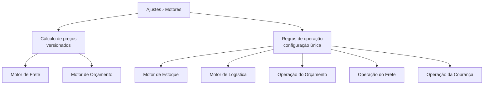

# Motores operacionais

Um **motor** é uma regra da sua operação que o sistema segue sozinho. Em vez de decidir tudo manualmente a cada locação ou venda, você configura o padrão **uma vez** e o LocFlow aplica daí em diante — calculando o frete, sugerindo datas, reservando os itens, pedindo aprovação quando preciso.

Você encontra todos eles em **Ajustes › Motores**.


Pense nos motores como o "piloto automático" da sua operação. Eles não tiram seu controle: você pode sempre ajustar caso a caso dentro de cada orçamento. O motor só define o **ponto de partida** — o que acontece quando ninguém mexe em nada.


## Os dois grupos do hub {#os-dois-grupos}

A tela de Motores separa tudo em **dois grupos**, porque eles funcionam de formas diferentes:

| Grupo | O que é | Como se edita |
| --- | --- | --- |
| **Cálculo de preços** | Motores que definem **quanto se cobra** — e que guardam **histórico de versões**. | Você prepara os ajustes, revisa e **publica** uma nova versão. As anteriores ficam registradas. |
| **Regras de operação** | Configuração **única** da operação (estoque, logística, aprovações, reembolso). | Editada direto na tela; vale sempre a configuração atual, sem histórico. |

A diferença existe porque preço é algo sensível: ao mudar como você cobra, é bom ter um **registro do que valia antes** (e poder revisar com calma antes de pôr no ar). Já uma regra de operação — como "exigir fatura antes de entregar" — é um liga-desliga: vale a escolha atual e pronto.

---

## Cálculo de preços {#calculo-de-precos}

São os motores **versionados**. Cada um abre com a sua **configuração em vigor** (a que vale hoje), e você pode preparar **ajustes não publicados** e só então **publicar** uma nova versão para toda a empresa. Veja [Versões e publicação](#versoes-e-publicacao).

### Motor de Frete {#motor-de-frete}

Define **como o frete é calculado** quando você usa o cálculo automático no orçamento. Em vez de digitar um valor à mão toda vez, você descreve as suas **cobranças** — situações que você sabe explicar ("para Sorocaba", "no fim de semana", "para entregas longas") com um valor associado ("R$ 500 fixo", "R$ 3 por km", "20% a mais") — e o motor aplica sozinho.

Ao abrir, você escolhe como prefere montar as regras, pelo perfil da sua operação:

| Perfil | Quando usar |
| --- | --- |
| **Tenho um método único de cobrança** | Uma cobrança que vale para todos os fretes. Mais fácil de configurar — é o caminho **mais comum**. |
| **Tenho vários métodos de cobrança** | Várias cobranças combinadas, uma por situação (município, distância, época do ano…). |
| **Quero montar regras manualmente** | Editor avançado, com condições e mais de uma ação por regra. |

> Você pode trocar de perfil depois. O app ainda oferece um **Simulador de frete** para testar cenários hipotéticos com as suas regras — cálculo local, **sem criar orçamentos**.


**O motor cobra por rota, não por viagem.** O LocFlow calcula o frete sobre uma **rota estimada**, como se o veículo saísse do galpão só para aquele orçamento. Um aluguel típico envolve **4 rotas estimadas** (ida e volta da entrega, ida e volta da retirada). Por isso, valores e limites configurados aqui valem **por rota**: uma cobrança de **R$ 500 fixo** somaria **R$ 2.000** ao frete final (4 × R$ 500). Quer cobrar R$ 500 no total? Configure **R$ 125 por rota**.


Para cada variável numérica (km, kg, minutos…), você decide entre **cobrar por ela** (preço por unidade) ou **usá-la como critério** — cobrar só quando o valor estiver dentro de um mínimo, máximo ou faixa. Exemplo: gatilho "distância" + critério "entre 0 e 50 km" + valor "R$ 100 fixo + R$ 3 por km" = uma cobrança específica para rotas curtas.

> Onde isso aparece no dia a dia: no bloco **Valores** do orçamento, na aba **Frete automático**. Veja [Valores: mão de obra, frete e descontos](../orcamentos/valores.md#frete).

### Motor de Orçamento {#motor-de-orcamento}

Define o **valor mínimo de orçamento** (o "corte"): o total que toda proposta precisa atingir.

> "O corte de orçamento é o valor mínimo que o total do orçamento deve atingir. Se o valor final ficar abaixo desse limite, o sistema avisa o operador e não permite criar o orçamento até que o valor seja ajustado ou o corte revisado."

É uma trava contra propostas baixas demais — útil para padronizar margem quando há vários vendedores. Aqui você edita um único valor e **salva**; o salvamento já publica a nova versão.


Não confunda: o **valor mínimo** é versionado e fica neste motor. Já **taxa de serviço, validade e intervalo mínimo logístico** são padrões operacionais (sem histórico) e ficam em **Operação do Orçamento** — há um atalho para eles dentro desta tela.


---

## Regras de operação {#regras-de-operacao}

São os motores **operacionais**: configuração única, editada direto na tela. Vale sempre o que estiver salvo.

### Motor de Estoque {#motor-de-estoque}

Define **quando os itens ficam reservados** ao cliente — ou seja, por quanto tempo um item fica indisponível quando entra num orçamento. É o que impede alugar o mesmo item para dois clientes no mesmo período.

São políticas de bloqueio à sua escolha — da mais fiel à mais flexível:

| Política | O que faz |
| --- | --- |
| **Pela entrega e retirada** | O item fica reservado do momento em que sai para a entrega até voltar na retirada. O cálculo mais fiel quando você agenda entrega e coleta. |
| **Apenas o período do evento** | Bloqueia só as datas do evento informadas no orçamento, sem considerar deslocamento. Bom quando o cliente retira e devolve no balcão. |
| **Cada orçamento define** | Não há regra fixa — em cada orçamento você informa o período de bloqueio manualmente. Útil quando cada locação é muito diferente da outra. |
| **Com folga antes e depois** | Bloqueia o período do evento e ainda reserva um tempo extra antes e depois. Use quando precisa de uma margem entre uma locação e a próxima. |

Esse motor tem uma página dedicada, porque ele se cruza com a forma como você **cobra** e **usa** o item. Veja [Duração, cobrança e bloqueio de uso](../orcamentos/duracao-e-bloqueio.md).

### Motor de Logística {#motor-de-logistica}

Define as **regras de entrega, retirada e provas**. Tem quatro blocos:

**Faturamento antes da logística.** O liga-desliga **"Exigir fatura emitida para iniciar a logística"**:

> "Controla se a logística (separar, preparar e enviar os itens) só pode começar depois que uma fatura for gerada para o orçamento. A fatura apenas registra uma cobrança em aberto para o cliente — ela não significa que o cliente já pagou. Para decidir, pergunte-se: você começa a preparar e entregar os itens mesmo sem ter gerado uma fatura de cobrança?"
>
> • Sim, entrego antes de cobrar → deixe desligado.
> • Não, só libero os itens depois de gerar a fatura → deixe ligado.

**Logística interna (galpão).** Define se existem etapas **dentro do galpão**. Vale para orçamentos **futuros**; os já em andamento não mudam.

* **Separação interna** (*A separar → Separado*) — ative se o material é separado/conferido no galpão antes de sair. Desligado, a logística começa direto na entrega/retirada.
* **Conferência na devolução** (*A conferir → Conferido*) — só para aluguel. Ative se, ao voltar, o material passa por conferência antes de finalizar.

> Locadores pequenos, com pouca variedade, costumam deixar as duas **desligadas**: separar e conferir é controle que cabe na cabeça, e ligar só criaria cliques. Conforme cresce, ligue a **Separação** primeiro (organiza o que preparar) e depois a **Conferência** (controle da volta, com provas). Veja [Separação no galpão](../logistica/separacao.md) e [Conferência na devolução](../logistica/conferencia.md).

**Requisitos de evidência.** O que a equipe precisa registrar **antes de concluir** cada entrega e retirada — separadamente. Cada item marcado vira **obrigatório**: o app não deixa concluir sem registrar. **Nada marcado = conclui com 1 toque**, sem prova. As provas vão da mais simples (foto e vídeo) à mais forte (código confirmado no WhatsApp do cliente, identificação de quem recebeu, localização confirmada). Comece com foto e vídeo; conforme os itens ficam mais caros, some provas mais fortes.

**Agendamento padrão.** Uma sugestão de datas ao criar um orçamento: ao informar a data do evento, a entrega e a retirada são preenchidas automaticamente (e podem ser ajustadas). Você diz quantos dias **antes** do evento é a entrega e quantos dias **depois** é a retirada. Deixe em branco para não sugerir.

### Operação do Orçamento {#operacao-do-orcamento}

Parâmetros padrão usados ao montar orçamentos — políticas internas, sem histórico:

* **Taxa de serviço** — um valor de referência que agiliza a criação. "Orçamentos com taxa diferente da configurada aqui ainda podem ser criados normalmente."
* **Validade do orçamento** — por quantos dias, a partir da criação, o orçamento permanece reservado. "Preços e políticas mudam com frequência; a validade evita orçamentos com regras antigas." É um padrão — o operador pode mudar em cada orçamento.
* **Intervalo mínimo logístico** — toda entrega e retirada ocorre dentro de um intervalo de horários (não dá para garantir chegada no minuto exato). Este campo define a folga mínima entre o início e o fim de cada movimento. Se algum movimento ficar abaixo dela, o sistema alerta o operador, que precisa consentir com o risco para prosseguir.

### Operação do Frete {#operacao-do-frete}

Define **como o frete é aprovado** — quando um frete calculado precisa da aprovação de um responsável antes de seguir. É política interna; o **cálculo** do frete fica no Motor de Frete.

| Modo | O que faz |
| --- | --- |
| **Aprovação automática** *(recomendado)* | Todo frete calculado é aprovado na hora, sem revisão. |
| **Aprovar acima de um valor** | Aprova automaticamente até o limite que você define; acima dele, exige um responsável. |
| **Sempre exigir aprovação** | Todo frete aguarda um responsável com permissão para aprovar. |

**Qual usar?** Locador que entrega ele mesmo → **Automática** (zero atrito). Operação em crescimento → **Por valor** (controla só os fretes altos). Equipe com vários vendedores → **Sempre manual** (padroniza margem e evita erro de digitação).

> Quando um orçamento trava aguardando aprovação, ele vira **Pendente** — uma pré-etapa do funil. Veja [Aprovação de orçamentos](../orcamentos/aprovacao.md).

### Operação da Cobrança {#operacao-da-cobranca}

Define o destino **padrão** de um valor a favor do cliente — quando uma edição reduz o total abaixo do que já foi pago, ou quando entra um pagamento a mais:

| Política | O que faz |
| --- | --- |
| **Crédito / vale-locação** *(recomendado)* | O valor vira crédito reaproveitável na próxima locação. Não exige operação bancária. |
| **Reembolso em dinheiro** | O valor é devolvido ao cliente em dinheiro (estorno ou transferência). |

O sistema **aplica esse padrão automaticamente e avisa a equipe**, que pode trocar a forma em cada caso.

---

## Versões e publicação {#versoes-e-publicacao}

Os motores de **Cálculo de preços** guardam histórico. Dentro de cada um você vê duas abas:

* **Em vigor** — a versão que vale hoje para toda a empresa.
* **Ajustes não publicados** — um rascunho onde você prepara mudanças com calma. Ele não afeta ninguém até ser publicado.

Quando estiver pronto, você **publica** — e o app confirma: *"Esta ação irá publicar e tornar a configuração ativa para toda a organização."* A partir daí, a nova versão entra em vigor e a anterior fica registrada no **histórico de versões** (acessível pelo link "Ver histórico de versões"). Se quiser recomeçar do que já está no ar, há a opção **"Descartar e igualar ao publicado"**.


No **Motor de Orçamento**, como é um único valor, não há abas: você edita e **salva**, e o salvamento já publica a nova versão em um passo.


## Quem pode mexer {#permissoes}


As opções visíveis dependem das **permissões** do seu usuário. Ver, listar e editar motores são permissões distintas — algumas pessoas conseguem **consultar** sem poder **alterar**. Se não encontrar um motor, fale com quem administra a conta. Veja [Colaboradores e acessos](colaboradores-e-acessos.md).


Alguns recursos de motor podem estar disponíveis apenas em um **plano superior**. Quando for o caso, o app indica.

## Situações reais {#situacoes-reais}

* **"Meus orçamentos saem com frete errado."** Confira o **Motor de Frete**: lembre que os valores valem **por rota**, não pela viagem inteira. Use o **Simulador** para testar antes de publicar.
* **"A equipe começou a preparar um pedido que ainda não foi cobrado."** Em **Motor de Logística**, ligue **"Exigir fatura emitida para iniciar a logística"**.
* **"O mesmo item foi reservado para dois clientes."** Revise a política do **Motor de Estoque** — provavelmente está "apenas o período do evento" quando deveria ser "pela entrega e retirada" (ou com folga).
* **"Quero que fretes altos passem por mim antes de fechar."** Em **Operação do Frete**, escolha **Aprovar acima de um valor** e defina o limite.
* **"Um cliente pagou a mais e não sei o que fazer com o troco."** O **Operação da Cobrança** já decide o padrão (crédito ou dinheiro) e avisa a equipe.

## Próximo passo {#proximo-passo}

* [Duração, cobrança e bloqueio de uso](../orcamentos/duracao-e-bloqueio.md) — o Motor de Estoque em detalhe.
* [Valores: mão de obra, frete e descontos](../orcamentos/valores.md) — onde o Motor de Frete aparece no orçamento.
* [Aprovação de orçamentos](../orcamentos/aprovacao.md) — o que acontece quando a Operação do Frete trava um pedido.
* [Separação no galpão](../logistica/separacao.md) e [Conferência na devolução](../logistica/conferencia.md) — as etapas internas que o Motor de Logística liga.
* [Horários e sazonalidades](horarios-e-sazonalidades.md) — os horários comerciais que o cálculo de frete e o agendamento respeitam.
