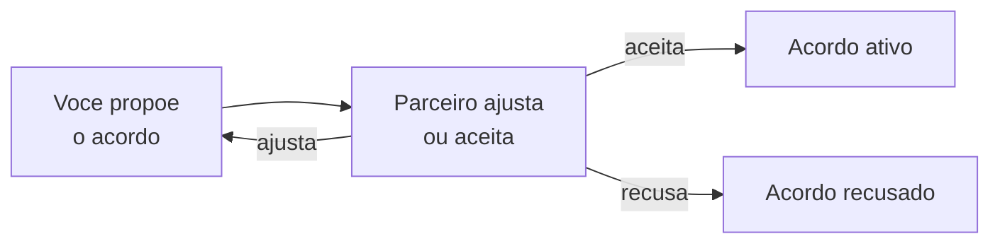
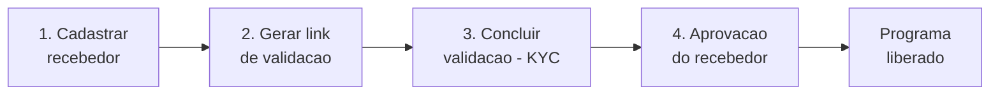

# Programa de Parceiros

O **Programa de Parceiros** é o caminho do LocFlow para você trabalhar junto com outra empresa em um mesmo pedido e **dividir os ganhos de forma automática**, com acordo claro e menos conferência manual. Vale para **locação** e para **venda** de bens móveis.


**Onde fica:** no menu da sua organização, em **Parceiros**. A tela mostra um botão **"Entenda como funciona"** com o resumo do programa.



**O que já dá para fazer hoje:** preparar o acesso. A tela **libera o Programa de Parceiros assim que a sua integração de pagamento estiver aprovada** — é esse o passo de hoje. A criação dos acordos e a divisão automática de valores estão **em construção** (veja [Em breve](#em-breve)). Esta página explica o que existe agora e o que vem a seguir, sem prometer o que ainda não está no ar.


## O que é 

Imagine que você fecha um pedido com um cliente, mas quem entrega (ou parte do material) vem de uma **empresa parceira**. Em vez de fazer acertos por fora — planilha, conversa de WhatsApp, conferência no fim do mês — o LocFlow registra o **acordo** entre as duas empresas e, quando o cliente paga, **divide os valores conforme o combinado**.

Em palavras simples, como diz a própria tela:

> Você fecha acordos com parceiros e o sistema organiza regras, valores e divisão de ganhos para tudo funcionar com menos trabalho manual.

O programa se apoia em quatro ideias:

| Ideia | O que significa para você |
| --- | --- |
| **Acordos simples e claros** | Você define com quem vai trabalhar e quais regras valem para cada parceria. |
| **Valores combinados antes de começar** | Preço dos itens, frete e condições ficam registrados no acordo — sem conversa perdida. |
| **Comissionamento automático** | Quando o pagamento entra, o sistema divide os valores conforme o combinado entre as partes. |
| **Mais agilidade no dia a dia** | Previsibilidade financeira e menos operação manual em repasses e conferências. |

## Como funciona 

A parceria nasce de um **acordo** entre duas empresas: uma que fecha a venda com o cliente (o lado **vendedor**) e outra que entra com material e/ou logística (o lado **parceiro**). O acordo registra quais itens entram, os valores e como os ganhos se dividem.

O acordo passa por um **fluxo de aceite** — um vai e volta entre as partes até as duas concordarem:

1. Uma parte **propõe** o acordo (itens, valores, divisão).
2. A outra **ajusta** (faz uma contraproposta) ou **aceita**.
3. Quando ambas concordam, a parceria fica **ativa** e passa a valer para os pedidos repassados.


Esse vai e volta evita mal-entendido: nada começa a valer sem o "ok" das duas empresas. Enquanto não há acordo, cada pedido segue normal, só seu.


A primeira versão atende a **parceria externa** — quando a empresa parceira trabalha **dentro da sua organização**, usando o **mesmo catálogo** de itens. Assim os itens já são os mesmos para as duas partes, sem precisar "casar" produto por produto. A parceria entre **duas contas LocFlow diferentes** virá depois.

## O funil de liberação 

Para dividir valores de um pedido entre você e um parceiro, o dinheiro precisa entrar pelo **pagamento online** e ser repartido na origem. Por isso, **o Programa de Parceiros só libera depois que a sua integração de pagamento estiver aprovada**.

É o mesmo cadastro do **recebedor** que você usa para receber online — explicado em [Pagamento online](../cobranca/pagamento-online.md). Enquanto a integração não estiver pronta, a tela de Parceiros mostra um **passo a passo** com o que falta e um atalho para concluir.


**Atalho:** **Ajustes › Integrações › Integração de Pagamento.** É lá que você cadastra e acompanha o recebedor.


### Passo a passo para liberar 

A tela acompanha quatro marcos. Cada um acende quando o anterior é concluído:

| Marco | O que acontece |
| --- | --- |
| **1) Cadastrar recebedor** | Você preenche os dados básicos e bancários da sua locadora. O cadastro é enviado para análise. |
| **2) Gerar link de validação** | Você gera um link e envia ao responsável legal da empresa. |
| **3) Concluir validação (KYC)** | O responsável confirma a identidade pelo link. A partir daí, fica em análise. |
| **4) Aprovação do recebedor** | Quando aprovado, **o Programa de Parceiros é liberado** e o recebimento online fica ativo. |


**A aprovação é automática e pode levar algumas horas.** Ela acontece em segundo plano — você não precisa ficar olhando. Quando quiser conferir, **puxe a tela para baixo para atualizar**. Estar "em validação" **não** é o mesmo que aprovado: é preciso gerar o link e o responsável concluir a confirmação de identidade.


Quando tudo fica verde, a tela mostra: **"Tudo pronto! O split de pagamento está habilitado para esta organização."** A partir daí, o programa fica disponível para receber os próximos passos (criar parceiros e acordos) à medida que forem entrando no ar.


**Quem ativa:** o cadastro do recebedor é feito por quem administra a conta. Se você não tem esse acesso, peça ao responsável — o sistema mostra o motivo, ninguém fica travado sem entender o porquê.


## Quem recebe o que 

Quando um pedido em parceria é pago, o valor que o cliente paga é repartido **na hora**, conforme o acordo, sem você lançar nada à mão.

### Divisão de ganhos 

O acordo define:

* **O repasse** — quanto, de cada parcela paga, vai para a empresa parceira.
* **A sua parte** — o que sobra para você depois do repasse e da taxa de plataforma.
* **A taxa de plataforma** — o percentual que o LocFlow retém sobre o valor recebido. O acordo também combina **como essa taxa se divide** entre as duas empresas.
* **Quem cuida de quê** — quem é responsável por **reembolsos** ao cliente, em caso de cancelamento, e quem arca com a **taxa de processamento** do pagamento. O padrão recai sobre o lado vendedor, mas isso faz parte do que se combina.


A soma sempre fecha: **a sua parte + a parte do parceiro + a taxa de plataforma = o valor pago pelo cliente**. Nada some, nada some sem registro.



Os percentuais, valores e limites exatos do programa fazem parte das **condições comerciais** e podem variar por plano. Confira sempre os números que aparecem **no próprio acordo**, na hora de fechá-lo — é o acordo que vale.


## Em breve 

Hoje a tela de Parceiros tem **um único trabalho**: liberar o acesso quando a sua integração de pagamento é aprovada. As etapas abaixo estão **modeladas e a caminho**, mas ainda não estão disponíveis para uso:

* **Cadastrar parceiros** — adicionar a empresa com quem você vai trabalhar (o botão **"Adicionar parceiro"** já aparece na tela, ainda desativado).
* **Criar e negociar acordos** — propor, ajustar e aceitar os termos (o vai e volta descrito em [Como funciona](#como-funciona)).
* **Divisão automática no pagamento** — repartir cada parcela recebida conforme o acordo, sem lançamento manual.
* **Parceria entre duas contas LocFlow** — a versão em que cada empresa tem a sua própria conta (a primeira versão atende a **parceria externa**, dentro da sua organização).


Você **não precisa esperar** para se preparar: deixe a sua integração de pagamento **aprovada** desde já. Assim, quando os acordos entrarem no ar, é só começar.


## Situações reais 

**"Abri a tela de Parceiros e o botão de adicionar parceiro está apagado."**
É o esperado por enquanto. A criação de parceiros e acordos está [em breve](#em-breve). Hoje a tela serve para **liberar o acesso** pela integração de pagamento — garanta que ela esteja aprovada.

**"Concluí a validação, mas o programa não liberou."**
Estar "em validação" não é o mesmo que aprovado. A aprovação é automática e **pode levar algumas horas**. Puxe a tela para baixo para atualizar. Se não tiver gerado o **link de validação** e o responsável não tiver concluído, esse é o passo que falta — veja [Pagamento online](../cobranca/pagamento-online.md).

**"Não consigo cadastrar o recebedor."**
O cadastro é feito por quem **administra a conta**. Se você não tem esse acesso, o sistema orienta a pedir ao responsável.

## Próximo passo 

* [Pagamento online](../cobranca/pagamento-online.md) — o recebedor, a validação (KYC) e a aprovação que liberam o programa.
* [A página de pagamento do cliente](../cobranca/pagina-de-pagamento.md) — por onde o dinheiro entra e é repartido.
* [Integrações](integracoes.md) — onde você acompanha tudo que conecta o LocFlow ao mundo de fora.
* [Minha assinatura e créditos](assinatura-e-creditos.md) — recursos avançados podem depender do seu plano.
