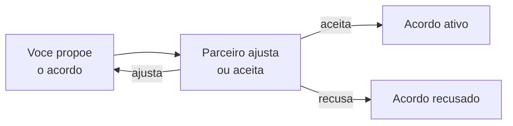
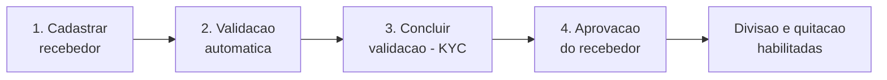

# Preparando o dinheiro da parceria

Para trabalhar em parceria com outra empresa e **dividir os ganhos de um pedido automaticamente**, o dinheiro precisa entrar pelo **pagamento online** e ser repartido na origem. Esta página é sobre esse cadastro: como concluí-lo e o que, exatamente, depende dele.


**O recebedor não é a porta de entrada da Rede — é a torneira do dinheiro.** Entrar na Rede de Parceiros, publicar o seu perfil, fechar acordos e repassar pedidos **não** esperam por essa aprovação: quem decide se você vê a Rede é o **acesso** que você tem na conta (o seu papel). O que fica travado sem o recebedor aprovado é a **liquidação** — a divisão automática no pagamento do cliente e o PIX que quita o repasse do parceiro. O saldo continua nascendo; o que falta é o caminho para pagá-lo dentro do LocFlow.



**Esta página é só o preparo financeiro.** Como a parceria funciona no dia a dia — acordos, repasse de pedidos, ganhos e reputação — está na seção [Rede de Parceiros](../parcerias/visao-geral.md), que já descreve tudo o que está no ar.



**Onde fica:** o que esta página descreve é o **cadastro do recebedor**, e ele fica em **Ajustes › Integrações › Integração de Pagamento** — o mesmo cadastro da [cobrança online](../cobranca/pagamento-online.md). Dentro do espaço **Rede de Parceiros** ele também aparece como **Conta de recebimento**, no menu, para você não precisar sair da Rede para conferir.

A Rede em si vive no **alternador de espaço de trabalho** (*Operação ↔ Rede de Parceiros*), e as telas do dia a dia da parceria estão descritas na seção [Rede de Parceiros](../parcerias/visao-geral.md).


## O que é 

Imagine que você fecha um pedido com um cliente, mas quem entrega (ou parte do material) vem de uma **empresa parceira**. Em vez de fazer acertos por fora — planilha, conversa de WhatsApp, conferência no fim do mês — o LocFlow registra o **acordo** entre as duas empresas e, quando o cliente paga, **divide os valores conforme o combinado**.

Em palavras simples, como diz a própria tela:

> Você fecha acordos com parceiros e o sistema organiza regras, valores e divisão de ganhos para tudo funcionar com menos trabalho manual.

O programa se apoia em quatro ideias:

| Ideia | O que significa para você |
| --- | --- |
| **Acordos simples e claros** | Você define com quem vai trabalhar e quais regras valem para cada parceria. |
| **Valores combinados antes de começar** | Preço dos itens, frete e condições ficam registrados no acordo — sem conversa perdida. |
| **Comissionamento automático** | Quando o pagamento entra, o sistema divide os valores conforme o combinado entre as partes. |
| **Mais agilidade no dia a dia** | Previsibilidade financeira e menos operação manual em repasses e conferências. |

## Como funciona 

A parceria nasce de um **acordo** entre duas empresas: uma que fecha a venda com o cliente (o lado **vendedor**) e outra que entra com material e/ou logística (o lado **parceiro**). O acordo registra quais itens entram, os valores e como os ganhos se dividem.

O acordo passa por um **fluxo de aceite** — um vai e volta entre as partes até as duas concordarem:

```mermaid
flowchart LR
    A[Voce propoe<br/>o acordo] --> B[Parceiro ajusta<br/>ou aceita]
    B -->|aceita| C[Acordo ativo]
    B -->|ajusta| A
    B -->|recusa| D[Acordo recusado]
```

1. Uma parte **propõe** o acordo (itens, valores, divisão).
2. A outra **ajusta** (faz uma contraproposta) ou **aceita**.
3. Quando ambas concordam, a parceria fica **ativa** e passa a valer para os pedidos repassados.


Esse vai e volta evita mal-entendido: nada começa a valer sem o "ok" das duas empresas. Enquanto não há acordo, cada pedido segue normal, só seu.



O vai e volta do aceite, os itens que entram, o **modelo de pagamento** do repasse e a vigência estão detalhados em [Acordos de parceria](../parcerias/acordos-de-parceria.md).


## O caminho até o recebedor aprovado 

Para dividir valores de um pedido entre você e um parceiro, o dinheiro precisa entrar pelo **pagamento online** e ser repartido na origem. Sem o recebedor aprovado, **a divisão não acontece e nenhum PIX de quitação sai** — nem o que você paga ao parceiro, nem o que ele te paga quando cobrou o cliente na rua.

É o mesmo cadastro do **recebedor** que você usa para receber online — explicado em [Pagamento online](../cobranca/pagamento-online.md). Enquanto a integração não estiver pronta, a tela da integração mostra um **passo a passo** com o que falta e um atalho para concluir.


**Não deixe para depois — mas também não espere por isso para começar.** Você pode fechar acordos e repassar pedidos hoje; o saldo do parceiro nasce e fica registrado do mesmo jeito. O problema é o dia do acerto: descobrir que falta cadastro justamente quando o parceiro vem buscar o dinheiro dele é o pior momento possível.



**Atalho:** **Ajustes › Integrações › Integração de Pagamento.** É lá que você cadastra e acompanha o recebedor.


### Passo a passo para liberar 

A tela acompanha quatro marcos. Cada um acende quando o anterior é concluído:

```mermaid
flowchart LR
    R[1. Cadastrar<br/>recebedor] --> K[2. Validacao<br/>automatica]
    K --> V[3. Concluir<br/>validacao - KYC]
    V --> A[4. Aprovacao<br/>do recebedor]
    A --> L[Divisao e quitacao<br/>habilitadas]
```

| Marco | O que acontece |
| --- | --- |
| **1) Cadastrar recebedor** | Você preenche os dados básicos e bancários da sua locadora. O cadastro é enviado para análise. |
| **2) Validação automática** | O gateway confere os seus dados sozinho — **você não precisa fazer nada** aqui. |
| **3) Concluir validação (KYC)** | Quando o gateway pede a confirmação de identidade do responsável, a tela da integração mostra o cartão **"Falta a prova de vida para liberar seu saldo"**, com o botão **"Fazer prova de vida agora"**. Ele gera um endereço (e um QR Code) para **abrir ali mesmo**, **enviar** ao responsável ou **copiar** — o link vale **20 minutos**; se expirar, gere outro no mesmo lugar. |
| **4) Aprovação do recebedor** | Quando aprovado, o recebimento online fica **ativo**: a divisão automática no pagamento do cliente passa a funcionar e os PIX de quitação de repasse podem ser gerados. |


**A aprovação é automática e pode levar algumas horas.** Ela acontece em segundo plano — você não precisa ficar olhando. Quando quiser conferir, **puxe a tela para baixo para atualizar**. Estar "em validação" **não** é o mesmo que aprovado: se o gateway pediu a confirmação de identidade, alguém ainda precisa concluir a prova de vida — enquanto isso não acontece, a conta não é aprovada.


Quando tudo fica verde, a tela mostra: **"Tudo pronto! O split de pagamento está habilitado para esta organização."** Daí em diante o dinheiro da parceria circula sozinho — e [entrar na rede](../parcerias/entrando-na-rede.md), fechar [acordos](../parcerias/acordos-de-parceria.md) e [repassar pedidos](../parcerias/repassando-um-pedido.md), que nunca dependeram disso, seguem como sempre.


**Quem ativa:** o cadastro do recebedor é feito por quem administra a conta. Se você não tem esse acesso, peça ao responsável — o sistema mostra o motivo, ninguém fica travado sem entender o porquê.


## Quem recebe o que 

Quando um pedido em parceria é pago, o valor que o cliente paga é repartido **na hora**, conforme o acordo, sem você lançar nada à mão.

### Divisão de ganhos 

O acordo define:

* **O repasse** — quanto vai para a empresa parceira.
* **A sua parte** — o que sobra para você depois do repasse e da taxa de plataforma.
* **A taxa de plataforma** — **8%** sobre o total da operação (o que o cliente paga), fixos. O que o acordo combina é **como esses 8% se dividem** entre as duas empresas: 8/0 (o padrão, tudo do lado vendedor), 6/2, 4/4 — desde que some 8%.
* **Quem cuida de quê** — quem é responsável por **reembolsos** ao cliente, em caso de cancelamento, e quem arca com a **taxa de processamento** do pagamento. O padrão recai sobre o lado vendedor, mas isso faz parte do que se combina.


A soma sempre fecha: **a sua parte + a parte do parceiro + a taxa de plataforma = o valor pago pelo cliente**. Nada se move sem registro.



**Os 8% não variam por plano de assinatura** — e são cobrados **uma vez por orçamento**, mesmo que o pedido passe por dois parceiros. A conta completa, com exemplos numéricos, está em [O dinheiro da parceria](../parcerias/dinheiro-da-parceria.md#taxa-de-plataforma).


## O caminho da parceria 

A Rede de Parceiros fica no **alternador de espaço de trabalho** (o seletor *Operação ↔ Rede de Parceiros*) — e aparece para quem tem acesso a ela na conta, com ou sem recebedor aprovado. O caminho a partir daí:

1. [Entrando na rede](../parcerias/entrando-na-rede.md) — o perfil público e a descoberta de outras operações.
2. [Acordos de parceria](../parcerias/acordos-de-parceria.md) — os termos, o aceite das duas partes e a vigência.
3. [Repassando um pedido](../parcerias/repassando-um-pedido.md) — como um pedido seu vai para o parceiro.
4. [O dinheiro da parceria](../parcerias/dinheiro-da-parceria.md) — repasses, ganhos e a divisão no pagamento.

## Situações reais 

**"Concluí a validação e ainda não está aprovado."**
Estar "em validação" não é o mesmo que aprovado. A aprovação é automática e **pode levar algumas horas**. Puxe a tela para baixo para atualizar. Se não tiver gerado o **link de validação** e o responsável não tiver concluído, esse é o passo que falta — veja [Pagamento online](../cobranca/pagamento-online.md).

**"Não consigo cadastrar o recebedor."**
O cadastro é feito por quem **administra a conta**. Se você não tem esse acesso, o sistema orienta a pedir ao responsável.

**"Não vejo a Rede de Parceiros no alternador."**
Isso não tem relação com o recebedor: o alternador só oferece a Rede a quem tem **acesso** a alguma tela dela. Se o seu papel na conta não inclui parceria, o espaço nem aparece — para não te levar a um lugar onde tudo estaria barrado. Fale com quem administra a conta; veja [Colaboradores e acessos](colaboradores-e-acessos.md).

## Próximo passo 

* [Rede de Parceiros: a visão](../parcerias/visao-geral.md) — como a parceria funciona depois de liberada.
* [Pagamento online](../cobranca/pagamento-online.md) — o recebedor, a validação (KYC) e a aprovação que fazem o dinheiro circular.
* [A página de pagamento do cliente](../cobranca/pagina-de-pagamento.md) — por onde o dinheiro entra e é repartido.
* [Integrações](integracoes.md) — onde você acompanha tudo que conecta o LocFlow ao mundo de fora.
* [Minha assinatura e créditos](assinatura-e-creditos.md) — recursos avançados podem depender do seu plano.
