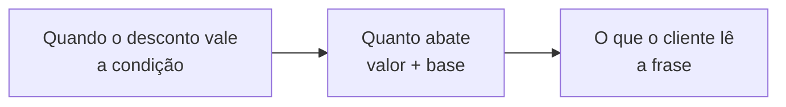

# Regras de desconto

Uma **regra de desconto** é um desconto **tabelado**: você cadastra uma vez e o LocFlow passa a **sugeri-lo sozinho** nos orçamentos em que ele cabe, com o valor já calculado. É o oposto do desconto avulso, aquele que o vendedor digita na hora e vale só para um pedido.

Elas ficam em **Ajustes › Regras de Desconto**, e a própria tela resume o combinado:


*"Os descontos que a sua equipe pode oferecer. O sistema sugere no orçamento quando a condição bate — quem concede é sempre o vendedor."*


## Por que tabelar um desconto {#por-que-tabelar}

| Sem regra cadastrada | Com regra cadastrada |
| --- | --- |
| Cada vendedor lembra (ou não) da política de volume | O sistema **avisa** quando o carrinho já dá direito ao desconto |
| O texto que vai ao cliente muda a cada proposta | A frase sai **sempre igual**, escrita uma vez |
| O desconto some quando o vendedor sai de férias | A política vive na organização, não na cabeça de alguém |


**Onde isso vira dinheiro:** a regra *"a partir de 10 unidades, 10%"* aparece na tela justamente quando o cliente pediu 8 — e o vendedor tem, na hora, o argumento para subir o pedido para 10. Desconto tabelado não é só abatimento: é gatilho de venda.


## Montando uma regra {#montando-uma-regra}

O cadastro tem **três blocos**, na ordem em que a decisão acontece:

### ① Quando o desconto vale: a condição {#condicao}

A condição é o **gatilho**. São três, da mais simples à mais específica:

| Condição | O que o sistema confere | Exemplo |
| --- | --- | --- |
| **Sem condição** | Nada — *"quem decide usar é o vendedor"* | pagamento à vista |
| **Por valor do orçamento** | Se o **total** atinge o valor que você definir | acima de R$ 2.000 |
| **Por quantidade** | Se um **produto ou kit** atinge N unidades no orçamento | a partir de 10 cadeiras |

Na condição **sem condição**, você escreve a **mensagem que explica o desconto** (*"Pagamento à vista"*) — é ela que o vendedor lê para decidir e que o cliente lê no documento.


**"Sem condição" nunca aparece como cumprida.** O sistema não tem como saber se o cliente vai mesmo pagar à vista. Por isso, no orçamento, essas regras vêm com o selo âmbar **"Depende de você"**: o LocFlow oferece, quem afirma que a condição vale é o vendedor.


### ② Quanto abate: o valor e a base {#valor-e-base}

O valor é **percentual (%)** ou **valor fixo (R$)**. E logo abaixo vem a decisão que mais mexe no seu bolso: **sobre qual valor ele incide**.

| Base | O que entra na conta |
| --- | --- |
| **Sobre o total** | Itens, acréscimos e frete — tudo o que o cliente paga |
| **Sobre os itens** | Só os bens móveis; frete e serviços ficam de fora |
| **Sobre o item** | Só o produto ou kit que **ativou a condição** de quantidade |

A tela mostra isso **desenhado**: uma barra com as três partes do orçamento (itens, mão de obra, frete) em que o pedaço atingido pelo desconto fica **aceso**. Escolha "sobre os itens" e você vê o frete apagar.


**A base "sobre o item" só existe com a condição por quantidade.** É a condição que diz *qual* item ativou a regra; sem ele não há sobre o que incidir. Nas outras condições o card fica indisponível com a explicação: *"Só com a condição por quantidade — nas outras não existe um item que ativou a regra."*



**Por que fixar a base importa.** Num pedido de R$ 2.000 em itens + R$ 300 de montagem + R$ 200 de frete, "10% de desconto" pode custar **R$ 250** (sobre o total), **R$ 200** (sobre os itens) ou **R$ 80** (sobre as 10 cadeiras que ativaram a regra). É a mesma frase e três resultados diferentes — por isso o LocFlow obriga você a escolher.


### ③ O que o cliente lê {#descricao}

O LocFlow **monta a frase sozinho**, juntando a condição, o valor e a base:

> *A partir de 10 unidades de Cadeira Tiffany: 10% de desconto sobre o item*

> *Para orçamentos a partir de R$ 2.000,00: R$ 150,00 de desconto sobre o total*

Um bloco **"O cliente vai ler"** mostra a frase em tempo real enquanto você preenche. Se preferir outro texto, ligue **"Escrever meu próprio texto"** e escreva o seu — a frase automática continua visível abaixo, esmaecida, como referência do que está sendo substituído.


**A frase viaja com o orçamento.** Quando o vendedor aplica a regra, o texto é **copiado para dentro daquele orçamento**. Editar a regra depois muda as próximas propostas, **não** o que o cliente já recebeu.


## O catálogo: ativar, desativar, excluir {#catalogo}

A listagem mostra cada regra com a frase que vai ao cliente, e os filtros **Todas / Ativas / Desativadas** no alto.

* **A chave de cada cartão liga e desliga a regra.** Regra desativada fica esmaecida, com o selo **Desativada** — ela **não é avaliada nem oferecida** em nenhum orçamento, mas continua no catálogo para você reativar na próxima temporada.
* **Texto próprio** é o selo de quem sobrescreveu a descrição automática.
* **Excluir** remove de vez. Os orçamentos que já usaram a regra **não mudam** — a descrição deles está congelada.


**Desativar em vez de excluir** é o caminho para promoções sazonais: o "desconto de fim de ano" volta a existir com um toque, com a mesma frase e o mesmo valor que você calibrou no ano passado.


## Criando uma regra no meio da negociação {#criar-do-orcamento}

Você não precisa sair do orçamento para tabelar um desconto. Na etapa **Valores**, em **Adicionar desconto › Do catálogo**, há o atalho para **cadastrar uma regra nova** — com exatamente o mesmo formulário desta página.

A única diferença: na condição por quantidade, o seletor de item oferece **só os produtos e kits que já estão no carrinho**. Faz sentido — você está olhando *este* pedido, e uma busca no catálogo inteiro seria outra jornada. Para uma regra sobre um item que não está no orçamento, use a tela de Ajustes.

## Quem pode mexer {#permissoes}

O catálogo mora no pacote **comercial**, não no de configuração do sistema: a ideia é que o vendedor cadastre a regra na hora, sem depender de um administrador. Ainda assim, cada ação tem a sua permissão:

| Permissão | O que libera |
| --- | --- |
| **Listar / ver** | Entrar na tela e ver as regras |
| **Criar** | Cadastrar regras novas (aqui e de dentro do orçamento) |
| **Editar** | Alterar uma regra e **ativar/desativar** |
| **Excluir** | Remover a regra do catálogo |

Para distribuir isso entre os papéis da sua equipe, veja [Colaboradores e acessos](colaboradores-e-acessos.md).

## Um limite para o que a equipe concede {#teto}

Regra tabelada define **o que** pode ser oferecido. Quanto ao **quanto** um vendedor pode abater sozinho, quem manda é o **teto de desconto**, em **Ajustes › Motores › Operação do orçamento**: acima dele, o orçamento nasce congelado aguardando aprovação. O teto vale para o desconto do orçamento **como um todo** — inclusive o que veio das regras daqui. Veja [Motor de Orçamento](motor-de-orcamento.md#teto-de-desconto).

## Por porte {#por-porte}

| Se você é… | Como costuma usar |
| --- | --- |
| **Autônomo / micro** | Nenhuma regra. O desconto sai avulso, na conversa, e pronto. |
| **Médio** | Duas ou três regras que traduzem a sua política — volume, pagamento à vista, pedido grande — e o sistema lembra a equipe por você. |
| **Grande** | Regras com base fixada por item (para o desconto não comer o frete), texto próprio alinhado ao comercial, e **teto de desconto** com aprovação para o que fugir da tabela. |

## Situações reais {#situacoes-reais}

- **Política de volume que ninguém aplicava.** Você combina "10% a partir de 10 cadeiras", mas metade da equipe esquece. Vira regra: agora ela aparece sozinha no orçamento, com o valor calculado, e ninguém mais esquece.
- **O desconto que comia o frete.** A regra de 10% estava "sobre o total" e vinha abatendo também o transporte de pedidos distantes. Você troca a base para "sobre os itens" — o abatimento continua, a margem do frete volta.
- **Promoção de temporada.** Fim de ano acabou: você **desativa** a regra em vez de excluí-la. Em novembro, uma chave a traz de volta.
- **Cliente antigo, desconto de sempre.** Uma regra **sem condição** com o texto *"Cliente parceiro — condição especial"*: o sistema nunca a marca como cumprida, mas ela fica a um toque de distância, com a frase certa para o documento.

## Próximo passo {#proximo-passo}

- Veja como as regras aparecem e se somam na proposta em [Valores: acréscimos, frete e descontos](../orcamentos/valores.md#descontos).
- Para limitar o que a equipe concede sozinha, veja o [teto de desconto](motor-de-orcamento.md#teto-de-desconto).
- Para o que acontece quando o teto é ultrapassado, veja [Aprovação de orçamento](../orcamentos/aprovacao.md).
- Para distribuir as permissões, veja [Colaboradores e acessos](colaboradores-e-acessos.md).
