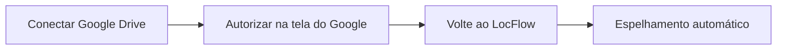

# Sincronização em Nuvem

A **Sincronização em Nuvem** mantém uma **cópia automática** dos documentos e comprovantes que você gera no LocFlow dentro da **sua própria nuvem**. Hoje ela funciona com o **Google Drive**.

É um recurso recente e **opcional**: o LocFlow continua sendo o lugar onde tudo é gerado e organizado; a nuvem fica com uma **cópia de segurança** que é só sua.


Você encontra esta tela em **Configurações → Integrações → Sincronização em Nuvem**.


## Para que serve 

Pense nela como um **backup que se cuida sozinho**:

* **Cópia de segurança.** Se um dia você precisar de um contrato, recibo ou comprovante e não estiver com o app à mão, ele também está no seu Drive.
* **Acesso fora do app.** Os arquivos ficam num lugar que você já conhece e acessa de qualquer computador ou celular, com ou sem o LocFlow aberto.
* **Tranquilidade.** Provas de entrega (fotos e vídeos) e documentos importantes ficam guardados em **dois lugares**.

## O que é espelhado 

Tudo é organizado dentro de uma pasta chamada **`LocFlow`** no seu Drive, separada em subpastas:

| Subpasta no seu Drive | O que vai para lá |
| --- | --- |
| **Documentos** | Os PDFs que você gera no LocFlow (contratos, recibos, orçamentos e demais documentos). |
| **Provas logísticas** | As fotos e vídeos registrados nas entregas e devoluções (os **comprovantes de entrega**). |


O LocFlow só enxerga e mexe nos arquivos que **ele mesmo** cria no seu Drive. O resto da sua nuvem — suas outras pastas e arquivos pessoais — **não é acessado**.


## O armazenamento é seu 

Este é o ponto mais importante: **os arquivos ficam na sua conta**, não na nossa.

* Você é o **dono** dos arquivos espelhados.
* O espaço usado sai da **cota do seu Google Drive** (o espaço gratuito que toda conta Google tem), e **não** de nenhuma cota do LocFlow.
* Se um dia você desligar a integração, o que já foi copiado **continua no seu Drive**.


Na prática: ligar a Sincronização em Nuvem **não consome** nenhum limite do seu plano LocFlow nem gera custo de armazenamento conosco. É a **sua** nuvem trabalhando para você.


## Como conectar 

A conexão é rápida e você faz uma única vez. O passo da **autorização** acontece na tela do próprio Google, por segurança.

1. **Conectar.** Na tela da Sincronização em Nuvem, toque em **Conectar Google Drive**.
2. **Autorizar.** Você é levado ao Google para **autorizar o LocFlow**. Faça o login na conta onde quer guardar os arquivos e confirme.
3. **Voltar.** Conclua no navegador e volte ao app. Se o status ainda não atualizou, **puxe a tela para baixo** para atualizar.
4. **Pronto.** A partir daí, novos documentos e comprovantes são **espelhados sozinhos**.

Quando conectado, a tela mostra a **conta** usada (o e-mail do Google) e a pasta de destino (**LocFlow · Documentos · Provas logísticas**).


Esse passo pelo navegador é normal — é o Google quem pede a sua autorização, e é assim que ele garante que **só você** liberou o acesso. O LocFlow nunca vê a sua senha do Google.



Se na tela aparecer que a integração **ainda não foi habilitada neste ambiente**, fale com o suporte do LocFlow. Pode ser preciso conceder o acesso a este recurso na sua conta.


## Sincronizar agora 

Depois de conectar, você **não precisa fazer nada**: o LocFlow envia os arquivos novos automaticamente, a cada poucos minutos.

Se você acabou de gerar algo e quer mandar para o Drive **na hora**, use o botão **Sincronizar agora**. Ele empurra o que estiver pendente; o restante continua sendo enviado sozinho.

### Pendentes e sincronizados 

A tela mostra dois números para você acompanhar:

| Indicador | O que significa |
| --- | --- |
| **Sincronizados** | Quantos arquivos já têm uma cópia no seu Drive. |
| **Pendentes** | Quantos ainda estão na fila para serem enviados. |

Quando não há nada na fila, a tela mostra **Em dia**. É normal ver "pendentes" por alguns minutos logo depois de gerar vários documentos — eles somem sozinhos conforme o envio acontece.

## Quando algo dá errado

### Reconectar 

Se você ver o aviso de **conexão expirada** (ou um selo pedindo para **Reconectar**), o acesso ao seu Google Drive foi **revogado ou expirou** — por exemplo, se você removeu a permissão do LocFlow lá nas configurações da sua conta Google.

Nesse caso, o espelhamento **pausa**. Para voltar a copiar, toque em **Reconectar Google Drive** e autorize novamente. Nada que já estava no Drive se perde.

### Desconectar 

Se quiser desligar a integração, use **Desconectar**. O que acontece:

* Os documentos **já espelhados permanecem no seu Drive** — eles são seus.
* **Novos** documentos deixam de ser enviados, até você reconectar.


Desconectar **não apaga** nada do seu Drive. Apenas interrompe o envio das próximas cópias.


## Situações reais 

* **"Quero um backup dos meus contratos e recibos."** Conecte o Google Drive uma vez. Daí em diante, todo PDF que você gerar ganha uma cópia na subpasta **Documentos** da sua nuvem.
* **"Preciso das fotos da entrega num computador."** As provas de entrega vão para a subpasta **Provas logísticas** do seu Drive — abra direto no Google Drive, sem precisar do app.
* **"Acabei de gerar vários documentos e quero garantir que foram para a nuvem."** Toque em **Sincronizar agora** e confira o indicador **Em dia**.
* **"Vou trocar de conta Google."** Desconecte a atual (os arquivos já copiados ficam) e conecte a nova conta.

## Próximo passo 

* Veja todas as conexões disponíveis em [Integrações](integracoes.md).
* Personalize o que sai nos PDFs em [Modelos personalizados](../documentos/modelos-personalizados.md).
* Em dúvida com um termo? Consulte o [Glossário](../primeiros-passos/glossario.md).
