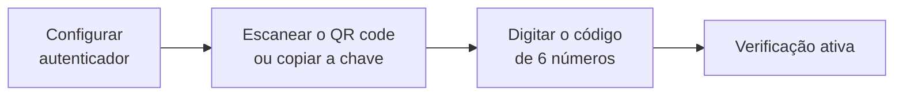

# Verificação em duas etapas

A **verificação em duas etapas** acrescenta uma segunda tranca à sua conta. Além da senha (ou do login pelo Google), você confirma cada entrada com um **código de 6 números** que só o seu celular conhece — gerado por um **aplicativo autenticador**, como o Google Authenticator, o Microsoft Authenticator ou outro compatível.


**Por que vale a pena:** o LocFlow guarda contratos, cobranças e dados de clientes. Com a verificação ligada, uma senha vazada não basta para alguém entrar na sua conta — falta o código, que muda a cada poucos segundos e está no seu bolso.


## Ligar para a sua conta {#ligar}

Antes de começar, instale um aplicativo autenticador no celular.

1. Abra **Minha Conta** (pelo seu **avatar**, no topo, ou pelo atalho **Minha Conta** no alto de Ajustes) e vá até **Segurança** › **Verificação em duas etapas**.
2. Toque em **Configurar autenticador**. Abre a tela **"Configure a verificação em duas etapas"**, com um **QR code**.
3. No aplicativo autenticador, escaneie o QR code. **Está no mesmo celular** e não tem como escanear? Use a **chave manual** que aparece logo abaixo (**No mesmo celular? Use esta chave manual**) — toque em **Copiar chave** e cole no aplicativo.
4. Digite o **código de 6 números** que o aplicativo mostra e toque em **Ativar verificação**.

Pronto: o cartão passa a listar o seu autenticador como **Ativo**.

## Como fica a entrada {#entrada}

Daí em diante, depois da senha (ou do Google), o LocFlow mostra **"Confirme que é você"**: abra o aplicativo autenticador, digite o **código atual** e toque em **Confirmar entrada**. Se você tiver mais de um autenticador cadastrado, escolha qual vai usar.


**"Código inválido ou expirado."** O código muda a cada poucos segundos. Aguarde o próximo aparecer no aplicativo e tente de novo — e confira se o relógio do celular está certo.


## Mais de um autenticador, e como remover {#gerenciar}

* **Adicionar outro autenticador** — útil para ter um segundo celular de reserva. O caminho é o mesmo do cadastro.
* **Remover** — toque na **lixeira** ao lado do autenticador e confirme em **Remover autenticador?**. Daquele aplicativo, os códigos deixam de valer. Por segurança, o LocFlow pode pedir um código antes de remover — e, depois da remoção, pode pedir que você **entre de novo**.


**Quando a organização exige a verificação**, o cartão mostra **"Obrigatória para sua organização"** e o **último** autenticador não pode ser removido: *"Cadastre outro autenticador antes de remover este."* Cadastre o novo primeiro e só então remova o antigo.


## Exigir da equipe inteira {#exigir-da-equipe}

Quem administra a conta (o dono e o **Administrador**) pode tornar a verificação **obrigatória para todo mundo** da organização. Fica em **Ajustes › Empresa e equipe › Perfil da Empresa**, no bloco **Verificação em duas etapas da equipe** — que mostra se ela está **Obrigatória** ou **Opcional**.

| Botão | O que acontece |
| --- | --- |
| **Exigir da equipe** | Todas as pessoas passam a confirmar um código ao entrar. Quem ainda não tem autenticador é **orientado a cadastrar um** antes de continuar usando o LocFlow. |
| **Tornar opcional** | A exigência sai. Quem **já ativou** continua protegido e ainda precisa do código ao entrar; quem não ativou segue sem. |


**Mudar essa regra também pede o código.** Para exigir ou tornar opcional, o LocFlow pede que você confirme com o seu próprio autenticador — e, se você ainda não tem um, que configure antes: *"Confirme ou configure seu autenticador para alterar esta política."*


Avise a equipe **antes** de exigir: quem não tiver o aplicativo instalado vai precisar dele na próxima entrada. Veja o restante da tela em [Perfil da Empresa](perfil-da-empresa.md).

## Por porte {#por-porte}

| Porte | Como costuma usar |
| --- | --- |
| **Autônomo / MEI** | Ligue para a **sua** conta: é você quem recebe e cobra, e um minuto de configuração protege tudo. |
| **Médio** | Ligue para quem mexe com dinheiro e configurações (você e o Administrador) e incentive o restante. |
| **Grande** | **Exija da equipe**, avisando com antecedência, e peça a cada pessoa um segundo autenticador de reserva. |

## Situações reais {#situacoes-reais}

* **"Troquei de celular."** Antes de se desfazer do antigo, cadastre o novo em **Adicionar outro autenticador**; depois, remova o antigo.
* **"Um colaborador perdeu o celular e não consegue entrar."** Sem o código, a entrada não passa. Se a verificação é obrigatória e ele não tem outro autenticador, fale com o [suporte](../primeiros-passos/onde-tirar-duvidas.md).
* **"Quero a equipe toda protegida."** Avise o time, peça que instalem o aplicativo e toque em **Exigir da equipe** no Perfil da Empresa.

## Próximo passo {#proximo-passo}

* Veja o resto da sua área pessoal em [Minha conta e preferências](minha-conta.md).
* Defina quem acessa o quê em [Colaboradores e acessos](colaboradores-e-acessos.md).
* Esqueceu a senha? Veja [Recuperar sua senha](../primeiros-passos/recuperar-senha.md).
