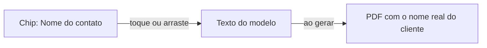

# Designer de documentos

Esta é a página de quem quer **dominar** o editor de documentos em PDF do LocFlow. Se você ainda não viu o panorama — quais documentos existem, natureza e canal, como salvar e publicar — comece por [Modelos personalizados](modelos-personalizados.md). Aqui a gente entra fundo nas peças que dão acabamento profissional: as **variáveis**, o **ocultar-quando-vazio**, o **kit agrupado**, o **compositor logístico**, a **coluna de foto** e o **total em destaque**.


Tudo aqui é sobre o canal **PDF**, montado por blocos. O canal WhatsApp é um campo de texto único — veja [Modelos personalizados](modelos-personalizados.md).


## Como o editor é organizado

O PDF é montado **empilhando blocos**. No topo do editor há uma régua de chips **Adicionar bloco**; abaixo, a lista dos blocos já adicionados, cada um num card. Você toca no card para abrir as opções daquele bloco, usa as **setas** para reordenar, o **olho** para esconder/mostrar e a **lixeira** para excluir.

| Bloco | O que faz |
| --- | --- |
| **Cabeçalho** | O topo do documento: sua marca, título e dados da empresa. Um por modelo, sempre no topo |
| **Texto** | Um parágrafo livre — uma introdução, uma observação, uma cláusula |
| **Tabela** | A lista de [itens](../primeiros-passos/glossario.md), com colunas que você escolhe |
| **Totais** | O fechamento de valores |
| **Divisória** | Uma linha para separar seções |
| **Rodapé** | O fim do documento: contatos, observações finais. Um por modelo, sempre no fim |


**Cabeçalho e rodapé são únicos e fixos.** O sistema mantém o cabeçalho no topo e o rodapé no fim em todas as páginas. Por isso eles não duplicam nem trocam de lugar.


A pré-visualização atualiza na hora. Dá para testar com um **orçamento real**: escolha um no seletor e veja o documento preenchido com os dados verdadeiros daquele pedido.

## Variáveis: chips que viram dados reais 

Uma **variável** é um espaço reservado que, na hora de gerar o documento, é trocado pelo dado verdadeiro do pedido. Você escreve uma vez "Olá, [nome do contato]" e cada documento sai com o nome certo do cliente. É o coração de um modelo reutilizável.

Você não digita código. Na **barra de variáveis** embaixo do editor de texto, as variáveis aparecem como **chips** prontos. A ajuda do campo de conteúdo diz exatamente como usar:

> Toque em um chip da barra abaixo para inserir no cursor — ou arraste e solte no ponto exato.

### A barra de variáveis 

A barra tem uma **busca** ("Buscar variável… (ex.: data, nome, valor)") e **filtros** por categoria (Contato, Orçamento, Entrega, Retirada, e por aí vai). Há também o filtro **Todas**.

- **Toque** no chip → a variável entra **onde está o cursor**.
- **Segure e arraste** o chip → uma cópia segue o dedo; **solte** no ponto exato do texto.
- A barra **colapsa** (botão Esconder) para liberar espaço, e **reabre sozinha** quando você começa a buscar.


Algumas categorias têm um ícone de **repetição** (↻): são **listas** — por exemplo, a lista de itens do orçamento. Listas não entram num texto solto; elas alimentam uma **Tabela** (veja abaixo). No canal WhatsApp, as listas nem aparecem na barra, porque não dá para montar tabela em texto puro.


## Ocultar quando vazio: o bloco some se não há dado 

Nem todo orçamento tem todos os dados. Um pedido pode não ter desconto; outro pode estar sem endereço definido ainda. Sem cuidado, o documento sairia com um "Desconto:" seguido de nada — feio e confuso.

O **ocultar-quando-vazio** resolve isso: você liga um bloco a uma variável e, **se ela estiver vazia ou zerada no pedido, o bloco inteiro some** do PDF. Todos os tipos de bloco têm essa opção, com o rótulo **"Esconder quando estiver vazio"**. A ajuda do recurso diz:

> Selecione uma variável para gatear este bloco. Se ela estiver vazia/zero no orçamento, o bloco inteiro some no PDF.

Você escolhe a variável condicionante numa lista de pílulas (com busca). Enquanto nenhuma está marcada, o status mostra **"Sempre visível"**; ao marcar uma, vira **"Esconde se 'tal coisa' estiver vazio"**. Para desligar, toque em **Remover**.


**Por que isso importa:** um único modelo passa a servir pedidos muito diferentes. O bloco de desconto aparece só quando há desconto; o bloco do responsável, só quando há responsável. O documento nunca mostra um campo pela metade.


Cada tipo de bloco traz uma dica sob medida:

- **Tabela:** "Sumir a tabela inteira quando a lista escolhida estiver vazia (ex.: 'se não houver itens, não mostrar a tabela')." A Tabela também deixa condicionar pela **própria lista** ("se houver itens").
- **Totais:** "Sumir o bloco inteiro quando a variável escolhida estiver vazia (ex.: 'se não houver desconto E mão de obra, esconder a tabela de totais')."


**Ocultar-quando-vazio × o olho.** O **olho** no card do bloco esconde o bloco **sempre**, em todo documento — é uma decisão sua, na hora de montar o modelo. O **ocultar-quando-vazio** é **condicional**: o bloco aparece ou não **caso a caso**, dependendo do dado de cada pedido.


## Bloco avançado

Daqui para baixo são recursos para quem já personaliza com frequência e quer cobrir casos específicos da operação. Se você está começando, os blocos padrão já cobrem o dia a dia — volte aqui quando precisar.

### Kit agrupado: o conjunto e suas peças 

Quando um pedido inclui um [kit](../cadastros/catalogo-kits.md), você decide **como ele aparece na tabela de itens**. A Tabela tem a opção **"Como exibir kits nesta tabela"**, com a ajuda:

> Normal: kit aparece como uma linha. Agrupamento: o kit fica visível e seus componentes aparecem recuados abaixo, sem preço unitário.

São duas formas:

| Modo | Como sai no PDF | Quando usar |
| --- | --- | --- |
| **Normal** | O kit é **uma linha só**, com o nome do kit e o preço cheio | A maioria dos casos — o cliente vê o conjunto fechado |
| **Agrupamento (kit + sub-itens)** | O kit continua sendo a **linha principal** com o preço cheio; os componentes aparecem **recuados logo abaixo**, sem preço unitário nem subtotal | Quando você quer **detalhar o que compõe o conjunto sem distribuir o valor** |


O agrupamento é perfeito para **venda com preço fechado**: o cliente vê o valor único do kit, mas tem a relação de componentes ali embaixo — ótimo para conferência na separação e na entrega, sem abrir o preço peça por peça.


### Compositor logístico: entrega, retirada e "a definir" 

Mostrar [entrega e retirada](../orcamentos/movimentos-e-janelas.md) num documento tem várias situações: às vezes os dois acontecem no **mesmo local**; às vezes o **horário** ainda não foi acertado; às vezes o **endereço** nem existe porque a negociação está no começo.

Em vez de te obrigar a montar isso na mão, o LocFlow traz um bloco pronto — **"Movimentos logísticos"**:

> Bloco que mostra entrega, retirada e endereços. Personalize o que aparece em cada situação — sem precisar mexer em texto técnico.

Ele faz **três perguntas**, e a combinação das respostas monta o bloco certo para cada pedido automaticamente:

**1. Quando a entrega e a retirada acontecem no mesmo lugar** — "Comum em aluguéis em que o cliente devolve no mesmo galpão/salão da retirada."

- **Mostrar uma linha única** (padrão): ex. "Local de entrega e retirada: Av. Paulista, 1000". Quando os endereços diferirem, volta para duas linhas automaticamente.
- **Sempre em duas linhas (Entrega: / Retirada:)**: mostra cada movimento em sua própria linha, mesmo quando o endereço é o mesmo.

**2. Mostrar horário em cada movimento?** — "Para orçamentos em que o horário ainda não foi acertado, escolha como tratar."

- **Mostrar quando o orçamento tiver horário** (padrão): "Quando há horário, aparece '08:00'; quando não há, some sozinho."
- **Não mostrar — só a data**: "O horário nunca aparece, mesmo quando o orçamento tiver."

**3. Quando ainda não há endereço de entrega/retirada** — "Útil para orçamentos em negociação inicial, em que a logística ainda não foi acertada."

- **Esconder essa seção** (padrão): "O bloco inteiro some quando nem entrega nem retirada têm endereço."
- **Mostrar "Logística a definir."**: "Aparece um aviso em itálico quando nenhum endereço está cadastrado — sinaliza ao cliente que a logística ainda será combinada."


**Por que um bloco e não dois.** Antes, "mesmo local" e "locais diferentes" eram blocos separados, e ficava confuso entender que um aparecia quando o outro sumia. Agora é **um bloco só** que se adapta sozinho ao pedido. Você responde três perguntas; o documento faz o resto.


### Coluna de foto do item 

Na Tabela, você pode ligar **"Mostrar coluna de foto"**. A ajuda diz:

> Exibe a imagem do produto/kit na tabela. Pode ser ocultada em versões mais enxutas do PDF.

Ao ligar, entra uma coluna **Foto** no início da tabela, puxando a imagem cadastrada de cada item. Itens sem foto cadastrada ficam com a célula em branco — nada quebra.


Um orçamento **com foto dos itens** vende sozinho: o cliente vê exatamente o que vai receber. Para uma ordem de carga enxuta, é só desligar a coluna no modelo daquele documento.


### Total em destaque 

O bloco **Totais** é uma lista de linhas (Subtotal, Desconto, Frete, Total…), cada uma com um rótulo e uma variável de valor. A ajuda do bloco orienta:

> Marque uma linha como destaque para realçar o total final.

Em cada linha há a opção **"Destacar esta linha (total final)"**. A linha em destaque sai **realçada** no PDF — é como o cliente bate o olho e encontra o valor que importa. Você ainda escolhe se o bloco de totais fica alinhado à **esquerda** ou à **direita**.

### "Deixe em branco para a logo da organização" 

No **Cabeçalho**, cada coluna tem um tipo de conteúdo: **Logo**, **Título**, **Info da empresa** ou **Texto livre**. Na coluna de **Logo**, o campo é a URL da imagem, e a ajuda é direta:

> Deixe em branco para usar a logo da organização.

Ou seja: **não precisa colar link nenhum**. Deixe o campo vazio e o documento usa a logo que você subiu em [Identidade visual](identidade-visual.md). Assim, se um dia você trocar a marca, todos os modelos acompanham — sem reeditar documento por documento.


Para a **Info da empresa**, a dica é "Cada linha vira uma linha no PDF. Use variáveis para puxar dados da organização." Em vez de digitar o CNPJ na mão, insira a variável do documento da empresa — assim o cabeçalho fica certo mesmo para quem é cadastrado como CPF.


## Por porte: do simples ao detalhado

| Seu momento | O que fazer no designer |
| --- | --- |
| **Começando** | Use os modelos padrão. Eles já trazem cabeçalho, tabela e totais prontos |
| **Quer a sua cara** | Deixe a logo em branco (usa a da organização), ajuste textos com **variáveis** e ligue a **coluna de foto** |
| **Operação grande** | Use **ocultar-quando-vazio** para um modelo servir vários cenários, o **kit agrupado** para vendas com preço fechado e o **compositor logístico** para padronizar entrega/retirada |

## Situações reais

- **Um modelo para tudo:** seus orçamentos às vezes têm desconto, às vezes não. Você liga o bloco de desconto no **ocultar-quando-vazio**: ele só aparece quando há desconto. Um modelo só, sem versão "com" e "sem".
- **Proposta de evento com foto:** o cliente quer ver as peças. Você liga a **coluna de foto** na tabela do orçamento de aluguel; cada item sai com sua imagem.
- **Venda de kit fechado:** você vende um pacote por preço único, mas o cliente quer saber o que vem dentro. Use o **kit agrupado**: preço cheio na linha do kit, componentes recuados abaixo.
- **Orçamento em negociação:** a logística ainda não foi definida. No **compositor logístico**, escolha "Mostrar 'Logística a definir.'" — o cliente entende que entrega e retirada serão combinadas.

## Próximo passo

Suba sua marca em [Identidade visual](identidade-visual.md) — é ela que entra quando você deixa a logo do cabeçalho em branco. Para o panorama de modelos, natureza e canal, veja [Modelos personalizados](modelos-personalizados.md). Bateu dúvida? [Onde tirar dúvidas](../primeiros-passos/onde-tirar-duvidas.md).
