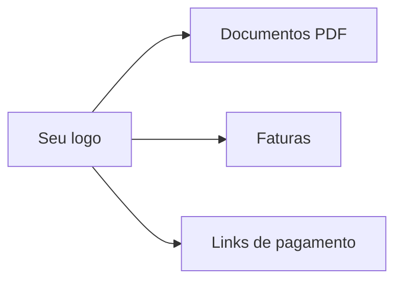

# Identidade visual

A marca da sua locadora não vive só no papel timbrado. No LocFlow, o **logo** que você cadastra aparece nos documentos gerados, nas faturas e até nos links de pagamento que o cliente abre. É a sua cara em cada ponto de contato.

Você configura isso em **Configurações → Identidade visual**.


**Por que isso te faz faturar mais:** quando o cliente recebe um orçamento, uma fatura e uma página de pagamento com a sua marca, ele sente que está lidando com uma empresa séria. Confiança fecha negócio e faz o cliente pagar sem hesitar.


## O logo da organização

Você sobe **uma** imagem e ela é usada em todos esses lugares. Para enviar, toque no ícone de upload no quadro do logo, escolha a imagem na galeria e ajuste o corte se quiser. Para trocar, é só subir outra; para tirar, toque em remover (o sistema pede confirmação).

| O que cuidar | Recomendação |
| --- | --- |
| **Formato** | PNG transparente fica melhor sobre qualquer fundo |
| **Proporção** | **1:1 (quadrado)** — você pode cortar na hora do envio |
| **Tamanho** | Até **2 MB** |


**Por que quadrado?** O logo aparece em lugares de tamanhos bem diferentes — o topo de um PDF, uma lista, um ícone pequeno. Um logo quadrado escala e centraliza bem em qualquer um deles, sem distorcer.


## Situação real

Você fecha uma locação e gera a [fatura](../primeiros-passos/glossario.md). O cliente recebe o [link de pagamento](../cobranca/pagamento-online.md), abre no celular e vê o logo da sua locadora no topo da página de cobrança. Em vez de uma tela genérica, ele reconhece a sua marca e paga na hora, sem desconfiar que o link é golpe.

## Próximo passo

Combine a marca com documentos sob medida em [Modelos personalizados](modelos-personalizados.md), ou veja como ela aparece na cobrança em [Pagamento online](../cobranca/pagamento-online.md).
