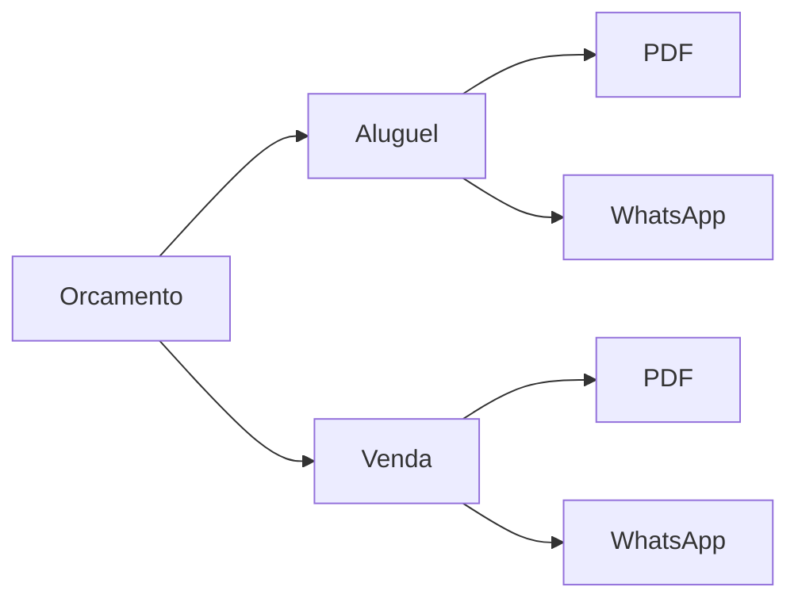
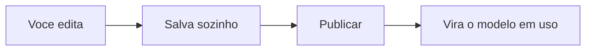

# Modelos personalizados

Todo pedido gera papelada: orçamento para o cliente aprovar, contrato para assinar, ordem de carga para o motorista, recibo para comprovar o pagamento. No LocFlow, **esses documentos já saem prontos** — bem diagramados, com os dados do orçamento, do cliente e dos seus [itens](../primeiros-passos/glossario.md). Você não precisa configurar nada para começar a usar.

E quando quiser dar a sua cara ao documento, é só personalizar — sem sair do app e sem mexer em código.


**Por que isso te faz fechar mais:** um orçamento bonito e um contrato com a sua marca passam profissionalismo. O cliente confia mais, decide mais rápido e você fecha mais. Documento amador faz o contrário: gera dúvida e adia a decisão.


## Os documentos que o sistema gera

Cada documento nasce de um **modelo**. O modelo é o "molde": define o que aparece e como aparece. O LocFlow já vem com modelos padrão para o dia a dia da locadora:

| Documento | Para que serve | Onde aparece |
| --- | --- | --- |
| **Orçamento (Aluguel)** | A proposta de [locação](../primeiros-passos/glossario.md): datas de evento, entrega/retirada e tabela de itens | Você envia ao cliente para aprovar |
| **Orçamento (Venda)** | A proposta de [venda](../primeiros-passos/glossario.md): itens, totais e condições de pagamento | Você envia ao cliente para aprovar |
| **Contrato de Locação** | O contrato com as cláusulas da sua empresa | Antes da entrega, para assinatura |
| **Ordem de Carga** | A lista do que o motorista leva: itens, endereço e quem recebe | Vai com a equipe na entrega |
| **Termo de Responsabilidade** | Confirma o recebimento e as condições de uso dos itens locados | Enviado ao cliente |
| **Recibo de Pagamento** | Comprovante de quitação | Entregue ao cliente após o pagamento |


**Aluguel e venda têm modelos separados** porque dizem coisas diferentes: o orçamento de aluguel fala de datas e devolução; o de venda fala de entrega definitiva. Assim cada documento usa a linguagem certa. Veja [Locação e venda](../conceitos/locacao-e-venda.md).


## Natureza e canal: o mesmo documento em dois formatos

Cada modelo tem duas escolhas que mudam como ele sai:

- **Natureza** — para qual operação o documento serve: **Aluguel** ou **Venda**. (Documentos como contrato, ordem de carga e recibo não dependem de natureza.)
- **Canal** — por onde o documento vai chegar ao cliente:
  - **PDF** — um arquivo bonito, pronto para baixar, imprimir ou anexar.
  - **WhatsApp** — uma mensagem em texto formatado, pronta para colar e enviar na conversa.

A mesma proposta sai como um PDF caprichado (para fechar um contrato grande) ou como uma mensagem rápida de WhatsApp (para um pedido de balcão). Você escolhe o canal certo para cada cliente.

## Personalizando no designer

Você encontra os modelos em **Configurações → Modelos**. Eles ficam agrupados por módulo (Orçamento, Logística, Financeiro). Cada modelo mostra um selo dizendo se está no **Padrão do sistema** ou se você já o deixou **Personalizado**.

Tocar em um modelo abre o **designer** — uma tela dividida em duas partes: o **editor** de um lado e a **pré-visualização** do outro (no celular, você alterna entre as abas **Editor** e **Visualizar**; em tela larga, vê os dois lado a lado).

### Documentos em PDF: montados por blocos

Você não escreve HTML nem mexe em código. O PDF é montado **empilhando blocos**, cada um com um papel:

| Bloco | O que faz |
| --- | --- |
| **Cabeçalho** | O topo do documento — sua marca e os dados de abertura |
| **Texto** | Um parágrafo livre (uma introdução, uma observação, uma cláusula) |
| **Tabela** | A lista de itens com quantidades e valores |
| **Total** | O fechamento de valores |
| **Divisor** | Uma linha para separar seções |
| **Rodapé** | O fim do documento (contatos, observações finais) |

Você adiciona, edita e reordena os blocos, e a pré-visualização mostra o resultado na hora. Dá até para testar com um **orçamento real**: escolha um no seletor e veja o documento preenchido com os dados verdadeiros daquele pedido, antes de enviar.

### Documentos em WhatsApp: texto formatado

No canal WhatsApp, o editor é um campo de **texto único** com a formatação do WhatsApp (negrito, listas). A pré-visualização mostra uma **bolha de conversa**, igual o cliente vai ver. Simples e direto.

### Salvar e publicar

- **Salvamento automático** — enquanto você edita, o sistema vai salvando o rascunho sozinho. No topo aparece "Salvando..." e depois "Salvo".
- **Publicar** — quando estiver do jeito que você quer, toque em **Publicar**. Só a versão **publicada** é a que o sistema usa de verdade nos documentos. Assim você mexe à vontade no rascunho sem medo de bagunçar o que já está rodando.


Espere a indicação **"Salvo"** antes de publicar. Publicar uma versão garante que é exatamente aquela que sai para os clientes — o rascunho fica guardado até você publicar.


## Por porte: do simples ao detalhado

O LocFlow abstrai para quem está começando e abre as portas para quem cresceu.

| Seu momento | O que fazer |
| --- | --- |
| **Começando** | Use os modelos **padrão**. Já saem prontos e profissionais — zero configuração. |
| **Quer a sua cara** | **Personalize**: ajuste textos, suba sua marca (veja [Identidade visual](identidade-visual.md)) e publique |
| **Operação grande** | Refine **bloco a bloco** por natureza e canal, mantenha versões publicadas e padronize todo o time |

## Situações reais

- **Contrato com cláusula própria:** sua locadora exige caução. Você adiciona um bloco de **Texto** com a cláusula no Contrato de Locação, publica, e todo contrato gerado já sai com ela.
- **Orçamento rápido no WhatsApp:** o cliente pediu preço pelo celular. Você usa o modelo de **Aluguel · WhatsApp**, que já manda datas e itens em texto formatado — é só colar na conversa.
- **Ordem de carga sob medida:** seu motorista precisa de um campo de observação grande para anotar o estado do local. Você ajusta o modelo de **Ordem de Carga** uma vez e toda entrega sai padronizada.


**Padronizar economiza tempo todo dia:** ajustar o modelo uma vez vale para todos os pedidos seguintes. Sua equipe para de improvisar documento a documento e tudo sai com a mesma cara, sem erro e sem retrabalho.


## Próximo passo

Dê o acabamento da marca em [Identidade visual](identidade-visual.md), ou veja onde os documentos entram em [O ciclo de um pedido](../conceitos/ciclo-de-um-pedido.md). Bateu dúvida? [Onde tirar dúvidas](../primeiros-passos/onde-tirar-duvidas.md).
