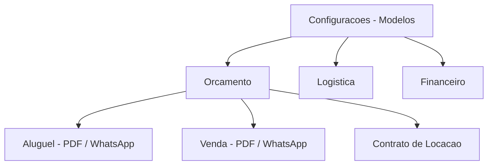
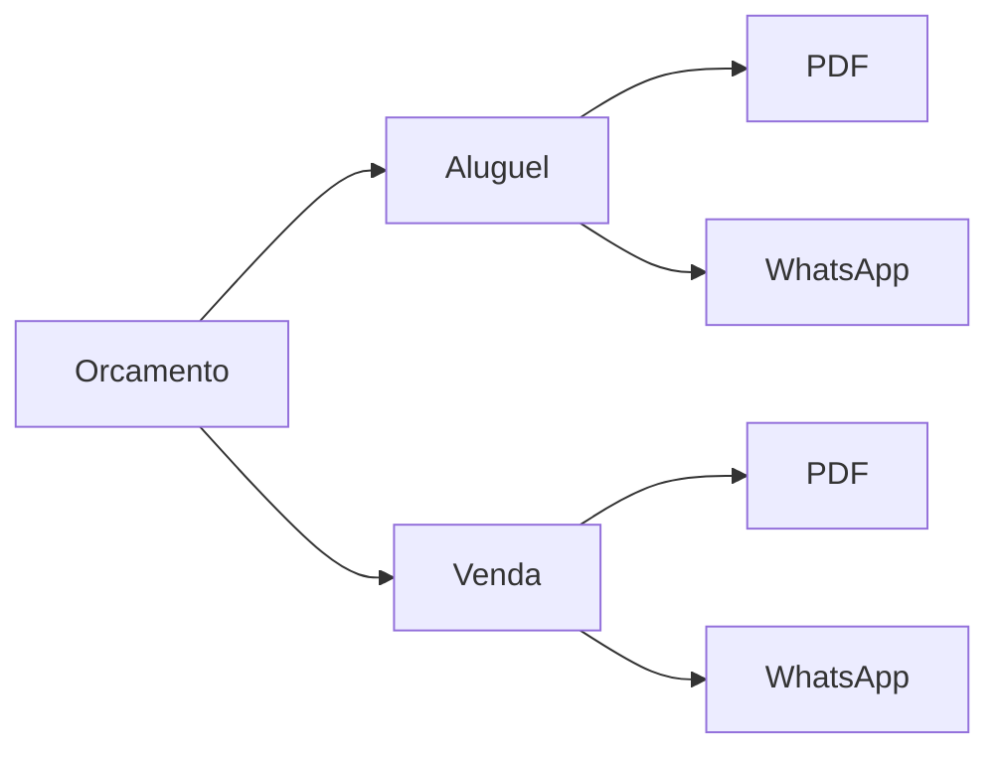
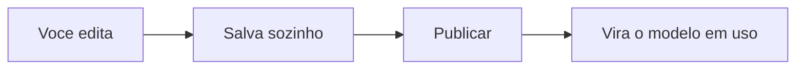

# Modelos personalizados

Todo pedido gera papelada: orçamento para o cliente aprovar, contrato para assinar, ordem de carga para o motorista, recibo para comprovar o pagamento. No LocFlow, **esses documentos já saem prontos** — bem diagramados, com os dados do orçamento, do cliente e dos seus [itens](../primeiros-passos/glossario.md). Você não precisa configurar nada para começar a usar.

E quando quiser dar a sua cara ao documento, é só personalizar — sem sair do app e sem mexer em código.


**Por que isso te faz fechar mais:** um orçamento bonito e um contrato com a sua marca passam profissionalismo. O cliente confia mais, decide mais rápido e você fecha mais. Documento amador faz o contrário: gera dúvida e adia a decisão.


## Os documentos que o sistema gera 

Cada documento nasce de um **modelo**. O LocFlow já vem com modelos padrão para o dia a dia da locadora:

| Documento | Para que serve | Onde aparece |
| --- | --- | --- |
| **Orçamento (Aluguel)** | A proposta de [locação](../primeiros-passos/glossario.md): datas de evento, entrega/retirada e tabela de itens | Você envia ao cliente para aprovar |
| **Orçamento (Venda)** | A proposta de [venda](../primeiros-passos/glossario.md): itens, totais e condições de pagamento | Você envia ao cliente para aprovar |
| **Contrato de Locação** | O contrato com as cláusulas da sua empresa | Antes da entrega, para assinatura |
| **Ordem de Carga** | A lista do que o motorista leva: itens, endereço e quem recebe | Vai com a equipe na entrega |
| **Termo de Responsabilidade** | Confirma o recebimento e as condições de uso dos itens locados | Enviado ao cliente |
| **Recibo de Pagamento** | Comprovante de quitação | Entregue ao cliente após o pagamento |

## O que é um "modelo" 

Um **modelo** é o molde do documento: define o que aparece e como aparece. Quando você gera um orçamento, o LocFlow pega o modelo correspondente e preenche os espaços com os dados daquele pedido — o nome do cliente, os itens, as datas, os valores. O molde é o mesmo para todos; os dados é que mudam de pedido para pedido.

Por isso você ajusta o **modelo uma vez** e todos os documentos seguintes daquele tipo já saem do novo jeito. Não há documento para arrumar um a um.

## Os modelos por módulo 

Você encontra os modelos em **Configurações → Modelos**. Eles ficam agrupados por **módulo**, na mesma lógica do resto do sistema:

| Módulo | Modelos |
| --- | --- |
| **Orçamento** | Aluguel · PDF, Aluguel · WhatsApp, Venda · PDF, Venda · WhatsApp, Contrato de Locação |
| **Logística** | Ordem de Carga, Termo de Responsabilidade |
| **Financeiro** | Recibo de Pagamento |

Cada módulo mostra um resumo do tipo **"5 modelos · padrão do sistema"** ou **"5 modelos · 2 personalizados"** — assim você sabe de relance onde já mexeu. Dentro do módulo de Orçamento, os modelos ainda aparecem separados por **Aluguel** e **Venda**, e o que não depende disso (contrato, ordem de carga, recibo) fica em **Outros documentos**.

### Padrão do sistema ou personalizado 

Cada modelo carrega um **selo** que diz a origem dele:

- **Padrão do sistema** (losango vazado, neutro) — você ainda não mexeu; está usando o modelo pronto do LocFlow.
- **Personalizado** (losango roxo) — você já ajustou esse modelo, e é a sua versão que sai para o cliente.

O selo é a mesma palavra e o mesmo formato em todo o sistema (modelos, motores, funções), então você reconhece o conceito na hora: **"veio pronto"** versus **"você ajustou"**.

## Natureza e canal: o mesmo documento em dois formatos 

Cada modelo tem duas escolhas que mudam como ele sai:

- **Natureza** — para qual operação o documento serve: **Aluguel** ou **Venda**. (Documentos como contrato, ordem de carga e recibo não dependem de natureza.)
- **Canal** — por onde o documento vai chegar ao cliente:
  - **PDF** — um arquivo bonito, pronto para baixar, imprimir ou anexar.
  - **WhatsApp** — uma mensagem em texto formatado, pronta para colar e enviar na conversa.


**Aluguel e venda têm modelos separados** porque dizem coisas diferentes: o orçamento de aluguel fala de datas e devolução; o de venda fala de entrega definitiva. Assim cada documento usa a linguagem certa. Veja [Locação e venda](../conceitos/locacao-e-venda.md).


A mesma proposta sai como um PDF caprichado (para fechar um contrato grande) ou como uma mensagem rápida de WhatsApp (para um pedido de balcão). Você escolhe o canal certo para cada cliente. Dentro da edição, há um atalho para pular do PDF para o WhatsApp da mesma natureza sem voltar à lista.

## Editando: blocos, texto e a prévia 

Tocar em um modelo abre o **editor**, com uma **prévia** ao lado. No celular você alterna entre as abas **Editor** e **Visualizar**; em tela larga, vê os dois lado a lado. Você **não escreve código** em momento nenhum: o PDF é montado empilhando **blocos** (cabeçalho, texto, tabela, total, divisor, rodapé), e o WhatsApp é um campo de texto único com a formatação da conversa.

O detalhe de como adicionar, ajustar e reordenar cada bloco fica em [Designer de documentos](designer-de-documentos.md). Aqui basta saber que o que você muda no editor já vira o documento que sai para o cliente, depois de **publicar**.

### "Modelo herdado do sistema"

Ao abrir um modelo que você nunca personalizou, pode aparecer um aviso no topo:

> **Modelo herdado do sistema** — Começamos um modelo novo com cabeçalho, texto, tabela e totais. Personalize cada bloco tocando nele — qualquer alteração já substitui o modelo antigo.

Isso significa que o LocFlow já montou um ponto de partida pronto para você. Não há nada de errado: é só o sinal de que, a partir da primeira alteração, esse modelo passa a ser **seu** (vira "Personalizado") e deixa de seguir o padrão do sistema.

### Prévia: exemplo x dados reais 

A prévia tem dois modos, e a tela avisa qual está em uso:

| Modo | Quando acontece | O que você vê |
| --- | --- | --- |
| **Dados de exemplo** | Nenhum orçamento selecionado | O documento preenchido com valores de demonstração, só para você ver o leiaute |
| **Dados reais** | Você escolhe um orçamento no seletor "Orçamento de teste" | O documento preenchido com os dados verdadeiros daquele pedido |

Use o seletor **"Orçamento de teste"** (busca por código) para testar com um pedido real antes de enviar qualquer coisa ao cliente. No PDF, só com um orçamento selecionado o botão **Gerar PDF** fica liberado — afinal, o arquivo final precisa de dados de verdade. A mensagem na tela é direta: *"Preview com dados de exemplo. Selecione um orçamento para gerar o arquivo definitivo."*


A prévia com dados reais é um **teste seguro**: gerar um PDF de teste ou ver a bolha do WhatsApp aqui **não envia nada** ao cliente nem altera o pedido. É só para você conferir.


### Salvar e publicar

- **Salvamento automático** — enquanto você edita, o sistema vai salvando o rascunho sozinho. No topo aparece "Salvando…" e depois "Salvo".
- **Publicar** — quando estiver do jeito que você quer, toque em **Publicar**. Só a versão **publicada** é a que o sistema usa de verdade nos documentos. Assim você mexe à vontade no rascunho sem medo de bagunçar o que já está rodando.


Espere a indicação **"Salvo"** antes de publicar. Publicar uma versão garante que é exatamente aquela que sai para os clientes — o rascunho fica guardado até você publicar.


## Quem pode ver, editar e usar 

O acesso aos modelos respeita as **competências** de cada colaborador. Para cada modelo há três níveis:

| Pode… | Significa |
| --- | --- |
| **Ver** | Abrir o modelo e olhar (prévia com dados de exemplo funciona) |
| **Editar** | Mudar os blocos/texto e publicar — quem não pode editar abre em modo somente leitura |
| **Usar** | Gerar o documento com dados reais de um pedido (testar com orçamento, baixar o PDF) |

Quem não tem a competência de **editar** vê o modelo, mas o editor fica travado. Quem não tem a de **usar** consegue olhar o leiaute com o exemplo, mas não vê a prévia com dados reais nem gera o arquivo. Quem cuida disso define no perfil de cada pessoa — veja [Colaboradores e acessos](../configuracoes/colaboradores-e-acessos.md) e [Papéis, funções e competências](../conceitos/papeis-funcoes-competencias.md).

## Por porte: do simples ao detalhado 

O LocFlow abstrai para quem está começando e abre as portas para quem cresceu.

| Seu momento | O que fazer |
| --- | --- |
| **Começando** | Use os modelos **padrão**. Já saem prontos e profissionais — zero configuração. |
| **Quer a sua cara** | **Personalize**: ajuste textos, suba sua marca (veja [Identidade visual](identidade-visual.md)) e publique |
| **Operação grande** | Refine **bloco a bloco** por natureza e canal, mantenha versões publicadas e padronize todo o time |

## Situações reais 

- **Contrato com cláusula própria:** sua locadora exige caução. Você adiciona um bloco de **Texto** com a cláusula no Contrato de Locação, publica, e todo contrato gerado já sai com ela.
- **Conferir antes de mandar:** antes de enviar a proposta de um evento grande, você escolhe esse pedido no seletor **"Orçamento de teste"** e vê o PDF preenchido com os dados reais — sem enviar nada ao cliente.
- **Orçamento rápido no WhatsApp:** o cliente pediu preço pelo celular. Você usa o modelo de **Aluguel · WhatsApp**, que já manda datas e itens em texto formatado — é só colar na conversa.
- **Ordem de carga sob medida:** seu motorista precisa de um campo de observação grande para anotar o estado do local. Você ajusta o modelo de **Ordem de Carga** uma vez e toda entrega sai padronizada.


**Padronizar economiza tempo todo dia:** ajustar o modelo uma vez vale para todos os pedidos seguintes. Sua equipe para de improvisar documento a documento e tudo sai com a mesma cara, sem erro e sem retrabalho.


## Próximo passo 

Dê o acabamento da marca em [Identidade visual](identidade-visual.md), ou veja onde os documentos entram em [O ciclo de um pedido](../conceitos/ciclo-de-um-pedido.md). Bateu dúvida? [Onde tirar dúvidas](../primeiros-passos/onde-tirar-duvidas.md).
