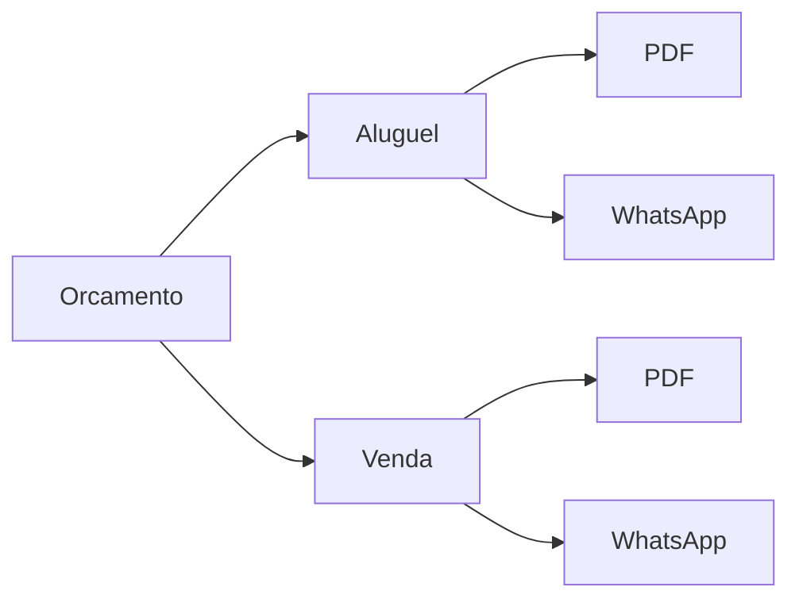
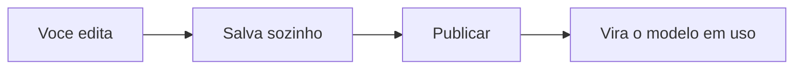

# Modelos de documento

Todo pedido gera papelada: orçamento para o cliente aprovar, contrato para assinar, ordem de carga para o motorista, recibo para comprovar o pagamento. No LocFlow, **esses documentos já saem prontos** — bem diagramados, com os dados do orçamento, do cliente e dos seus [itens](../primeiros-passos/glossario.md). Você não precisa configurar nada para começar a usar.

E quando quiser dar a sua cara ao documento, é só editar o modelo — sem sair do app e sem mexer em código.


**Por que isso te faz fechar mais:** um orçamento bonito e um contrato com a sua marca passam profissionalismo. O cliente confia mais, decide mais rápido e você fecha mais. Documento amador faz o contrário: gera dúvida e adia a decisão.


## Onde ficam {#onde-ficam}

Em **Ajustes › Modelos de documento** — *"Contratos, orçamentos e recibos que saem para o cliente"*. A tela abre numa **lista única**, na ordem em que os documentos aparecem na operação: **orçar → contratar → entregar → receber** e, por último, os **termos internos**.

## Os documentos que o sistema gera {#documentos-que-o-sistema-gera}

Cada documento nasce de um **modelo**. O LocFlow já vem com dez:

| Documento | Canal | Para que serve |
| --- | --- | --- |
| **Orçamento de aluguel** | PDF | A proposta de [locação](../primeiros-passos/glossario.md): datas de evento, entrega/retirada e tabela de itens |
| **Orçamento de aluguel** | WhatsApp | A mesma proposta em mensagem, com datas e itens em texto formatado |
| **Orçamento de venda** | PDF | A proposta de [venda](../primeiros-passos/glossario.md): itens, totais e condições de pagamento |
| **Orçamento de venda** | WhatsApp | Itens, total e próximas etapas, em mensagem |
| **Contrato de locação** | PDF | As cláusulas da sua empresa, para assinar antes da entrega |
| **Ordem de carga** | PDF | O que o motorista leva, com endereço e janela de entrega |
| **Recibo de pagamento** | PDF | O comprovante de quitação para entregar ao cliente |
| **Descrição de serviço da NFS-e** | Texto | O texto que descreve o serviço na nota fiscal de serviço — veja [abaixo](#descricao-nfse) |
| **Reserva sem estoque** | Termo interno | O termo que o operador lê e aceita ao reservar sem estoque disponível — só aparece quando a empresa permite isso. Veja [Bloquear (ou permitir) orçamento sem estoque](../estoque/galpoes-e-disponibilidade.md#bloquear-ou-permitir-orcamento-sem-estoque) |
| **Disponibilidade condicional** | Termo interno | O termo do plano superior: o estoque fecha desde que outros pedidos retornem a tempo, e o operador aceita a condição no carrinho antes de prosseguir |


**Os termos internos nunca vão para o cliente.** Eles aparecem na tela, para quem está montando o pedido, e servem para deixar claras as responsabilidades assumidas. Por isso ficam no fim da lista.


## A lista {#a-lista}

* **Busca** — *"Buscar modelo de documento"* — e os filtros **Todos**, **PDF**, **WhatsApp** e **Editados**. Tocar de novo no filtro marcado volta para **Todos**. Um contador diz quantos modelos aparecem.
* Cada linha diz **um fato** sobre o modelo, não uma classificação:

| A linha diz | O que significa |
| --- | --- |
| **Padrão do LocFlow** | Você ainda não mexeu: é o modelo pronto do sistema |
| **Editado em 2 set** | Você editou e publicou — a data é a da última publicação (o ano só aparece quando não é o atual) |
| **Rascunho não publicado** *(em âmbar)* | Há uma alteração salva que **ainda não vale**: enquanto ela existir, o cliente continua recebendo a versão anterior |

* **No celular**, tocar numa linha abre o modelo. **No computador**, um clique abre, ao lado da lista, a **prévia real** do documento, com o botão **Editar este modelo**; a setinha do cabeçalho fecha a prévia antes de sair da lista.
* No rodapé, um atalho para **Nomes de arquivo** — que agora é um item próprio de Ajustes. Veja [Nomes de arquivo](../configuracoes/nomes-de-arquivo.md).


**Ao abrir um modelo com rascunho**, o painel avisa: *"Você está vendo o rascunho. Enquanto ele não for publicado, o cliente continua recebendo a versão anterior."* É o lembrete para publicar — ou descartar — o que ficou pela metade.


## O que é um "modelo" 

Um **modelo** é o molde do documento: define o que aparece e como aparece. Quando você gera um orçamento, o LocFlow pega o modelo correspondente e preenche os espaços com os dados daquele pedido — o nome do cliente, os itens, as datas, os valores. O molde é o mesmo para todos; os dados é que mudam de pedido para pedido.

Por isso você ajusta o **modelo uma vez** e todos os documentos seguintes daquele tipo já saem do novo jeito. Não há documento para arrumar um a um.

## Natureza e canal: o mesmo documento em dois formatos 

O orçamento tem duas escolhas que mudam como ele sai:

- **Natureza** — para qual operação o documento serve: **Aluguel** ou **Venda**. (Contrato, ordem de carga e recibo não dependem de natureza.)
- **Canal** — por onde o documento vai chegar ao cliente:
  - **PDF** — um arquivo bonito, pronto para baixar, imprimir ou anexar.
  - **WhatsApp** — uma mensagem em texto formatado, pronta para colar e enviar na conversa.

```mermaid
flowchart LR
    M[Orcamento] --> AL[Aluguel]
    M --> VE[Venda]
    AL --> ALP[PDF]
    AL --> ALW[WhatsApp]
    VE --> VEP[PDF]
    VE --> VEW[WhatsApp]
```


**Aluguel e venda têm modelos separados** porque dizem coisas diferentes: o orçamento de aluguel fala de datas e devolução; o de venda fala de entrega definitiva. Assim cada documento usa a linguagem certa. Veja [Locação e venda](../conceitos/locacao-e-venda.md).


A mesma proposta sai como um PDF caprichado (para fechar um contrato grande) ou como uma mensagem rápida de WhatsApp (para um pedido de balcão). Você escolhe o canal certo para cada cliente. Dentro da edição, há um atalho para pular do PDF para o WhatsApp da mesma natureza sem voltar à lista.

## Como você quer editar? {#como-editar}

Ao abrir um modelo para editar, o app pergunta **Como você quer editar?**, com dois caminhos:

* **Criar com a Flo** *(recomendado)* — *converse sobre este modelo e a Flo escreve com você, com exemplos, testes em orçamentos reais e aprovação antes de publicar.* Hoje esse caminho existe para o **orçamento de aluguel no WhatsApp** e o **orçamento de venda no WhatsApp**; nos outros modelos o cartão aparece como *em breve*.
* **Editar manualmente** — o editor de sempre, por blocos (PDF) ou por texto (WhatsApp).

A **descrição de serviço da NFS-e** não passa por essa pergunta: ela abre direto no editor manual, porque é texto que vai para a prefeitura.

### Com a Flo: o texto do WhatsApp no jeito da casa {#com-a-flo}

Em vez de editar o modelo campo a campo, você **conversa com a [Flo](../flo/conheca-a-flo.md)** sobre como o orçamento deve chegar ao cliente pelo WhatsApp — o tom, o que vem primeiro, o que não pode faltar. A Flo transforma esse combinado num modelo de verdade, que o LocFlow preenche com os dados de cada pedido, como sempre. **Aluguel e venda são conversas separadas.**

1. **Converse.** Conte como a sua equipe escreve hoje, mande um exemplo, diga o que incomoda no padrão.
2. **Confira a bateria.** Antes de propor um texto, a Flo o testa sobre **orçamentos reais da sua empresa** e passa por uma série de checagens. Você vê o resultado já preenchido.
3. **Aprove — ou peça outra volta.** Nada é publicado sem a sua aprovação.
4. Não é preciso apertar nada para terminar: se a conversa se alongar, a Flo fecha sozinha numa proposta — a cortesia de créditos guarda uma parte só para esse fechamento.


**Apelidos, quando a casa chama diferente.** O item pode ter um **apelido** que vale só no texto que vai ao cliente — o "Kit Festa" que no catálogo se chama "Conjunto mesa redonda + 8 cadeiras". O orçamento formal continua com o nome do catálogo. São até **20 apelidos** por organização; acima disso, o certo é renomear o item no catálogo.


* O texto gerado leva o selo **Gerado pela Flo** onde é usado — e uma edição manual depois não apaga essa marca.
* A conversa de criação tem um **crédito de cortesia próprio**, concedido uma vez por organização e usado antes da sua carteira de créditos — é o que garante que a conversa sempre termina num modelo, inclusive no teste grátis. Quando a cortesia acaba, o gasto volta para a carteira. Veja [Minha assinatura e créditos](../configuracoes/assinatura-e-creditos.md).

#### A linha do tempo do modelo

Cada vez que a Flo aplica um texto, ele vira um ponto numa **linha do tempo** (o ícone de relógio). Você pode **andar pelas versões anteriores** para ver como o texto estava — só olhar, sem gravar nada. Gostou mais de uma antiga? Toque em **Voltar para esta**: o LocFlow grava uma **versão nova** igual àquela, e o que veio depois continua no histórico, caso você se arrependa.

### Manualmente: blocos, texto e a prévia 

O editor manual abre com uma **prévia** ao lado. No celular você alterna entre as abas **Editor** e **Visualizar**; em tela larga, vê os dois lado a lado. Você **não escreve código** em momento nenhum: o PDF é montado empilhando **blocos** (cabeçalho, texto, tabela, totais, divisória, rodapé), e o WhatsApp é um campo de texto único com a formatação da conversa.

O detalhe de como adicionar, ajustar e reordenar cada bloco fica em [Designer de documentos](designer-de-documentos.md). Aqui basta saber que o que você muda no editor vira o documento que sai para o cliente depois de **publicar**.

#### "Modelo herdado do sistema"

Ao abrir um modelo que você nunca personalizou, pode aparecer um aviso no topo:

> **Modelo herdado do sistema** — Começamos um modelo novo com cabeçalho, texto, tabela e totais. Personalize cada bloco tocando nele — qualquer alteração já substitui o modelo antigo.

Isso significa que o LocFlow já montou um ponto de partida pronto para você. Não há nada de errado: é só o sinal de que, a partir da primeira alteração publicada, esse modelo passa a ser **seu** — a lista passa a mostrar a data da edição — e deixa de seguir o padrão do sistema.

## Quando o modelo do sistema muda {#modelo-do-sistema-mudou}

O LocFlow melhora os modelos padrão de tempos em tempos. Quem **não editou** um modelo recebe essas melhorias sozinho. Quem editou, não — a sua versão é sua, e o sistema não mexe nela.

Por isso, quando o modelo padrão muda depois da sua edição, o editor mostra a faixa **O modelo do sistema mudou**: *"2 seções do modelo padrão estão diferentes da sua versão. Correções do produto não alcançam um modelo personalizado."* Toque em **Ver quais seções** para saber o que mudou.

Se preferir voltar ao padrão, use **Restaurar o padrão do sistema**. A confirmação — **Restaurar o modelo do sistema?** — é direta: as suas personalizações daquele documento são descartadas, ele volta a ser o modelo padrão, passa a receber as correções do produto automaticamente, e **não há como desfazer**. Para seguir, toque em **Descartar e restaurar**.


Antes de restaurar, anote o que você tinha personalizado (a cláusula de caução, o texto do rodapé…). Depois de restaurado, é preciso refazer à mão o que ainda quiser manter.


## Prévia: exemplo x dados reais 

A prévia tem dois modos, e a tela avisa qual está em uso:

| Modo | Quando acontece | O que você vê |
| --- | --- | --- |
| **Dados de exemplo** | Nenhum orçamento selecionado | O documento preenchido com valores de demonstração, só para você ver o leiaute |
| **Dados reais** | Você escolhe um pedido no seletor **Orçamento real** | O documento preenchido com os dados verdadeiros daquele pedido |

Use o seletor **Orçamento real** (*"Buscar orçamento por código…"*) para testar com um pedido real antes de enviar qualquer coisa ao cliente — o último que você escolheu fica lembrado. No PDF, só com um orçamento selecionado o botão **Gerar PDF** fica liberado — afinal, o arquivo final precisa de dados de verdade: *"Selecione um orçamento acima para liberar a geração com dados reais."* E a tela sempre diz em que modo você está — *"Mostrando dados de exemplo"*, com as imagens apenas ilustrativas, até você escolher um pedido.


A prévia com dados reais é um **teste seguro**: gerar um PDF de teste ou ver a bolha do WhatsApp aqui **não envia nada** ao cliente nem altera o pedido. É só para você conferir.


## Salvar e publicar

```mermaid
flowchart LR
    E[Voce edita] --> S[Salva sozinho]
    S --> P[Publicar]
    P --> U[Vira o modelo em uso]
```

- **Salvamento automático** — enquanto você edita, o sistema vai salvando o rascunho sozinho. No topo aparece "Salvando…" e depois "Salvo". Se o salvamento falhar, o lugar do "Salvo" mostra **o motivo** — você não fica achando que salvou.
- **Publicar** — quando estiver do jeito que você quer, toque em **Publicar**. Só a versão **publicada** é a que o sistema usa de verdade nos documentos. Assim você mexe à vontade no rascunho sem medo de bagunçar o que já está rodando — e a lista mostra **Rascunho não publicado** enquanto houver alteração esperando.


Espere a indicação **"Salvo"** antes de publicar. Publicar uma versão garante que é exatamente aquela que sai para os clientes — o rascunho fica guardado até você publicar.


## A descrição de serviço da NFS-e {#descricao-nfse}

Este modelo não gera um arquivo: ele monta o **texto que descreve o serviço** na nota fiscal de serviço — o que o seu cliente lê na nota. O padrão é a linha de sempre, montada a partir dos itens do pedido (*"Locação de bens — 2x Mesa, 10x Cadeira"*).

Editando o modelo, você pode acrescentar:

* **dados do pedido** — o código do orçamento, o valor dos itens, o frete, o desconto, o total;
* **texto fixo** — os dados bancários da empresa, uma observação que vai em toda nota;
* **campos que você preenche na hora de emitir** — por exemplo, o número do **pedido de compra** do cliente. A tela de emissão pergunta esses campos antes de transmitir, e você pode deixá-los em branco.


**O texto chega à prefeitura exatamente como foi escrito.** O editor deste modelo não tem barra de formatação, e a prévia mostra o texto literal: um asterisco no modelo é um asterisco na nota. E nada sai sem ser preenchido — se sobrar no texto um campo que o sistema não sabe preencher, a nota não é transmitida, e a tela de emissão diz qual é o campo.


A descrição de cada nota pode ser ajustada na própria emissão — veja [Emitir uma nota fiscal](../fiscal/emitir-nota.md).

## Quem pode ver, editar e usar 

O acesso aos modelos respeita as **competências** de cada colaborador. Para cada modelo há três níveis:

| Pode… | Significa |
| --- | --- |
| **Ver** | Abrir o modelo e olhar (prévia com dados de exemplo funciona) |
| **Editar** | Mudar os blocos/texto e publicar — quem não pode editar abre em modo somente leitura |
| **Usar** | Gerar o documento com dados reais de um pedido (testar com orçamento, baixar o PDF) |

Quem não tem a competência de **editar** vê o modelo, mas o editor fica travado. Quem não tem a de **usar** consegue olhar o leiaute com o exemplo, mas não vê a prévia com dados reais nem gera o arquivo. Um modelo que o seu acesso não alcança simplesmente não aparece na lista. Quem cuida disso define no perfil de cada pessoa — veja [Colaboradores e acessos](../configuracoes/colaboradores-e-acessos.md) e [Papéis, funções e competências](../conceitos/papeis-funcoes-competencias.md).

## Por porte: do simples ao detalhado 

O LocFlow abstrai para quem está começando e abre as portas para quem cresceu.

| Seu momento | O que fazer |
| --- | --- |
| **Começando** | Use os modelos **padrão**. Já saem prontos e profissionais — zero configuração. |
| **Quer a sua cara** | Converse com a **Flo** sobre o orçamento do WhatsApp, ajuste textos, suba sua marca (veja [Identidade visual](identidade-visual.md)) e publique |
| **Operação grande** | Refine **bloco a bloco** por natureza e canal, use o filtro **Editados** para revisar o que é seu e padronize todo o time |

## Situações reais 

- **Contrato com cláusula própria:** sua locadora exige caução. Você adiciona um bloco de **Texto** com a cláusula no Contrato de locação, publica, e todo contrato gerado já sai com ela.
- **Conferir antes de mandar:** antes de enviar a proposta de um evento grande, você escolhe esse pedido no seletor **Orçamento real** e vê o PDF preenchido com os dados reais — sem enviar nada ao cliente.
- **Orçamento rápido no WhatsApp, do jeito da casa:** sua equipe sempre começa a mensagem com um "Olá, tudo bem?" e o total em destaque. Você conta isso à Flo, confere o texto nos seus próprios orçamentos e aprova — e todo orçamento de WhatsApp passa a sair assim.
- **Ordem de carga sob medida:** seu motorista precisa de um campo de observação grande para anotar o estado do local. Você ajusta o modelo de **Ordem de carga** uma vez e toda entrega sai padronizada.
- **O cliente pede o número do pedido de compra na nota:** você acrescenta esse campo à descrição de serviço da NFS-e, e a emissão passa a perguntá-lo antes de transmitir.


**Padronizar economiza tempo todo dia:** ajustar o modelo uma vez vale para todos os pedidos seguintes. Sua equipe para de improvisar documento a documento e tudo sai com a mesma cara, sem erro e sem retrabalho.


## Próximo passo 

Dê o acabamento da marca em [Identidade visual](identidade-visual.md), defina como cada arquivo é batizado em [Nomes de arquivo](../configuracoes/nomes-de-arquivo.md), ou veja onde os documentos entram em [O ciclo de um pedido](../conceitos/ciclo-de-um-pedido.md). Bateu dúvida? [Onde tirar dúvidas](../primeiros-passos/onde-tirar-duvidas.md).
