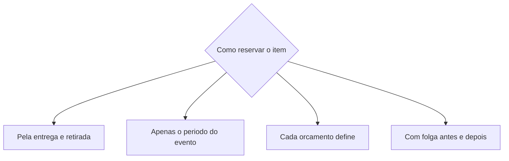

# Galpões e disponibilidade

O galpão é o **lugar de onde seus [bens móveis](../primeiros-passos/glossario.md) saem e para onde voltam**. No LocFlow, cadastrar o galpão dá ao sistema o ponto de partida das entregas (o endereço e o alcance) e a base para calcular o **bloqueio de estoque** — a regra que impede você de alugar o mesmo item para dois clientes no mesmo período.

## Criando um galpão

O cadastro é guiado e simples:

- **Nome** — como sua equipe chama o galpão (ex.: "Galpão Nordeste").
- **Localização** — informe o CEP e o LocFlow completa o endereço; você confirma ou ajusta o pino no mapa.
- **Tipo de local** — Comercial, Industrial ou Rural.
- **Raio máximo de atendimento** — a distância máxima, a partir do galpão, para as entregas (ex.: 1,2 km). É a cobertura daquela base.
- **Fuso horário** — preenchido automaticamente pelas coordenadas do endereço.


O endereço vira a **origem das rotas** e o raio define até onde você atende. Por isso vale posicionar o pino com capricho — é dele que sai o cálculo de frete e o traçado das entregas.



**Por que isso te faz faturar mais:** com galpão e raio definidos, o LocFlow já sabe de onde sai a entrega e até onde compensa atender. Você cota frete na hora, não promete entrega fora do alcance e organiza as rotas a partir do ponto certo — menos viagem perdida, mais pedido fechado.


## Bloqueio de estoque: o coração da disponibilidade

O **bloqueio de estoque** é a **janela de tempo em que um item fica reservado** para um cliente e, portanto, **indisponível para outro**. É o que impede o erro mais clássico de uma locadora: alugar a mesma tenda para duas festas no mesmo fim de semana.

Você define **uma política** que vale para a operação inteira, no Motor de Estoque (em Ajustes > Motores). São quatro opções:

| Política | Quando o item fica reservado | Indicada para |
| --- | --- | --- |
| **Pela entrega e retirada** *(recomendada)* | Do momento em que o item sai para a entrega até voltar na retirada | Quem agenda entrega e coleta |
| **Apenas o período do evento** | Só as datas do evento informadas no orçamento, sem contar deslocamento | Quem entrega e devolve no balcão |
| **Cada orçamento define** | Sem regra fixa — você informa a janela em cada orçamento | Quando cada locação é muito diferente |
| **Com folga antes e depois** | O período do evento mais um tempo extra antes e depois | Quem precisa de margem entre uma locação e a próxima |

### Folgas: a margem de segurança

Duas políticas trabalham com **folga** — um tempo extra em que o item continua bloqueado, para você não emendar uma locação na outra sem respiro:

- **Folga de estoque** (na política *Com folga antes e depois*) — definida em **dias**. Exemplo: com 1 dia de folga antes e depois, um item usado num evento de sábado fica indisponível de sexta a domingo.
- **Folga de rota** (na política *Pela entrega e retirada*) — definida em **minutos**, mais fina. Antecipa um pouco a reserva antes da entrega e a estende um pouco depois da retirada, para cobrir o deslocamento e imprevistos sem o item ser reservado para outro cliente nesse intervalo. Deixe 0 para não usar.


A política vale para toda a operação. Escolha pensando em como você realmente opera: quem entrega **no local** ganha com "Pela entrega e retirada"; quem trabalha **no balcão** se encaixa em "Apenas o período do evento". Errar aqui faz o item parecer livre quando não está — ou ocupado quando já voltou.



**Por que isso protege seu faturamento:** o bloqueio certo evita o pior pesadelo da locação — prometer o que você não tem. Sem reserva dupla, sem cliente na mão na hora do evento, sem prejuízo de remarcar às pressas. A folga ainda te dá fôlego para conferir e preparar o material entre uma locação e outra.


## Situação real: o mesmo item, dois clientes, datas que encostam

A Maria aluga **30 cadeiras**. O Cliente A faz uma festa no **sábado**; o Cliente B, um almoço no **domingo**.

- **Sem folga:** as cadeiras voltam sábado à noite e já estariam "livres" para sair domingo cedo — mas a equipe ainda nem conferiu nem limpou. Risco de sair material sujo ou faltando.
- **Com 1 dia de folga (estoque):** sábado e domingo ficam bloqueados juntos. O LocFlow não deixa reservar as mesmas cadeiras para o Cliente B — e avisa antes de fechar o orçamento.
- **Com folga de rota (minutos):** ideal quando há entrega e coleta no mesmo dia. A reserva se estende o suficiente para cobrir o trajeto de volta, sem travar um dia inteiro à toa.

O resultado: a Maria fecha os dois pedidos **com tranquilidade** ou sabe, na hora, que precisa de mais cadeiras — em vez de descobrir o problema no domingo de manhã.

## Em breve

O módulo de estoque está crescendo. Nas próximas versões chegam recursos para acompanhar o material em detalhe:

- **Movimentações** — entradas, saídas, transferências entre galpões, ajustes, baixas e manutenção.
- **Giro do estoque por produto** — quanto cada item roda e rende ao longo do tempo.
- **Disponibilidade** — uma visão consolidada do que está livre, reservado ou em manutenção, por período.


Esses recursos ainda não estão no app. Por enquanto, a disponibilidade é garantida pelo **bloqueio de estoque** descrito acima, que já protege você contra reserva dupla.


## Próximo passo

Veja como o pedido caminha em [O ciclo de um pedido](../conceitos/ciclo-de-um-pedido.md) e ajuste suas regras em [Motores operacionais](../configuracoes/motores-operacionais.md). Em dúvida sobre um termo? Consulte o [Glossário](../primeiros-passos/glossario.md) ou veja [Onde tirar dúvidas](../primeiros-passos/onde-tirar-duvidas.md).
