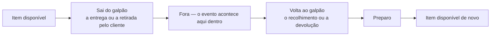

# Galpões e disponibilidade

O galpão é o **lugar de onde seus [bens móveis](../primeiros-passos/glossario.md) saem e para onde voltam**. No LocFlow, cadastrar o galpão dá ao sistema o ponto de partida das entregas (o endereço e o alcance) e a base para calcular o **bloqueio de estoque** — a regra que impede você de alugar o mesmo item para dois clientes no mesmo período.

## Criando um galpão

O cadastro é guiado e simples:

- **Nome** — como sua equipe chama o galpão (ex.: "Galpão Nordeste").
- **Localização** — informe o CEP e o LocFlow completa o endereço; você confirma ou ajusta o pino no mapa.
- **Tipo de local** — Comercial, Industrial ou Rural.
- **Raio máximo de atendimento** — a distância máxima, a partir do galpão, para as entregas (ex.: 1,2 km). É a cobertura daquela base.
- **Fuso horário** — preenchido automaticamente pelas coordenadas do endereço.


O endereço vira a **origem das rotas** e o raio define até onde você atende. Por isso vale posicionar o pino com capricho — é dele que sai o cálculo de frete e o traçado das entregas.



**Hoje, o galpão é também o balcão de atendimento.** Quando um cliente **retira ou devolve no galpão**, ele vem a este **mesmo endereço** — o [balcão](../logistica/balcao.md) é a parte de atendimento do galpão, não um ponto à parte. Você ainda não consegue ter um balcão (ponto de retirada do cliente) num endereço diferente do galpão. **Em breve**, locadoras maiores poderão separar os dois: armazéns em certos endereços e balcões/pontos de retirada em outros. Por enquanto, os dois andam sempre juntos.



**Por que isso te faz faturar mais:** com galpão e raio definidos, o LocFlow já sabe de onde sai a entrega e até onde compensa atender. Você cota frete na hora, não promete entrega fora do alcance e organiza as rotas a partir do ponto certo — menos viagem perdida, mais pedido fechado.


## Bloqueio de estoque: o coração da disponibilidade

O **bloqueio de estoque** é a **janela de tempo em que um item fica reservado** para um cliente e, portanto, **indisponível para outro**. É o que impede o erro mais clássico de uma locadora: alugar a mesma tenda para duas festas no mesmo fim de semana.

### O bloqueio acompanha a saída e a volta do material

A base do cálculo **não se configura**, porque ela é ditada pela realidade: o item fica bloqueado **do momento em que sai do galpão até o momento em que volta**. É a saída que tira o item de circulação — não o evento. O material sai **antes** de o evento começar (para dar tempo de montar) e volta **depois** de ele acabar (porque alguém precisa ir buscar).

```mermaid
flowchart LR
    A["Item disponível"] --> B["Sai do galpão<br/>a entrega ou a retirada pelo cliente"]
    B --> C["Fora — o evento acontece aqui dentro"]
    C --> D["Volta ao galpão<br/>o recolhimento ou a devolução"]
    D --> E["Preparo"] --> F["Item disponível de novo"]
```


**Quando a ponta é do cliente, vale o dia todo.** Se ele retira ou devolve no galpão, existe uma data contratada mas não existe hora garantida — então o LocFlow reserva o dia inteiro. Combine um horário com o cliente e a janela aperta sozinha.


### A política: quanta folga somar

No Motor de Estoque (em Ajustes > Motores) você escolhe **uma política**, que vale para a operação inteira. São **duas** opções, e a única diferença entre elas é a folga:

| Política | Quando o item fica reservado | Indicada para |
| --- | --- | --- |
| **Mínimo justo** | Exatamente da saída até a volta, sem nenhuma folga | Operação bem previsível, com horário confirmado nas duas pontas |
| **Com folga** *(recomendada)* | O mesmo período, esticado por um tempo extra antes e depois | Praticamente todo mundo — é o padrão de uma locadora nova |


**Use folga.** O "Mínimo justo" é apertado demais para a maioria: ele assume que tudo acontece no horário previsto, e o LocFlow libera o item para o próximo cliente no minuto seguinte ao retorno esperado. Um atraso de trânsito vira problema de dois pedidos em vez de um.


### As duas folgas: equipe e cliente

A folga não é um número só, porque o atraso tem **naturezas diferentes**. São quatro campos, todos **em minutos**:

| A folga de… | Cobre o quê | Padrão |
| --- | --- | --- |
| **Equipe** (antes / depois) | Você entrega e recolhe: trânsito, rota mais lenta que o previsto, uma parada que demorou. | **60 min** de cada lado |
| **Cliente** (antes / depois) | Ele retira e devolve no galpão: aparece mais tarde, remarca, devolve só no dia seguinte. | **0** — a ponta dele já vale o dia todo |

Numa operação **mista**, cada ponta usa a folga do seu grupo: se a sua equipe entrega e o cliente devolve, a abertura do bloqueio usa a folga de **equipe** e o fechamento usa a de **cliente**.

**Como estimar sem ter os dados?** Pense no **pior atraso comum do último mês** (não o desastre isolado — o que se repete toda semana), ou no tempo de **uma volta extra até o galpão**. Se o retorno de rota leva 45 minutos, é isso que vai na folga de equipe *depois*. E se o cliente às vezes devolve no dia seguinte, uma folga de cliente de **1440 minutos** (um dia) te protege disso.


**Por que isso protege seu faturamento:** o bloqueio certo evita o pior pesadelo da locação — prometer o que você não tem. Sem reserva dupla, sem cliente na mão na hora do evento, sem prejuízo de remarcar às pressas. A folga ainda te dá fôlego para conferir e preparar o material entre uma locação e outra.


### O sistema avisa quando as datas não fecham

Existe uma regra que o LocFlow passou a cobrar: **o bloqueio precisa cobrir toda a operação, e a operação precisa cobrir o evento**. Se um orçamento sair disso — a janela ajustada à mão para menos do que o vai e volta real, ou um recolhimento agendado antes de o evento terminar —, o app **avisa e pede correção antes de você seguir**, em vez de deixar passar calado.


Isso é proteção, não burocracia: cada aviso desses representa um pedido que você teria fechado prometendo um item que ainda estaria na rua. Entenda a regra inteira em [Duração, cobrança e bloqueio de uso](../orcamentos/duracao-e-bloqueio.md#a-regra-que-o-locflow-cobra-de-voce).


## Bloquear (ou permitir) orçamento sem estoque {#bloquear-ou-permitir-orcamento-sem-estoque}

No mesmo Motor de Estoque existe uma chave que decide **o que acontece quando falta item para fechar um pedido**: **"Bloquear orçamento sem estoque"**.

- **Ligada (padrão):** o LocFlow **não deixa fechar** um orçamento se algum item não tem estoque disponível na janela de bloqueio. É a regra da casa "não aluga o que não tem" — segura, recomendada para a maioria.
- **Desligada:** você **permite** fechar mesmo sem estoque cheio — mas de forma **controlada**, não ilimitada.


**Desligar cobra um termo de responsabilidade.** Com a chave desligada, o app passa a pedir, no fechamento do pedido, que você **assuma explicitamente** o compromisso de suprir o que falta. Não é uma formalidade: é o momento em que você declara que consegue comprar, sublocar ou remanejar o material a tempo. Se não consegue, o lugar de resolver isso é antes — mantendo a chave ligada.


### Teto de overbooking: sobre-reservar com limite

Ao **desligar** o bloqueio, aparece o campo **"Teto de overbooking"** — quanto você aceita reservar **acima** do estoque físico, em porcentagem. É o mesmo modelo de companhias aéreas e hotéis: aceitar um pouco além do que se tem, sabendo que dá para suprir a diferença (comprando, sublocando ou remanejando).

- O padrão é **10%** — um valor conservador e bastante usado no mercado.
- Exemplo: com **10 cadeiras** e teto de **10%**, você pode reservar até **11**. A 12ª já é barrada.
- Use **0%** para permitir **sem limite** (o LocFlow nunca barra por falta de estoque).

| Chave "Bloquear sem estoque" | Comportamento ao fechar |
| --- | --- |
| **Ligada** | Barra qualquer pedido acima do estoque disponível |
| **Desligada, teto 10%** | Permite reservar até 10% acima do físico; barra além disso |
| **Desligada, teto 0%** | Permite qualquer quantidade (sem limite) |

### Quando o negócio já foi fechado e o estoque não cobre

Um pedido pode ser **ganho** e, só depois, o estoque deixar de cobrir — por exemplo, dois orçamentos diferentes reservam o mesmo item, ou você deu baixa/avaria entre a proposta e o fechamento. Nesse caso o LocFlow **nunca cancela a venda** (negócio fechado é compromisso): a reserva é aplicada mesmo assim e você recebe um aviso **"Estoque descoberto"** na Central de Notificações, com o pedido e a quantidade que faltou — para providenciar o suprimento a tempo.


Mantenha o bloqueio **ligado** se você não quer correr o risco de sobrevender. Só desligue (com um teto) se a sua operação realmente consegue suprir a diferença na hora — a responsabilidade de honrar o pedido passa a ser sua.


## Situação real: o mesmo item, dois clientes, datas que encostam

A Maria aluga **30 cadeiras**. O Cliente A faz uma festa no **sábado**; o Cliente B, um almoço no **domingo**.

A equipe da Maria entrega sexta de manhã e recolhe **domingo às 18h**. Repare que o evento do Cliente A é só no sábado, mas as cadeiras ficam fora de sexta a domingo — é a **operação**, não o evento, que define o bloqueio.

- **Mínimo justo:** as cadeiras contam como livres às 18h de domingo, cravado. Se a rota atrasar uma hora, o LocFlow já terá oferecido as mesmas cadeiras para o almoço do Cliente B.
- **Com folga de equipe (60 min depois):** o bloqueio só fecha às 19h. A hora de trânsito está coberta e ninguém promete cadeira que está na estrada.
- **Se o Cliente B devolvesse no balcão:** a ponta seria dele, e valeria o dia inteiro — porque não há hora garantida de devolução.

O resultado: a Maria fecha os dois pedidos **com tranquilidade** ou sabe, na hora, que precisa de mais cadeiras — em vez de descobrir o problema no domingo de manhã.

## Acompanhando o estoque no dia a dia

O bloqueio protege você **na hora de fechar** o pedido. Para ver o que existe no galpão agora e o que estará livre numa data futura, o LocFlow tem uma tela dedicada — com a **Posição** (o físico de agora), a **previsão por data** e a **Data de Liberação** de cada item, que já considera o retorno mais o tempo de preparo.

Veja [Posição e previsão de estoque](posicao-e-previsao.md).

## Próximo passo

Veja como o pedido caminha em [O ciclo de um pedido](../conceitos/ciclo-de-um-pedido.md) e ajuste suas regras em [Motores operacionais](../configuracoes/motores-operacionais.md#motor-de-estoque). Para entender a janela de bloqueio por dentro, veja [Duração, cobrança e bloqueio de uso](../orcamentos/duracao-e-bloqueio.md). Em dúvida sobre um termo? Consulte o [Glossário](../primeiros-passos/glossario.md) ou veja [Onde tirar dúvidas](../primeiros-passos/onde-tirar-duvidas.md).
