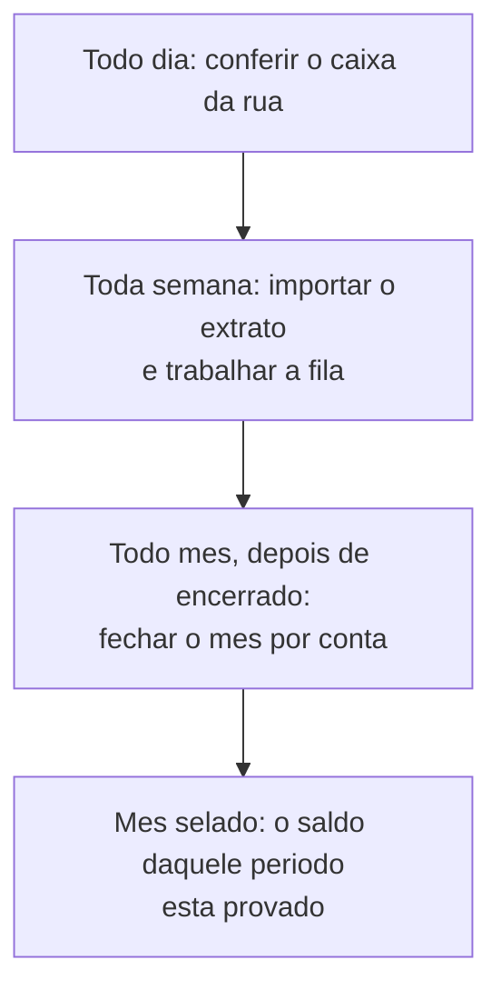

# Conciliação e fechamento

Conferir dinheiro é o trabalho que faz o resto confiável. O LocFlow tem **três** conferências, e elas resolvem problemas diferentes — a confusão entre elas é o erro mais comum de quem começa.


**Leia esta tabela antes de qualquer coisa.** Três nomes parecidos, três coisas distintas:

| | O que é | Contra o que confere | Onde fica |
| --- | --- | --- | --- |
| **Fechamento de caixa** | Conferir o dinheiro e a maquininha que **alguém recebeu na rua ou no balcão** | A palavra de quem recebeu × o dinheiro que chegou à tesouraria | Ajustes → **Fechamento de caixa** (e no menu do app, quando há pendência) |
| **Fechamento mensal** | **Selar** um mês já conferido de uma conta | O saldo do razão × o saldo do **extrato** no fim do mês | Ajustes → **Conciliação** → aba *Fechamento mensal* |
| **Extrato bancário** | Casar **linha por linha** o que o banco reportou com os seus lançamentos | Cada linha do extrato × cada lançamento | Ajustes → **Conciliação** → aba *Extrato bancário* |

O fechamento de **caixa** é sobre **pessoas** (quem recebeu o quê). Os outros dois são sobre **banco**.


Os três se anunciam sozinhos: quando há pendência, [a visão geral mostra um cartão](visao-geral.md#trabalho-esperando) com a contagem e o caminho.

## A diferença entre o seu saldo e o do banco é normal

Comece por aqui, porque é a dúvida que trava todo mundo: **o saldo do LocFlow raramente é igual ao saldo do banco, e isso não é um defeito.**

Motivos legítimos, todos comuns:

* **Tarifas** que o banco cobrou e ninguém lançou ainda (pacote de serviços, DOC, manutenção de conta).
* **Rendimento** ou **juros** creditados sem aviso.
* Um pagamento feito no banco e **ainda não registrado** no LocFlow.
* Um lançamento registrado com a **data** ou a **conta** errada.
* Dinheiro que está no **processador de pagamentos** e ainda não foi sacado — ele aparece na conta-espelho do gateway, não no banco.


**O que fazer com a diferença:** não corrija o saldo à mão (o LocFlow não deixa, e por bons motivos — saldo digitado deixa de ser verificável). O caminho é o contrário: **encontre a linha que falta**. O **extrato bancário** encontra por você, uma linha por vez; o **fechamento mensal** registra a sobra que restou, como um **ajuste justificado**, e sela o período. O que nunca deve acontecer é você olhar dois números diferentes e não saber o porquê.


## Saldo de abertura: quem vem de outro sistema {#saldo-de-abertura}

Se a sua locadora já operava antes do LocFlow, o saldo real da conta não nasce de zero. O **saldo de abertura** resolve isso: você informa **quanto a conta tinha, numa data**, e o LocFlow passa a contar dali para frente.

1. Em **Ajustes → Conciliação**, escolha a conta nos chips do topo.
2. No cartão **Saldo de abertura**, toque em **Definir**.
3. Informe o **saldo real na data** (há um botão para marcar que a conta estava **negativa**) e a **data de abertura**.

O que acontece:

* O saldo da conta passa a ser **abertura + tudo o que veio depois**.
* Movimento **anterior** à data de abertura fica **fora** do saldo — é justamente o histórico que já estava contabilizado no sistema antigo, e contá-lo de novo dobraria o dinheiro.
* Depois da abertura definida, o LocFlow **recusa** lançamento com data anterior a ela: nasceria invisível para todos os saldos.


**Depois do primeiro fechamento mensal, o saldo de abertura fica imutável.** Ele é o alicerce da cadeia de meses selados: mudá-lo depois reescreveria todo saldo já conferido. Confira o número **antes** de fechar o primeiro mês.


## Fechamento mensal por conta {#fechamento-mensal}

Fechar o mês é dizer: *"conferi este mês nesta conta, e daqui não se mexe mais"*.

A conciliação é **por conta** — cada uma tem a sua própria cadeia de meses, porque cada uma tem o seu próprio extrato.

### Como fechar

1. Escolha a **conta** nos chips do topo.
2. Toque em **Fechar {mês}** — o LocFlow já propõe o **próximo mês da cadeia**.
3. Leia a **prévia**: o *saldo calculado no fim do mês* (o que o razão diz) e o *movimento do mês*.
4. Informe o **saldo do extrato do banco no fim do mês** — o número que está no seu extrato, não o que você acha.
5. Se houver **diferença**, escreva a **justificativa** (obrigatória).
6. **Fechar e selar o mês**.

### O que o mês selado trava

| Depois de fechado | O que acontece |
| --- | --- |
| Os lançamentos daquele mês | Ficam **selados** — marcados como conferidos |
| Lançar algo com data naquele mês | **Recusado**. O que o sistema lança sozinho (uma taxa atrasada, por exemplo) cai no **primeiro dia do mês aberto seguinte** |
| Editar a data de um realizado para dentro do mês fechado | **Recusado** |
| A diferença entre razão e extrato | Virou um **lançamento de ajuste** com a sua justificativa — visível, não escondido |


**Por que travar é o objetivo, e não um efeito colateral.** Um mês conferido que continua aceitando lançamento retroativo não foi conferido: amanhã o saldo daquele mês é outro, e a conferência que você fez virou ficção. É esse selo que permite dizer, meses depois, *"em março a conta fechou em R$ 12.480 e está provado"*.


### A cadeia, sem pulos

* Só **meses já encerrados** podem ser fechados. O mês corrente ainda está acontecendo — congelá-lo congelaria um saldo incompleto.
* Os meses fecham **em ordem**, sem pular: fechar março depois de abril faria o saldo-base de abril mudar depois de conferido.
* O mês fechado também protege os **meses anteriores** — inserir algo antes da cadeia mudaria o saldo de partida.

### Reabrir um mês

Achou um lançamento esquecido? Só o **último mês fechado** pode ser reaberto, e com **justificativa obrigatória**:

* o **selo** dos lançamentos sai;
* o **ajuste** daquele fechamento é desfeito;
* o mês precisa ser **refechado** depois da correção;
* a reabertura fica registrada — **quem, quando e por quê**.

Na lista, o mês reaberto aparece com o cadeado aberto e o aviso *"Reaberto — refeche para selar"*.

## Extrato bancário: a fila de conciliação {#extrato}

Aqui você casa o que o **banco** reportou com o que o **razão** registra — linha por linha.

### Importar o extrato

Na aba **Extrato bancário**, use **Importar extrato (OFX)** e escolha o arquivo que você baixou do internet banking. Ao terminar, o LocFlow diz o que fez: *"N novas, N conciliadas sozinhas, N repetidas"*.


**Importar o mesmo arquivo duas vezes não duplica nada.** O LocFlow reconhece cada movimento pelo identificador que o próprio banco dá — reimportar é seguro. Se ficou em dúvida se importou, importe de novo.


Linhas com casamento **muito forte** (mesmo valor, mesma data, sem outro candidato) já entram **conciliadas sozinhas** — não aparecem na fila. Havendo **empate** — duas saídas idênticas no mesmo dia —, o LocFlow **nunca** decide por você: as duas vão para a fila.

### Trabalhar a fila

Cada linha pendente mostra a **data**, a **descrição do banco** e o **valor** (verde para crédito, vermelho para débito) e, quando existe, a **melhor sugestão** com o grau de confiança: *"Sugestão (87%): Gasolina do caminhão"*.

Três caminhos por linha:

| Ação | Quando usar | O que faz |
| --- | --- | --- |
| **Conciliar** | A sugestão está certa | Casa a linha do banco com o lançamento — os dois passam a ser o mesmo fato |
| **Criar lançamento** | O movimento existe no banco e **não** existe no razão | Cria o lançamento já conciliado com aquela linha. Quando há uma regra de reconhecimento para aquela descrição, a categoria já vem sugerida |
| **Ignorar** | A linha não pertence ao seu razão (uma duplicidade do banco, por exemplo) | Tira da fila **sem tocar** no razão, exigindo o motivo — que fica registrado |


**Linha marcada como divergente.** Se o banco **retificar** um movimento que você já havia conciliado (mudou valor ou data no arquivo novo), a linha volta para a fila com o aviso *"O banco retificou esta linha — o vínculo anterior foi desfeito"*. Não é erro seu: é o banco corrigindo, e você reconcilia com o lançamento certo.


### Desfazer uma conciliação

A fila mostra o que está **pendente**, então uma linha já conciliada sai dela. Hoje, para desfazer:

* se o **banco retificou** a linha, ela volta sozinha para a fila (o caso acima);
* se você conciliou errado num mês **já fechado**, é preciso **reabrir o mês** antes de qualquer correção — o selo protege o período de propósito.

## Fechamento de caixa: o dinheiro da rua {#fechamento-de-caixa}

Nada a ver com banco. Aqui você confere o que **pessoas** receberam fora do sistema: o motorista que recebeu R$ 300 em dinheiro na entrega, a maquininha do balcão.

Quando alguém da sua equipe registra um recebimento presencial, a parcela **não** é quitada na hora: ela fica **Aguardando conferência**, e o recebimento entra nesta fila. É um cuidado deliberado — dinheiro de rua precisa bater no fim do dia. O outro lado dessa história está em [Recebendo pagamentos](../cobranca/recebendo-pagamentos.md).

A tela mostra:

* **A conferir · N recebimentos** e o total esperado.
* A fila, **mais antigos primeiro**, com o **método** (dinheiro, maquininha, transferência, outro), o **valor**, **quem marcou** e o **roteiro**.
* Filtros por **operador** que marcou e por **responsável do roteiro**.

Duas decisões por recebimento:

| Decisão | Quando | O que acontece |
| --- | --- | --- |
| **Confirmar** | O dinheiro chegou. Você informa como veio (dinheiro, maquininha, transferência, outro) | A **parcela é liquidada** e a entrada passa a valer no seu financeiro |
| **Divergência** | O caixa não bateu. Você escreve o motivo | A parcela é **congelada** para investigação, com o motivo registrado |


**Quando quem entregou foi um parceiro logístico com cobrança na rua, não há o que conferir aqui** — o dinheiro ficou com ele, e a parcela é quitada na hora. O acerto passa a ser entre vocês dois. A conta completa está em [O dinheiro da parceria](../parcerias/dinheiro-da-parceria.md).


## A rotina que funciona

| Quando | O que fazer |
| --- | --- |
| **Todo dia** | Zerar o **fechamento de caixa** — dinheiro de rua não espera |
| **Toda semana** | Importar o **extrato** e trabalhar a fila enquanto você ainda lembra de cada movimento |
| **Depois de virar o mês** | **Fechar o mês** de cada conta, com o saldo do extrato na mão |

## Situações reais

* **"Meu saldo no LocFlow é R$ 230 maior que o do banco."** Importe o extrato do período: as tarifas que o banco cobrou vão aparecer como linhas sem par. Crie os lançamentos delas pela fila, e a diferença desaparece.
* **"Estou migrando de outro sistema."** Defina o **saldo de abertura** de cada conta na data da virada, **antes** de fechar qualquer mês. O histórico antigo fica fora do saldo, como deve.
* **"Esqueci uma despesa de junho e já fechei junho."** Reabra junho com a justificativa, lance a despesa, e refeche o mês.
* **"O extrato tem duas saídas de R$ 150 no mesmo dia."** O LocFlow não escolhe por você: as duas vão para a fila para você casar cada uma com o lançamento certo.
* **"O motorista disse que recebeu R$ 300, mas veio R$ 280."** Reporte **divergência** com o motivo. A parcela congela até alguém apurar — ninguém dá baixa em dinheiro que não chegou.

## Próximo passo

* Para entender o saldo que está sendo conferido: [Contas](contas.md).
* Para o outro lado do recebimento na rua: [Recebendo pagamentos](../cobranca/recebendo-pagamentos.md).
* Para ler o resultado depois de conferido: [Relatórios: como ler](relatorios.md).
