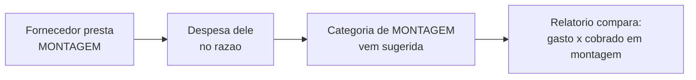

# Fornecedores

**Fornecedor** é quem recebe o seu dinheiro: o posto que abastece a frota, a operadora do telefone, a oficina que conserta os bens móveis, o contador. Cadastrá-los transforma uma pilha de despesas soltas em respostas — *com quem eu mais gasto?*, *quanto essa oficina já levou este ano?*

Você os encontra em **Gestão Financeira → engrenagem (Ajustes) → Fornecedores**.


**Por que o cadastro se paga rápido:** marcando **os serviços que cada fornecedor presta**, cada despesa dele já nasce na **categoria certa** — sem você escolher na lista toda vez. E o relatório passa a comparar o que você **gasta** com aquele serviço e o que você **cobra** por ele.


## Cadastrar um fornecedor

Use **Novo fornecedor**. O cadastro é enxuto de propósito:

| Campo | Obrigatório | Para que serve |
| --- | --- | --- |
| **Nome do fornecedor** | Sim | Como ele aparece nas despesas e nos relatórios |
| **Celular** | Não | Ter o contato à mão quando precisar cobrar uma nota |
| **CPF/CNPJ** | Não | Identificar sem ambiguidade — e é campo de busca |
| **Serviços que ele presta** | Não | O vínculo que faz a sugestão de categoria funcionar |

Também dá para criar um fornecedor **de dentro de uma despesa**: no seletor de fornecedor do lançamento, a opção de criar abre a mesma folha, sem perder o que você já preencheu.

## Os serviços que o fornecedor presta

São seis, os mesmos do plano de contas: **Frete**, **Mão de obra**, **Montagem**, **Desmontagem**, **Layout** e **Outro**. Marque quantos couberem — uma transportadora presta frete; um prestador que monta e desmonta estrutura marca os dois.

### Por que isso importa

Ao escolher esse fornecedor numa despesa, se você **ainda não escolheu categoria**, o LocFlow sugere a categoria do mesmo serviço e avisa que foi sugestão — *"Categoria sugerida: Montagem de terceiros. Pelo serviço que este fornecedor presta. Troque se não for o caso."*

Duas garantias que valem saber:

* A sugestão **nunca sobrescreve** uma categoria que você já escolheu.
* Ela é sempre **visível e reversível** — a categoria continua sua para trocar.


**Fornecedor sem serviço marcado funciona** — ele só não sugere nada. A lista mostra isso na própria linha: *"Sem serviço vinculado — a despesa não vai sugerir categoria"*. É um convite, não um erro.


## O que a tela mostra

Uma faixa de resumo, com três números:

| Métrica | O que diz |
| --- | --- |
| **Ativos** | Quantos fornecedores estão em uso |
| **Com serviço** | Quantos dos ativos têm serviço vinculado (ex.: *4/7*). Fica **âmbar** enquanto falta alguém — é o termômetro de quanto a sugestão automática está de fato te ajudando |
| **Já pago** | O total das despesas lançadas para os seus fornecedores |

Abaixo, a lista — uma linha por fornecedor, densa e legível:

* o **nome**, e o selo **Arquivado** quando for o caso;
* o **contato** (celular e documento);
* os **chips dos serviços**, cada um com o seu ícone;
* à direita, **quanto já saiu** para aquele fornecedor.

**Busca** por nome ou CPF/CNPJ, e três recortes: **Ativos**, **Arquivados** e **Todos**.

## Editar

Toque na linha do fornecedor para abrir a edição — a mesma folha do cadastro, agora com os dados dele. Você corrige o nome, atualiza o telefone, acrescenta ou remove serviços.

Deixar um campo em branco na edição significa **limpar** aquele campo.


**Renomear vale para todo o histórico.** O fornecedor é o mesmo, com outro nome — as despesas antigas passam a exibir o nome novo. Se o que você quer é um fornecedor **diferente**, cadastre um novo.


## Arquivar em vez de excluir

**Arquivar** é a "exclusão" do módulo — e preserva o passado:

* o fornecedor sai do seletor de uma **despesa nova**;
* ele continua **nomeando as despesas já lançadas**, e os relatórios de meses anteriores não mudam;
* a linha fica esmaecida com o selo **Arquivado**.

Não há confirmação, porque é reversível ali mesmo: filtre por **Arquivados** e use o ícone de **reativar**.

## Fornecedor de frete: um cadastro à parte

Se você contrata **transportadoras** para executar frete — aquelas que aparecem na distribuição de frete de um pedido, com frota e regra de preço próprias —, elas têm hoje um cadastro dedicado em **Cadastros Base → Fornecedores**, descrito em [Fornecedores de frete](../parcerias/fornecedores-de-frete.md).


**Como saber qual usar:** se o terceiro vai ser **escolhido dentro de um pedido** para executar a viagem, ele é fornecedor de frete. Se ele apenas **recebe o seu dinheiro** (posto, oficina, contador, telefonia), ele é fornecedor de despesa — este cadastro aqui. Quando um pedido com transportadora é reservado, o custo dela já entra sozinho como **conta a pagar**, sem você lançar nada.


## Por porte

| Porte | O que cadastrar |
| --- | --- |
| **Autônomo / MEI** | Os cinco ou seis que se repetem todo mês: posto, telefonia, contador, oficina. |
| **Médio** | Todos, com os **serviços** marcados — é o que faz o relatório por serviço ficar honesto. |
| **Grande** | Todos, com CPF/CNPJ preenchido, e revise a métrica **Com serviço** de tempo em tempo: fornecedor sem vínculo é relatório cego. |

## Situações reais

* **"Sempre erro a categoria da gasolina."** Cadastre o posto como fornecedor e marque o serviço de **frete**. Na próxima despesa, escolha o posto e a categoria vem sugerida.
* **"Troquei de oficina."** Arquive a antiga: ela sai das próximas escolhas e continua nomeando os consertos do ano passado.
* **"Quero saber quanto gastei com aquele prestador."** A coluna da direita, na linha dele, mostra o total já pago. Para o recorte por período, use o insight **por fornecedor** em [Relatórios](relatorios.md).
* **"Cadastrei 'Posto' e 'Posto Shell' por engano."** Arquive o duplicado e siga usando um só. As despesas antigas continuam onde estão.

## Próximo passo

* Para lançar uma despesa com fornecedor, veículo e forma de pagamento: [Lançamentos](lancamentos.md#registrar-um-lancamento).
* Para preparar as categorias que os serviços apontam: [Categorias e plano de contas](categorias-e-plano-de-contas.md).
* Para ver o gasto por fornecedor no período: [Relatórios: como ler](relatorios.md).
