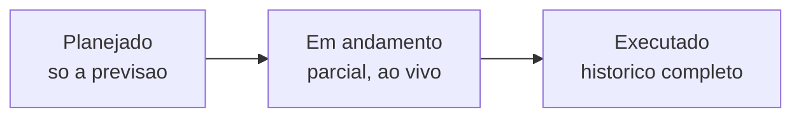

# Acompanhando seus roteiros

Depois de [planejar a rota](planejando-o-roteiro.md) e colocá-la na rua, você não precisa ficar ligando para o motorista para saber onde a viagem está. O LocFlow reúne **todos os roteiros numa lista** e abre cada um numa **linha do tempo que se atualiza sozinha** — você vê o material saindo do galpão, chegando em cada parada e voltando, com a comprovação de cada entrega.


**Por que isso te ajuda:** acompanhar a viagem em tempo real, da sua tela, troca o telefonema ("e aí, já entregou?") por uma resposta na hora. Você sabe o que já foi feito, o que falta e o que deu errado — e reage antes do cliente reclamar.


Esta página é sobre **olhar e acompanhar**. Quem está na rua **registrando** cada parada usa a tela de [execução em campo](execucao-em-campo.md) — é de lá que vêm os fatos que aparecem aqui.

## A lista de roteiros 

A tela de logística mostra seus roteiros separados em **duas abas**, conforme a fase da viagem:

| Aba | O que mostra |
| --- | --- |
| **Em execução e planejados** | O que ainda vai acontecer ou está acontecendo agora — as viagens do dia. |
| **Executados** | O histórico: roteiros já concluídos, dos mais recentes para os mais antigos. |

### Em execução e planejados 

Esta aba é a sua **fila de trabalho**. Ela ordena os roteiros pela **saída mais próxima primeiro** e agrupa no topo o que é seu, em duas seções:

* **Em execução** aparece antes de **planejados** — primeiro o que está acontecendo agora, depois o que ainda vai sair.
* Roteiros **atrasados** ganham destaque (veja a seguir).

### Executados 

O histórico das viagens concluídas, em lista simples (sem seções), dos **mais recentes primeiro**. Tocar num roteiro aqui abre a mesma linha do tempo — agora como **registro do que aconteceu**: horários reais, desfechos e comprovações.

## O cartão de roteiro 

Cada roteiro na lista vem num cartão enxuto, com o essencial para você decidir num relance:

* **Código** do roteiro e um **selo de estado** — *Em execução*, *Executado*, *Sob demanda*, ou se ele está atribuído a alguém.
* **Galpão-base** de onde a viagem sai.
* **Previsão de saída** (ou, se já passou da hora, o **atraso**).
* Quantos **movimentos** a viagem tem e sua **duração máxima** prevista.

### Atrasos 

Quando a hora prevista de saída já passou e o roteiro ainda não saiu, o cartão fica em **destaque vermelho** e troca a data por **quanto tempo de atraso**. Nos roteiros atrasados, o cartão também lista os **orçamentos** envolvidos — para você agir rápido sobre os pedidos certos.


O atraso é só um **sinal visual** para priorizar — não bloqueia nada. A viagem pode sair normalmente depois do horário previsto.


### Atribuídos a você e Disponíveis 

Na aba **Em execução e planejados**, os roteiros vêm separados por responsabilidade:

* **Atribuídos a você** — as viagens das quais você é o responsável (condutor ou equipe).
* **Disponíveis** — roteiros ainda **sem responsável**. Esta seção só aparece para quem tem acesso a **ver todos os roteiros** da empresa (normalmente quem coordena a operação). Quem não tem esse acesso enxerga apenas os roteiros ligados a si.

Você também pode usar os **filtros** da lista para recortar por atribuição (todos, só atribuídos, só sem responsável) ou por **colaborador responsável**.

### Lista ou mapa 

No alto da lista há um seletor entre **lista** e **mapa**.


**Mapa em tempo real (em breve).** A visão de mapa vai mostrar, ao vivo, **onde está quem está executando**, o traçado dos roteiros planejados e o histórico dos executados. Por enquanto, use a visão de **lista** — o acompanhamento ao vivo já funciona dentro de cada roteiro (veja abaixo).


## A tela do roteiro 

Tocar num roteiro abre **uma única tela** que serve a viagem inteira, **adaptando-se à fase** em que ela está:

* **Planejado** — ainda não saiu: você vê a **previsão** (paradas, ordem, carga prevista, veículo).
* **Em andamento** — a viagem está na rua: a tela mostra o **que já foi feito** e destaca a **parada atual**, atualizando-se sozinha.
* **Executado** — concluída: vira o **histórico** com horários reais, desfechos, comprovações e o saldo de carga.

No topo da tela ficam o **resumo da viagem** e, quando há o que fazer, os botões **Editar roteiro** (enquanto não saiu) e **Executar** / **Continuar execução** — que abrem o app de quem vai para a rua.

### Resumo da viagem 

Um cartão de cabeçalho concentra os dados da viagem: o **galpão-base**, a **previsão de saída**, a **duração máxima** e o número de **movimentos**, e o **veículo** (ou "Veículo não definido", quando ficou em aberto no planejamento). Se a carga prevista **não couber** no veículo escolhido — por volume **ou por peso** —, aparece aqui um **aviso de capacidade**.

Quando o roteiro foi traçado/otimizado, o cabeçalho também traz as **métricas da rota** — **distância**, **duração** e **paradas** —, depois a **ocupação** do veículo no pico e o **retorno previsto**, e uma linha de **custos previstos**: **combustível**, **pedágio** e o **gasto previsto** (a soma dos dois — quanto a viagem deve custar). São os mesmos números que apareceram no planejamento, agora **guardados com o roteiro**: não somem e **não custam crédito de novo** para você consultar.

Quando a viagem já tem execução, o resumo também mostra **quem conduziu**, **a equipe presente**, a **duração total** e o status — *Em andamento* ou *Concluído*.

## A linha do tempo 

O corpo da tela é a viagem desenhada como uma **linha do tempo de cima para baixo**: começa na **saída do galpão**, passa por **cada parada** na ordem da rota e termina na **volta ao galpão**. Cada ponto da linha muda conforme o que aconteceu:

* **Roxo (previsão)** — ainda vai acontecer (no roteiro planejado, tudo está assim).
* **Roxo pulsante (atual)** — a parada onde a equipe está **agora**.
* **Verde com um ✓ (concluída)** — etapa já cumprida.
* **Neutro (futura)** — ainda não chegou a vez.

### Saída do galpão 

O primeiro ponto é a **saída**. Ele mostra se a viagem **saiu com carga** ou **vazia** (uma rota só de retiradas sai vazia, por exemplo) e a **carga a levar** — o consolidado de tudo que vai para a rua, que você pode abrir para ver item a item, com foto e quantidade. Quando a viagem já partiu, aparece a **hora real** da saída; antes disso, o rótulo "A sair".

### Cada parada 

Para cada parada, a linha do tempo traz:

* O **endereço** (de forma curta).
* Os **movimentos** daquele ponto — cada um com o **código do orçamento**, se é **entrega** ou **retirada**, e a **janela de horário** combinada.
* A **chegada estimada** (*"chega ~HH:MM"*) calculada pela otimização, enquanto a parada ainda **não foi executada**. Quando essa previsão **cai fora da janela** combinada, o app já avisa ali — *"Deve atrasar"* (âmbar) ou *"Deve atrasar muito"* (vermelho) —, para você ver o problema **antes de a equipe sair**. Assim que a equipe registra o desfecho, esse previsto dá lugar à **hora real**, com a [pontualidade](#pontualidade-chegou-no-horario) da chegada.
* A **carga de entrega** e a **carga de retirada** daquele ponto (abríveis, com foto e quantidade).


**Locação x venda:** uma parada de **venda** só tem **entrega** — o item sai em definitivo. Na **locação**, a mesma rota pode ter entregas num cliente e **retiradas** em outro, voltando material para o galpão. Veja [Locação e venda](../conceitos/locacao-e-venda.md).


### Desfecho de cada movimento 

Quando a equipe registra uma parada em campo, o **desfecho** aparece aqui, no acompanhamento:

* **Entregue**, **Retirado** ou **Pulado** — com a **hora** do registro.
* No caso de **Pulado**, o **motivo** informado (cliente ausente, recusou, endereço não encontrado, etc.).
* A **hora da chegada** e quanto **tempo a equipe ficou no local**.
* A **distância do endereço** no momento da chegada e o raio esperado — e, se a chegada foi **fora do raio** (ou com **GPS simulado**), a **justificativa** que a equipe deu.
* As **comprovações** capturadas: chips de **foto** ou **vídeo** que você toca para ver a mídia em tela cheia.


**A comprovação fica guardada aqui.** Semanas depois, se um cliente disser "não recebi" ou "já chegou quebrado", a foto ou o vídeo do momento — com hora e local — encerra a conversa. Entenda o que dá para exigir em [Execução em campo](execucao-em-campo.md).


### Pontualidade: chegou no horário? 

Quando uma parada é concluída, o LocFlow compara o **horário real** da chegada com o que estava **previsto** e mostra um **selo de pontualidade** no desfecho: **No horário**, **Adiantado**, **Atrasado** ou **Muito atrasado**.

O importante é **com o que** comparamos — a regra foi feita para ser **justa com o motorista**:

* **Quando a rota foi otimizada ou traçada** (existe uma chegada prevista pelo mapa), a pontualidade olha a **diferença entre a chegada real e essa previsão**. Ou seja, mede o que **dependeu da execução** — não a janela combinada com o cliente.
* **Quando não houve otimização** (você não usou o mapa), não há previsão para comparar: aí o selo usa a **janela de horário** combinada.


**Por que nem sempre comparamos com a janela do cliente?** Porque às vezes o **próprio plano já nascia atrasado**: se as paradas anteriores e as distâncias empurram a chegada para depois da janela, o motorista vai chegar atrasado **mesmo fazendo tudo certo**. Penalizá-lo por isso seria injusto — o atraso foi do **planejamento**, não dele. Nesses casos o desfecho traz a nota *"Atraso já previsto no plano"*: a chegada bateu com o previsto, então conta como **no horário**.


A diferença em relação ao previsto vira o selo assim:

| Diferença para o previsto | Como conta |
| --- | --- |
| Até **15 min** | **No horário** |
| Entre **15 e 45 min** depois | **Atrasado** — um desvio tolerável, não um problema grave |
| Mais de **45 min** depois | **Muito atrasado** — aí sim houve um desvio relevante na execução |
| **Bem antes** do previsto | **Adiantado** |


Esses limiares (**15** e **45** minutos) são **fixos** nesta versão — valem igual para toda a operação. No futuro, poderão virar **parâmetros ajustáveis** por empresa nos [motores operacionais](../configuracoes/motores-operacionais.md), para quem precisa de uma régua mais rígida ou mais folgada. Por ora, são os mesmos para todos.


### Saldo no veículo 

Em cada parada, a linha do tempo mostra **quanto de carga sobra a bordo** depois daquele ponto — útil para entender se o caminhão vai vazio, cheio ou pela metade no trecho seguinte. O valor vem com um selo:

* **estimado** — calculado pelo **plano** da viagem (enquanto a parada não foi cumprida).
* **real** — calculado **do que de fato aconteceu**, depois que a parada foi concluída. O real já considera os pulos: uma **entrega pulada** continua no veículo; uma **retirada pulada** não entra na conta.

Você pode abrir o saldo para ver o detalhe **por produto**.

### Volta ao galpão 

O último ponto é a **chegada ao galpão**. Ele indica se a viagem **voltou com carga** (alguma retirada cumprida) ou **vazia**, e mostra a **descarga no galpão** — o que volta para o estoque. Quando a viagem já fechou, aparece a **hora real** do retorno.


Se uma **retirada foi pulada**, o material **não foi recolhido** — a linha do tempo avisa aqui ("X retirada(s) pulada(s) — material não recolhido"), para a equipe reagendar. Na locação, isso costuma seguir para a [conferência](conferencia.md) quando o item finalmente volta.


## Ao vivo 

Enquanto a viagem está **em andamento**, um selo no topo da tela mostra **Ao vivo** (em verde): a tela está conectada e **se atualiza sozinha** conforme a equipe registra cada passo — você não precisa recarregar nada. Quando não há viagem acontecendo, o selo fica em **Automático** (a tela se atualiza ao reabrir).

Na própria lista, os roteiros **em execução** ganham um atalho **Ver andamento** com um ponto verde pulsante, levando direto à linha do tempo ao vivo.


O acompanhamento ao vivo depende de a equipe estar registrando pelo aplicativo. Roteiros **planejados** (que ainda não saíram) e **concluídos** não mudam sozinhos — não há nada acontecendo em tempo real.


## Roteiro desatualizado 

Se um pedido **mudou depois** de o roteiro ter sido planejado (datas, itens ou responsabilidade), a tela mostra um aviso **"Roteiro desatualizado"**. Os movimentos afetados ficam **bloqueados na execução** até você **ajustar o roteiro** para a versão atual — tocar no aviso leva direto à edição. Entenda o porquê em [Quando um pedido muda depois de fechado](quando-um-pedido-muda.md).

## Acompanhar por porte 

A mesma tela atende quem faz duas entregas por semana e quem roda dezenas por dia:

| Porte | Como costuma acompanhar |
| --- | --- |
| **Pequeno** | Olha o cartão na lista e abre o roteiro de vez em quando — em geral é você mesmo na rua. A linha do tempo confirma o que já saiu e voltou. |
| **Médio** | Acompanha as viagens do dia **ao vivo** do escritório, vê quem está atrasado e abre a parada atual para saber o ponto exato da equipe. |
| **Grande** | Usa a fila ordenada por saída, os filtros por responsável e o histórico de executados para auditar comprovações, distâncias e tempos de permanência. |

## Para quem quer os números 

A linha do tempo de um roteiro executado guarda, para cada movimento, dados que servem de auditoria:

* **Horários reais** de saída do galpão, chegada em cada parada, conclusão e retorno.
* **Tempo de permanência** em cada local (em minutos).
* **Distância do endereço** na chegada e o **raio** esperado da política — além de marcar quando a chegada foi **fora do raio** ou com **GPS simulado**, sempre com a **justificativa** da equipe.
* **Duração total** da viagem.
* **Saldo de carga real** por parada, item a item, já considerando os pulos.

Esses números deixam claro **o que aconteceu de fato**, não só o que estava planejado — e ficam disponíveis para sempre no histórico de **Executados**.

## Situações reais 

* **"Já entregou no cliente X?"** — você abre o roteiro em andamento, vê o selo **Ao vivo**, e a parada do cliente X já está **verde** com a hora e a foto da entrega. Responde sem ligar para ninguém.
* **Viagem atrasada:** na aba *Em execução e planejados*, um cartão está em vermelho com "atrasada". Você abre, vê os orçamentos envolvidos e cobra a saída.
* **Cliente reclama dias depois:** vai em **Executados**, abre o roteiro, encontra o movimento **Entregue** e toca na **foto** — fim da discussão.
* **Retirada que não rolou:** o roteiro voltou com um aviso de **retirada pulada**. Você vê o motivo ("Cliente ausente") e reagenda o recolhimento daquele material.
* **Pedido mudou no meio do caminho:** a tela mostra **"Roteiro desatualizado"**; você ajusta o roteiro para a versão nova e a equipe volta a poder concluir os movimentos afetados.

## Próximo passo 

Veja como a viagem é **registrada** em [Execução em campo](execucao-em-campo.md), como a rota é **montada** em [Planejando o roteiro](planejando-o-roteiro.md) e, na locação, o que fazer quando o material volta em [Conferência na devolução](conferencia.md). Para o todo, a [Visão geral da logística](visao-geral.md) e o [ciclo de um pedido](../conceitos/ciclo-de-um-pedido.md).
