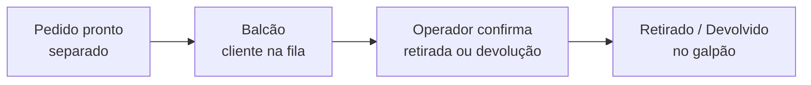

# Balcão: retirada e devolução no galpão

O **balcão** é o atendimento **presencial** da logística: quando o próprio cliente vem ao galpão **retirar** ou **devolver** os itens, sem transporte da equipe e sem rota. A tela de Balcão reúne, num lugar só, **todos os pedidos aguardando esse encontro** — você pega o mais antigo, confirma o atendimento e, se a sua operação exigir, captura a evidência.

É o irmão das filas de [separação](separacao.md) e [conferência](conferencia.md): uma fila do galpão, só que para a vez do **cliente**, não da equipe. No fluxo, ela ocupa a posição **externa sem transporte** — *cliente retira no galpão* (na ida) ou *cliente devolve no galpão* (na volta, só em locação).


**Por que isso vale a pena:** o balcão dá à pessoa que está no galpão uma **fila clara de quem vai chegar**, em vez de caçar pedido por pedido. Quando o cliente aparece, é um toque para confirmar a retirada ou a devolução — e, se você exigir, uma foto fica registrada como prova. Atendimento rápido, sem rota, com o mesmo cuidado de uma entrega.


## A fila do balcão

A fila do balcão é **sem atribuição**: o operador abre a tela e vê os atendimentos pendentes, do **mais antigo** para o mais novo. Cada linha mostra o pedido, o cliente, o **galpão** e o tipo do atendimento — **Cliente retira** ou **Cliente devolve**.

Ao tocar num atendimento, o LocFlow resolve o que aquele caso precisa e abre a confirmação:

* **Sem comprovação exigida** — confirma em **um toque**: o cliente concluiu a retirada ou a devolução, e pronto.
* **Com comprovação exigida** — abre a folha de captura para registrar a evidência (**foto ou vídeo**) antes de confirmar. Sem a prova, o app não deixa concluir.

Em ambos os casos, o sistema registra **quando o cliente chegou** e o **tempo de atendimento** — informações que ficam visíveis na etapa depois de concluída, na [jornada do pedido](jornada-do-pedido.md).


**Dá para confirmar em dois lugares, com o mesmo resultado.** Na fila de Balcão você vê **todos** os atendimentos pendentes de uma vez — ideal para quem fica no galpão. Já dentro de um pedido específico, a [jornada do pedido](jornada-do-pedido.md) também traz o botão **Confirmar no balcão**. É a mesma confirmação; a fila só junta tudo num painel.


## Quem opera o balcão

Há dois jeitos de cobrir o balcão, e você escolhe conforme a sua equipe:

* **Pelos papéis do galpão que você já usa.** Quem confirma a **retirada** pelo cliente é o **Separador** — controla o que **sai** do galpão, só que agora quem leva é o cliente. Quem confirma a **devolução** é o **Conferente** — cuida do que **volta**, trazido ao balcão em vez de coletado em rota. É o reaproveitamento natural de quem já trabalha as filas de [separação](separacao.md) e [conferência](conferencia.md).
* **Por um papel dedicado: o Operador de Balcão.** Para quem cuida do atendimento presencial das **duas pontas** — **entrega e recebe** do cliente na loja física —, há o papel **Operador de Balcão**. Além de confirmar um a um, é ele (junto do **Superadmin**) quem pode **registrar em lote** (veja a seguir).

Quem não tem nenhuma dessas competências — o motorista, por exemplo — **não vê** a fila. Os papéis já vêm prontos no LocFlow; basta escolhê-los ao convidar a pessoa. Veja [Papéis, funções e competências](../conceitos/papeis-funcoes-competencias.md).

## Registrar tudo em lote

Quando a fila **acumula** — vários clientes passaram pelo balcão e ninguém deu conta de confirmar um a um na hora —, dá para **registrar tudo de uma vez**. No **rodapé da fila**, quem tem permissão encontra o atalho **"Registrar tudo em lote"**.

A tela de lote lista os atendimentos pendentes, **todos já marcados**. Daí você:

1. **Desmarca** o que ainda não foi entregue/devolvido — o que ficar marcado será confirmado.
2. Anexa **evidência** onde quiser — é **opcional** no lote (toque em *"Anexar evidência"*).
3. Escreve, se quiser, um **motivo** do registro em massa (fica no histórico).
4. Toca em **Registrar** — e todos os marcados avançam de uma vez.


**Sucesso parcial: um item problemático não trava os outros.** Se algum atendimento já tinha sido confirmado por outra pessoa enquanto isso (ou deixou de ser um caso de balcão), o LocFlow **pula só aquele** e confirma o resto — avisando quais foram pulados. Você reconcilia depois, sem perder os demais.



**O lote é "menos rígido" — por isso é restrito.** Como ele confirma vários de uma vez e **dispensa a captura de evidência**, é uma capacidade **sensível**: só o **Operador de Balcão** e o **Superadmin** a têm. Quem confirma um a um (Separador, Conferente) segue com a comprovação que a sua política exigir. Use o lote para pôr a fila **em dia**; para o registro item a item, com prova, atenda pela fila normal.


## Comprovação no balcão

Assim como na rota, você decide **o que exigir no balcão** — e configura isso **separadamente** para a **retirada pelo cliente** e a **devolução pelo cliente**. A política vive no [motor de logística](../configuracoes/motores-operacionais.md#motor-de-logistica): marque foto ou vídeo para torná-los obrigatórios antes de concluir, ou deixe em branco para manter a confirmação em um toque.

## Vários galpões

Se a sua operação tem **mais de um galpão**, cada linha da fila traz a **etiqueta do galpão** e há um **filtro** para ver só os atendimentos daquele balcão. Com um galpão só, o filtro nem aparece — a fila já é a daquele lugar.

## Quando o balcão aparece

Quando você marca no orçamento que o cliente **retira** ou **devolve no galpão** (veja [Movimentos e janelas](../orcamentos/movimentos-e-janelas.md)), o atendimento de balcão aparece sozinho. Não é um liga-desliga — é consequência de como o cliente combina receber. O que muda com o porte é **quanto controle** você põe em volta.

Se a sua operação é **só por rota**, dá para sumir o Balcão do menu na [forma de operação](../configuracoes/motores-operacionais.md#motor-de-logistica) do Motor de Logística — e o contrário, **só balcão**, já deixa todo orçamento no balcão e esconde a roteirização. É só simplificação: nada bloqueia a exceção.

| Porte | Como você usa o balcão |
| --- | --- |
| **Começando** | **Direto.** O cliente busca ou devolve, você confirma em um toque. Sem prova, sem burocracia — a retirada acontece em minutos. |
| **Crescendo** | **Com prova.** Itens mais caros começam a sair pelo balcão; você liga a comprovação (foto/vídeo) para ter o registro de quem levou e de como voltou. |
| **Estruturado** | **Vários galpões, cada papel na sua vez.** Cada balcão tem sua fila filtrada; o **Separador** confirma as retiradas e o **Conferente** as devoluções, ou um **Operador de Balcão** cobre as duas pontas. No pico, o **registro em lote** põe a fila em dia de uma vez. |


Antes de o cliente chegar, você pode passar o material pela [separação](separacao.md) — assim a retirada no balcão é só entregar o que já está embalado e conferido. Na locação, o que volta pelo balcão ainda pode seguir para a [conferência](conferencia.md), se você a tiver ligado.


## Situações reais

* **Loja de festas com balcão movimentado:** de manhã a fila lista quem vem buscar à tarde. Cada cliente que chega é confirmado na hora, com a foto da retirada quando o item é caro — sem ninguém procurar o pedido na mão.
* **Aluguel que o cliente busca e devolve:** o palco sai pelo balcão e volta pelo balcão. A fila mostra os dois momentos — **Cliente retira** na ida, **Cliente devolve** na volta — e a devolução ainda pode cair na conferência.
* **Dois galpões na mesma empresa:** quem está no galpão da zona sul filtra só o seu balcão e atende a fila dele, sem ver os atendimentos do outro endereço.
* **Fila acumulada num dia de pico:** dez clientes passaram pela manhã e o operador não confirmou na hora. No fim do expediente ele abre **Registrar tudo em lote**, desmarca os dois que ainda não vieram, e confirma os oito de uma vez — com um motivo no histórico e, onde teve, a foto anexada.

## Próximo passo

Veja como o atendimento aparece na [jornada do pedido](jornada-do-pedido.md), revise o caminho completo em [Visão geral da logística](visao-geral.md), ou ajuste a prova exigida no [motor de logística](../configuracoes/motores-operacionais.md#motor-de-logistica).
