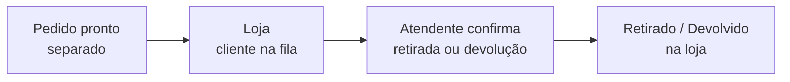

# Loja: retirada e devolução pelo cliente

A **Loja** é o atendimento **presencial** da logística: quando o próprio cliente vem **retirar** ou **devolver** os itens, sem transporte da equipe e sem rota. No menu, ela fica em **Logística › Minha Loja**, e a tela se chama **Loja**. Ali estão, num lugar só, **todos os pedidos aguardando esse encontro** — você acha quem chegou, confirma o atendimento e, se a sua operação exigir, registra a prova.

É a irmã das filas de [separação](separacao.md) e [conferência](conferencia.md): uma fila de atendimento, só que para a vez do **cliente**, não da equipe. No fluxo, ela ocupa a posição **externa sem transporte** — *cliente retira na loja* (na ida) ou *cliente devolve na loja* (na volta, só em locação).


**A Loja já se chamou Balcão.** Se você encontrar "balcão" num registro antigo ou numa conversa da equipe, é a mesma coisa: o atendimento presencial do cliente.



**Por que isso vale a pena:** a pessoa que atende ganha uma **fila clara de quem vai chegar**, em vez de caçar pedido por pedido. Quando o cliente aparece, a confirmação já vem pronta — é conferir e concluir — e, se você exigir, uma foto fica registrada como prova. Atendimento rápido, sem rota, com o mesmo cuidado de uma entrega.


## Galpão e loja são cadastros diferentes 

O **galpão** é onde o material fica guardado. A **loja** é onde o cliente é atendido — vem retirar ou devolver. As lojas ficam em **Estoque › Lojas** (veja [Lojas](../estoque/lojas.md)), e **toda loja é ligada a um galpão**: é dele que sai o material das retiradas dela.

* **No mesmo endereço** — o caso mais comum. A primeira loja nasce sozinha, junto do primeiro galpão, e quem opera de um endereço só nem precisa pensar nisso.
* **Em endereços diferentes** — armazém num lugar, ponto de atendimento em outro. Aí o material que o cliente vai buscar precisa **chegar à loja antes**, por uma [transferência](../estoque/transferencias.md): a fila mostra o selo **Aguardando material** (falta mandar) ou **Material a caminho** (a transferência já saiu), e a retirada só é confirmada do que já está na loja.


**Parte do pedido ainda não chegou?** Ao confirmar, a folha mostra a transferência pendente e oferece **Retirar só o que chegou**: saem desta retirada os itens que ainda não chegaram por completo à loja, e o cliente leva o resto agora. O que ficou continua na fila, como saldo, até o material chegar.


## A fila da loja 

A fila é **sem atribuição**: quem está atendendo abre a tela e vê os atendimentos pendentes. Eles vêm agrupados **por prazo**, pela data combinada da retirada ou da devolução:

| Seção | O que reúne |
| --- | --- |
| **Atrasado** | A data já passou — o único grupo em destaque. |
| **Hoje** | Quem deve vir hoje. |
| **Amanhã** | Quem deve vir amanhã. |
| **Próximos** | Os dias seguintes. |
| **Sem data** | Atendimentos sem data definida. |


**A fila não é por ordem de chegada.** O cliente aparece na hora que quiser — por isso a tela não numera ninguém. Para achar quem acabou de chegar, use a **busca**: digite o nome do cliente ou o código do pedido.


Cada linha mostra o **cliente**, o **código**, o tipo do atendimento — **Cliente retira** ou **Cliente devolve** —, a **data** e a **loja**. Com mais de uma loja na fila, aparecem atalhos para ver **Todos** ou só os atendimentos de uma delas.

```mermaid
flowchart LR
    PRO[Pedido pronto<br/>separado] --> FILA[Loja<br/>cliente na fila]
    FILA --> CONF[Atendente confirma<br/>retirada ou devolução]
    CONF --> FIM[Retirado / Devolvido<br/>na loja]
```

## Confirmar o atendimento 

Tocar num atendimento abre a **ficha** dele (uma janela em telas largas, uma folha no celular): a loja, a carga, o que já foi retirado ou devolvido antes e, quando a sua política pede prova, o selo **Exige evidência**. O botão **Confirmar retirada** (ou **Confirmar devolução**) abre a folha de confirmação, já preenchida com **tudo o que falta sair (ou voltar)**:

* **O cliente leva tudo?** Confira a lista e toque em **Confirmar retirada total** — as quantidades já vêm no total.
* **Leva só uma parte?** Ajuste a **quantidade de cada item** na própria folha; o botão passa a dizer quantos estão saindo, e o que faltar continua como **saldo** (veja a seção a seguir).
* **Comprovação exigida?** A captura da evidência (**foto ou vídeo**) acontece na mesma folha, antes de concluir. Sem a prova, o app não deixa confirmar.

Em todos os casos, o sistema registra **quando o cliente chegou** e o **tempo de atendimento** — que ficam visíveis na etapa depois de concluída, na [jornada do pedido](jornada-do-pedido.md).


**Dá para chegar aqui por outros caminhos, com o mesmo resultado.** Na fila da Loja você vê **todos** os atendimentos pendentes de uma vez — ideal para quem fica no atendimento. Dentro de um pedido específico, a [jornada do pedido](jornada-do-pedido.md) traz o botão **Confirmar na loja**, que abre a fila da Loja com aquele atendimento já aberto. E no [Painel Logístico](painel-logistico.md), o cartão do pedido oferece a mesma confirmação a quem opera a loja.


## Retirar (ou devolver) só uma parte 

Nem sempre o cliente leva tudo de uma vez. Ele pode buscar **parte** dos itens agora e o restante depois. A Loja lida com isso sem complicar: você registra **quanto de cada item** saiu nesta vez, e o que falta continua como **saldo**.

1. Abra o atendimento e toque em **Confirmar retirada** (ou **Confirmar devolução**).
2. Para cada item — a folha mostra *"faltam X de Y"* —, ajuste **quanto está saindo agora**. O resto fica de saldo.
3. Capture a **evidência**, se a sua política exigir (vale **por parcela**).
4. **Confirme.** O que saiu fica registrado; o que faltou continua aguardando.


**O pedido só "fecha" quando o saldo zera.** Enquanto faltar item, o atendimento **continua na fila** — o status do pedido (*retirado* / *devolvido na loja*) só avança quando a **última parte** sai. Assim o painel nunca dá um pedido como concluído enquanto ainda há item para entregar.


Cada retirada parcial é um **registro próprio**, com a sua **comprovação** (quando exigida) e o **horário**. Na ficha do atendimento, a seção *"Já retirado pelo cliente"* (ou *"Já devolvido pelo cliente"*) mostra a **linha do tempo das parcelas** — *1ª retirada*, *2ª retirada*... —, cada uma com **os itens e quantidades, o horário, quem registrou e as fotos daquela parcela**. As provas também aparecem na etapa correspondente da [jornada do pedido](jornada-do-pedido.md). Vale igual para a **devolução**: o cliente pode trazer parte dos itens de volta hoje e o restante depois.


**E os kits?** A contagem é feita pelos **produtos** que compõem o kit — os itens físicos que o cliente realmente leva. Assim *"faltam 10 de 20 cadeiras"* fica claro, mesmo que as cadeiras tenham vindo dentro de um kit.


## Quem opera a loja 

Há dois jeitos de cobrir a loja, e você escolhe conforme a sua equipe:

* **Pelos papéis do galpão que você já usa.** Quem confirma a **retirada** pelo cliente é o **Separador** — controla o que **sai** do galpão, só que agora quem leva é o cliente. Quem confirma a **devolução** é o **Conferente** — cuida do que **volta**, trazido à loja em vez de coletado em rota. É o reaproveitamento natural de quem já trabalha as filas de [separação](separacao.md) e [conferência](conferencia.md).
* **Por um papel dedicado: o Operador de Loja.** Para quem cuida do atendimento presencial das **duas pontas** — **entrega e recebe** do cliente na loja —, há o papel **Operador de Loja**. Além de confirmar um a um, é ele (junto do dono e do **Administrador**) quem pode **registrar em lote** (veja a seguir).

Quem não tem nenhuma dessas competências — o motorista, por exemplo — **não vê** a fila. Os papéis já vêm prontos no LocFlow; basta escolhê-los ao convidar a pessoa. Veja [Papéis, funções e competências](../conceitos/papeis-funcoes-competencias.md).


**Pedido repassado a um parceiro:** quando a logística do pedido foi repassada a um [parceiro logístico externo](../parcerias/parceiro-logistico-externo.md) que já aceitou o convite, quem confirma a retirada ou a devolução na loja é **ele**, no espaço dele — esse atendimento sai da sua fila. Na fila dele aparecem só os atendimentos dos pedidos repassados a ele, e ele confirma um a um (o lote não é dele). Quando o repasse é para **outra empresa da rede** (parceria entre organizações), o atendimento na loja continua na **sua** fila, com a sua equipe. Veja [Repassando um pedido](../parcerias/repassando-um-pedido.md).


## Registrar em lote 

Quando a fila **acumula** — vários clientes passaram pela loja e ninguém deu conta de confirmar um a um na hora —, dá para **registrar de uma vez**. No topo da fila, quem tem permissão encontra o botão **Em lote**.

A tela **Loja em lote** lista os atendimentos pendentes, **todos já marcados**. Daí você:

1. **Desmarca** o que ainda não foi entregue ou devolvido — o que ficar marcado será confirmado.
2. Registra a **evidência** de cada atendimento, conforme a sua política (veja o aviso abaixo).
3. Escreve, se quiser, o **motivo do registro em lote** (opcional — fica no histórico).
4. Toca em **Registrar N atendimentos** — e todos os marcados avançam de uma vez.


**No lote vale a mesma comprovação do atendimento um a um.** Se a sua organização exige foto ou vídeo na retirada ou na devolução, o atendimento sem a prova é **recusado** — o aviso no topo da tela diz isso. A saída, quando não houve como comprovar, é a **dispensa justificada**: quem tem a permissão de dispensar evidência toca em **Não consegui comprovar — dispensar com justificativa** naquela linha e escreve o motivo, que fica gravado. Só quando a sua política **não** exige prova é que a evidência é de fato opcional. O Operador de Loja já vem com a permissão de dispensar; veja [dispensar a evidência](../configuracoes/colaboradores-e-acessos.md#dispensar-evidencia).



**Sucesso parcial: um item problemático não trava os outros.** Se algum atendimento já tinha sido confirmado por outra pessoa enquanto isso (ou deixou de ser um atendimento de loja), o LocFlow **pula só aquele** e confirma o resto — avisando quais foram pulados. Você reconcilia depois, sem perder os demais.


O lote é uma capacidade **sensível** — confirma vários atendimentos de uma vez —, por isso, entre os papéis que já vêm prontos, só o **Operador de Loja**, o **Administrador** e o dono a têm. Use-o para pôr a fila **em dia**; para o atendimento do dia a dia, com o cliente na sua frente, confirme pela fila normal.

## Comprovação na loja 

Assim como na rota, você decide **o que exigir na loja** — e configura isso **separadamente** para a **retirada pelo cliente** e a **devolução pelo cliente**. A política vive no [motor de logística](../configuracoes/motores-operacionais.md#motor-de-logistica): sem nada marcado, a confirmação é em **um toque**; com uma exigência, o app só deixa concluir depois de capturar a prova.

### Os meios de prova

Na loja, além de **foto** e **vídeo**, a política aceita **assinatura** — o cliente assina que retirou (ou que devolveu). E faz sentido justamente aqui: na loja o cliente está **na sua frente**, então a assinatura é o comprovante natural da **retirada presencial** e do **recibo de devolução** — diferente da entrega em rota, onde a assinatura costuma "ficar para depois".


**A assinatura é uma opção da política — e ainda não está no app.** Você já pode montar a regra contando com ela; a **captura da assinatura na tela** da loja chega numa próxima versão. Enquanto isso, **foto e vídeo** são os meios capturados hoje.


### Regras que combinam meios

A exigência **não** é só uma lista de "tudo obrigatório". Você monta a regra do jeito que a sua operação pede, combinando os meios:

* **Exigir dois juntos (E):** *"foto **e** assinatura"* — as duas coisas para concluir.
* **Dar alternativas (OU):** *"vídeo **ou** assinatura"* — qualquer uma serve.
* **Misturar os dois:** *"foto **e** (vídeo **ou** assinatura)"* — sempre a foto, mais uma das outras duas.
* **Pedir uma quantidade mínima:** *"2 fotos"*, por exemplo, quando uma só não conta a história.

Enquanto a prova exigida não estiver completa, o app **não deixa concluir** — e mostra, em texto claro, o que ainda falta (*"Foto e (vídeo ou assinatura)"*). Assim a regra acompanha o valor do que sai pela loja: leve para o corriqueiro, reforçada para o item caro.

## Quando a loja aparece 

Quando você marca no orçamento que o cliente **retira** ou **devolve na loja** (veja [Movimentos e janelas](../orcamentos/movimentos-e-janelas.md)), o atendimento aparece sozinho na fila. Não é um liga-desliga — é consequência de como o cliente combina receber. O que muda com o porte é **quanto controle** você põe em volta.

Na **forma de operação** do [Motor de Logística](../configuracoes/motores-operacionais.md#motor-de-logistica) você escolhe o formato padrão: **Só rota** (sua equipe entrega e recolhe — a Loja some do menu), **Só loja** (o cliente retira e devolve na loja — a roteirização some) ou **Mista** (os dois convivem e você escolhe por orçamento). É só simplificação: o que não se usa fica oculto, não proibido, e nada bloqueia a exceção.

| Porte | Como você usa a loja |
| --- | --- |
| **Começando** | **Direto.** O cliente busca ou devolve, você confere a lista já preenchida e confirma. Sem prova, sem burocracia — a retirada acontece em minutos. |
| **Crescendo** | **Com prova.** Itens mais caros começam a sair pela loja; você liga a comprovação (foto/vídeo) para ter o registro de quem levou e de como voltou. |
| **Estruturado** | **Várias lojas, cada papel na sua vez.** Cada loja tem sua fila filtrada; o **Separador** confirma as retiradas e o **Conferente** as devoluções, ou um **Operador de Loja** cobre as duas pontas. No pico, o **registro em lote** põe a fila em dia de uma vez. |


Antes de o cliente chegar, você pode passar o material pela [separação](separacao.md) — assim a retirada na loja é só entregar o que já está embalado e conferido. Na locação, o que volta pela loja ainda pode seguir para a [conferência](conferencia.md), se você a tiver ligado.


## Situações reais

* **Loja de festas movimentada:** de manhã, a seção **Hoje** lista quem vem buscar à tarde. Quando o cliente chega e diz o nome, a busca acha o pedido na hora; a confirmação já vem preenchida, com a foto da retirada quando o item é caro.
* **Aluguel que o cliente busca e devolve:** o palco sai pela loja e volta pela loja. A fila mostra os dois momentos — **Cliente retira** na ida, **Cliente devolve** na volta — e a devolução ainda pode cair na conferência.
* **Cliente leva metade agora:** o cliente busca parte das cadeiras hoje e volta pelo resto amanhã. O atendente ajusta as quantidades na folha de confirmação, registra o que saiu, e o atendimento segue na fila mostrando *"faltam X"* até a última retirada zerar o saldo.
* **Loja longe do galpão:** a cliente chega para retirar, mas a linha dela mostra **Material a caminho** — parte da carga ainda está na transferência. O atendente toca em **Retirar só o que chegou**, ela leva os itens que já chegaram por completo, e o resto fica de saldo.
* **Duas lojas na mesma empresa:** quem está na loja da zona sul filtra só a sua fila e atende sem ver os atendimentos da outra.
* **Fila acumulada num dia de pico:** dez clientes passaram pela manhã e ninguém confirmou na hora. No fim do expediente, o Operador de Loja abre **Em lote**, desmarca os dois que ainda não vieram, anexa as fotos que tirou e confirma os oito de uma vez — com um motivo no histórico.

## Próximo passo

Veja como o atendimento aparece na [jornada do pedido](jornada-do-pedido.md), revise o caminho completo em [Visão geral da logística](visao-geral.md), ou ajuste a prova exigida no [motor de logística](../configuracoes/motores-operacionais.md#motor-de-logistica).
