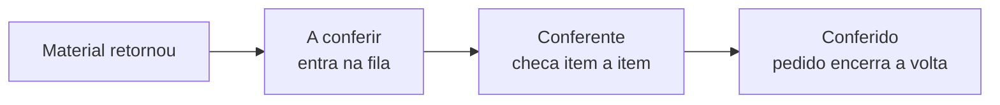

# Conferência na devolução

A **conferência** é a etapa interna da **volta**: depois que o material de uma [locação](../primeiros-passos/glossario.md) retorna, alguém no galpão confere o que voltou antes de o pedido ser dado como concluído. No fluxo da logística, ela ocupa as duas últimas posições — *A conferir → Conferido*.

Ela existe **só na locação** (na venda o item sai em definitivo, não há volta) e só aparece se você **ligar a conferência na devolução** no [motor de logística](../configuracoes/motores-operacionais.md). Sem ela, o pedido finaliza assim que o material retorna.


**Por que isso evita prejuízo:** a conferência é a sua **última chance de olhar o material com atenção** antes de ele voltar para a prateleira e sumir do radar. É na volta que você pega o item riscado, a peça faltando, a estrutura amassada — enquanto ainda dá para ligar a avaria àquela locação. Sem esse passo, o problema só aparece na próxima vez que o item sai, e aí já não dá para saber de quem cobrar.


## Por que ela vive no estoque

Diferente da [separação](separacao.md), a conferência mora no **hub de Estoque** do aplicativo, não na logística. O motivo é direto: a conferência **conversa com o estoque**. É o ponto natural para, no futuro, registrar avarias e baixas do que voltou danificado — então faz sentido estar perto de onde o material é controlado.

Por isso também o controle é **separado**: o papel **Conferente** é distinto do **Separador**. Quem confere a volta pode não ser quem prepara a ida.

## A fila do conferente

Assim como a separação, a conferência é uma **fila sem atribuição**: o operador pega o orçamento **mais antigo** aguardando e confere **item a item**.

Ao abrir um orçamento da fila, o conferente vê a mesma **lista consolidada de produtos** da separação — kits explodidos em componentes, itens iguais somados, com a quantidade total. Ele marca cada item conforme confere; a barra mostra o progresso (*X de Y conferidos*).

O botão **Concluir conferência** só libera quando **todos os itens** estão marcados. Ao concluir, o pedido passa para *Conferido* e a volta está encerrada.


**Registrar avarias e baixas na conferência** — anotar o item que voltou danificado e dar baixa direto na fila — é um reforço que **está chegando**. Hoje a conferência confirma o retorno item a item; o registro estruturado da avaria virá nas próximas versões, sempre com a mesma lógica: você liga quando a operação pedir.


## O papel Conferente

Quem confere recebe o papel **Conferente**: ao abrir o app, enxerga **apenas a fila de conferência** — separada da fila de separação e invisível para o motorista. Acesso sob medida, sem cliques que não são da função dele.

O papel já vem pronto no LocFlow — escolha-o ao convidar a pessoa. Veja [Papéis, funções e competências](../conceitos/papeis-funcoes-competencias.md).

## Quando ligar a conferência

A conferência é **opcional** e escala com a operação — o gatilho é o risco de avaria, não o sistema.

| Porte | Como você usa a conferência |
| --- | --- |
| **Começando** | **Desligada.** Poucos itens, fáceis de olhar na hora da retirada — finaliza assim que volta. |
| **Crescendo** | **Ligada.** O volume subiu e itens caros começam a voltar; conferir na volta vira a sua proteção contra avaria. |
| **Estruturada** | **Ligada, com papel Conferente dedicado** e processo de devolução padronizado no galpão. |


**Vale só para pedidos futuros.** Ao ligar ou desligar a conferência, o LocFlow lê essa política **na hora de iniciar a logística** de cada orçamento. Pedidos já em andamento não mudam de fluxo no meio do caminho.


## Situações reais

* **Locação de som e iluminação:** o material volta de madrugada. De manhã, o conferente abre a fila, confere item a item e identifica um cabo faltando — ainda dá para ligar à locação certa.
* **Itens caros que giram muito:** sem conferência, a peça danificada voltaria à prateleira e só apareceria quebrada no próximo cliente. Com a fila, o problema é pego **na volta**.
* **Galpão com equipe dividida:** o Separador prepara as saídas do dia e o Conferente cuida só dos retornos — cada um na sua fila, sem pisar no trabalho do outro.


Quando é o **próprio cliente** que devolve no galpão (em vez de a equipe ir buscar), esse retorno é confirmado no [balcão](balcao.md) — e, se você tiver ligado a conferência, o material segue normalmente para esta fila depois.


## Próximo passo

Reveja o caminho completo em [Visão geral da logística](visao-geral.md), ou entenda a ponta da ida em [Separação no galpão](separacao.md).
