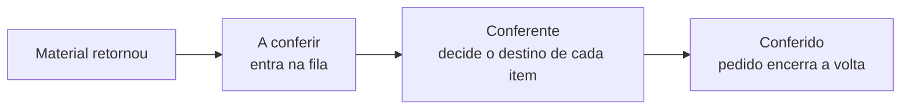

# Conferência na devolução

A **conferência** é a etapa interna da **volta**: depois que o material de uma [locação](../primeiros-passos/glossario.md) retorna, alguém no galpão confere o que voltou antes de o pedido ser dado como concluído. No fluxo da logística, ela ocupa as duas últimas posições — *A conferir → Conferido*.

Ela existe **só na locação** (na venda o item sai em definitivo, não há volta) e só aparece se você **ligar a conferência na devolução** no [motor de logística](../configuracoes/motores-operacionais.md). Sem ela, o pedido finaliza assim que o material retorna.


**Por que isso evita prejuízo:** a conferência é a sua **última chance de olhar o material com atenção** antes de ele voltar para a prateleira e sumir do radar. É na volta que você pega o item riscado, a peça faltando, a estrutura amassada — enquanto ainda dá para ligar a avaria àquela locação. Sem esse passo, o problema só aparece na próxima vez que o item sai, e aí já não dá para saber de quem cobrar.


## Por que ela vive no estoque

Diferente da [separação](separacao.md), a conferência mora no **hub de Estoque** do aplicativo, não na logística. O motivo é direto: a conferência **conversa com o estoque**. É o ponto natural para, no futuro, registrar avarias e baixas do que voltou danificado — então faz sentido estar perto de onde o material é controlado.

Por isso também o controle é **separado**: o papel **Conferente** é distinto do **Separador**. Quem confere a volta pode não ser quem prepara a ida.

## A fila do conferente

Assim como a separação, a conferência é uma **fila sem atribuição**: o operador pega o retorno **mais antigo** aguardando e confere **item a item**. A fila mostra, em cada cartão, o pedido, o cliente e há quanto tempo espera.

```mermaid
flowchart LR
    RET[Material retornou] --> AC[A conferir<br/>entra na fila]
    AC --> CHK[Conferente<br/>decide o destino de cada item]
    CHK --> CON[Conferido<br/>pedido encerra a volta]
```

### Ver a fila por roteiro

Quando o material chegou num **roteiro** (a equipe foi buscar), a fila oferece duas formas de olhar: **por orçamento** (um cartão por pedido, na ordem de chegada) ou **por roteiro** — cada grupo é o veículo que voltou, com o condutor, a hora em que chegou ao galpão e o que trouxe ("3 retiradas · 1 entrega pulada"). Assim quem descarrega um caminhão confere tudo o que desceu dele de uma vez. A escolha fica guardada para a próxima visita. O que o cliente devolveu no **balcão** aparece por último, em "Sem roteiro".


A lente por roteiro **não muda a ordem de atendimento**: o número de cada cartão é a posição na fila, esteja ele em que grupo estiver.


### Conferir a descarga do veículo de uma vez

Na prática, ninguém confere pedido a pedido enquanto o caminhão está na doca: descarrega-se tudo e confere-se a carga. Por isso cada grupo de roteiro tem o botão **Conferir descarga**. Ele abre o veículo inteiro numa folha só: no topo, **o que desceu** por produto ("68 itens em 2 produtos · 3 pedidos" e um chip por produto com o total) — é o número que você bate contra o caminhão; abaixo, **uma seção por pedido**, porque o destino de cada item (e a cobrança de uma avaria) continua sendo de um cliente. A retirada tem o mesmo **Tudo OK** e **Separar por destino**; a entrega pulada é um toque em **Recebido**. **Tudo OK em todos os pedidos** resolve a descarga limpa em um gesto, e a foto da doca, tirada uma vez, fica registrada em todas as conferências daquele veículo.

O botão diz **Concluir descarga** quando tudo está decidido, ou **Concluir parte** quando sobra saldo. Se algum pedido não puder ser conferido, o LocFlow avisa qual e por quê — ele continua na fila para você resolver sozinho.

### Conferir um retorno

Ao abrir um retorno, o conferente vê no topo **de onde o material veio** (o roteiro e o condutor, ou "devolvido no balcão"), quando chegou e o progresso (*2 de 5 itens conferidos*), e abaixo a **lista consolidada de produtos** — kits explodidos em componentes, itens iguais somados.

Para cada item, o caso comum é um toque: **Tudo OK**. Quando algo voltou diferente, **Separar por destino** abre as quatro quantidades — **OK**, **Manutenção**, **Avaria** e **Baixa** — e o próprio cartão diz quanto ainda falta distribuir. O botão do rodapé diz o que vai acontecer: **Concluir conferência** quando tudo está decidido, ou **Concluir parte** quando ainda sobra saldo para um lote seguinte (o pedido continua na fila até o último item).


**O item voltou danificado?** Ao registrar **avaria**, quem tem permissão de emitir cobrança pode, no mesmo passo, **cobrar o cliente** pelo prejuízo — é opcional, aparece dentro do próprio item, e o motivo fica registrado no [extrato do estoque](../estoque/posicao-e-previsao.md#movimentacoes). O que foi para a **manutenção** segue para a bancada, onde depois recebe o seu [desfecho](../estoque/manutencao.md).


### Foto ou vídeo do que voltou

No rodapé da conferência há um **comprovante opcional**: uma foto ou um vídeo do material como chegou — o mesmo registro que o motorista faz na entrega. Ele fica guardado na conferência e, com a [sincronização em nuvem](../configuracoes/sincronizacao-em-nuvem.md) ativa, sobe para **Estoque → Conferências de retorno** no seu Drive. Enquanto o arquivo ainda está subindo, o botão de concluir espera.

### A entrega que foi pulada também passa por aqui

A conferência é a realidade do que aconteceu no roteiro: o que a equipe **retirou** volta para ser triado, e o que **não foi entregue** — uma entrega pulada — também desce do veículo. Esse material aparece na fila como **"Entrega pulada · voltou"**: o conferente registra que ele chegou (com foto e uma observação, se quiser), e **nada muda no estoque** — o pedido continua separado, esperando a nova tentativa de entrega.

### As conferências já feitas

A aba **Conferidas**, na mesma tela, lista o que foi conferido nos **últimos 30 dias**, com busca: **quem** conferiu e **quando**, o **roteiro** e o **pedido**, os quatro desfechos e as fotos registradas. É a trilha para responder, semanas depois, "em que estado esse item voltou?".

## O papel Conferente

Quem confere recebe o papel **Conferente**: ao abrir o app, enxerga **apenas a fila de conferência** — separada da fila de separação e invisível para o motorista. Acesso sob medida, sem cliques que não são da função dele.

O papel já vem pronto no LocFlow — escolha-o ao convidar a pessoa. Veja [Papéis, funções e competências](../conceitos/papeis-funcoes-competencias.md).

## Quando ligar a conferência

A conferência é **opcional** e escala com a operação — o gatilho é o risco de avaria, não o sistema.

| Porte | Como você usa a conferência |
| --- | --- |
| **Começando** | **Desligada.** Poucos itens, fáceis de olhar na hora da retirada — finaliza assim que volta. |
| **Crescendo** | **Ligada.** O volume subiu e itens caros começam a voltar; conferir na volta vira a sua proteção contra avaria. |
| **Estruturada** | **Ligada, com papel Conferente dedicado** e processo de devolução padronizado no galpão. |


**Vale só para pedidos futuros.** Ao ligar ou desligar a conferência, o LocFlow lê essa política **na hora de iniciar a logística** de cada orçamento. Pedidos já em andamento não mudam de fluxo no meio do caminho.


## Situações reais

* **Locação de som e iluminação:** o material volta de madrugada. De manhã, o conferente abre a fila, confere item a item e identifica um cabo faltando — ainda dá para ligar à locação certa.
* **Itens caros que giram muito:** sem conferência, a peça danificada voltaria à prateleira e só apareceria quebrada no próximo cliente. Com a fila, o problema é pego **na volta**.
* **Galpão com equipe dividida:** o Separador prepara as saídas do dia e o Conferente cuida só dos retornos — cada um na sua fila, sem pisar no trabalho do outro.
* **Um caminhão volta com quatro retiradas e uma entrega que não aconteceu:** o conferente toca em **Conferir descarga** no grupo do roteiro, bate o consolidado com a carga, marca **Tudo OK em todos os pedidos**, ajusta a avaria de um deles, tira uma foto da doca e conclui — as quatro retiradas triadas e a entrega pulada recebida de uma vez, e o pedido pulado segue separado para a nova tentativa.


Quando é o **próprio cliente** que devolve no galpão (em vez de a equipe ir buscar), esse retorno é confirmado no [balcão](balcao.md) — e, se você tiver ligado a conferência, o material segue normalmente para esta fila depois.


## Próximo passo

Reveja o caminho completo em [Visão geral da logística](visao-geral.md), ou entenda a ponta da ida em [Separação no galpão](separacao.md).
