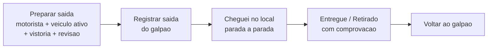
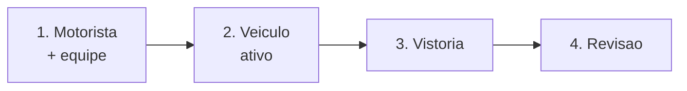

# Execução em campo

Depois de [planejado](planejando-o-roteiro.md) (ou criado sob demanda), o roteiro vai para a rua. Quem executa acompanha tudo **pelo aplicativo, no celular**: prepara a saída, segue parada a parada e registra cada entrega e retirada na hora. O status volta para a equipe **em tempo real** — quem está no escritório vê o pedido avançar sem precisar ligar para o motorista.


A execução em tempo real depende do **GPS do celular** e é feita no **aplicativo**. Pela web não dá para executar passo a passo; se a sua empresa precisar registrar uma rota **depois** que ela já aconteceu, existe a execução em lote (retroativa) — um recurso separado, para quem tem essa permissão.


## O caminho da execução

## Antes de a rota liberar: os portões de entrada

Quando o motorista abre o roteiro para executar, o app faz três verificações **antes** de deixar a viagem começar. Cada uma protege a operação de um jeito — e some sozinha quando não se aplica.

| Portão | Quando aparece | O que o motorista faz |
| --- | --- | --- |
| **É no celular** | Ao tentar executar pela web | Baixa o app (a execução ao vivo usa GPS). Quem tem a permissão de lote ainda vê o atalho "Executar em lote" pela web. |
| **Aguardando logística interna** | A empresa separa o material internamente **e** quem abriu não opera a separação | Espera a equipe do galpão marcar a separação como concluída — só então a execução libera. |
| **Acessos do celular** | Sempre, antes de cada rota | Concede **Localização** (sempre) e **Câmera** (quando a empresa exige foto/vídeo de prova). |


**"Aguardando logística interna" — verbatim do app:** *"Os pedidos deste roteiro ainda estão na separação interna. Assim que a equipe marcar a separação como concluída, a execução fica liberada para iniciar."* Esse portão só aparece para quem **não** opera a [separação](separacao.md) — quem separa não fica travado.


### O portão de acessos do celular

Antes de toda rota, o app mostra uma tela enxuta — **"Antes de começar a rota"** — com um checklist dos acessos que a viagem precisa:

* **Localização (sempre obrigatória).** É o que confirma a chegada em cada parada. Texto do app: *"Confirmamos sua chegada em cada parada pela sua posição — o roteiro só registra 'Cheguei' no local certo."*
* **Câmera (obrigatória só quando a empresa exige prova).** Quando a política pede foto/vídeo na entrega, a câmera vira pré-requisito: *"Sua organização exige foto/vídeo como prova de entrega. A câmera abre ao concluir cada movimento."*

Se o motorista já concedeu tudo, esse portão **passa direto** — ele nem chega a vê-lo. Se faltar algo, o botão **Começar execução** só libera depois de conceder os obrigatórios.


**Negar uma vez não trava para sempre.** O app verifica os acessos **de verdade, no sistema do celular**, toda vez que a tela abre (e quando você volta das Configurações). Se você negou antes, o passo reaparece; e quando o próprio celular bloqueia o pedido, o botão vira **"Abrir configurações"** e te leva direto ao lugar certo.



**Avisos e sons enquanto dirige são preferência, não pré-requisito.** No rodapé desse portão há um atalho para ajustar notificações — útil para quem quer ser avisado em rota —, mas isso **nunca** bloqueia a viagem. Veja a [Central de Notificações](../configuracoes/central-de-notificacoes.md).


## Preparar a saída

Passados os portões, o motorista entra no **preparo guiado, passo a passo** — sem tela amontoada. Se o roteiro foi planejado, os campos já vêm **pré-preenchidos**; o motorista só confirma ou ajusta o que mudou.

* **Passo 1 — Motorista e equipe.** Quem dirige (o condutor) e quem vai junto. O condutor entra sempre entre os presentes; se alguém não compareceu, é só **remover** da equipe. O app **avisa** se o condutor estiver sem CNH ou sem a competência de dirigir.
* **Passo 2 — Veículo.** Você seleciona **um veículo concreto** (por nome ou placa). Veículos **inativos, em manutenção ou já em trânsito** em outra rota aparecem esmaecidos, com o motivo; se o roteiro pediu uma especificação, carros de outro tipo ficam marcados como "Especificação diferente".
* **Passo 3 — Vistoria.** O app confere a vistoria do veículo escolhido (veja a seguir).
* **Passo 4 — Revisão.** Uma conferência final de tudo (motorista, veículo, vistoria) antes de **concluir o preparo**.


**O veículo é obrigatório — e precisa estar ativo.** Diferente do roteiro planejado (onde dá para deixar o veículo em aberto ou indicar só a especificação), quem vai para a rua precisa registrar **em qual veículo de verdade** o material saiu. Isso garante a rastreabilidade da carga e da frota.


### Vistoria do veículo

Quando um veículo é selecionado, o app verifica a **vistoria**:

* Se a vistoria estiver **vencida**, aparece um **checklist** — o motorista precisa conferir **todos os itens** antes de poder avançar.
* Se não houver checklist obrigatório, há apenas uma marcação simples de **"Vistoria do veículo conferida"**.

Na revisão final, o motorista toca em **Concluir preparo** — e a rota está pronta para sair.

### Sair do galpão

Pronto para partir, o app mostra a **carga a carregar** (o consolidado das entregas da rota) para a equipe conferir item a item, e o botão **Registrar saída do galpão**. Ao registrar a saída, os movimentos passam a ficar **em trânsito**.


A saída usa o GPS. Se você registrar **longe do galpão** (fora do raio) ou com localização simulada, o app pede para **confirmar o motivo** antes de prosseguir — fica no histórico da operação.


## Em rota: parada a parada

Com a rota iniciada, o app mostra **uma parada de cada vez** — a atual, em destaque, com um indicador de progresso ("Parada X de N"). Cada parada traz tudo o que o motorista precisa, em seções:

* **Entregar / Retirar** — os itens da parada (com foto, para reconhecer rápido) e a quantidade.
* **Local** — endereço, complemento e o botão para **traçar a rota** até lá no app de mapas.
* **Contato** — fala direto com o cliente: abre o **WhatsApp** quando disponível, senão a ligação.
* **Cobrança** e **Anotações** — a situação financeira do pedido e as observações internas relevantes para aquela parada.

### A bolha de retorno do mapa (Android)

Quando o motorista toca em **traçar a rota**, o app de mapas abre por cima do LocFlow — e é fácil "perder" a tela da execução. Para resolver isso, no **Android** o LocFlow mostra uma **bolha flutuante** com o logo por cima do mapa: tocar nela traz o app de volta à rota num instante (no mesmo espírito de apps de entrega).


**Como a permissão funciona (verbatim do app):** *"Enquanto você usa o mapa, o LocFlow mostra uma bolha flutuante por cima dos outros apps — toque nela para voltar à rota num instante."* O Android pede uma permissão de **"aparecer sobre outros apps" / "sobrepor a outras telas"**. Na primeira vez, o LocFlow explica para quê serve e como conceder **antes** de te mandar para as Configurações — você não cai numa tela de sistema sem contexto.


A bolha é **opcional e some sozinha** quando você volta ao app. Se você escolher "Agora não", o mapa abre normalmente, sem bolha, e o app não insiste de novo. No **iPhone (iOS)** esse recurso não existe — o app simplesmente ignora, sem nenhum efeito colateral.

### Chegada na parada (geofence)

A parada tem **duas etapas**, nesta ordem: primeiro **chegar**, depois **concluir**.

O motorista toca em **Cheguei no local**. O app registra a chegada com a **localização**. Se a chegada for **fora do raio esperado** do endereço (ou com GPS simulado), o app pede uma **justificativa** — mostra a distância e o raio, oferece reavaliar a localização, e só registra a chegada **com o motivo** informado.


Não dá para marcar "Entregue" sem antes ter registrado a chegada. Essa ordem garante que o registro de entrega aconteça **no endereço certo, na hora certa** — e fica tudo no histórico.


### Concluir: entrega ou retirada com comprovação

Depois de chegar, o motorista conclui: **Entregue** (numa entrega) ou **Retirado** (numa retirada). É aqui que entra a **comprovação** — a prova que você guarda de cada movimento.

O que precisa ser registrado **depende da política da sua empresa**, definida nos [motores operacionais](../configuracoes/motores-operacionais.md). Você escolhe os requisitos **separadamente para entrega e para retirada**. Cada item marcado vira **obrigatório**: o app não deixa concluir sem registrar. **Nada marcado = conclui com um toque**, sem prova.

#### O que dá para registrar hoje

| Meio de prova | O que faz | Disponível |
| --- | --- | --- |
| **Foto** | Mostra o estado do material e que a equipe esteve lá. | Sim, hoje |
| **Vídeo** | Idem, em movimento — útil para registrar avarias e o ato completo. | Sim, hoje |

Quando a política exige foto ou vídeo, ao confirmar a entrega o app **abre a câmera na hora** ("Tirar foto" / "Gravar vídeo"), envia a mídia e conclui o movimento — tudo numa sequência só. Se exigir os dois meios, o motorista escolhe qual capturar.


A permissão de câmera é pedida lá no **portão de acessos**, antes da rota — então, na hora da entrega, a câmera já abre direto, sem interromper a operação no cliente.


#### Provas mais fortes (em breve)

Conforme o negócio cresce e os itens ficam mais caros, vale somar provas mais robustas. Estas já estão previstas e chegam nas próximas versões:

* **Assinatura na tela** — o cliente assina que recebeu.
* **Identificação de quem recebeu** — nome, CPF e foto do documento, ligando o recebimento a uma pessoa real.
* **Código no WhatsApp do cliente** — o cliente confirma um código que só chega no celular dele; a forma mais forte contra "assinatura falsa".
* **Localização confirmada** — registra que a equipe estava no endereço certo na hora.


**A prova de entrega protege o seu dinheiro.** Quando um cliente diz "não recebi" ou "já estava quebrado quando chegou", uma foto ou vídeo do momento mostra o que de fato aconteceu. Isso evita devolução indevida, desconto que você não deve e a discussão que ninguém ganha — começa simples (foto/vídeo) e reforça à medida que cresce.


### Cobrar na rua

O motorista não precisa entregar e "lembrar de cobrar depois". Direto da parada, na seção **Cobrança**, ele vê a situação financeira do pedido (Pago / Em aberto: R$ X / Aguardando conferência) e, **enquanto houver saldo realmente em aberto**, um acesso **Cobrar** que abre a tela de cobrança no momento da entrega.

Lá, conforme a permissão de quem está em campo, há dois caminhos:

| Caminho | O que o motorista faz | Quando usar |
| --- | --- | --- |
| **Cobrança online (Pix)** | **Gera o Pix** (QR grande + copia-e-cola) ou **mostra** o que já estava aberto, igualzinho ao operador. | Cliente paga na hora pelo celular dele. |
| **Recebimento presencial** | Registra um pagamento que entrou **na rua** — **Dinheiro**, **Maquininha**, **Transferência** ou **Outro** — com o valor recebido. | Cliente paga em espécie, passa o cartão na maquininha ou já transferiu. |


**Pix ao vivo na entrega.** Se o cliente paga o Pix com o QR aberto na tela, o app **percebe na hora** e mostra a confirmação animada de "Pagamento confirmado" — o motorista sai do cliente com a certeza de que o dinheiro entrou, sem ligar para o escritório.



**Recebimento presencial cai como "Aguardando conferência".** Quando o motorista registra dinheiro/maquininha na rua, o valor entra na fatura como recebido, mas marcado para **conferência** depois (quem fecha o caixa concilia). Isso mantém o controle do que entrou por fora sem cobrar ninguém duas vezes — a mesma lógica da [baixa manual](../cobranca/recebendo-pagamentos.md).


#### Quem pode cobrar em campo

Cada caminho é liberado **por permissão, separadamente** — você decide o que cada papel pode fazer na rua:

* **Gerar/ver Pix** depende da permissão de **pagamento online**.
* **Registrar recebimento presencial** depende da permissão de **pagamento externo**.

Sem nenhuma das duas, o motorista vê a cobrança mas **não cobra** — útil quando você quer que ele só entregue e deixe o financeiro com o escritório. Ajuste isso em [Colaboradores e acessos](../configuracoes/colaboradores-e-acessos.md).

### Quando a parada não dá certo

Nem toda parada se conclui. Se o cliente não atende, está ausente, recusa, o endereço não foi encontrado ou outro motivo, o motorista pode **pular** o movimento registrando o porquê. Assim a viagem segue para a próxima parada e o motivo fica no histórico — a equipe sabe exatamente o que houve.

### Voltar ao galpão

Cumpridas as paradas, o app conduz o **retorno ao galpão**, mostrando a **carga de retorno** (o que volta — itens não entregues ou retirados de locação). Registrada a volta, a execução está **concluída**.

## Por porte: do simples ao escalável

A mesma execução serve a quem está começando e a quem opera frota — porque quase tudo é **opcional e cresce com você**.

| Porte | Como a execução se comporta |
| --- | --- |
| **Pequeno** | Sem separação interna, sem prova obrigatória, sem cobrança em campo: o motorista prepara, sai, chega e conclui com um toque. O caminho mais curto. |
| **Médio** | Liga prova de entrega (foto/vídeo), passa a cobrar na rua e pode exigir separação interna antes da rota — controle onde dói, sem burocratizar o resto. |
| **Grande** | Provas mais fortes (assinatura, identificação, código no WhatsApp — em breve), permissões finas por papel (quem dirige, quem cobra, quem separa) e rastreabilidade total de carga, veículo e dinheiro em cada viagem. |

## Situações reais

* **Entrega com foto obrigatória:** a empresa exige foto na entrega. Ao chegar e confirmar, o app abre a câmera, o motorista fotografa o material no local do cliente e a entrega é concluída com a prova anexada. Semanas depois, o cliente reclama — a foto encerra a conversa.
* **Cliente paga na hora:** o cliente diz que prefere pagar agora. O motorista toca em **Cobrar**, gera o Pix, mostra o QR — e quando o pagamento cai, a tela confirma sozinha. Se o cliente paga em dinheiro, ele registra o **recebimento presencial** e segue viagem.
* **Cliente ausente:** o motorista chega, ninguém atende. Em vez de ficar parado, ele **pula** a parada com o motivo "Cliente ausente" e segue. A equipe reagenda sabendo o que aconteceu.
* **Endereço difícil:** o GPS marca a chegada a 200 m do ponto. O app pede justificativa; o motorista informa "Acesso pela rua de trás" e registra a chegada mesmo assim, com o motivo guardado.
* **Negou a localização por engano:** o motorista tocou em "negar" sem querer. Na próxima vez que abre a rota, o portão de acessos reaparece e o leva direto às Configurações — sem ficar travado para sempre.
* **Equipe reduzida:** o ajudante faltou. No preparo, o motorista **desmarca** o presente que não veio — o registro reflete quem realmente saiu na viagem.

## Próximo passo

Veja como o roteiro é montado em [Planejando o roteiro](planejando-o-roteiro.md), defina o que exigir de prova nos [motores operacionais](../configuracoes/motores-operacionais.md), entenda a cobrança na volta em [Recebendo pagamentos](../cobranca/recebendo-pagamentos.md) e, na locação, acompanhe o retorno em [Conferência na devolução](conferencia.md).
