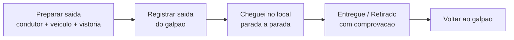

# Execução em campo

Depois de [planejado](planejando-o-roteiro.md) (ou criado sob demanda), o roteiro vai para a rua. Quem executa acompanha tudo **pelo aplicativo, no celular**: prepara a saída, segue parada a parada e registra cada entrega e retirada na hora. O status volta para a equipe **em tempo real** — quem está no escritório vê o pedido avançar sem precisar ligar para o motorista.


A execução em tempo real depende do **GPS do celular** e é feita no **aplicativo**. Pela web não dá para executar passo a passo; se a sua empresa precisar registrar uma rota **depois** que ela já aconteceu, existe a execução em lote (retroativa) — um recurso separado, para quem tem essa permissão.


## O caminho da execução

## Preparar a saída

Antes de pôr o pé na rua, o motorista confirma quem vai e em quê. Se o roteiro foi planejado, esses campos já vêm **pré-preenchidos** — o operador só ajusta o que mudou.

* **Condutor** — quem dirige. Vem do planejamento, mas pode ser trocado. O condutor entra sempre entre os presentes.
* **Acompanhantes / presentes** — a equipe que vai junto. Se alguém não compareceu, é só **desmarcar** quem ficou.
* **Veículo (opcional)** — você seleciona por nome ou placa. Veículos **inativos, em manutenção ou já em trânsito** em outra rota aparecem esmaecidos, com o motivo. Se o roteiro definiu uma especificação, carros de outro tipo ficam marcados como "Especificação diferente".


**Veículo é opcional para iniciar.** Quem ainda não cadastrou a frota, ou está com o único carro em manutenção, consegue rodar mesmo assim — o app avisa que o registro ficará sem veículo, mas não trava a operação.


### Vistoria do veículo

Quando um veículo é selecionado, o app verifica a **vistoria**:

* Se a vistoria estiver **vencida**, aparece um **checklist** — o motorista precisa conferir **todos os itens** antes de poder iniciar a rota.
* Se não houver checklist obrigatório, há apenas uma marcação simples de **"Vistoria do veículo conferida"**.

Com tudo definido, o motorista toca em **Iniciar execução**: o preparo está concluído.

### Sair do galpão

Pronto para partir, o app mostra a **carga a carregar** (o consolidado das entregas da rota) para a equipe conferir item a item, e o botão **Registrar saída do galpão**. Ao registrar a saída, os movimentos passam a ficar **em trânsito**.


A saída usa o GPS. Se você registrar **longe do galpão** (fora do raio) ou com localização simulada, o app pede para **confirmar o motivo** antes de prosseguir — fica no histórico da operação.


## Em rota: parada a parada

Com a rota iniciada, o app mostra **uma parada de cada vez** — a atual, em destaque, com um indicador de progresso ("Parada X de N"). Cada parada traz tudo o que o motorista precisa, em seções:

* **Entregar / Retirar** — os itens da parada (com foto, para reconhecer rápido) e a quantidade.
* **Local** — endereço, complemento e o botão para **traçar a rota** até lá no app de mapas.
* **Contato** — fala direto com o cliente: abre o **WhatsApp** quando disponível, senão a ligação.
* **Cobrança** e **Anotações** — a situação financeira do pedido e as observações internas relevantes para aquela parada.

### Chegada na parada (geofence)

A parada tem **duas etapas**, nesta ordem: primeiro **chegar**, depois **concluir**.

O motorista toca em **Cheguei no local**. O app registra a chegada com a **localização**. Se a chegada for **fora do raio esperado** do endereço (ou com GPS simulado), o app pede uma **justificativa** — mostra a distância e o raio, oferece reavaliar a localização, e só registra a chegada **com o motivo** informado.


Não dá para marcar "Entregue" sem antes ter registrado a chegada. Essa ordem garante que o registro de entrega aconteça **no endereço certo, na hora certa** — e fica tudo no histórico.


### Concluir: entrega ou retirada com comprovação

Depois de chegar, o motorista conclui: **Entregue** (numa entrega) ou **Retirado** (numa retirada). É aqui que entra a **comprovação** — a prova que você guarda de cada movimento.

O que precisa ser registrado **depende da política da sua empresa**, definida nos [motores operacionais](../configuracoes/motores-operacionais.md). Você escolhe os requisitos **separadamente para entrega e para retirada**. Cada item marcado vira **obrigatório**: o app não deixa concluir sem registrar. **Nada marcado = conclui com um toque**, sem prova.

#### O que dá para registrar hoje

| Meio de prova | O que faz | Disponível |
| --- | --- | --- |
| **Foto** | Mostra o estado do material e que a equipe esteve lá. | Sim, hoje |
| **Vídeo** | Idem, em movimento — útil para registrar avarias e o ato completo. | Sim, hoje |

Quando a política exige foto ou vídeo, ao confirmar a entrega o app **abre a câmera na hora** ("Tirar foto" / "Gravar vídeo"), envia a mídia e conclui o movimento — tudo numa sequência só. Se exigir os dois meios, o motorista escolhe qual capturar.


A primeira vez que a câmera for necessária, o app pede **permissão**. É obrigatório conceder para registrar a prova; sem isso, a entrega que exige foto/vídeo não conclui.


#### Provas mais fortes (em breve)

Conforme o negócio cresce e os itens ficam mais caros, vale somar provas mais robustas. Estas já estão previstas e chegam nas próximas versões:

* **Assinatura na tela** — o cliente assina que recebeu.
* **Identificação de quem recebeu** — nome, CPF e foto do documento, ligando o recebimento a uma pessoa real.
* **Código no WhatsApp do cliente** — o cliente confirma um código que só chega no celular dele; a forma mais forte contra "assinatura falsa".
* **Localização confirmada** — registra que a equipe estava no endereço certo na hora.


**A prova de entrega protege o seu dinheiro.** Quando um cliente diz "não recebi" ou "já estava quebrado quando chegou", uma foto ou vídeo do momento mostra o que de fato aconteceu. Isso evita devolução indevida, desconto que você não deve e a discussão que ninguém ganha — começa simples (foto/vídeo) e reforça à medida que cresce.


### Quando a parada não dá certo

Nem toda parada se conclui. Se o cliente não atende, está ausente, recusa, o endereço não foi encontrado ou outro motivo, o motorista pode **pular** o movimento registrando o porquê. Assim a viagem segue para a próxima parada e o motivo fica no histórico — a equipe sabe exatamente o que houve.

### Voltar ao galpão

Cumpridas as paradas, o app conduz o **retorno ao galpão**, mostrando a **carga de retorno** (o que volta — itens não entregues ou retirados de locação). Registrada a volta, a execução está **concluída**.

## Situações reais

* **Entrega com foto obrigatória:** a empresa exige foto na entrega. Ao chegar e confirmar, o app abre a câmera, o motorista fotografa o material no local do cliente e a entrega é concluída com a prova anexada. Semanas depois, o cliente reclama — a foto encerra a conversa.
* **Cliente ausente:** o motorista chega, ninguém atende. Em vez de ficar parado, ele **pula** a parada com o motivo "Cliente ausente" e segue. A equipe reagenda sabendo o que aconteceu.
* **Endereço difícil:** o GPS marca a chegada a 200 m do ponto. O app pede justificativa; o motorista informa "Acesso pela rua de trás" e registra a chegada mesmo assim, com o motivo guardado.
* **Equipe reduzida:** o ajudante faltou. No preparo, o motorista **desmarca** o presente que não veio — o registro reflete quem realmente saiu na viagem.

## Próximo passo

Veja como o roteiro é montado em [Planejando o roteiro](planejando-o-roteiro.md), defina o que exigir de prova nos [motores operacionais](../configuracoes/motores-operacionais.md) e, na locação, acompanhe o retorno em [Conferência na devolução](conferencia.md).
