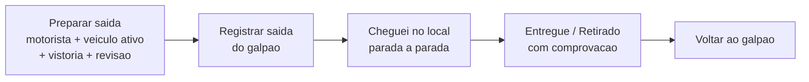
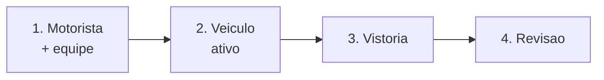

# Execução em campo

Depois de [planejado](planejando-o-roteiro.md), o roteiro vai para a rua. O motorista acompanha tudo **pelo aplicativo, no celular** — ou pelo navegador: prepara a saída, segue parada a parada e registra cada entrega e retirada na hora. O status volta para a equipe em seguida — quem está no escritório vê o pedido avançar sem precisar ligar para o motorista.


**O passo a passo é o mesmo no aplicativo e no navegador.** No navegador, a localização é pedida na hora de registrar a chegada, e a foto ou o vídeo de prova vêm do seletor de arquivos, em vez da câmera. Para registrar uma rota **depois** que ela já aconteceu, existe a [execução em lote](execucao-em-lote.md) (retroativa) — um recurso separado, para quem tem essa permissão.


## O caminho da execução

```mermaid
flowchart LR
    PREP[Preparar saida<br/>motorista + veiculo ativo<br/>+ vistoria + revisao] --> SAI[Registrar saida<br/>do galpao]
    SAI --> CHEG[Cheguei no local<br/>parada a parada]
    CHEG --> DESF[Entregue / Retirado<br/>com comprovacao]
    DESF --> VOLTA[Voltar ao galpao]
```

## Motorista e ajudante: quem registra a rota 

Um roteiro tem **um motorista responsável** — quem dirige e responde pela viagem — e, se for o caso, **ajudantes** que vão junto. Estar na equipe **não basta** para executar a rota:

| Quem | O que faz na execução |
| --- | --- |
| **Motorista responsável** | Inicia a rota e registra **tudo**: a saída, as chegadas, as entregas e retiradas, as provas, a cobrança na porta e o retorno. |
| **Ajudante** (quem vai junto) | Abre a execução em **modo de acompanhamento**: vê as paradas e a carga e conversa pelos **comentários da parada**, mas não registra nada. Vê a cobrança, sem os botões de receber. |
| **Retaguarda** (quem vê todos os roteiros) | Pode registrar a rota em nome da operação, escolher outro motorista ao iniciar e trocar o motorista com a rota na rua. |

Para o ajudante, a tela deixa isso claro numa faixa: *"Você é ajudante neste roteiro — só (nome do motorista) registra a execução. Use os comentários da parada para falar com a equipe."* Na lista de roteiros, o cartão dele traz o selo **Ajudante**, e o detalhe oferece **Acompanhar execução** no lugar de **Executar**.


**E se o motorista faltar?** O motorista não troca o responsável por conta própria: no preparo, ele vê o próprio nome fixo. Quem escolhe outro motorista é a **retaguarda** — ao iniciar a rota (ou ao lançar o lote) em nome de quem de fato saiu, o substituto passa a ser o responsável, e o titular fica na equipe como acompanhante. Com a rota já na rua, a troca é feita na edição do roteiro; veja [Trocar o motorista com a rota na rua](acompanhando-roteiros.md#trocar-motorista-na-rua).



**Papel personalizado que executa roteiros, mas não vê todos**, registra só a rota em que é o motorista responsável. Para registrar a rota de outra pessoa, o papel precisa da permissão de **ver todos os roteiros**. Veja [Colaboradores e acessos](../configuracoes/colaboradores-e-acessos.md).


## Antes de a rota liberar: os portões de entrada

Quando o motorista abre o roteiro para executar, o app faz três verificações **antes** de deixar a viagem começar. Cada uma protege a operação de um jeito — e some sozinha quando não se aplica.

| Portão | Quando aparece | O que o motorista faz |
| --- | --- | --- |
| **Aguardando logística interna** | A empresa separa o material internamente **e** quem abriu não opera a separação | Espera a equipe do galpão marcar a separação como concluída — só então a execução libera. |
| **Roteiro muito futuro** | Ao tentar iniciar um roteiro cuja saída está prevista para **muito à frente** | Espera chegar perto da data. A execução libera a partir de **12 horas antes** da saída prevista. |
| **Acessos do aparelho** | Sempre, antes de cada rota | Concede **Localização** (sempre) e, no aplicativo, **Câmera** (quando a empresa exige foto/vídeo de prova). |


**"Aguardando logística interna" — verbatim do app:** *"Os pedidos deste roteiro ainda estão na separação interna. Assim que a equipe marcar a separação como concluída, a execução fica liberada para iniciar."* Esse portão só aparece para quem **não** opera a [separação](separacao.md) — quem separa não fica travado.


### Roteiros muito futuros: a margem de 12 horas 

Você **não consegue iniciar** um roteiro planejado para muito à frente. A execução só libera a partir de **12 horas antes da saída prevista** do roteiro — uma margem fixa, igual para todo mundo, pensada para o caso real: a equipe pode se **adiantar um pouco** (sair mais cedo no mesmo dia), mas não começar um roteiro que é de **outro dia**.

* **Adiantar um pouco, pode.** Saiu uns minutos — ou algumas horas — antes da hora marcada? Tudo certo, está dentro da margem.
* **Executar com dias de antecedência, não.** Um roteiro do dia 24 não pode ser iniciado no dia 22: ainda não é hora.
* **Atrasar é sempre permitido.** Se a saída já passou (executou no horário ou depois), não há trava nenhuma — você registra normalmente.


**Por que essa trava existe.** Ela garante que tudo que aparece como *executado* aconteceu de fato perto do planejado — sem roteiros "do futuro" sendo dados como feitos por engano. A margem de **12 horas** é um valor padrão do sistema; você não precisa configurar nada.


### O portão de acessos do aparelho

Antes de toda rota, o app mostra uma tela enxuta — **"Antes de começar a rota"** — com um checklist dos acessos que a viagem precisa:

* **Localização (sempre obrigatória).** É o que confirma a chegada em cada parada. Texto do app: *"Confirmamos sua chegada em cada parada pela sua posição — o roteiro só registra 'Cheguei' no local certo."*
* **Câmera (no aplicativo, obrigatória só quando a empresa exige prova).** Quando a política pede foto/vídeo na entrega, a câmera vira pré-requisito: *"Sua organização exige foto/vídeo como prova de entrega. A câmera abre ao concluir cada movimento."* No navegador não há câmera a autorizar: a prova vem do seletor de arquivos.

Se o motorista já concedeu tudo, esse portão **passa direto** — ele nem chega a vê-lo. Se faltar algo, o botão **Começar execução** só libera depois de conceder os obrigatórios. Quem tem a permissão de registro em lote vê ali também o atalho **Registrar em lote (sem GPS)**.


**Confirmar chegada ≠ aparecer no mapa ao vivo.** A localização deste portão é a que confirma a **chegada em cada parada** (o "Cheguei" no local certo) — obrigatória para executar. Já **mostrar o caminhão se movendo no mapa** para quem acompanha é outra coisa: uma **preferência opt-in, desligada por padrão**, que o condutor ativa em **Configurações → Preferências**. Sem ela, a execução funciona normal — só o ponto ao vivo no mapa não aparece. Entenda em [Acompanhando seus roteiros](acompanhando-roteiros.md#acompanhar-execucao-no-mapa).



**Negar uma vez não trava para sempre.** O app verifica os acessos **de verdade, no sistema do celular**, toda vez que a tela abre (e quando você volta das Configurações). Se você negou antes, o passo reaparece; e quando o próprio celular bloqueia o pedido, o botão vira **"Abrir configurações"** e te leva direto ao lugar certo.



**Avisos e sons enquanto dirige são preferência, não pré-requisito.** No rodapé desse portão há um atalho para ajustar notificações — útil para quem quer ser avisado em rota —, mas isso **nunca** bloqueia a viagem. Veja a [Central de Notificações](../configuracoes/central-de-notificacoes.md).


## Preparar a saída

Passados os portões, o motorista entra no **preparo guiado, passo a passo** — sem tela amontoada. Se o roteiro foi planejado, os campos já vêm **pré-preenchidos**; o motorista só confirma ou ajusta o que mudou.

```mermaid
flowchart LR
    M[1. Motorista<br/>+ equipe] --> V[2. Veiculo<br/>ativo] --> VI[3. Vistoria] --> R[4. Revisao]
```

* **Passo 1 — Motorista e equipe.** *"Quem vai conduzir?"* O motorista responsável já vem do planejamento e entra sempre na **equipe presente**. Ele vê o próprio nome fixo; só a retaguarda (quem vê todos os roteiros) troca o motorista aqui. Nos **acompanhantes**, se alguém não compareceu, é só **remover**; quem foi sem estar previsto entra por **Adicionar à equipe**. O app **avisa** se o motorista estiver sem CNH ou sem a competência de dirigir.
* **Passo 2 — Veículo.** Você seleciona **um veículo concreto** (por nome ou placa). Se o [planejamento](planejando-o-roteiro.md) definiu o tipo de veículo, só os daquele tipo ficam selecionáveis — os de fora aparecem esmaecidos com o selo **"Classe diferente"**. Também aparecem esmaecidos, com o motivo, os veículos **inativos**, **em manutenção**, **em trânsito** em outra rota e os com **documento vencido**. Quando o planejamento previu uma **carreta** (extensão), você escolhe a carreta do grupo planejado, compatível com o veículo — sair sem ela não é possível, porque a carga foi conferida contra a capacidade do conjunto.
* **Passo 3 — Vistoria.** O app confere a vistoria do veículo escolhido — e da carreta, quando há (veja a seguir).
* **Passo 4 — Revisão.** Uma conferência final de tudo (motorista, veículo, vistoria) antes de **concluir o preparo**.


**Documento vencido não sai.** Veículo ou carreta com o licenciamento (CRLV) **vencido** não pode ser selecionado — circular assim é infração gravíssima, com remoção do veículo. Documento **não cadastrado** não bloqueia: só aparece como aviso na revisão. A validade do documento fica no cadastro do veículo, em [Frota](../cadastros/frota.md).



**O veículo é obrigatório — e precisa estar ativo.** Diferente do roteiro planejado (onde dá para deixar o tipo de veículo em aberto), quem vai para a rua precisa registrar **em qual veículo de verdade** o material saiu. Isso garante a rastreabilidade da carga e da frota.


### Vistoria do veículo

Quando um veículo é selecionado, o app verifica a **vistoria**:

* Se a vistoria estiver **vencida**, aparece um **checklist** — o motorista precisa conferir **todos os itens** antes de poder avançar.
* Se não houver checklist obrigatório, há apenas uma marcação simples de **"Vistoria do veículo conferida"**.
* Com **carreta**, ela tem a **vistoria própria** — o documento e o checklist dela não são os do caminhão —, e os itens dela também são conferidos um a um.

Na revisão final, o motorista toca em **Concluir preparo** — e a rota está pronta para sair.

### Sair do galpão

Pronto para partir, o app mostra a **carga a carregar** (o consolidado das entregas da rota) para a equipe conferir item a item, e o botão **Registrar saída do galpão**. Ao registrar a saída, os movimentos passam a ficar **em trânsito**.


A saída usa o GPS. Se você registrar **longe do galpão** (fora do raio) ou com localização simulada, o app pede para **confirmar o motivo** antes de prosseguir — fica no histórico da operação.


### Coletar em outro galpão no caminho 

Quando o roteiro leva material de **mais de um galpão**, a passagem pelo galpão de apoio é uma **parada própria**, antes dos clientes: **Carregar em (galpão)**. O motorista confere item a item o que está subindo no veículo e toca em **Registrar carga em (galpão)** — com a mesma checagem de localização da saída (longe do galpão, o app pede o motivo). É esse registro que **baixa o estoque do galpão certo**. Se não houver nada a carregar ali, dá para seguir com **Continuar sem carregar aqui**.

E se a quantidade carregada **não bater com a planejada**? Quem decide é a sua operação, em **Ajustes › Motores › Logística › No galpão** (*Carga diferente do planejado*):

| Política | O que acontece |
| --- | --- |
| **Livre** | Registra a quantidade declarada, sem perguntar nada. |
| **Com motivo** (padrão) | Pede uma explicação, que fica junto do registro da passagem. |
| **Bloquear** | Só deixa sair a quantidade planejada — o app avisa *"Esta operação só permite carregar a quantidade planejada."* Para carregar outra, alguém edita o roteiro antes da saída. |

## Em rota: parada a parada

Com a rota iniciada, o app mostra **uma parada de cada vez** — a atual, em destaque, com um indicador de progresso ("Parada X de N"). O card da parada não descreve o lugar: ele mostra **a tarefa**, sempre na mesma ordem, sem nada escondido em seções que precisam ser abertas:

1. **A rota** — a fita no topo, com as paradas feitas e as que faltam;
2. **Quem é o cliente** e o pedido — se é entrega ou retirada;
3. **O endereço**, com o complemento (tocar copia o endereço completo);
4. **A que horas ficou combinado** — a janela de horário (ou *"Sem horário combinado"*);
5. **O estado** da parada — o que já foi feito e o que ainda falta, inclusive a prova;
6. **O recado da equipe** — as anotações internas daquele pedido;
7. **O contato** — o botão **Falar** abre as opções para falar com o cliente (WhatsApp, ligação);
8. **Os itens** a entregar ou retirar, com foto (para reconhecer rápido) e quantidade;
9. **A cobrança**, numa linha (veja [Cobrar na rua](#cobrar-na-rua)).

**Direita é execução, esquerda é conversa.** Os botões de agir — **Cheguei** / **Entregue** (ou **Retirado**), **Pular esta parada** e **Traçar rota** — ficam de um lado, sempre na mesma ordem. Do outro, mais discreta, fica a **bandeja de mensagens** da parada: os comentários da equipe sobre aquele pedido. Abrir qualquer folha esconde os dois, para nada ser tocado sem querer. Quando o endereço não tem ponto no mapa, **Traçar rota** vira **Copiar endereço**, para colar no app de mapas.


**"Viagem N de M": quando a entrega foi dividida.** Se o movimento foi [repartido em viagens](planejando-o-roteiro.md#cargas-e-viagens), a parada exibe o selo **"Viagem 1 de 2"** (por exemplo) e os itens listados são **só os daquela viagem**. O motorista sabe — e pode avisar o cliente — que **ainda faltam viagens**. O pedido só passa a *Entregue* / *Retirado* quando a **última viagem** termina; concluir a viagem 1 não fecha o pedido, e isso é o esperado.


### Quando o pedido muda no meio da rota 

Se o pedido muda com a rota na rua e o escritório [ajusta o roteiro](quando-um-pedido-muda.md#ajustar-o-roteiro), o motorista **fica sabendo o que mudou** — não só que "algo mudou":

* O aviso **Roteiro ajustado** diz a diferença na própria frase — por exemplo, *"Mudou a carga do pedido ORC-1042: Cadeira Tiffany de 36 para 40. Confira antes de seguir."* — e tocar nele abre a execução.
* Na parada afetada aparece a faixa escura **Esta parada mudou**, com o resumo (*"Cadeira Tiffany: 36 → 40"*, a janela nova, *"Endereço mudou"*). Tocar nela abre **O que mudou nesta parada**: itens, janela de horário e local, do antes para o depois.
* O motorista toca em **Ciente, seguir** — fica registrado no roteiro que ele viu a alteração.

Se a tela estiver aberta no momento da mudança, uma faixa no topo avisa na hora (*"O operador ajustou este roteiro agora. Confira a carga antes de seguir."*). E, enquanto o escritório **ainda não ajustou** o roteiro, a parada do pedido alterado fica travada — o motorista vê *"Este pedido foi alterado agora. Confira a carga — a parada fica travada até o operador ajustar."* Veja [Quando um pedido muda depois de fechado](quando-um-pedido-muda.md).

### Consultar o que já passou e o que ainda vem 

O motorista não precisa sair da execução para responder ao cliente:

* **Paradas já feitas:** pela fita da rota, dá para voltar às paradas anteriores — elas abrem **só para consulta**, marcadas pela cor do desfecho, sem nenhum botão de agir.
* **O que ainda falta:** quando o contrato tem outras viagens pela frente, o fim do card traz a linha **O que ainda falta**, com as próximas entregas e retiradas daquele pedido e a janela de cada uma (marcada como *estimado* quando ainda não foi combinada). A folha mostra só o que faz sentido para aquela parada — numa retirada, só retiradas — e lembra: *"Programação da operação — confirme com a retaguarda antes de prometer data ao cliente."*

### Sem sinal, o app continua servindo 

No aplicativo, falta de sinal **não derruba a sessão** do motorista. O roteiro em execução fica guardado no aparelho e a tela mostra a faixa *"Sem sinal · dados de 06/10 09:40. O que você registrar será enviado quando a conexão voltar."* O que ele registra sem sinal entra numa fila, com o selo *"N registro(s) aguardando envio · tocar para tentar"*, e sobe sozinho quando a conexão volta.


**Trocar o motorista enquanto ele está sem sinal?** Espere a sincronização: o que o motorista que sai registrou offline e ainda não enviou **não entra na rota** depois da troca. Veja [Trocar o motorista com a rota na rua](acompanhando-roteiros.md#trocar-motorista-na-rua).


### A bolha de retorno do mapa (Android)

Quando o motorista toca em **traçar a rota** (ou em **ver a localização**), o app de mapas abre por cima do LocFlow — e é fácil "perder" a tela da execução. Para resolver isso, no **Android** o LocFlow mostra uma **bolha flutuante** por cima do mapa, com três coisas: uma **seta de voltar** (tocar em qualquer ponto da bolha traz o app de volta à rota num instante), o **logo** e o **número do endereço** da parada — mais o **complemento**, quando o endereço tem um. É o que o motorista precisa ler quando está chegando: o mapa leva à rua, o número e o complemento levam à porta. Endereço sem número aparece como **s/n**. A bolha pode ser arrastada; soltá-la sobre o **X** que aparece embaixo a fecha sem fechar o app.


**Como a permissão funciona (verbatim do app):** *"Enquanto você usa o mapa, o LocFlow mostra uma bolha flutuante por cima dos outros apps, com o número e o complemento do endereço da parada — e uma seta para voltar à rota num instante."* O Android pede uma permissão de **"aparecer sobre outros apps" / "sobrepor a outras telas"**. Na primeira vez, o LocFlow explica para quê serve e como conceder **antes** de te mandar para as Configurações — você não cai numa tela de sistema sem contexto.


A bolha é **opcional e some sozinha** quando você volta ao app. Se você escolher "Agora não", o mapa abre normalmente, sem bolha, e o app não insiste de novo. No **iPhone (iOS)** esse recurso não existe — o app simplesmente ignora, sem nenhum efeito colateral.

### Chegada na parada (geofence)

A parada tem **duas etapas**, nesta ordem: primeiro **chegar**, depois **concluir**.

O motorista toca em **Cheguei no local**. O app registra a chegada com a **localização**. Se a chegada for **fora do raio esperado** do endereço (ou com GPS simulado), o app pede uma **justificativa** — mostra a distância e o raio, oferece reavaliar a localização, e só registra a chegada **com o motivo** informado.


Não dá para marcar "Entregue" sem antes ter registrado a chegada. Essa ordem garante que o registro de entrega aconteça **no endereço certo, na hora certa** — e fica tudo no histórico.


### Concluir: entrega ou retirada com comprovação

Depois de chegar, o motorista conclui: **Entregue** (numa entrega) ou **Retirado** (numa retirada). É aqui que entra a **comprovação** — a prova que você guarda de cada movimento.

O que precisa ser registrado **depende da política da sua empresa**, definida nos [motores operacionais](../configuracoes/motores-operacionais.md). Você escolhe os requisitos **separadamente para entrega e para retirada**. **Nada marcado = conclui com um toque**, sem prova.


**A regra pode combinar meios — não é só uma lista de "tudo obrigatório".** Você pode exigir dois juntos (*"foto **e** vídeo"*), dar alternativas (*"vídeo **ou** assinatura"*), misturar (*"foto **e** (vídeo **ou** assinatura)"*) ou pedir uma **quantidade mínima** (*"2 fotos"*). Enquanto a prova não estiver completa, o app não deixa concluir e mostra em texto claro o que ainda falta. O mesmo modelo vale na [loja](balcao.md#comprovacao-na-loja).


#### Obrigatório x opcional

Cada grupo de prova que a sua empresa configura vem marcado como **Obrigatório** ou **Opcional**:

* **Obrigatório** trava o desfecho até a prova ser registrada — igual sempre foi: sem ela, o motorista não conclui.
* **Opcional** vira um **passo que dá para pular sem justificar**. O motorista ainda vê o pedido de anexo na tela — se quiser fotografar ou filmar mesmo assim, é só tocar — mas nada trava a conclusão por causa dele.

Se a sua política tiver **só itens opcionais** para aquele movimento, o motorista conclui **sem nenhuma trava**, do mesmo jeito que se nada estivesse marcado.


**Isso não é a mesma coisa que "dispensar" uma prova obrigatória.** Pular um item **opcional** é livre para qualquer motorista, sem escrever nada. Já **dispensar** uma prova **obrigatória** exige uma justificativa e uma permissão à parte, que o motorista comum **não tem** (veja [Quem pode mexer](../configuracoes/motores-operacionais.md#permissoes) e [Colaboradores e acessos](../configuracoes/colaboradores-e-acessos.md#dispensar-evidencia)).


#### O que dá para registrar hoje

| Meio de prova | O que faz | Disponível |
| --- | --- | --- |
| **Foto** | Mostra o estado do material e que a equipe esteve lá. | Sim, hoje |
| **Vídeo** | Idem, em movimento — útil para registrar avarias e o ato completo. | Sim, hoje |

Quando a política exige foto ou vídeo, ao confirmar a entrega o app **abre a câmera na hora** ("Tirar foto" / "Gravar vídeo"), envia a mídia e conclui o movimento — tudo numa sequência só. Se exigir os dois meios, o motorista escolhe qual capturar.


A permissão de câmera é pedida lá no **portão de acessos**, antes da rota — então, na hora da entrega, a câmera já abre direto, sem interromper a operação no cliente. No navegador, a foto ou o vídeo vêm do seletor de arquivos.


#### Entregou (ou recolheu) só uma parte? 

Nem sempre tudo sai como planejado: o cliente só tinha espaço para 8 das 10 mesas, ou só 6 das cadeiras estavam prontas para voltar. Para isso há a ação **Entregar só parte** (ou **Recolher só parte**), junto de **Pular esta parada**:

1. O app pergunta *"Quanto você conseguiu entregar?"* e lista os itens da parada, com foto.
2. O motorista informa **item a item** o que de fato saiu (ou voltou). O botão mostra a conta — por exemplo, **Confirmar 8 de 10**.
3. A parte feita exige **a mesma comprovação** de uma entrega inteira: com prova exigida, o botão vira **Comprovar e confirmar**.


**O que faltou não some.** O app avisa antes de confirmar: *"Faltam 2. Vão virar uma pendência do pedido e voltar para a fila de roteirização — o pedido NÃO fica como entregue."* O restante volta a ficar disponível para outro roteiro, e o estoque só registra o que saiu de verdade.


#### Provas mais fortes (em breve)

Conforme o negócio cresce e os itens ficam mais caros, vale somar provas mais robustas. Estas já estão previstas e chegam nas próximas versões:

* **Assinatura na tela** — o cliente assina que recebeu.
* **Identificação de quem recebeu** — nome, CPF e foto do documento, ligando o recebimento a uma pessoa real.
* **Código no WhatsApp do cliente** — o cliente confirma um código que só chega no celular dele; a forma mais forte contra "assinatura falsa".
* **Localização confirmada** — registra que a equipe estava no endereço certo na hora.


**A prova de entrega protege o seu dinheiro.** Quando um cliente diz "não recebi" ou "já estava quebrado quando chegou", uma foto ou vídeo do momento mostra o que de fato aconteceu. Isso evita devolução indevida, desconto que você não deve e a discussão que ninguém ganha — começa simples (foto/vídeo) e reforça à medida que cresce.


### Cobrar na rua 

O motorista não precisa entregar e "lembrar de cobrar depois". Direto da parada, a linha de **cobrança** mostra quanto há a receber (*"R$ X a receber"*) — ou o que já foi recebido e aguarda conferência — e, **enquanto houver saldo realmente em aberto**, um acesso **Cobrar** que abre a tela **Receber**.

Antes de qualquer botão, a tela diz o que o motorista precisa saber para agir na porta:

* **O que foi combinado com o cliente.** Se o vendedor combinou a forma de pagamento (por exemplo, *"Pagamento combinado: Pix · metade na entrega"*), esse recado aparece no topo da cobrança da parada e na tela de receber. É um **recado, não uma regra**: se o cliente mudar de ideia na porta, dá para receber de outro jeito.
* **Cobrança já paga:** em vermelho — *"Esta cobrança já foi paga. Não receba nada do cliente por ela."* O caminho de receber some: receber duas vezes é dinheiro para devolver depois.
* **Cliente faturado:** em âmbar — o escritório cobra esse cliente depois, por fatura. O aviso pede para não insistir na porta, mas o **receber continua disponível**: se o cliente quiser pagar na hora, o motorista recebe normalmente.

Depois disso, conforme a permissão de quem está em campo, há dois caminhos:

| Caminho | O que o motorista faz | Quando usar |
| --- | --- | --- |
| **O cliente vai pagar agora** (Pix) | **Cobrar por PIX** gera o QR grande + copia-e-cola — ou **mostra** o Pix que já estava aberto, igualzinho ao operador. | Cliente paga na hora pelo celular dele. |
| **Já recebi em** (presencial) | Registra um pagamento que entrou **na rua** — **Dinheiro**, **Maquininha**, **Transferência** ou **Outro** — com o valor recebido. | Cliente paga em espécie, passa o cartão na maquininha ou já transferiu. |


**O ajudante vê, mas não recebe.** Quem vai na viagem como ajudante enxerga o valor e os avisos da cobrança — para responder ao cliente —, mas sem os botões de receber: *"Você acompanha esta rota: quem recebe na porta é o motorista responsável."* O parceiro logístico que cobra na rua vê o mesmo recado do combinado; veja [Cobrança na rua](../parcerias/cobranca-na-rua.md).



**Pix ao vivo na entrega.** Se o cliente paga o Pix com o QR aberto na tela, o app **percebe na hora** e mostra a confirmação animada de "Pagamento confirmado" — o motorista sai do cliente com a certeza de que o dinheiro entrou, sem ligar para o escritório.



**Recebimento presencial cai como "Aguardando conferência".** Quando o motorista registra dinheiro/maquininha na rua, o valor entra na fatura como recebido, mas marcado para **conferência** depois (quem fecha o caixa concilia). Isso mantém o controle do que entrou por fora sem cobrar ninguém duas vezes — a mesma lógica da [baixa manual](../cobranca/recebendo-pagamentos.md).


#### Quem pode cobrar em campo

Cada caminho é liberado **por permissão, separadamente** — você decide o que cada papel pode fazer na rua:

* **Gerar/ver Pix** depende da permissão de **pagamento online**.
* **Registrar recebimento presencial** depende da permissão de **pagamento externo**.

Sem nenhuma das duas, o motorista vê a cobrança mas **não cobra** — útil quando você quer que ele só entregue e deixe o financeiro com o escritório. Ajuste isso em [Colaboradores e acessos](../configuracoes/colaboradores-e-acessos.md).

### Quando a parada não dá certo 

Nem toda parada se conclui. Se o cliente não atende, está ausente, recusa, o endereço não foi encontrado ou outro motivo, o motorista pode **pular** o movimento registrando o porquê. Assim a viagem segue para a próxima parada e o motivo fica no histórico — a equipe sabe exatamente o que houve.

E o melhor: **ninguém precisa criar nada na mão depois**. Ao pular, o LocFlow abre sozinho uma **nova tentativa**:

* O movimento **volta à fila de roteirização na hora** — não é preciso esperar o motorista terminar a rota. Ele reaparece com um selo âmbar de prioridade — *"Tentativa 2 · falhou 1× — priorize"* — junto com o **motivo** do pulo, pronto para entrar no próximo roteiro.
* No roteiro em que foi pulada, a parada fica registrada com o aviso **"Replanejar · nova tentativa pendente"** — o histórico da falha não se perde.


**Pulou, já pode replanejar.** Um roteiro em andamento é parte já executada e parte ainda por fazer. O que foi pulado virou história daquela viagem, então não fica preso a ela: enquanto o motorista segue para as próximas paradas, o escritório já pode encaixar a nova tentativa em outro roteiro — inclusive para sair no mesmo dia.



**"Replanejar" não é "Desatualizado".** A nova tentativa nasce porque a parada **falhou** — o pedido em si não mudou. Quando o **pedido** muda depois de planejado (data, itens, endereço), aí sim o movimento aparece como *Desatualizado* — veja [Quando um pedido muda](quando-um-pedido-muda.md).


### Voltar ao galpão

Cumpridas as paradas, o app conduz o **retorno ao galpão**, mostrando a **carga de retorno** (o que volta — itens não entregues ou retirados de locação). Registrada a volta, a execução está **concluída**.

## Por porte: do simples ao escalável

A mesma execução serve a quem está começando e a quem opera frota — porque quase tudo é **opcional e cresce com você**.

| Porte | Como a execução se comporta |
| --- | --- |
| **Pequeno** | Sem separação interna, sem prova obrigatória, sem cobrança em campo: o motorista prepara, sai, chega e conclui com um toque. O caminho mais curto. |
| **Médio** | Liga prova de entrega (foto/vídeo), passa a cobrar na rua e pode exigir separação interna antes da rota — controle onde dói, sem burocratizar o resto. |
| **Grande** | Provas mais fortes (assinatura, identificação, código no WhatsApp — em breve), permissões finas por papel (quem dirige, quem cobra, quem separa) e rastreabilidade total de carga, veículo e dinheiro em cada viagem. |

## Situações reais

* **Entrega com foto obrigatória:** a empresa exige foto na entrega. Ao chegar e confirmar, o app abre a câmera, o motorista fotografa o material no local do cliente e a entrega é concluída com a prova anexada. Semanas depois, o cliente reclama — a foto encerra a conversa.
* **Foto opcional que o motorista tira mesmo assim:** a política marca a foto de retirada como opcional. Ao concluir, o motorista vê o convite para anexar, mas não é obrigado — como o material é caro, ele tira a foto por conta própria e ela fica guardada com o movimento.
* **Só itens opcionais na política:** a empresa marcou apenas provas opcionais para a entrega. O motorista toca em "Entregue", vê o convite para anexar (opcional) e toca em **Confirmar** sem tirar nada — nenhuma trava o segura, porque não há nenhum requisito obrigatório na regra.
* **Cliente paga na hora:** o cliente diz que prefere pagar agora. O motorista toca em **Cobrar**, gera o Pix, mostra o QR — e quando o pagamento cai, a tela confirma sozinha. Se o cliente paga em dinheiro, ele registra o **recebimento presencial** e segue viagem.
* **Cliente ausente:** o motorista chega, ninguém atende. Em vez de ficar parado, ele **pula** a parada com o motivo "Cliente ausente" e segue. No escritório, o movimento já reaparece na fila de roteirização como **"Tentativa 2 — priorize"**, com o motivo — é só encaixar no próximo roteiro.
* **Endereço difícil:** o GPS marca a chegada a 200 m do ponto. O app pede justificativa; o motorista informa "Acesso pela rua de trás" e registra a chegada mesmo assim, com o motivo guardado.
* **Negou a localização por engano:** o motorista tocou em "negar" sem querer. Na próxima vez que abre a rota, o portão de acessos reaparece e o leva direto às Configurações — sem ficar travado para sempre.
* **Equipe reduzida:** o ajudante faltou. No preparo, o motorista **remove** da equipe quem não veio — o registro reflete quem realmente saiu na viagem.
* **O ajudante abriu a rota no celular dele:** ele vê a faixa *"Você é ajudante neste roteiro — só (motorista) registra a execução"*, acompanha as paradas e a carga e avisa a equipe pelos comentários da parada. Quem toca em **Cheguei** e **Entregue** é o motorista.
* **Só cabiam 8 das 10 mesas:** o motorista toca em **Entregar só parte**, informa as 8 que ficaram e confirma com a foto. As 2 que voltaram viram pendência do pedido e reaparecem na fila de roteirização — o pedido não fica como entregue.
* **O cliente aumentou o pedido com o caminhão na rua:** o escritório ajusta o roteiro e o motorista recebe *"Mudou a carga do pedido…: Cadeira Tiffany de 36 para 40"*. Na parada, ele abre **O que mudou nesta parada**, confere e toca em **Ciente, seguir**.
* **Estrada sem sinal:** a tela mostra *"Sem sinal · dados de 06/10 09:40"*; o motorista segue registrando as entregas, que ficam na fila do aparelho e sobem sozinhas quando o sinal volta.

## Próximo passo

Veja como o roteiro é montado em [Planejando o roteiro](planejando-o-roteiro.md), defina o que exigir de prova nos [motores operacionais](../configuracoes/motores-operacionais.md), entenda a cobrança na volta em [Recebendo pagamentos](../cobranca/recebendo-pagamentos.md) e, na locação, acompanhe o retorno em [Conferência na devolução](conferencia.md).
