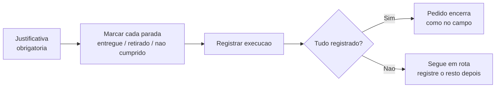

# Execução em lote (retroativa)

A **execução em lote** é o jeito de registrar, **pela web e de uma vez**, um roteiro que **já aconteceu** na rua. Em vez de acompanhar parada a parada em tempo real, você passa pela lista de paradas e marca o que de fato ocorreu — entregue, retirado ou não cumprido — e o pedido caminha de *planejado* a *executado* na mesma operação.

É a alternativa à [execução em campo](execucao-em-campo.md): o motorista nem sempre tem o app na mão no momento da entrega. Quando a viagem foi feita "no papel" ou combinada por fora, alguém do escritório **lança depois** o que aconteceu — sem deixar o pedido travado em aberto.


**Na web e também no app.** A execução em tempo real depende do GPS do celular e roda no aplicativo. O lote é o caminho para registrar uma rota **depois** que ela já aconteceu — um recurso separado, para quem tem a permissão. Ele aparece na **web** e, agora, **no próprio app no celular**: na tela de execução, antes de iniciar, há o atalho *"Sem tempo real agora? Registrar em lote (sem GPS)"* — útil para quem está só com o telefone na mão e não vai acompanhar parada a parada.


## Quando usar o lote

O lote existe para o **registro retroativo**: a operação já foi feita, você só precisa que o sistema reflita isso. Casos típicos:

* O motorista entregou sem o app aberto (sinal ruim, celular sem bateria, viagem combinada de última hora).
* A entrega foi feita por um parceiro ou terceiro que não usa o app.
* O pedido ficou "preso" em aberto na logística e você precisa fechar o ciclo pelo escritório.


**O lote não substitui o campo.** Sempre que der, use o app no celular para a execução em tempo real — ele registra a localização de cada parada e a comprovação na hora, protegendo o seu dinheiro. O lote é para o que **já passou**, sem essa rede de segurança.


## Quem pode registrar em lote

O registro retroativo é uma ação **sensível** — afinal, você está afirmando que algo aconteceu sem o sistema ter visto acontecer. Por isso ela é **restrita por permissão**:

* Vai para a **gestão e a operação interna** (perfis como Operador e Atendente, e o Superadmin) — quem planeja a rota também pode registrar o que aconteceu offline.
* **Não** vai para o **motorista** nem para **parceiros** de campo: quem está na rua executa em tempo real, não retroativamente.

Quem não tem a permissão simplesmente não vê o caminho do lote. Veja [Papéis, funções e competências](../conceitos/papeis-funcoes-competencias.md).


A execução em lote integra o conjunto de recursos de **gerenciamento de rotas**, disponível a partir do plano **Pro**. Confira em [Minha assinatura e créditos](../configuracoes/assinatura-e-creditos.md).


## O que você precisa antes

Para registrar um roteiro em lote, ele precisa ter um **condutor definido no planejamento**. O sistema reaproveita a **atribuição do planejamento** — condutor, equipe e veículo — como quem realmente saiu na viagem; você não preenche isso de novo.

Se o roteiro ainda não tem condutor, a tela pede para **abrir o roteiro e atribuir um condutor primeiro**. O veículo, ao contrário do campo, **não é obrigatório** aqui — se o planejamento tinha um, ele entra junto; se não, o registro segue sem veículo.


**Roteiro não pode ser do futuro.** Assim como na [execução em campo](execucao-em-campo.md), você não registra em lote um roteiro planejado para **muito à frente** — a saída prevista tem que estar a, no máximo, **12 horas** no futuro. Faz sentido: o lote é para o que **já aconteceu**, e algo que só sai daqui a dias ainda não aconteceu. Roteiros no horário ou **atrasados** podem ser registrados normalmente.


## Como funciona, passo a passo

A tela mostra um **aviso** logo no topo, para deixar claro o que você está fazendo:

> *Registro retroativo: você está marcando o que já aconteceu, de uma vez, sem avaliação de localização (GPS). Para validar em tempo real, use a execução passo a passo.*

Em seguida vêm a justificativa, a lista de paradas e o botão **Registrar execução**.

## A justificativa é obrigatória

Antes de salvar, você precisa **explicar por que está registrando em lote** — sem tempo real. É um campo de texto livre, e o sistema não deixa concluir sem ele.

> *Ex.: execução feita em campo; lançando agora pelo escritório.*

Essa justificativa fica **gravada no histórico** da operação, junto de **quem** registrou e **quando**. É o que dá rastreabilidade a um registro que, por natureza, não tem a prova automática do GPS.

## O comprovante é opcional

No campo, a sua empresa pode **exigir** foto ou vídeo para concluir uma entrega (a política de comprovação dos [motores operacionais](../configuracoes/motores-operacionais.md)). No lote, **essa exigência não se aplica**: o comprovante é **opcional**.

Faz sentido — você está lançando algo que já passou, e nem sempre há uma foto daquele momento. A justificativa textual assume o papel de registro do que aconteceu.

Ainda assim, **você pode anexar** foto ou vídeo em cada parada concluída — é só tocar em **"Anexar evidências (opcional)"** no card. Quando a sua política pediria uma evidência ali, o sistema **mostra qual** ("Comprovação sugerida: …") e, se você concluir **sem** ela, exibe um **aviso de que você está assumindo o risco** — sem travar o registro. A intenção é te dar a chance de comprovar e te **conscientizar** do que está abrindo mão, não te bloquear.


**O aviso de risco é só um lembrete, não uma trava.** Concluir sem a evidência sugerida segue valendo — mas aquele pedido fica sem a prova que a sua política normalmente guardaria. Anexe sempre que tiver o material em mãos.



**Sem GPS, sem geofence, sem prova obrigatória.** O lote não avalia se você estava no endereço certo nem pede foto na hora. Por isso ele é "menos seguro" que o campo — e por isso a justificativa é cobrada. Para a rastreabilidade completa (localização + prova de entrega), use a [execução em campo](execucao-em-campo.md).


## O que aconteceu em cada parada

A lista mostra **cada parada do roteiro**, na ordem planejada, com o código do pedido, o cliente e o endereço. Para cada uma, você escolhe entre dois desfechos:

* **Entregue / Retirado** — a parada se concretizou. (O rótulo muda conforme a parada seja de entrega ou de retirada.)
* **Não cumprido** — a parada não aconteceu.

Ao marcar **Não cumprido**, o sistema pede o **motivo**:

| Motivo | Quando usar |
| --- | --- |
| **Não atendeu** | Ninguém respondeu no local. |
| **Endereço não encontrado** | O ponto de entrega não foi localizado. |
| **Cliente ausente** | O cliente não estava para receber/entregar. |
| **Recusou** | O cliente recusou o material. |
| **Outro** | Qualquer outro caso — exige uma **descrição** do que impediu. |

O motivo é **obrigatório** em toda parada não cumprida, e a descrição é obrigatória quando você escolhe **Outro**. Esses motivos são os mesmos do campo, então o histórico fica consistente entre as duas formas de executar.


Uma parada **não cumprida** não é um erro — é informação. Ela registra que aquele movimento falhou e abre caminho para uma nova tentativa, exatamente como acontece quando o motorista pula uma parada na rua.


## Registrar aos poucos: o lote incremental

Você **não precisa** ter certeza de tudo de uma vez. O lote é **incremental**: marque o que já sabe, toque em **Registrar execução** e volte depois para lançar o restante.

O segredo é que o sistema **registra apenas o que ainda está pendente** e **preserva o que já foi registrado**. Ou seja:

* O que você já confirmou numa rodada anterior fica **congelado** — não é reescrito, mesmo que a tela mostre tudo de novo.
* Numa segunda rodada, só os movimentos **ainda em aberto** são gravados com o desfecho que você marcar.

Isso vale inclusive quando a viagem **começou no campo** e ficou pela metade: você pode **terminar pela web** o que faltou registrar, sem reiniciar nada.


**Não dá para "reeditar o feito".** Como o já registrado é imutável, você lança com tranquilidade aos poucos: nenhuma rodada nova apaga ou altera o que foi confirmado antes. Para corrigir um pedido que mudou de verdade, veja [Quando um pedido muda depois de fechado](quando-um-pedido-muda.md).


## Encerra o pedido igual ao tempo real

Aqui está o ponto que importa: **o lote fecha o ciclo da mesma forma que o campo**. Quando você registra um movimento em lote, ele dispara exatamente os mesmos efeitos da execução em tempo real — o status logístico do pedido avança, a [conferência](conferencia.md) é acionada (na locação, se estiver ligada), o pedido finaliza quando deve.

A diferença está no **fechamento da viagem**:

* Se **todos** os movimentos do roteiro foram registrados na operação, a execução é **encerrada** (retorno ao galpão) — e o pedido segue para a finalização como no campo.
* Se **ainda falta** registrar alguma parada, o roteiro permanece **em rota**, pronto para você lançar o restante depois.

Em outras palavras: **registrar tudo de uma vez finaliza o pedido na mesma operação**, sem nenhum passo extra.

## Lote x tempo real

| | Execução em campo | Execução em lote |
| --- | --- | --- |
| **Onde** | Aplicativo, no celular | Web — e também no app, no celular |
| **Quando** | Durante a viagem, ao vivo | Depois que a viagem aconteceu |
| **Localização (GPS)** | Registra chegada e saída | Não usa |
| **Comprovação (foto/vídeo)** | Conforme a política da empresa | Opcional |
| **Justificativa** | Não exigida | **Obrigatória** |
| **Quem faz** | Motorista / equipe de campo | Gestão / operação interna |
| **Resultado** | Fecha o ciclo do pedido | Fecha o ciclo do pedido (idêntico) |

As duas chegam ao mesmo lugar — um pedido executado e finalizado. O que muda é **como** e **quando** você registra.

## Quando o lote trava

Há uma situação em que o lote **não deixa** registrar uma parada: quando aquele movimento foi **superado por uma mudança no pedido** depois de fechado. Se o cliente alterou datas, itens ou responsabilidades e a logística ainda não foi re-sincronizada, registrar (mesmo retroativamente) ficaria desencontrado da realidade.

Nesse caso, o operador precisa **re-sincronizar o roteiro** antes — abrindo e ajustando o planejamento. É a mesma trava do campo. Entenda o cenário em [Quando um pedido muda depois de fechado](quando-um-pedido-muda.md).


Um roteiro **já concluído** também não aceita novo registro em lote — não há mais o que lançar. O lote serve para roteiros **em aberto** ou **pela metade**.


## Por porte

| Porte | Como você usa o lote |
| --- | --- |
| **Começando** | Provavelmente nem liga. Poucas entregas, feitas e fechadas na hora pelo próprio dono — sem necessidade de registro retroativo. |
| **Crescendo** | Vira a sua "rede de segurança". O motorista nem sempre lança tudo no app; o escritório fecha pela web o que ficou em aberto, sem deixar pedido preso. |
| **Estruturado** | Entra na rotina de fechamento: a operação interna registra rotas de parceiros, viagens offline e exceções, mantendo o sistema fiel ao que aconteceu na rua. |

## Situações reais

* **Motorista sem app:** a entrega foi feita por um parceiro que não usa o LocFlow. No fim do dia, o operador abre o roteiro em lote, marca cada parada como entregue, justifica "entrega via parceiro X" e registra — o pedido fecha como se tivesse sido executado no app.
* **Viagem pela metade:** o motorista registrou as três primeiras paradas no campo e ficou sem sinal nas duas últimas. O escritório **completa pela web** só o que faltou; as três já registradas ficam intactas.
* **Lançamento aos poucos:** chegou só metade das confirmações da viagem. O operador registra o que sabe, salva, e volta no dia seguinte para lançar o restante — quando tudo é marcado, o pedido finaliza.
* **Cliente recusou no lote:** uma das entregas não aconteceu porque o cliente recusou. O operador marca **Não cumprido → Recusou**; o motivo fica no histórico e abre a porta para uma nova tentativa.

## Próximo passo

Compare com a [Execução em campo](execucao-em-campo.md), entenda o destino do material em [Conferência na devolução](conferencia.md) ou reveja o caminho completo em [Visão geral da logística](visao-geral.md).
