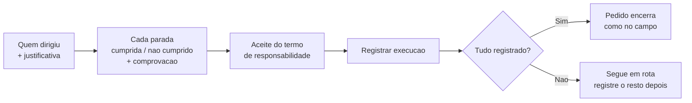

# Execução em lote (retroativa)

A **execução em lote** é o jeito de registrar, **pela web e de uma vez**, um roteiro que **já aconteceu** na rua. Em vez de acompanhar parada a parada em tempo real, você passa pela lista de paradas e marca o que de fato ocorreu — entregue, retirado ou não cumprido — e o pedido caminha de *planejado* a *executado* na mesma operação.

É a alternativa à [execução em campo](execucao-em-campo.md): o motorista nem sempre tem o app na mão no momento da entrega. Quando a viagem foi feita "no papel" ou combinada por fora, alguém do escritório **lança depois** o que aconteceu — sem deixar o pedido travado em aberto.


**Na web e também no app.** A execução passo a passo acompanha a rota enquanto ela acontece, com a localização do aparelho. O lote é o caminho para registrar uma rota **depois** que ela já aconteceu — um recurso separado, para quem tem a permissão. No detalhe do roteiro, o botão **Executar** pergunta *"Como deseja registrar a execução?"* e oferece **Registro em lote** (quando você tem os dois jeitos). No celular, a tela de execução também traz, antes de iniciar, o atalho *"Sem tempo real agora? Registrar em lote (sem GPS)"* — útil para quem está só com o telefone na mão e não vai acompanhar parada a parada.


## Quando usar o lote

O lote existe para o **registro retroativo**: a operação já foi feita, você só precisa que o sistema reflita isso. Casos típicos:

* O motorista entregou sem o app aberto (sinal ruim, celular sem bateria, viagem combinada de última hora).
* A entrega foi feita por um parceiro ou terceiro que não usa o app.
* O pedido ficou "preso" em aberto na logística e você precisa fechar o ciclo pelo escritório.


**O lote não substitui o campo.** Sempre que der, use a execução passo a passo (no app ou no navegador) — ela registra a localização de cada parada e a comprovação na hora, protegendo o seu dinheiro. O lote é para o que **já passou**, sem essa rede de segurança.


## Quem pode registrar em lote

O registro retroativo é uma ação **sensível** — afinal, você está afirmando que algo aconteceu sem o sistema ter visto acontecer. Por isso ela é **restrita por permissão**:

* Vai para a **gestão e a operação interna** (perfis como Operador / Atendente, e o Superadmin) — quem planeja a rota também pode registrar o que aconteceu offline.
* Vai também para o **Parceiro Externo**, para os pedidos repassados a ele: como a logística daqueles pedidos é dele, ele fecha por lote o que já aconteceu. Veja [Parceiro Logístico Externo](../parcerias/parceiro-logistico-externo.md).
* **Não** vai para o **motorista**: quem está na rua executa passo a passo, não retroativamente.

Quem não tem a permissão simplesmente não vê o caminho do lote. Veja [Papéis, funções e competências](../conceitos/papeis-funcoes-competencias.md).


**O lote está no plano Starter.** Planejar, atribuir, otimizar, executar roteiros com prova de entrega e registrar em lote fazem parte do Starter. O plano **Pro** acrescenta o tempo real — a localização ao vivo dos entregadores e o andamento da rota com o trânsito do momento —, além de recursos como a gestão de frota e os fornecedores de frete. Confira em [Minha assinatura e créditos](../configuracoes/assinatura-e-creditos.md#planos-por-nivel).


## Quem dirigiu: o condutor do registro

O topo da tela de lote traz **Quem dirigiu (condutor)** — o registro fica no nome dele. O campo já vem preenchido com o **condutor do planejamento** (ou com você, se o planejamento não tinha condutor):

* **Quem enxerga todos os roteiros** (a retaguarda) pode trocar o condutor por quem de fato dirigiu. Ao escolher outra pessoa, ela passa a ser a **responsável pelo roteiro**, e o titular fica na equipe como acompanhante.
* **O motorista responsável** (ou o parceiro, no roteiro dele) vê o condutor **fixo**: *"O registro sai no nome do responsável pelo roteiro. Para trocar o condutor, peça ao operador."*

O lote **não pergunta a placa**: o registro fica sem veículo — a tela mostra o veículo do planejamento só como referência. Por isso uma rota lançada em lote não aparece na consulta de [uso do veículo](acompanhando-roteiros.md#uso-do-veiculo).


**Roteiro não pode ser do futuro.** Assim como na [execução em campo](execucao-em-campo.md), você não registra em lote um roteiro planejado para **muito à frente** — a saída prevista tem que estar a, no máximo, **12 horas** no futuro. Faz sentido: o lote é para o que **já aconteceu**, e algo que só sai daqui a dias ainda não aconteceu. Roteiros no horário ou **atrasados** podem ser registrados normalmente.


## Como funciona, passo a passo

```mermaid
flowchart LR
    COND[Quem dirigiu<br/>+ justificativa] --> PAR[Cada parada<br/>cumprida / nao cumprido<br/>+ comprovacao]
    PAR --> TERMO[Aceite do termo<br/>de responsabilidade]
    TERMO --> REG[Registrar execucao]
    REG --> TUDO{Tudo registrado?}
    TUDO -->|Sim| FIM[Pedido encerra<br/>como no campo]
    TUDO -->|Nao| SEGUE[Segue em rota<br/>registre o resto depois]
```

A tela segue essa ordem: **quem dirigiu**, a **justificativa**, **o que aconteceu em cada parada** (com a comprovação de cada uma) e, por último, o **termo de responsabilidade** e o botão **Registrar execução**.

## A justificativa é obrigatória

Antes de salvar, você precisa **explicar por que está registrando em lote** — sem tempo real. É um campo de texto livre, e o sistema não deixa concluir sem ele.

> *Ex.: execução feita em campo; lançando agora pelo escritório.*

Essa justificativa fica **gravada no histórico** da operação, junto de **quem** registrou e **quando**. É o que dá rastreabilidade a um registro que, por natureza, não tem a prova automática do GPS.

## O que aconteceu em cada parada

A lista mostra **cada parada do roteiro**, na ordem planejada, com o código do pedido, o cliente e o endereço. Para cada uma, você escolhe entre dois desfechos:

* **Entregue / Retirado** — a parada se concretizou. (O rótulo muda conforme a parada seja de entrega ou de retirada.)
* **Não cumprido** — a parada não aconteceu.

Ao marcar **Não cumprido**, o sistema pede o **motivo**:

| Motivo | Quando usar |
| --- | --- |
| **Não atendeu** | Ninguém respondeu no local. |
| **Endereço não encontrado** | O ponto de entrega não foi localizado. |
| **Cliente ausente** | O cliente não estava para receber/entregar. |
| **Recusou** | O cliente recusou o material. |
| **Outro** | Qualquer outro caso — exige uma **descrição** do que impediu. |

O motivo é **obrigatório** em toda parada não cumprida, e a descrição é obrigatória quando você escolhe **Outro**. Esses motivos são os mesmos do campo, então o histórico fica consistente entre as duas formas de executar.


Uma parada **não cumprida** não é um erro — é informação. Ela registra que aquele movimento falhou e abre caminho para uma nova tentativa, exatamente como acontece quando o motorista pula uma parada na rua.


## A comprovação segue a política da sua empresa 

No lote vale **a mesma política de comprovação** da execução em campo (a que você define nos [motores operacionais](../configuracoes/motores-operacionais.md#motor-de-logistica)), **parada a parada**:

* **A política exige foto ou vídeo?** Cada parada cumprida precisa da sua prova. O card mostra o que falta (*"Falta comprovar: …"*) e o botão **Registrar comprovação deste movimento**. Enquanto alguma parada estiver sem a prova exigida, o botão final diz **Registre a comprovação exigida** e não avança.
* **A política não exige nada?** A prova é opcional: **Anexar evidência deste movimento (opcional)**, para quem tiver a foto em mãos.
* **Parada não cumprida** não precisa de prova.

A evidência **pertence ao próprio movimento**: a foto de uma parada nunca vale pela outra.


**Não tem como comprovar o que já passou? Dispensa justificada.** Quem tem a permissão de dispensar evidência encontra, na própria parada, **Não consegui comprovar — dispensar com justificativa**, e escreve o motivo — obrigatório; uma dispensa aberta e vazia não passa. O motivo fica gravado com **quem** registrou e **quando**, e o roteiro passa a mostrar quantas paradas fecharam sem prova. Quem não tem a permissão vê: *"Você não tem permissão para dispensar a evidência: peça a dispensa a quem tem, ou ajuste a política."* Veja [dispensar a evidência](../configuracoes/colaboradores-e-acessos.md#dispensar-evidencia).



**Sem GPS e sem geofence.** O lote não confere se a equipe estava no endereço certo nem a hora em que cada coisa aconteceu. Por isso ele é "menos seguro" que o campo — e por isso a justificativa e o termo são cobrados. Para a rastreabilidade completa (localização + prova na hora), use a [execução em campo](execucao-em-campo.md).


## O termo de responsabilidade 

Antes do botão, um cartão explica, em quatro pontos, o que o registro faz — **"Antes de registrar, entenda o que isso faz"**:

* você está registrando algo que **já aconteceu** — os horários e resultados são os que você informar;
* o sistema **não confere GPS nem hora** em tempo real neste modo;
* vale como a **execução oficial**: atualiza pedidos, estoque e cobranças;
* fica **gravado no seu nome**, com data e hora do registro.

Para registrar, marque **"Li e aceito. Entendo que esta confirmação é uma execução real, não uma edição do planejamento."** Enquanto isso não for feito, o botão diz **Aceite o termo para registrar** e não avança.

## Registrar aos poucos: o lote incremental

Você **não precisa** ter certeza de tudo de uma vez. O lote é **incremental**: marque o que já sabe, toque em **Registrar execução** e volte depois para lançar o restante.

O segredo é que o sistema **registra apenas o que ainda está pendente** e **preserva o que já foi registrado**. Ou seja:

* O que você já confirmou numa rodada anterior fica **congelado** — não é reescrito, mesmo que a tela mostre tudo de novo.
* Numa segunda rodada, só os movimentos **ainda em aberto** são gravados com o desfecho que você marcar.

Isso vale inclusive quando a viagem **começou no campo** e ficou pela metade: você pode **terminar pela web** o que faltou registrar, sem reiniciar nada.


**Não dá para "reeditar o feito".** Como o já registrado é imutável, você lança com tranquilidade aos poucos: nenhuma rodada nova apaga ou altera o que foi confirmado antes. Para corrigir um pedido que mudou de verdade, veja [Quando um pedido muda depois de fechado](quando-um-pedido-muda.md).


## Encerra o pedido igual ao tempo real

Aqui está o ponto que importa: **o lote fecha o ciclo da mesma forma que o campo**. Quando você registra um movimento em lote, ele dispara exatamente os mesmos efeitos da execução em tempo real — o status logístico do pedido avança, a [conferência](conferencia.md) é acionada (na locação, se estiver ligada), o pedido finaliza quando deve.

A diferença está no **fechamento da viagem**:

* Se **todos** os movimentos do roteiro foram registrados na operação, a execução é **encerrada** (retorno ao galpão) — e o pedido segue para a finalização como no campo.
* Se **ainda falta** registrar alguma parada, o roteiro permanece **em rota**, pronto para você lançar o restante depois.

Em outras palavras: **registrar tudo de uma vez finaliza o pedido na mesma operação**, sem nenhum passo extra.

## Lote x tempo real

| | Execução em campo | Execução em lote |
| --- | --- | --- |
| **Onde** | Aplicativo ou navegador | Web — e também no app, no celular |
| **Quando** | Durante a viagem, ao vivo | Depois que a viagem aconteceu |
| **Localização (GPS)** | Registra chegada e saída | Não usa |
| **Comprovação (foto/vídeo)** | Conforme a política da empresa | Conforme a política da empresa — ou dispensa justificada |
| **Justificativa e termo** | Não exigidos | **Obrigatórios** |
| **Quem faz** | O motorista responsável (e a retaguarda) | Gestão / operação interna — e o parceiro externo, nos pedidos dele |
| **Resultado** | Fecha o ciclo do pedido | Fecha o ciclo do pedido (idêntico) |

As duas chegam ao mesmo lugar — um pedido executado e finalizado. O que muda é **como** e **quando** você registra.

## Quando o lote trava

Há uma situação em que o lote **não deixa** registrar uma parada: quando aquele movimento foi **superado por uma mudança no pedido** depois de fechado. Se o cliente alterou datas, itens ou responsabilidades e a logística ainda não foi re-sincronizada, registrar (mesmo retroativamente) ficaria desencontrado da realidade.

Nesse caso, o operador precisa **re-sincronizar o roteiro** antes — abrindo e ajustando o planejamento. É a mesma trava do campo. Entenda o cenário em [Quando um pedido muda depois de fechado](quando-um-pedido-muda.md).


Um roteiro **já concluído** também não aceita novo registro em lote — não há mais o que lançar. O lote serve para roteiros **em aberto** ou **pela metade**.


## Por porte

| Porte | Como você usa o lote |
| --- | --- |
| **Começando** | Provavelmente nem liga. Poucas entregas, feitas e fechadas na hora pelo próprio dono — sem necessidade de registro retroativo. |
| **Crescendo** | Vira a sua "rede de segurança". O motorista nem sempre lança tudo no app; o escritório fecha pela web o que ficou em aberto, sem deixar pedido preso. |
| **Estruturado** | Entra na rotina de fechamento: a operação interna registra rotas de parceiros, viagens offline e exceções, mantendo o sistema fiel ao que aconteceu na rua. |

## Situações reais

* **Entrega feita por quem não usa o LocFlow:** um terceiro fez as entregas e mandou as fotos pelo WhatsApp. No fim do dia, o operador abre o roteiro em lote, confere quem dirigiu, justifica "entrega via terceiro X", marca cada parada como entregue, anexa a foto de cada uma (a política da empresa exige), aceita o termo e registra — o pedido fecha como se tivesse sido executado no app.
* **Sem foto de uma das paradas:** a política exige foto, mas uma das entregas não foi fotografada. Quem tem a permissão de dispensar abre **Não consegui comprovar — dispensar com justificativa** naquela parada e escreve o motivo ("confirmado por telefone com o cliente"). O roteiro registra que aquela parada fechou sem prova.
* **Parceiro externo fechando o dia:** o parceiro que recebeu os pedidos repassados fez as entregas sem o app aberto. Ele mesmo abre o roteiro dele em lote e registra o que aconteceu.
* **Viagem pela metade:** o motorista registrou as três primeiras paradas no campo e ficou sem sinal nas duas últimas. O escritório **completa pela web** só o que faltou; as três já registradas ficam intactas.
* **Lançamento aos poucos:** chegou só metade das confirmações da viagem. O operador registra o que sabe, salva, e volta no dia seguinte para lançar o restante — quando tudo é marcado, o pedido finaliza.
* **Cliente recusou no lote:** uma das entregas não aconteceu porque o cliente recusou. O operador marca **Não cumprido → Recusou**; o motivo fica no histórico e abre a porta para uma nova tentativa.

## Próximo passo

Compare com a [Execução em campo](execucao-em-campo.md), entenda o destino do material em [Conferência na devolução](conferencia.md) ou reveja o caminho completo em [Visão geral da logística](visao-geral.md).
