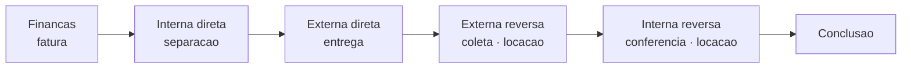

# A jornada de um pedido (Ver Logística)

A tela **Ver Logística** é o **acompanhamento** de um pedido: ela mostra, num só lugar, onde o material está, o que está acontecendo **agora** e **de quem é a vez** — sua equipe ou o cliente. É a "tela de rastreio" do orçamento, do galpão até o cliente e, na [locação](../primeiros-passos/glossario.md), de volta.

Não confunda com o [planejamento do roteiro](planejando-o-roteiro.md): lá você **monta** a viagem (paradas, ordem, veículo, quem vai). Aqui você só **olha** como o pedido caminha — uma visão de leitura, com um botão de avanço aparecendo apenas quando há algo a fazer e você tem permissão.


**Por que isso te ajuda:** quando qualquer pessoa da equipe abre o pedido e entende na hora "o material já saiu", "está com o cliente" ou "falta conferir a volta", ninguém precisa ligar para o motorista nem adivinhar o status. Menos retrabalho, menos pedido esquecido no meio do caminho.


## Como você chega aqui

Abra um orçamento ganho e, nas **ações rápidas**, toque em **Ver Logística**. A tela carrega a jornada daquele pedido — o título traz o código do orçamento e o nome do cliente, e um selo indica se é **Aluguel** ou **Venda**.

## O mapa da rota (topo da tela)

No alto fica um **mapa animado** da operação: o **Galpão** de um lado, o **Cliente** do outro, e entre eles uma ou duas trilhas que se preenchem conforme o pedido avança.

* A trilha de **IDA** (roxa) é o caminho do material **até o cliente**.
* A trilha de **VOLTA** (âmbar) aparece **só na locação** — é o retorno dos itens ao galpão.
* Um **ícone deslizante** marca onde o material está agora. Ele **pulsa** quando há um veículo de fato na rua (entrega ou coleta).
* Quando o cliente **retira ou devolve no balcão** (sem transporte da equipe), a trilha vira **tracejada** — um aviso visual de "sem viagem, o cliente vem ao galpão".
* O pino do **Cliente** acende quando o material já chegou (ou está) com ele.

Cada trilha traz uma etiqueta do modo: *Entrega ao cliente* ou *Retirada no balcão* na ida; *Coleta pela equipe* ou *Devolução no balcão* na volta.


O botão **Como funciona**, no canto do mapa, abre uma explicação da operação inteira — escrita conforme o seu caso (venda ou aluguel, com ou sem separação, retira no balcão ou recebe em casa). Use sempre que a configuração daquele pedido não estiver óbvia.


## A jornada por fases

Abaixo do mapa, o pedido aparece como uma **linha do tempo** dividida em fases. Cada fase agrupa as etapas daquele trecho da operação:

| Fase | O que acontece | Quando aparece |
| --- | --- | --- |
| **Finanças** (etapa zero) | A fatura é gerada antes de a logística começar | Sempre |
| **Logística interna** | [Separação](separacao.md) dos itens no galpão | Só se a separação estiver ligada |
| **Logística externa** | A entrega ao cliente (ou a retirada no balcão) | Sempre |
| **Logística externa reversa** | A coleta dos itens com o cliente (ou devolução no balcão) | Só na locação |
| **Logística interna reversa** | A [conferência](conferencia.md) do que voltou | Só na locação, se ligada |
| **Conclusão** | O ciclo logístico encerrado | Sempre |

Cada fase tem um cabeçalho com uma **pílula de direção**: **IDA** (roxa) para o caminho ao cliente, **VOLTA** (âmbar) para o retorno. E um botão **?** que abre **O que é esta fase** — uma explicação curta daquele trecho, com os status que ele pode ter.


**A jornada se adapta ao pedido.** Numa **venda**, não há fases de volta — termina na entrega. Sem separação ligada, a fase **Logística interna** simplesmente não aparece. Você só vê o que aquele pedido realmente percorre. Veja [Locação e venda](../conceitos/locacao-e-venda.md).


### O estado de cada etapa

Cada etapa da linha do tempo carrega um selo que diz em que pé ela está:

* **Concluída** — já aconteceu (marca verde de confirmação).
* **Acontecendo agora** — a etapa atual, com um anel pulsante chamando a atenção.
* **A fazer** — ainda vai acontecer (neutra, em cinza).

## "Acontecendo agora": o que de fato está em curso

Aqui está a ideia mais importante da tela. O **"acontecendo agora"** não é o nome de um status parado — é o **processo vivo** entre o que já aconteceu e o próximo passo, sempre escrito **no gerúndio**.

A lógica por trás é simples: **quando uma etapa é marcada, ela já virou passado.** "Entregue" é um fato consumado. O que está realmente em curso é o que vem **depois** dele. Por isso a tela calcula o "agora" a partir da **transição** (etapa atual → próxima), e não do rótulo isolado.

Na prática, isso produz frases vivas:

| Situação | O que a tela mostra como "acontecendo agora" |
| --- | --- |
| Itens sendo preparados no galpão | **Separando no galpão** |
| Veículo na rua levando os itens | **A caminho do cliente** |
| Itens já entregues, em locação | **Em locação — aguardando devolução** (ou coleta) |
| Separado, cliente vai buscar | **Aguardando o cliente no balcão** |
| Equipe indo recolher na locação | **A caminho para coletar** |
| Itens coletados, voltando | **Retornando ao galpão** |
| Conferindo o retorno no galpão | **Conferindo o retorno** |


É por isso que você nunca verá a contradição "Entregue — etapa atual". Quando o marco já aconteceu (entregue, devolvido, coletado), a tela mostra esse marco como **concluído** e abre, logo abaixo, o que está **realmente** acontecendo agora — por exemplo, *Em locação — aguardando a devolução*.


## De quem é a bola: o selo de responsabilidade

Toda etapa **acontecendo agora** ganha também um **selo de responsabilidade** — um indicador de **com quem está a operação neste momento**. É o que separa "a gente precisa agir" de "estamos esperando o cliente".

| Selo | O que significa | Cor |
| --- | --- | --- |
| **Com a equipe** | A equipe está trabalhando no galpão (separando, conferindo, planejando o despacho) | Roxo |
| **Em trânsito** | Há um veículo da operação na rua (entrega ou coleta) | Roxo |
| **Aguardando o cliente** | O material está pronto e a equipe só espera o cliente vir ao balcão | Âmbar |
| **Com o cliente** | Numa locação, os itens estão em posse do cliente durante o período | Âmbar |
| **Aguardando** | Antes da logística começar (aguardando a fatura) ou em estado de espera | Âmbar |

A leitura de cor é direta: **roxo = a bola é sua** (alguém da operação precisa ou está agindo); **âmbar = a bola é do cliente** (você está esperando o cliente retirar, usar ou devolver). Esse eixo deixa explícito quando **não há nada a fazer da sua parte** — você não está atrasado, está aguardando.


Esse selo é só de **acompanhamento** — ele descreve a situação, não muda nada no pedido. Ele aparece apenas nas etapas em andamento; etapas já concluídas ou futuras não o exibem.


## Avançar a etapa (quando dá e quando some)

Na etapa **acontecendo agora**, quando há um próximo passo acionável, a tela mostra um **botão de avanço**. O rótulo muda conforme o que falta fazer:

* **Separar no galpão** — leva à [fila de separação](separacao.md).
* **Planejar entrega** / **Planejar retirada** — abre o [roteiro](planejando-o-roteiro.md) daquele despacho.
* **Conferir retorno** — leva à [fila de conferência](conferencia.md).
* **Confirmar no balcão** — registra ali mesmo a retirada ou devolução pelo cliente (quando não há viagem).

A maioria desses botões **leva você até a tela certa** para agir; só a confirmação no balcão acontece direto aqui na tela.


**Quem não tem permissão para aquela etapa vê "Somente leitura nesta etapa"** no lugar do botão — a jornada continua visível para todos, mas só avança quem tem a competência. Veja [Papéis, funções e competências](../conceitos/papeis-funcoes-competencias.md).


### A confirmação no balcão

Quando o cliente **retira ou devolve no galpão** (sem transporte da equipe), a etapa externa vira um **balcão**: a tela mostra "Sem transporte · cliente retira (ou devolve) no balcão". O operador toca em **Confirmar no balcão** para registrar o atendimento.

Se o seu [motor de logística](../configuracoes/motores-operacionais.md) exigir **comprovação**, a tela abre uma folha para capturar a evidência (por exemplo, uma foto) antes de confirmar. Sem essa exigência, a confirmação é em um toque. O sistema registra **quando o cliente chegou** e o **tempo de atendimento**, que ficam visíveis na etapa depois de concluída.

## Finanças e conclusão: as pontas da jornada

A linha do tempo é cercada por duas etapas que não são de transporte, mas fazem parte do ciclo:

* **Finanças (etapa zero)** — antes de qualquer movimento, o financeiro gera a fatura. Enquanto ela não sai, o pedido fica em **Aguardando fatura** e a logística não começa. Quando a fatura é emitida, a logística **inicia sozinha**. Veja a opção de [exigir a fatura antes de despachar](visao-geral.md#exigir-fatura-antes-de-iniciar-a-logistica).
* **Conclusão** — quando todos os movimentos previstos aconteceram, a operação é dada como **finalizada** (numa venda, itens entregues; num aluguel, itens de volta ao galpão).


A fatura apenas **registra uma cobrança em aberto** — não significa que o cliente já pagou. A etapa de Finanças marca que a cobrança existe, liberando a logística; o pagamento corre em paralelo, em [Cobranças](../cobranca/lista-de-cobrancas.md).


## Por porte

A mesma tela serve quem está começando e quem opera em escala — ela revela só o que o seu pedido realmente percorre.

| Porte | Como a jornada aparece |
| --- | --- |
| **Começando** | Poucas fases: Finanças → entrega → conclusão. Sem separação, sem conferência, sem volta numa venda. Acompanhamento enxuto. |
| **Crescendo** | Separação ligada e, na locação, conferência: a jornada ganha as fases internas, e o selo de responsabilidade ajuda a equipe a saber de quem é a vez. |
| **Estruturado** | Operação completa de ida e volta, com balcão, comprovação exigida e papéis dedicados — cada etapa só avança por quem tem permissão. |

## Situações reais

* **Venda no balcão:** Finanças → separação (se ligada) → o cliente retira no balcão → conclusão. O selo passa de **Com a equipe** para **Aguardando o cliente**, e a confirmação no balcão fecha o ciclo.
* **Locação de evento:** entrega na véspera (**Em trânsito**), depois **Com o cliente — aguardando a coleta** durante o evento, **Retornando ao galpão** na coleta e **Conferindo o retorno** no fim. Você vê em qual ponto exato está, sem ligar para ninguém.
* **Cliente sumiu para retirar:** o selo fica **Aguardando o cliente** em âmbar — fica claro que a bola é dele, não um atraso da sua operação.
* **Mudou o pedido depois de fechado:** se a entrega for ajustada, a jornada reflete o novo caminho — entenda em [Quando um pedido muda depois de fechado](quando-um-pedido-muda.md).

## Próximo passo

Veja [Separação no galpão](separacao.md), [Planejando o roteiro](planejando-o-roteiro.md), [Execução em campo](execucao-em-campo.md) ou [Conferência na devolução](conferencia.md). Para o panorama do fluxo, reveja [O ciclo de um pedido](../conceitos/ciclo-de-um-pedido.md).
