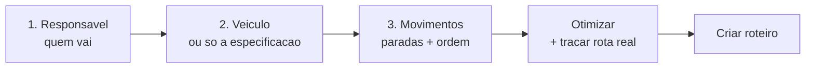
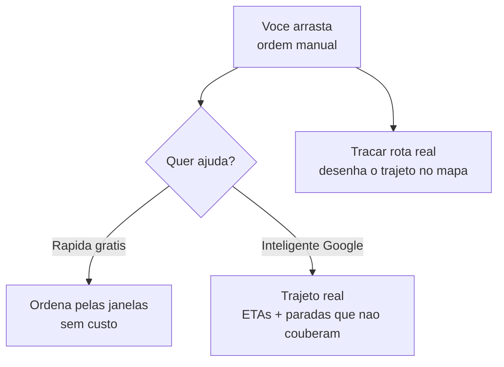

# Planejando o roteiro

Um **roteiro** é a sequência de paradas de uma viagem: as entregas e retiradas que a equipe vai cumprir, na melhor ordem, com quem vai e em qual veículo. Planejar com antecedência é o que transforma várias entregas soltas em **uma viagem só, bem aproveitada**.

O planejamento acontece em **três passos**, sempre com o mapa à vista. Você não preenche um formulário longo: vai tocando os pinos, ajustando a ordem e o app vai mostrando o que dá para melhorar.


**Por que isso te faz faturar mais:** agrupar entregas próximas numa rota só corta viagem repetida, combustível e horas da equipe. Com a ordem otimizada e o veículo certo, o mesmo motorista cumpre mais paradas no mesmo dia — você entrega mais sem contratar mais.


## Os três passos

### Passo 1 — Responsável

Você define quem responde pela viagem. Pode ser **você mesmo** (quando é você que vai dirigir/acompanhar) ou **outro colaborador**. Esse responsável é o **condutor** do roteiro.

Em seguida, você pode somar **acompanhantes** — a equipe que vai junto na viagem (ajudantes de carga, por exemplo). O condutor entra automaticamente na equipe; os acompanhantes são opcionais.


Quem aparece para escolher são os [colaboradores](../configuracoes/colaboradores-e-acessos.md) da sua empresa. Um colaborador marcado como apto a dirigir mostra **"Dirige veículos"** ao lado do nome — ajuda a não escalar como condutor alguém que só vai acompanhar.


### Passo 2 — Veículo

Aqui você diz **em que o material vai**. Há três caminhos, do mais específico ao mais flexível:

| Você escolhe | O que acontece | Quando usar |
| --- | --- | --- |
| **Um veículo específico** | A rota já nasce com a placa definida. | Você sabe exatamente qual carro vai. |
| **Só a especificação** | Você indica o tipo de veículo (marca/modelo/ano) sem travar a placa. | Tanto faz qual carro, desde que seja daquele tipo — quem executa escolhe na hora. |
| **Nenhum** | A rota fica sem veículo definido. | Ainda não decidiu, ou quem vai resolver isso é o motorista no campo. |

Por padrão, o app já **sugere o veículo-padrão do condutor**, se ele tiver um. Você troca quando quiser. Se preferir não amarrar a placa, ligue a opção de informar **só a especificação**.


Definir o veículo (ou ao menos a especificação) ajuda no passo seguinte: o app consegue avaliar se a carga **cabe** no que você escolheu. Sem nenhum dos dois, essa conferência não aparece. Veja [Frota](../cadastros/frota.md).


### Passo 3 — Movimentos e ordem

Este é o coração do planejamento. No mapa, cada pino é um **movimento** (uma entrega ou uma retirada) que está esperando para ser roteirizado. Você monta a rota assim:

* **Toque nos pinos** para adicionar paradas à rota. O **primeiro** movimento define o **galpão de origem**; os demais precisam sair do mesmo galpão.
* Use o **filtro de data** (Hoje, Amanhã, 7 dias, Período ou Tudo) para ver no mapa só o que cai no dia que você está planejando.
* Use o **laço** para cercar uma área no mapa e adicionar de uma vez todos os movimentos ali dentro.
* Pontos no mesmo endereço aparecem agrupados — toque para adicionar ou remover cada um.

À medida que você seleciona, a parte de baixo da tela mostra a **ordem da rota**: a lista numerada das paradas.

#### Endereços sem localização no mapa

Um movimento só aparece como pino se o endereço dele já tiver **coordenadas**. Quando algum não tem, o app avisa no topo (**"X sem localização no mapa"**) e oferece **Resolver** — ele busca as coordenadas pelo endereço. Cada endereço novo resolvido consome **1 crédito** (movimentos no mesmo endereço contam como um só; endereços já resolvidos antes não custam nada).


Resolver localização usa o mapa do Google e por isso consome créditos. Endereços que você já resolveu ficam guardados — da próxima vez, saem de graça. Veja [Minha assinatura e créditos](../configuracoes/assinatura-e-creditos.md).


## A ordem da rota

A ordem das paradas é **arrastável**: segure um item da lista e arraste para cima ou para baixo. Mas você não precisa fazer tudo na mão — o app ajuda em três níveis.

### Otimização rápida (grátis)

Toque em **Otimizar** e escolha **Rápida (grátis)**. O app reordena as paradas priorizando as **janelas de horário** que fecham antes — ou seja, atende primeiro quem precisa ser atendido mais cedo. É instantâneo e **não consome créditos**.

### Otimização inteligente (Google)

A opção **Inteligente (Google)** vai além: usa o mapa real para calcular a **melhor sequência pelo trajeto** (não só pelas janelas), **desenha a rota no mapa** e calcula os **ETAs** (a previsão de horário de chegada em cada parada). Se alguma parada **não couber** no tempo ou nas janelas disponíveis, o app avisa e a deixa de fora da sequência, ao final da lista, para você decidir o que fazer.

Por usar o mapa do Google, ela **consome créditos** — o app sempre mostra **quanto pode custar** e pede sua confirmação antes de cobrar.


A otimização inteligente **cobra por parada**. Antes de confirmar, o app exibe "Esta ação usa até N crédito(s)" e o seu saldo atual. Você só paga depois de confirmar.


### Traçar rota real

Quer apenas **ver o trajeto desenhado no mapa** sem reordenar nada (mantendo a sua ordem manual)? Use **Traçar rota real**. Ele calcula o caminho real entre as paradas, na ordem que você definiu. Se você já tiver traçado esse mesmo trajeto antes, o app **reaproveita sem custo**.


Ao reordenar ou mudar as paradas, o traçado desenhado fica **desatualizado** e o mapa volta à linha reta — é só traçar de novo. Isso evita mostrar um caminho que já não corresponde à rota.


## A carga cabe no veículo?

Se você escolheu um veículo (ou a especificação) no passo 2, o app **avalia a capacidade** enquanto você monta a rota: ele soma o que vai ser transportado e compara com o que o veículo comporta. Essa avaliação é **um aviso, não um bloqueio** — quando algo não cabe, a parada crítica é destacada na lista para você decidir (tirar uma parada, dividir em duas viagens ou trocar o veículo).


Saber antes de sair que a carga não cabe evita a pior cena da operação: o motorista chega no cliente e descobre que faltou item no caminhão. Menos viagem perdida, menos cliente esperando, menos retrabalho.


## A ordem da rota por porte

A mesma tela atende quem está começando e quem já roda dezenas de entregas por dia. Você usa só o que precisa:

| Porte | Como costuma montar a ordem |
| --- | --- |
| **Pequeno** | Poucas paradas: arrasta na mão e pronto. A ordem manual já resolve. |
| **Médio** | Várias paradas com horários a respeitar: usa a **otimização rápida (grátis)** para ordenar pelas janelas. |
| **Grande** | Muitas paradas, tempo apertado e combustível pesando: usa a **inteligente (Google)** para o melhor trajeto, ETAs e ver o que não cabe no dia. |

## Roteiro planejado x sob demanda

O planejamento descrito aqui gera um **roteiro planejado** — você agrupa vários movimentos com antecedência. Quando precisar despachar **uma** entrega ou retirada na hora, a partir das ações rápidas do orçamento, o LocFlow cria um roteiro **sob demanda** reusando este mesmo fluxo, já com o movimento-alvo selecionado. A **execução em campo é idêntica** nos dois casos.

## Situações reais

* **Manhã de entregas:** filtra por **Hoje**, dá um laço na região do bairro, otimiza pela **rápida (grátis)** e sai com a sequência que respeita os horários combinados.
* **Dia cheio com tempo curto:** dez paradas, várias com janela apertada. Usa a **inteligente (Google)**: ela ordena pelo trajeto real, mostra que duas paradas não cabem antes do fim do expediente e você as joga para amanhã — em vez de descobrir isso no meio da rua.
* **Carro ainda indefinido:** monta a rota escolhendo **só a especificação** (um furgão). Na execução, o motorista pega o furgão que estiver livre.
* **Entrega que apareceu agora:** não dá para esperar o planejamento — despacha **sob demanda** direto do orçamento, e a viagem segue do mesmo jeito no campo.

## Próximo passo

Com a rota montada, é hora de colocar na rua: veja [Execução em campo](execucao-em-campo.md). Para entender onde o roteiro se encaixa no todo, veja a [Visão geral da logística](visao-geral.md) e o [ciclo de um pedido](../conceitos/ciclo-de-um-pedido.md).
