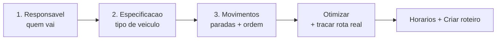
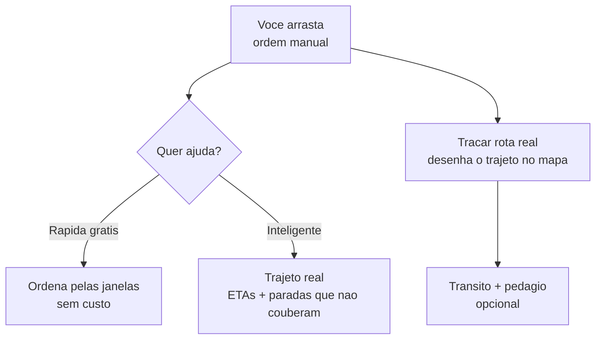

# Planejando o roteiro

Um **roteiro** é a sequência de paradas de uma viagem: as entregas e retiradas que a equipe vai cumprir, na melhor ordem, com quem vai e em qual veículo. Planejar com antecedência é o que transforma várias entregas soltas em **uma viagem só, bem aproveitada**.

O planejamento acontece em **passos**, sempre com o mapa à vista. Você não preenche um formulário longo: vai tocando os pinos, ajustando a ordem e o app vai mostrando o que dá para melhorar.


**Por que isso te faz faturar mais:** agrupar entregas próximas numa rota só corta viagem repetida, combustível e horas da equipe. Com a ordem otimizada e o veículo certo, o mesmo motorista cumpre mais paradas no mesmo dia — você entrega mais sem contratar mais.


## Os três passos

O coração do planejamento são três decisões — **quem vai**, **em que tipo de veículo** (a especificação) e **quais paradas, em que ordem** —, e por último você confere os **horários**.

### Passo 1 — Responsável

Você define quem responde pela viagem. Pode ser **você mesmo** (quando é você que vai dirigir/acompanhar) ou **outro colaborador**. Esse responsável é o **condutor** do roteiro — quem vai dirigir e tocar a operação.

Em seguida, você pode somar **acompanhantes** — a equipe que vai junto na viagem (ajudantes de carga, conferentes). O condutor entra automaticamente na equipe; os acompanhantes são opcionais.


Quem aparece para escolher são os [colaboradores](../configuracoes/colaboradores-e-acessos.md) da sua empresa. Um colaborador apto a dirigir mostra **"Dirige veículos"** ao lado do nome (e a etiqueta **"Dirige"** na lista da equipe) — ajuda a não escalar como condutor alguém que só vai acompanhar.


#### O aviso de condutor (CNH e competência)

Quando você escolhe **outro colaborador** como responsável, o app verifica se ele está realmente pronto para dirigir e, se algo estiver pendente, mostra um **aviso âmbar** abaixo da escolha. O aviso aparece quando o colaborador:

* **não tem a competência de dirigir** — nenhuma das funções dele inclui "Dirigir Veículos"; **e/ou**
* **está com a CNH vencida** — a habilitação está cadastrada, mas a validade já passou; **ou**
* **não tem CNH cadastrada**.

O texto vem pronto, por exemplo: *"Fulano não tem a competência de dirigir e está com a CNH vencida. Dá para prosseguir e montar o roteiro, mas regularize isso antes da execução."*


Esse aviso **não impede** nada — você pode planejar o roteiro normalmente. Ele é um lembrete para você **regularizar antes de a equipe pôr o pé na estrada**: ajustar a função do colaborador ou atualizar a CNH dele no cadastro. A competência de dirigir e a validade da CNH vêm de [Colaboradores e acessos](../configuracoes/colaboradores-e-acessos.md).


### Passo 2 — Especificação

No planejamento você diz **o tipo de veículo** — a **especificação** (marca/modelo/ano, com a vistoria e a capacidade dela) —, **não a placa**. Escolher qual carro exatamente vai é uma decisão do **dia da operação** (depende de qual está livre, abastecido, sem manutenção), então ela fica para a **execução**, não para o planejamento.

E por que a especificação já basta aqui? Porque é dela que vêm a **capacidade** (se a carga cabe) e a **vistoria** — tudo o que o planejamento precisa avaliar. A placa não muda nada disso.

| No planejamento | Na execução (PrepararSaída) |
| --- | --- |
| Você escolhe **a especificação** (ou deixa em branco). | O app resolve **a placa** automaticamente. |

A especificação é **opcional**: sem ela, o app só não consegue avaliar a carga no passo seguinte (segue com um aviso).


**Como a placa é resolvida na execução.** Ao preparar a saída, o app sugere o veículo nesta ordem: **(1)** o **veículo-padrão do motorista**, se ele tiver um; **(2)** senão, o **último veículo que ele usou**; **(3)** senão, ele **seleciona na hora**. As sugestões respeitam a especificação do planejamento. Veja [Execução em campo](execucao-em-campo.md).



Definir a especificação ajuda no passo seguinte: o app consegue avaliar se a carga **cabe**. Sem ela, essa conferência não aparece. Veja [Especificações: capacidade](../cadastros/frota-capacidade.md).


### Passo 3 — Movimentos e ordem

Este é o passo central do planejamento. No mapa, cada pino é um **movimento** (uma entrega ou uma retirada) que está esperando para ser roteirizado. Você monta a rota assim:

* **Toque nos pinos** para adicionar paradas à rota. O **primeiro** movimento define o **galpão de origem**; os demais precisam sair do mesmo galpão.
* Use o **filtro de data** (Hoje, Amanhã, 7 dias, Período ou Tudo) para ver no mapa só o que cai no dia que você está planejando.
* Use o **laço** para cercar uma área no mapa e adicionar de uma vez todos os movimentos ali dentro. Só entram movimentos do mesmo galpão de origem.
* Pontos no mesmo endereço aparecem agrupados — toque para adicionar ou remover cada um.

À medida que você seleciona, o painel mostra a rota como uma **linha do tempo**, no jeito de um app de mapas: começa na **Saída do galpão**, desce pelas **paradas numeradas** na ordem definida e fecha no **Retorno ao galpão**. Entre cada ponto aparece a **distância e o tempo** do trecho — inclusive do galpão até a primeira parada e da última de volta ao galpão (depois que você traça a rota real). Cada parada tem uma **alça** para arrastar e reordenar.

Cada parada também mostra a sua **carga**: o que a equipe vai **entregar** (descarregar) ou **retirar** (carregar) ali — produto/kit e quantidade —, e dá para ver isso já no **detalhe do movimento** (ao tocar ou passar o mouse no pino), **antes** de incluí-lo na rota. Com base nisso, a linha do tempo projeta a carga **planejada**: a **carga de saída** no galpão (tudo que será entregue), o **saldo a bordo após** cada parada e a **carga de retorno** no fim. Esses números são uma **estimativa do planejamento** (por isso o rótulo *planejado*) — o saldo **real** é o que a execução registra parada a parada.


**Um roteiro sai de um galpão só.** O **galpão de saída** é definido pelo primeiro movimento que você adiciona; os demais precisam sair do mesmo galpão (o app recusa os de outra origem com *"Sai de outro galpão"*). Movimentos de galpões diferentes viram **roteiros separados**. Entenda o porquê — e a visão futura de operação **multi-galpão** — em [Movimentos, janelas e galpão de origem](../orcamentos/movimentos-e-janelas.md#cada-carga-sai-de-um-galpao-so).


#### Endereços sem localização no mapa

Um movimento só aparece como pino se o endereço dele já tiver **coordenadas**. Quando algum não tem, o app avisa no topo (**"X sem localização no mapa"**) e oferece **Resolver** — ele busca as coordenadas pelo endereço. Cada endereço novo resolvido consome **1 crédito** (movimentos no mesmo endereço contam como um só; endereços já resolvidos antes não custam nada).


Resolver localização usa o mapa por trás do app e por isso consome créditos. Endereços que você já resolveu ficam guardados — da próxima vez, saem de graça. Veja [Minha assinatura e créditos](../configuracoes/assinatura-e-creditos.md).


## A ordem da rota

A ordem das paradas é **arrastável**: segure um item da lista e arraste para cima ou para baixo. Mas você não precisa fazer tudo na mão — o app ajuda em três níveis.

### Otimização rápida (grátis)

Toque em **Otimizar** e escolha **Rápida (grátis)**. O app reordena as paradas priorizando as **janelas de horário** que fecham antes — ou seja, atende primeiro quem precisa ser atendido mais cedo. É instantâneo e **não consome créditos**.

### Otimização inteligente

A opção **Inteligente** vai além: usa o mapa real para calcular a **melhor sequência pelo trajeto** (não só pelas janelas), **desenha a rota no mapa** e calcula os **ETAs** (a previsão de horário de chegada em cada parada). Se alguma parada **não couber** no tempo ou nas janelas disponíveis, o app avisa ("X parada(s) não couberam na jornada") e a deixa de fora da sequência, ao final da lista, para você decidir o que fazer.

Por usar o mapa real, ela **consome créditos** — o app sempre mostra **quanto pode custar** e pede sua confirmação antes de cobrar.


A otimização inteligente **cobra por parada**. Antes de confirmar, o app exibe "Esta ação usa até N crédito(s)" e o seu saldo atual. Você só paga depois de confirmar.


### Traçar rota real

Quer apenas **ver o trajeto desenhado no mapa** sem reordenar nada (mantendo a sua ordem manual)? Use **Traçar rota real**. Ele calcula o caminho real entre as paradas, na ordem que você definiu. Se você já tiver traçado esse mesmo trajeto antes, o app **reaproveita sem custo**.


Ao reordenar ou mudar as paradas, o traçado desenhado fica **desatualizado** e o mapa volta à linha reta — é só traçar de novo. Isso evita mostrar um caminho que já não corresponde à rota.


### Ver trânsito e pedágio

No mapa há um botão **Trânsito** (com ícone de velocímetro). Ligá-lo pede o **traçado enriquecido**: além do caminho real, o app mostra a rota **colorida por trânsito** — verde onde flui, amarelo e vermelho onde trava — e estima o **pedágio** do percurso. Com o Trânsito ligado, o botão de traçar passa a se chamar **"Traçar com trânsito"**.

Como a otimização inteligente sai **sem as cores de trânsito**, depois de otimizar o app oferece um atalho **"Ver trânsito"** para enriquecer aquela mesma rota otimizada com as cores e o pedágio.

O resumo da rota (no rodapé da lista de paradas) mostra o resultado em números reais: **distância**, **tempo** e, quando há, **o valor do pedágio**. Assim você vê que o crédito gasto virou informação útil para o dia.


**Ligar o botão "Trânsito" não cobra nada por si só.** A cobrança acontece quando você de fato **traça** a rota com trânsito (ou toca em "Ver trânsito") — e, como nas outras ações pagas, o app mostra "usa até N crédito(s)" e pede confirmação antes.


### Quando consome créditos

Para deixar claro o que é grátis e o que cobra no planejamento:

| Ação | Consome crédito? |
| --- | --- |
| Arrastar a ordem na mão | Não |
| **Otimização rápida** (pelas janelas) | Não |
| Ligar o botão **Trânsito** | Não (só liga o modo) |
| **Resolver localização** de um endereço novo | Sim — 1 por endereço novo |
| **Otimização inteligente** | Sim — por parada |
| **Traçar rota real** | Sim — por parada (e **grátis** se reaproveitar um traçado igual) |
| **Traçar com trânsito** / **Ver trânsito** | Sim — por parada |

Em toda ação paga, o app **mostra o quanto pode custar e o seu saldo antes**, e só cobra depois que você confirma. Se o saldo não cobrir, ele avisa em vez de tentar cobrar. Veja [Minha assinatura e créditos](../configuracoes/assinatura-e-creditos.md).

## A carga cabe no veículo?

Se você escolheu um veículo (ou a especificação) no passo 2, o app **avalia a capacidade** enquanto você monta a rota: ele soma o que vai ser transportado e compara com o que o veículo comporta. Essa avaliação é **um aviso, não um bloqueio** — quando algo não cabe, a parada crítica é destacada na lista para você decidir (tirar uma parada, dividir em duas viagens ou trocar o veículo).

O painel aparece **no topo do passo 3** e é **didático**: ele mostra a **estratégia escolhida** (contagem ou volume) e, ao expandir **"Como chegamos nessa estratégia"**, revela o passo a passo — por exemplo, *"contagem pulada porque a carga é mista (3 itens diferentes) → avaliada por volume → cabe"*. Quando não dá para verificar, ele diz o **motivo concreto** (baú aberto, baú fechado sem dimensões cadastradas, ou item sem limite) e o que fazer. Entenda as estratégias em [Especificações: capacidade](../cadastros/frota-capacidade.md).


Saber antes de sair que a carga não cabe evita a pior cena da operação: o motorista chega no cliente e descobre que faltou item no caminhão. Menos viagem perdida, menos cliente esperando, menos retrabalho.


## A ordem da rota por porte

A mesma tela atende quem está começando e quem já roda dezenas de entregas por dia. Você usa só o que precisa:

| Porte | Como costuma montar a ordem |
| --- | --- |
| **Pequeno** | Poucas paradas: arrasta na mão e pronto. A ordem manual já resolve. |
| **Médio** | Várias paradas com horários a respeitar: usa a **otimização rápida (grátis)** para ordenar pelas janelas. |
| **Grande** | Muitas paradas, tempo apertado e combustível pesando: usa a **inteligente** para o melhor trajeto, ETAs e ver o que não cabe — e liga o **Trânsito** para fugir dos pontos travados e prever pedágio. |

## Roteiro planejado x sob demanda

O planejamento descrito aqui gera um **roteiro planejado** — você agrupa vários movimentos com antecedência. Quando precisar despachar **uma** entrega ou retirada na hora, a partir das ações rápidas do orçamento, o LocFlow cria um roteiro **sob demanda** reusando este mesmo fluxo, já com o movimento-alvo selecionado. A **execução em campo é idêntica** nos dois casos.

## Situações reais

* **Manhã de entregas:** filtra por **Hoje**, dá um laço na região do bairro, otimiza pela **rápida (grátis)** e sai com a sequência que respeita os horários combinados.
* **Dia cheio com tempo curto:** dez paradas, várias com janela apertada. Usa a **inteligente**: ela ordena pelo trajeto real, mostra que duas paradas não cabem antes do fim do expediente e você as joga para amanhã — em vez de descobrir isso no meio da rua.
* **Cidade congestionada:** liga o **Trânsito** antes de traçar; vê a rota vermelha numa avenida e o pedágio do trecho, e decide sair mais cedo ou desviar.
* **Escalou quem não pode dirigir:** ao atribuir um colaborador como condutor, aparece o **aviso de CNH vencida**. Monta o roteiro mesmo assim e, antes da execução, atualiza a habilitação dele no cadastro.
* **Qual carro só se sabe no dia:** no planejamento você escolhe a **especificação** (um furgão); na execução, o app já sugere o **veículo-padrão** do motorista (ou o último que ele usou), e ele confirma a placa do furgão que estiver livre.
* **Entrega que apareceu agora:** não dá para esperar o planejamento — despacha **sob demanda** direto do orçamento, e a viagem segue do mesmo jeito no campo.

## Próximo passo

Com a rota montada, é hora de colocar na rua: veja [Execução em campo](execucao-em-campo.md). Antes de despachar, a equipe pode [separar o material no galpão](separacao.md). Para entender onde o roteiro se encaixa no todo, veja a [Visão geral da logística](visao-geral.md) e o [ciclo de um pedido](../conceitos/ciclo-de-um-pedido.md).
