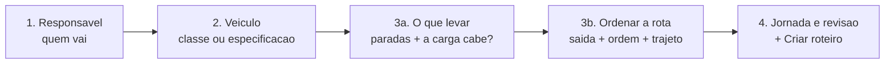
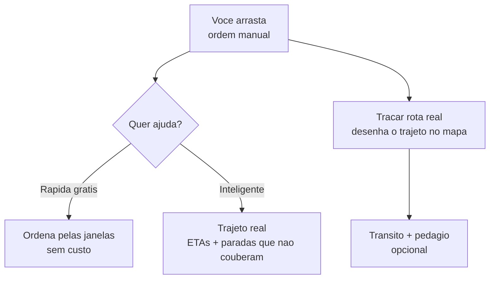

# Planejando o roteiro

Um **roteiro** é a sequência de paradas de uma viagem: as entregas e retiradas que a equipe vai cumprir, na melhor ordem, com quem vai e em qual veículo. Planejar com antecedência é o que transforma várias entregas soltas em **uma viagem só, bem aproveitada**.

O planejamento acontece em **passos**, sempre com o mapa à vista. Você não preenche um formulário longo: vai tocando os pinos, ajustando a ordem e o app vai mostrando o que dá para melhorar.


**Por que isso te faz faturar mais:** agrupar entregas próximas numa rota só corta viagem repetida, combustível e horas da equipe. Com a ordem otimizada e o veículo certo, o mesmo motorista cumpre mais paradas no mesmo dia — você entrega mais sem contratar mais.


## Os passos

O coração do planejamento são as decisões — **quem vai**, **em que tipo de veículo** (a classe ou a especificação) e **o que levar e em qual ordem** —, e por último a **jornada e a revisão**.

O passo dos **Movimentos** acontece em **dois momentos**, e o app te leva de um para o outro:

1. **O que levar** — você escolhe as paradas (os movimentos) e confere se a **carga cabe** no veículo.
2. **Ordenar a rota** — define a **saída**, coloca as paradas na **melhor ordem** e vê o **trajeto real** com tempos e informações.

Sempre que você **adiciona um movimento**, o app volta para o **"o que levar"** — porque mudou a carga, e faz sentido reconferir a capacidade antes de reordenar.

```mermaid
flowchart LR
    P1[1. Responsavel<br/>quem vai] --> P2[2. Veiculo<br/>classe ou especificacao]
    P2 --> P3a[3a. O que levar<br/>paradas + a carga cabe?]
    P3a --> P3b[3b. Ordenar a rota<br/>saida + ordem + trajeto]
    P3b --> P4[4. Jornada e revisao<br/>+ Criar roteiro]
```

### Passo 1 — Responsável

Você define quem responde pela viagem. Pode ser **você mesmo** (quando é você que vai dirigir/acompanhar) ou **outro colaborador**. Esse responsável é o **condutor** do roteiro — quem vai dirigir e tocar a operação.

Em seguida, você pode somar **acompanhantes** — a equipe que vai junto na viagem (ajudantes de carga, conferentes). O condutor entra automaticamente na equipe; os acompanhantes são opcionais.


Quem aparece para escolher são os [colaboradores](../configuracoes/colaboradores-e-acessos.md) da sua empresa. Um colaborador apto a dirigir mostra **"Dirige veículos"** ao lado do nome (e a etiqueta **"Dirige"** na lista da equipe) — ajuda a não escalar como condutor alguém que só vai acompanhar.


#### O aviso de condutor (CNH e competência)

Quando você escolhe **outro colaborador** como responsável, o app verifica se ele está realmente pronto para dirigir e, se algo estiver pendente, mostra um **aviso âmbar** abaixo da escolha. O aviso aparece quando o colaborador:

* **não tem a competência de dirigir** — nenhuma das funções dele inclui "Dirigir Veículos"; **e/ou**
* **está com a CNH vencida** — a habilitação está cadastrada, mas a validade já passou; **ou**
* **não tem CNH cadastrada**.

O texto vem pronto, por exemplo: *"Fulano não tem a competência de dirigir e está com a CNH vencida. Dá para prosseguir e montar o roteiro, mas regularize isso antes da execução."*


Esse aviso **não impede** nada — você pode planejar o roteiro normalmente. Ele é um lembrete para você **regularizar antes de a equipe pôr o pé na estrada**: ajustar a função do colaborador ou atualizar a CNH dele no cadastro. A competência de dirigir e a validade da CNH vêm de [Colaboradores e acessos](../configuracoes/colaboradores-e-acessos.md).


### Passo 2 — Veículo

No planejamento você diz **o tipo de veículo** — **não a placa**. Qual carro exatamente vai é uma decisão do **dia da operação** (depende do que está livre, abastecido, sem manutenção), então ela fica para a **execução**, não para o planejamento. Você define esse tipo de **duas formas**, e escolhe uma delas a cada roteiro:

| Forma | O que é | Quando escolher |
| --- | --- | --- |
| **Especificação exata** | Uma ficha específica (marca/modelo/ano, com a vistoria e a capacidade dela). | Quando importa qual modelo exatamente sai — por exemplo, só um veículo tem o baú do tamanho certo. |
| **Classe veicular** | Um **grupo** de especificações equivalentes — "qualquer veículo do grupo serve". | Quando vários modelos resolvem igualmente e você não quer prender o roteiro a uma ficha só. |

Nos dois casos a **placa não muda nada** do planejamento — ela só é resolvida na execução (veja abaixo). Sem escolher nenhuma das duas, o app só não consegue avaliar a carga no passo seguinte (segue com um aviso).

#### O que é uma classe veicular

Uma **classe** é uma **agregação de especificações** que você mesmo monta em [Frota](../cadastros/frota.md) — um jeito de dizer "estas fichas, para efeito de roteiro, são intercambiáveis". O critério do agrupamento é **seu**: você pode reunir especificações com a **mesma capacidade** (o caminho mais seguro, e o LocFlow chega a sugerir esse agrupamento sozinho) ou por **qualquer outro critério** que fizer sentido no seu negócio — nesse caso, assumindo o risco da escolha.

Além da capacidade, toda classe tem um **titular** — a sua organização, um fornecedor de frete ou um parceiro externo — e todas as fichas do grupo são desse mesmo titular. É por isso que escolher a classe no planejamento responde **duas** perguntas de uma vez: quanto cabe (a capacidade do grupo) e quem vai executar a viagem e por quanto (o titular).

*Exemplo:* você tem três picapes — uma 2019, uma 2021 e uma 2023 — que carregam exatamente o mesmo tanto de material. Em vez de escolher uma ficha específica a cada roteiro, você agrupa as três numa classe chamada "Picape" e passa a planejar só com "Picape": qualquer uma das três serve, e o app confere a carga pela capacidade que elas garantem em comum.


Como criar suas classes, o agrupamento livre e a sugestão automática do LocFlow (quando duas especificações têm a mesma capacidade) ficam em [Classes veiculares](../cadastros/frota-classes.md). Aqui o foco é como a classe entra na **montagem do roteiro**.


#### Como a classe confere a carga

Como uma classe pode reunir fichas com capacidades diferentes, o painel **"a carga cabe?"** (veja [mais abaixo](#a-carga-cabe-no-veiculo)) se ajusta ao que o grupo de fato garante:

| Situação da classe | Como a carga é conferida |
| --- | --- |
| **Capacidade verificada** — duas ou mais especificações com a mesma capacidade | A carga é conferida **por inteiro**, como se fosse uma especificação só. |
| **Capacidade mista — vale a menor** — as especificações têm capacidades diferentes entre si | A carga é conferida pela **menor capacidade** do grupo (o piso) — a única garantia que vale para **qualquer** veículo dele. O app avisa quando é esse o caso. |
| **Uma ficha só** — a classe tem uma única especificação | O app usa a capacidade dessa ficha, mas não chama de "verificada": ainda não há uma segunda ficha equivalente para comparar. |
| **Sem capacidade cadastrada** — nenhuma especificação da classe tem capacidade cadastrada (ou a classe está vazia) | O app avisa que **não dá para conferir a carga** — a responsabilidade de saber se cabe passa a ser de quem está planejando. |


A classe **nunca bloqueia** o planejamento — nem mesmo sem nenhuma capacidade cadastrada no grupo. Você continua podendo montar o roteiro normalmente; só fica sem a checagem automática de "a carga cabe?" para se apoiar, e a conta passa a ser sua.


| No planejamento | Na execução (PrepararSaída) |
| --- | --- |
| Você escolhe **a classe** ou **a especificação** (ou deixa em branco). | O app resolve **a placa** automaticamente, dentro do que a classe/especificação permite. |


**Quem aparece para escolher, na execução.** Planejou uma **classe**? Todo veículo que pertence a **alguma especificação daquela classe** fica selecionável; os de fora aparecem **esmaecidos**, com o selo **"Classe diferente"**. Planejou uma **especificação exata**? Só os veículos daquela ficha ficam selecionáveis; os demais aparecem esmaecidos com **"Especificação diferente"**. Além disso, o app sugere a placa nesta ordem: **(1)** o **veículo-padrão do motorista**, se ele tiver um; **(2)** senão, o **último veículo que ele usou**; **(3)** senão, ele **seleciona na hora** — sempre dentro do que a classe/especificação permite. Veja [Execução em campo](execucao-em-campo.md).



Definir a classe ou a especificação ajuda no passo seguinte: o app consegue avaliar se a carga **cabe**. Sem nenhuma das duas, essa conferência não aparece. Veja [Especificações: capacidade](../cadastros/frota-capacidade.md).


### Passo 3a — O que levar

No mapa, cada pino é um **movimento** (uma entrega ou uma retirada) esperando para ser roteirizado. Aqui você escolhe **quais** vão nesta viagem:

* **Toque nos pinos** para adicionar paradas à rota. O **primeiro** movimento define o **galpão de origem**; os demais precisam sair do mesmo galpão.
* Use o **filtro de data** (Hoje, Amanhã, 7 dias, Período ou Tudo) para ver no mapa só o que cai no dia que você está planejando.
* Use o **laço** para cercar uma área no mapa e adicionar de uma vez todos os movimentos ali dentro. Só entram movimentos do mesmo galpão de origem.
* Pontos no mesmo endereço aparecem agrupados — toque para adicionar ou remover cada um.

No topo deste momento fica o painel **"a carga cabe?"** (veja [mais abaixo](#a-carga-cabe-no-veiculo)). Cada movimento selecionado vira um **card** com o orçamento, o endereço e a sua **carga**. A carga aparece resumida (ex.: *"7 itens"*), e ao tocar na **setinha** o card **expande o detalhe item a item** — produto/kit, miniatura e quantidade. Você também vê a carga no **detalhe do movimento** (ao tocar/passar o mouse no pino) **antes** de incluí-lo.

Quando a carga estiver montada, toque em **Ordenar a rota** para avançar.

### Passo 3b — Ordenar a rota

Aqui você decide **quando sair** e em **qual ordem** atender, e vê o **trajeto real**.

**Saída do galpão.** Antes de otimizar, defina a **data** e a **hora de saída** — a otimização e os tempos dependem dela. Você tem dois modos:

* **Hora fixa** — a equipe sai na hora que você informar.
* **Melhor saída** — você liga *"Melhor saída (o sistema escolhe)"* e informa só o **"sair a partir de"**; a otimização inteligente calcula a **melhor hora de partir** para cumprir as janelas e mostra *"Sairá ~HH:MM"*.

A rota aparece como uma **linha do tempo**, no jeito de um app de mapas: começa na **Saída do galpão**, desce pelas **paradas numeradas** e fecha no **Retorno ao galpão**. Entre cada ponto aparece a **distância e o tempo** do trecho — inclusive do galpão à primeira parada e da última de volta (depois de traçar a rota real). Cada parada tem uma **alça** para **arrastar e reordenar**, e a mesma **setinha** que expande o detalhe da carga (o que **embarca** ou **desembarca** ali). Os nós de **Saída** e **Retorno** também expandem para mostrar o que carrega/descarrega no galpão.

Com base nisso, a linha do tempo projeta a carga **planejada**: a **carga de saída** no galpão (tudo que será entregue), o **saldo a bordo após** cada parada e a **carga de retorno** no fim. Esses números são uma **estimativa do planejamento** (por isso o rótulo *planejado*) — o saldo **real** é o que a execução registra parada a parada.


**Um roteiro pode passar em mais de um galpão.** Ele tem um **galpão-base** (de onde a equipe sai e para onde volta) e pode ter **galpões de apoio** no caminho, para completar a carga. A regra é: **todo galpão de que um movimento precisa tem de estar na rota** (base + apoios). Se faltar, o app diz qual — *"O movimento precisa do galpão X, que não está na rota do roteiro"* — e basta **acrescentar o galpão à rota**, sem quebrar o roteiro em dois. Entenda como o sistema escolhe as origens em [Movimentos, janelas e galpão de origem](../orcamentos/movimentos-e-janelas.md#varios-galpoes).


#### Endereços sem localização no mapa

Um movimento só aparece como pino se o endereço dele já tiver **coordenadas**. Quando algum não tem, o app avisa no topo (**"X sem localização no mapa"**) e oferece **Resolver** — ele busca as coordenadas pelo endereço. Cada endereço novo resolvido consome **1 crédito** (movimentos no mesmo endereço contam como um só; endereços já resolvidos antes não custam nada).


**Resolver as localizações vem primeiro.** As ações de mapa — **otimização inteligente**, **traçar rota real** e **trânsito/pedágio** — só funcionam com todas as paradas localizadas. Enquanto houver alguma parada sem localização, o app **não otimiza nem traça** e leva você a **Resolver** antes. Assim o custo do mapa fica transparente: você paga o **geocode** num passo (e vê quantos endereços novos são), e só depois usa as ações pagas sobre dados já resolvidos — em vez de tudo junto numa conta só. (A **otimização rápida**, que ordena pelas janelas sem usar o mapa, funciona mesmo sem localização.)



Resolver localização usa o mapa por trás do app e por isso consome créditos. Endereços que você já resolveu ficam guardados — da próxima vez, saem de graça. Veja [Minha assinatura e créditos](../configuracoes/assinatura-e-creditos.md).


## A ordem da rota

A ordem das paradas é **arrastável**: segure um item da lista e arraste para cima ou para baixo. Mas você não precisa fazer tudo na mão — o app ajuda em três níveis.

```mermaid
flowchart TD
    A[Voce arrasta<br/>ordem manual] --> B{Quer ajuda?}
    B -->|Rapida gratis| C[Ordena pelas janelas<br/>sem custo]
    B -->|Inteligente| D[Trajeto real<br/>ETAs + paradas que nao couberam]
    A --> E[Tracar rota real<br/>desenha o trajeto no mapa]
    E --> F[Transito + pedagio<br/>opcional]
```

### Otimização rápida (grátis)

Toque em **Otimizar** e escolha **Rápida (grátis)**. O app reordena as paradas priorizando as **janelas de horário** que fecham antes — ou seja, atende primeiro quem precisa ser atendido mais cedo. É instantâneo e **não consome créditos**.

### Otimização inteligente

A opção **Inteligente** vai além: usa o mapa real para calcular a **melhor sequência pelo trajeto** (não só pelas janelas), **desenha a rota no mapa** e calcula os **ETAs** (a previsão de horário de chegada em cada parada). Ela tenta também **chegar com a maior antecedência possível** dentro de cada janela — para a equipe ter folga, não chegar "em cima da hora".

Quando termina, o resultado **aparece na própria tela dos movimentos**: as paradas se **reorganizam com uma animação** e cada uma passa a mostrar a **chegada estimada** — um selo *"chega ~HH:MM"*. Quando essa previsão cai **fora da janela** combinada, o app já marca ali *"Deve atrasar"* (âmbar) ou *"Deve atrasar muito"* (vermelho): você vê, **ainda no planejamento**, quais paradas tendem a furar o horário e pode reagir antes de sair. Não é um quadro que some: a informação **fica nos cards** para você consultar quando quiser.

Se alguma parada **não couber** no tempo, nas janelas ou na **capacidade** do veículo, o app avisa ("X parada(s) não couberam") logo na sequência e a deixa ao final da lista, para você decidir o que fazer.

Por usar o mapa real, ela **consome créditos** — o app sempre mostra **quanto pode custar** e pede sua confirmação antes de cobrar.


A otimização inteligente **cobra por parada**. Antes de confirmar, o app exibe "Esta ação usa até N crédito(s)" e o seu saldo atual. Você só paga depois de confirmar.



**O crédito é gasto uma vez só.** Se você otimizar de novo **sem mudar nada** (mesma ordem, mesma saída, mesmo veículo), o app **reaproveita o resultado sem cobrar**. Só recalcula — e cobra — quando algo que afeta a rota muda (você reordena, troca o veículo ou a hora de saída).



**Um roteiro é uma viagem só — no máximo 24 horas.** Um roteiro cobre **um dia operacional** (um turno, uma jornada contínua); ele **não** abrange paradas espalhadas por vários dias. Por isso o app barra isso **já na seleção**: se você tentar **adicionar** um movimento com janela **muito distante** (uma de hoje e outra de amanhã, por exemplo), ele **avisa na hora e não inclui a parada** — *"Fora do horizonte do roteiro: com esta parada as janelas cobrem ~X; um roteiro vai até 24h."* As ações de mapa (**otimizar** e **traçar**) reforçam o mesmo limite. É um sinal de que provavelmente há uma **data errada** numa das paradas — ou de que aquilo são, na verdade, **dois roteiros** (um por dia).



Esse limite de **24 horas** é uma **regra do LocFlow**, não um detalhe técnico escondido: o planejamento é sempre de **uma viagem de um dia**. Para entregas de outro dia, monte **outro roteiro** — um por dia. Entenda o **porquê** do número (e as referências) em [O limite de 24h do roteiro](limite-de-24h.md).


### Traçar rota real

Quer apenas **ver o trajeto desenhado no mapa** sem reordenar nada (mantendo a sua ordem manual)? Use **Traçar rota real**. Ele calcula o caminho real entre as paradas, na ordem que você definiu. Se você já tiver traçado esse mesmo trajeto antes, o app **reaproveita sem custo**.


Ao reordenar ou mudar as paradas, o traçado desenhado fica **desatualizado** e o mapa volta à linha reta — é só traçar de novo. Isso evita mostrar um caminho que já não corresponde à rota.


### Ver trânsito e pedágio

No passo da ordenação há um botão **Trânsito** (com ícone de velocímetro). Ligá-lo pede o **traçado enriquecido**: além do caminho real, o app mostra a rota **colorida por trânsito** — verde onde flui, amarelo e vermelho onde trava — e estima o **pedágio** do percurso. Com o Trânsito ligado, o botão de traçar passa a se chamar **"Traçar com trânsito"** — é por ali que você enriquece a rota otimizada com as cores e o pedágio.

#### O resumo "Ida e volta" {#o-resumo-ida-e-volta}

Logo acima da sequência fica o card **"Ida e volta"**, que reúne tudo o que a otimização trouxe — e **fica fixo** ali (não some quando você fecha nada):

| O que mostra | Significado |
| --- | --- |
| **Distância** | quilômetros do percurso completo (ida + volta ao galpão) |
| **Tempo** | duração estimada da viagem |
| **Pedágio** | valor estimado do percurso (com o Trânsito ligado) |
| **Ocupação** | quão cheio o veículo fica no **pico** da rota (%) |
| **Retorno** | hora prevista de volta ao galpão |
| **Combustível** | custo estimado de combustível da rota (R$) |

A **ocupação** e o **combustível** dependem do **veículo** escolhido — só aparecem quando a especificação tem capacidade e [custo operacional](../cadastros/frota-capacidade.md#custo-operacional) cadastrados. Assim você vê, antes de sair, que o crédito gasto virou informação útil para o dia.


**Ligar o botão "Trânsito" não cobra nada por si só.** A cobrança acontece quando você de fato **traça** a rota com trânsito — e, como nas outras ações pagas, o app mostra "usa até N crédito(s)" e pede confirmação antes.



**Você paga uma vez por percurso, não por modo.** Se você já traçou um trajeto **sem trânsito** e depois quer vê-lo **com trânsito**, o app **adiciona o trânsito sem cobrar de novo** — é o mesmo caminho, só com as cores e o pedágio por cima. O segundo crédito só sairia se você **mudasse o percurso** (reordenar paradas, trocar a saída).


### Quando consome créditos

Para deixar claro o que é grátis e o que cobra no planejamento:

| Ação | Consome crédito? |
| --- | --- |
| Arrastar a ordem na mão | Não |
| **Otimização rápida** (pelas janelas) | Não |
| Ligar o botão **Trânsito** | Não (só liga o modo) |
| **Resolver localização** de um endereço novo | Sim — 1 por endereço novo |
| **Otimização inteligente** | Sim — por parada (e **grátis** se reaproveitar a mesma otimização) |
| **Traçar rota real** | Sim — uma vez por percurso (e **grátis** se reaproveitar um traçado igual) |
| **Traçar com trânsito** | **Grátis** se você já traçou esse mesmo percurso (sem trânsito); senão, cobra uma vez |

Em toda ação paga, o app **mostra o quanto pode custar e o seu saldo antes**, e só cobra depois que você confirma. Se o saldo não cobrir, ele avisa em vez de tentar cobrar. Veja [Minha assinatura e créditos](../configuracoes/assinatura-e-creditos.md).

## Passo 4 — Jornada e revisão

Com a rota pronta, o último passo é enxuto: você confere a **jornada** (a **duração máxima** da viagem — sugerida pela própria rota, com folga, e editável) e faz a **revisão** antes de criar. O **mapa** fica **focado só na rota final**: os movimentos que ficaram de fora somem do mapa para você ver com clareza o que de fato vai rodar. Conferiu? Toque em **Criar roteiro**.

## A carga cabe no veículo?

Se você escolheu uma classe, uma especificação (ou um veículo concreto) no passo 2, o app **avalia a capacidade** enquanto você monta a rota: ele soma o que vai ser transportado e compara com o que o veículo comporta. Essa avaliação é **um aviso, não um bloqueio** — quando algo não cabe, a parada crítica é destacada na lista para você decidir (tirar uma parada, dividir em duas viagens ou trocar o veículo).


**Quando o passo 2 escolheu uma classe**, essa conferência usa a capacidade **agregada** do grupo: por inteiro, se todas as especificações da classe forem iguais; pela **menor** delas, se forem diferentes; ou nem isso, se nenhuma tiver capacidade cadastrada — veja [Como a classe confere a carga](#como-a-classe-confere-a-carga).


O painel aparece **no topo do "o que levar"** e é **didático**: ele mostra a **estratégia escolhida** (contagem ou volume) e, ao expandir **"Como chegamos nessa estratégia"**, revela o passo a passo — por exemplo, *"contagem por produto → cabe (a cadeira é o item que mais pesa: 110 de 120)"*. Os **kits são diluídos** nos seus produtos, então a contagem vale mesmo quando a carga é misturada (jogos + cadeiras avulsas, por exemplo). Quando não dá para verificar, ele diz o **motivo concreto** (baú aberto, baú fechado sem dimensões cadastradas, ou produtos sem limite) e o que fazer. Entenda as estratégias em [Especificações: capacidade](../cadastros/frota-capacidade.md).

Além do volume e da contagem, a otimização inteligente também respeita o **peso máximo** do veículo (quando cadastrado): uma parada cuja carga ultrapassaria o peso é apontada como *"acima do peso máximo do veículo"*. Veja [custo operacional e peso](../cadastros/frota-capacidade.md#custo-operacional).


Saber antes de sair que a carga não cabe evita a pior cena da operação: o motorista chega no cliente e descobre que faltou item no caminhão. Menos viagem perdida, menos cliente esperando, menos retrabalho.


## Dividir um movimento em viagens

Quando a carga de **uma** entrega (ou retirada) **não cabe num veículo só**, você não precisa criar a rota na mão tentativa e erro: o LocFlow **divide o movimento em partes** — cada parte é uma **viagem** que cabe no veículo. Cada parte vira um item que você coloca num roteiro; assim a mesma entrega pode sair em **duas viagens** (no mesmo veículo em dias/turnos diferentes, ou em **veículos diferentes**).

No detalhe de um movimento, toque em **Dividir movimento**. A folha de divisão tem **dois modos**:

* **Por veículo** — escolha a **especificação** ou a **classe**, e o app **propõe as viagens** na hora, sem gastar créditos, mostrando **quantas viagens** dá e **quantos itens** vão em cada uma. Escolhendo a classe, ele usa a capacidade que o grupo garante (por inteiro quando é verificada, pela menor quando é mista) — e, se nenhuma ficha da classe tiver capacidade cadastrada, ele **recusa a proposta automática e diz o motivo**, sugerindo cadastrar a capacidade em ao menos uma ficha ou passar para o modo manual. Se outro veículo aproveitaria melhor a carga, ele **avisa qual seria o ideal** (*"para este movimento, o ideal seria o Furgão Branco"*) — você decide manter o que escolheu ou trocar.
* **Manual** — você monta cada viagem **item a item**, escolhendo as quantidades; a última viagem fica com **o resto**, automaticamente. É o caminho indicado quando os itens **não têm volume cadastrado** (a divisão automática avisa que não consegue calcular e sugere a manual) — ou quando você simplesmente prefere decidir a repartição.

Os **bens móveis** de cada parte somam **exatamente** o total do movimento — nada se perde nem se duplica na divisão.

Depois de dividir, as viagens ficam **aninhadas no próprio movimento** — na lista e no mapa continua **um pino só** por destino. Ao selecionar o movimento para uma rota, o app leva a **primeira viagem ainda livre**, mas você pode **tocar e escolher qual viagem entra nesta rota**: cada viagem mostra o seu status (**livre** ou já **em um roteiro**, com o código RT-XXXX).


A divisão é **opcional**. O caso comum — a carga cabe num veículo — não muda em nada: você seleciona o movimento inteiro e segue. Divida só quando precisar repartir a carga entre viagens.


Mudou de ideia? Enquanto as viagens ainda estiverem **livres** (fora de roteiro), o botão **Reagrupar viagens** desfaz a divisão e o movimento volta a ser um só.


**Um pedido dividido só conta como entregue no fim.** Cada viagem é concluída na sua rota, mas o **status do pedido** (*Entregue* / *Retirado*) só avança quando a **última viagem** termina — até lá, o pedido segue em aberto, com as viagens já cumpridas registradas. Na execução, o motorista vê o selo **"Viagem N de M"** em cada parada dividida (veja [Execução em campo](execucao-em-campo.md)).


## Editar um roteiro que já saiu

Um roteiro planejado não vira pedra quando o motorista sai. À medida que ele cumpre as paradas, o roteiro se **parte em dois**: o que já aconteceu e o que ainda falta.

O que já aconteceu é **história** — aparece em cima, com o desfecho de cada parada, e não se reordena nem se remove. O que falta é um **roteiro planejado menor**, e aceita tudo o que um roteiro novo aceita: você reordena arrastando, usa a otimização rápida, a inteligente, traça a rota real e liga o trânsito.

Só duas coisas mudam.

**A rota parte de onde a operação está**, não do galpão. É isso que faz a estimativa valer alguma coisa: a chegada na próxima parada é medida de um ponto a poucos quarteirões, não de um galpão do outro lado da cidade. O veículo continua voltando ao galpão no fim — só a primeira ponta muda.

De onde exatamente, o LocFlow escolhe pela informação mais forte que tiver, nesta ordem:

1. **a posição ao vivo do responsável**, quando ele está compartilhando — o ponto mais preciso, e o mesmo que você já vê no mapa da listagem;
2. **a última parada cumprida**, quando não há posição ao vivo;
3. **o galpão**, quando o roteiro ainda não saiu.

Você nunca fica sem rota por causa disso: sem permissão para ver a localização, com o responsável offline ou com o sinal perdido, ele simplesmente cai para o degrau seguinte. O cabeçalho do bloco diz de onde está saindo (*"A planejar · saindo de Marcos"* ou *"saindo de ORC-1042"*).


**O responsável pode ser você.** Se quem está editando o roteiro é a mesma pessoa que está na rua, a posição ao vivo é a dela — sem nenhum passo a mais.


**A hora de saída vira registro.** Ela já aconteceu, então o campo dá lugar a um carimbo: *"O motorista saiu às 08:12"*. Não é uma trava por precaução — é que aquele instante é a base de todo cálculo de tempo do roteiro, e reescrevê-lo não moveria a saída, só estragaria a conta.

Isso muda o que os cálculos usam como partida. Um horário no passado faria o Google devolver a rota **sem trânsito**, calada — você pagaria a otimização justamente para fugir de um congestionamento e receberia a rota livre. Então o que falta é calculado para **daqui a pouco**, e a tela diz para que horário: *"Calculado para sair às 14:35"*. O card de números também muda de nome — passa a ser **"Falta percorrer"**, porque a quilometragem e o tempo ali são só do trecho restante.

E como equipe, veículo e saída viraram fato, a tela de revisão deixa de ser um formulário: ela vira a **ficha da operação**. Os cartões de responsável e veículo aparecem com o selo *"Definido na saída"*, sem botão de editar — antes havia um, e ele levava a um passo bloqueado. O que continua editável continua com botão: os movimentos a planejar e a duração da jornada.

### O mapa conta a mesma história

O trecho **já percorrido** aparece em cinza pontilhado, parado. O trecho **a percorrer** é o que ganha cor e a animação do sentido — a regra é simples: **o que se move é futuro, o que está parado é passado**.

Cada parada cumprida troca o número pelo desfecho: **verde com ✓** quando deu certo, **vermelho com ✕** quando foi pulada. Passar o mouse por ela (ou tocar, no celular) mostra o que aconteceu e quando.

Quando o responsável está compartilhando a localização, ele aparece no mapa com o **mesmo marcador da listagem** — avatar com anel pulsando e o selo de quão fresca está a posição (*"ao vivo"*, *"há 2 min"*, *"sinal perdido"*). Nesse caso o marcador de origem sai de cena: dois pontos dizendo "a rota começa aqui" só fariam você escolher em qual acreditar.

Um roteiro de três paradas com a primeira cumprida fica assim: galpão → 1 em cinza pontilhado, 1 → 2 com a rota ativa, e de 2 em diante o que você ainda pode planejar.

### Quando uma parada é pulada

Pular **não encerra a obrigação** — ela volta a ficar disponível, e para **qualquer** roteiro, não só para aquele. Por isso ela **não** é trazida de volta automaticamente para a parte a planejar: ela reaparece na lista de movimentos disponíveis, com o histórico da tentativa à vista, e você decide se a nova tentativa acontece hoje neste roteiro, amanhã em outro, ou em nenhum.

Se você quiser tentar de novo hoje, é só selecioná-la de volta: ela entra na parte a planejar como qualquer outra parada, arrastável e com a numeração nova da rota — e o histórico da tentativa fica à vista no card.

Já uma parada **concluída com sucesso** está encerrada: não se replaneja em lugar nenhum, e não sai do roteiro.


**Sem coordenada no mapa, sem alarme.** Parada já cumprida cujo endereço nunca foi localizado simplesmente não vira pino, e a linha do percorrido pula aquele pedaço em vez de inventar um caminho. Se quiser, você ainda pode resolver o ponto dela — é útil para o mapa ficar completo e para o mesmo endereço já nascer localizado nos próximos roteiros.


## A ordem da rota por porte

A mesma tela atende quem está começando e quem já roda dezenas de entregas por dia. Você usa só o que precisa:

| Porte | Como costuma montar a ordem |
| --- | --- |
| **Pequeno** | Poucas paradas: arrasta na mão e pronto. A ordem manual já resolve. |
| **Médio** | Várias paradas com horários a respeitar: usa a **otimização rápida (grátis)** para ordenar pelas janelas. |
| **Grande** | Muitas paradas, tempo apertado e combustível pesando: usa a **inteligente** para o melhor trajeto, ETAs e ver o que não cabe — e liga o **Trânsito** para fugir dos pontos travados e prever pedágio. |

## Despachar uma entrega na hora

Não existe um "tipo especial" de roteiro para a pressa. Quando você toca em **Planejar entrega** (ou **Planejar retirada**) nas ações rápidas de um pedido, o LocFlow abre **este mesmo planejamento**, já com aquele movimento selecionado — e você salva ali mesmo, sem mais nada.

A diferença é que agora, se der, você **aproveita a viagem**: dá para acrescentar outras paradas antes de salvar, ou voltar depois e adicionar mais uma ao mesmo roteiro. Antes esse roteiro nascia trancado em um movimento só.

## Situações reais

* **Manhã de entregas:** filtra por **Hoje**, dá um laço na região do bairro, otimiza pela **rápida (grátis)** e sai com a sequência que respeita os horários combinados.
* **Dia cheio com tempo curto:** dez paradas, várias com janela apertada. Usa a **inteligente**: ela ordena pelo trajeto real, mostra que duas paradas não cabem antes do fim do expediente e você as joga para amanhã — em vez de descobrir isso no meio da rua.
* **Cidade congestionada:** liga o **Trânsito** antes de traçar; vê a rota vermelha numa avenida e o pedágio do trecho, e decide sair mais cedo ou desviar.
* **Escalou quem não pode dirigir:** ao atribuir um colaborador como condutor, aparece o **aviso de CNH vencida**. Monta o roteiro mesmo assim e, antes da execução, atualiza a habilitação dele no cadastro.
* **Qual carro só se sabe no dia:** no planejamento você escolhe a **especificação** (um furgão); na execução, o app já sugere o **veículo-padrão** do motorista (ou o último que ele usou), e ele confirma a placa do furgão que estiver livre.
* **Três picapes que carregam a mesma coisa:** você tem uma picape 2019, uma 2021 e uma 2023, todas com a mesma capacidade. Em vez de escolher uma ficha específica em cada roteiro, você as agrupa numa classe "Picape" e passa a planejar só pela classe; na execução, as três aparecem selecionáveis, e a carga é conferida por inteiro porque as três garantem a mesma capacidade.
* **Frota própria e fornecedor não se misturam:** você tem uma classe "Caminhão" da sua frota e, separadamente, uma frota-espelho de um fornecedor de frete. São classes diferentes, cada uma com seu titular — ao planejar, escolher uma ou outra já diz quem vai executar a viagem.
* **Entrega que apareceu agora:** não dá para esperar o planejamento — toca em **Planejar entrega** direto no pedido, o movimento já vem selecionado e você salva. Se, ao abrir, notar outra parada no mesmo bairro, leva as duas na mesma viagem.
* **Carga grande que não cabe:** uma festa com 300 cadeiras não entra na van. Em **Dividir por veículo** o app propõe **2 viagens**; você manda a 1ª hoje e a 2ª amanhã — ou põe cada parte num veículo, cada um no seu roteiro.
* **Apareceu uma entrega urgente com o motorista já na rua:** ele cumpriu duas das cinco paradas. Você abre o roteiro, adiciona a nova entrega, e manda **otimizar** — a ordem das três que faltam é recalculada a partir de onde ele está agora, não do galpão. As duas já feitas ficam intactas, em cinza no mapa.
* **A rua estava interditada:** o motorista pulou a parada 3. Ela não fica presa neste roteiro: volta para a lista de movimentos disponíveis com o motivo registrado, e você decide se tenta de novo hoje — colocando-a de volta — ou se ela entra no roteiro de amanhã.

## Próximo passo

Com a rota montada, é hora de colocar na rua: veja [Execução em campo](execucao-em-campo.md). Antes de despachar, a equipe pode [separar o material no galpão](separacao.md). Para criar e agrupar suas classes veiculares, veja [Classes veiculares](../cadastros/frota-classes.md). Para entender onde o roteiro se encaixa no todo, veja a [Visão geral da logística](visao-geral.md) e o [ciclo de um pedido](../conceitos/ciclo-de-um-pedido.md).
