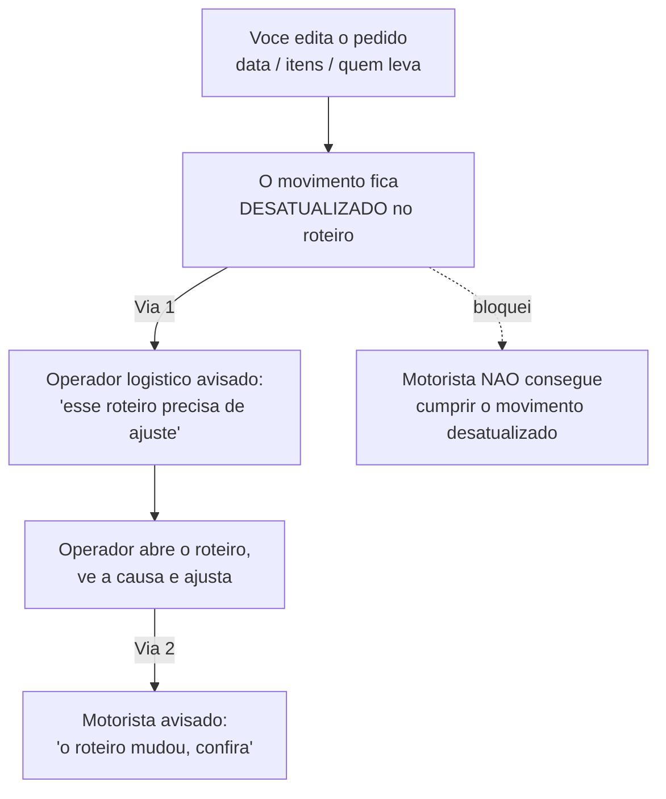

# Quando um pedido muda depois de fechado

Pedido fechado raramente fica parado: o cliente **adia a entrega**, **troca a data da retirada**, **tira ou acrescenta um item**, ou resolve **passar para pegar no balcão**. O LocFlow trata cada uma dessas mudanças com cuidado — porque uma data ou um item que muda **depois** que a operação já está rolando pode fazer o motorista ir ao lugar errado, na hora errada, ou levar a carga errada.

A regra de ouro é simples: **o pedido é a fonte da verdade; a logística segue o pedido.** Quando você edita um pedido já fechado, o LocFlow descobre sozinho o que aquilo afeta na operação e **avisa a pessoa certa** — começando sempre pela central de operação.


**Por que isso importa:** sem esse cuidado, um roteiro montado ontem ficaria "velho" sem ninguém perceber, e o motorista sairia com a informação antiga. Aqui, a mudança vira uma **pendência clara** para quem organiza as rotas, e o motorista é impedido de cumprir um movimento desatualizado. Menos retrabalho, menos entrega errada, menos cliente irritado.


## A ideia central: o movimento ganha uma versão nova

Cada entrega e cada retirada é um **movimento**. Quando você muda algo que afeta esse movimento — a data, a janela, os itens, ou quem leva —, o LocFlow **cria uma versão nova** do movimento e **guarda a antiga como histórico** (nunca apaga: serve de registro do que estava combinado antes).

Se esse movimento **já estava dentro de um roteiro planejado**, o roteiro passa a apontar para uma versão **antiga** — ou seja, ficou **desatualizado**. É exatamente esse "ficar desatualizado" que dispara o aviso para o operador.

## As duas vias do aviso

O segredo para não virar bagunça é separar **duas conversas diferentes**:

**Via 1 — a central de operação primeiro.** Quem precisa **agir** quando algo muda é o **operador logístico** (a pessoa que organiza e acompanha os roteiros). É ele que recebe o aviso: *"o roteiro tal precisa de ajuste"*. Ele abre, vê **o que mudou** (a data, o item...) e **reorganiza** a rota.

**O motorista, enquanto isso, fica protegido.** Um movimento desatualizado fica **bloqueado**: se o motorista tentar registrar a chegada ou concluir aquela parada, o app não deixa e mostra que aquele ponto **está aguardando um ajuste do roteiro**. Assim ele nunca cumpre a versão velha por engano.

**Via 2 — o motorista depois.** Só **quando o operador ajusta** o roteiro é que o motorista daquela rota recebe o aviso de que **o plano mudou** e deve conferir antes de seguir. A partir daí, é responsabilidade do motorista seguir o roteiro à risca.


Resumindo: **o operador conversa com a central; o motorista conversa com o roteiro.** O motorista nunca recebe "o cliente mudou tal item" — ele recebe "o seu roteiro foi ajustado", que é o que de fato muda o trabalho dele.


## O que cada mudança provoca

| O que você muda no pedido | Mexe na logística? | O que acontece | Quem é avisado, por padrão |
| --- | --- | --- | --- |
| Data ou janela de **entrega** | Sim | Nasce uma versão nova do movimento de entrega; a antiga vira histórico. O roteiro com essa parada fica desatualizado. | **Operador logístico** |
| Data ou janela de **retirada / devolução** | Sim | O mesmo, no movimento de retirada. | **Operador logístico** |
| **Itens** (o que vai ou volta) | Sim | A carga muda; o movimento ganha versão nova e o roteiro fica desatualizado. | **Operador logístico** |
| **Quem leva / de onde sai** (passou a retirar no balcão, trocou de galpão, ou uma venda virou locação e surgiu uma retirada) | Sim | O movimento é refeito — e pode até **surgir um movimento novo**. | **Operador logístico** |
| **Valor, desconto ou frete** | Não | Ajusta a **fatura** (gera crédito ou reembolso se você reduzir além do que já foi pago). O roteiro não muda. | Ninguém na logística — é assunto de [cobrança](../cobranca/faturas-e-parcelas.md). |


As datas do **evento** em si (início e fim) seguem sempre uma ordem coerente, garantida pelo próprio pedido. Para a logística, o que conta é se a **entrega** ou a **retirada** mudou de data/janela — é isso que move um movimento.


## Depende de em que ponto o pedido está

O aviso para o operador só faz sentido quando há, de fato, um roteiro para ajustar. Por isso a mesma edição tem efeitos diferentes conforme o momento:

| Situação do pedido | Se você muda a entrega, a retirada ou os itens... |
| --- | --- |
| **Fechado, logística ainda não começou** | Só atualiza os dados. Quando a logística iniciar, o movimento já nasce com a versão certa. **Ninguém precisa ser avisado.** |
| **Logística começou, mas o movimento ainda não entrou num roteiro** | Atualiza nos bastidores. O movimento aparece já com os dados novos quando for roteirizado. **Ninguém precisa ser avisado.** |
| **O movimento já está num roteiro planejado** | O roteiro fica **desatualizado** e vira uma **pendência**. O **operador logístico** é avisado para ajustar. |
| **O roteiro já está em execução** (motorista a caminho) | Além de avisar o operador, o movimento fica **bloqueado** para o motorista. Quando o operador ajusta, o motorista é avisado de que o roteiro mudou. |

## Quem recebe o quê

* **Operador logístico** — recebe o aviso *"Roteiro precisa de ajuste"*. É quem precisa de uma **função com a competência [Operar Logística](../conceitos/papeis-funcoes-competencias.md)** para aparecer como destinatário. Você pode ajustar esse público na [Central de Notificações](../configuracoes/central-de-notificacoes.md).
* **Motorista (executor da rota)** — não recebe a mudança crua. Ele só fica **impedido** de cumprir um movimento desatualizado e, depois do ajuste, recebe *"Roteiro ajustado em execução"*.


**O que isso te dá no dia a dia:** a pessoa certa, na hora certa. A central resolve a pendência com calma; o motorista nunca executa o que está vencido; e tudo fica registrado — a versão antiga do movimento não some, vira histórico para você auditar depois.


***

**Veja também:** [Planejando o roteiro](planejando-o-roteiro.md) · [Execução em campo](execucao-em-campo.md) · [Central de Notificações](../configuracoes/central-de-notificacoes.md) · [Papéis, funções e competências](../conceitos/papeis-funcoes-competencias.md)
