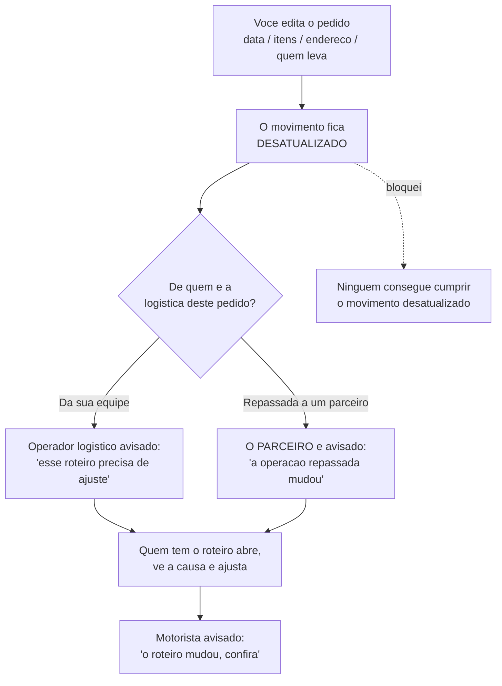

# Quando um pedido muda depois de fechado

Pedido fechado raramente fica parado: o cliente **adia a entrega**, **troca a data da retirada**, **tira ou acrescenta um item**, **muda o endereço da festa**, ou resolve **passar para pegar no balcão**. O LocFlow trata cada uma dessas mudanças com cuidado — porque uma data, um item ou um endereço que muda **depois** que a operação já está rolando pode fazer o motorista ir ao lugar errado, na hora errada, ou levar a carga errada.

A regra de ouro é simples: **o pedido é a fonte da verdade; a logística segue o pedido.** Quando você edita um pedido já fechado, o LocFlow descobre sozinho o que aquilo afeta — no roteiro, no estoque e na cobrança — e **avisa quem pode agir**.


**Por que isso importa:** sem esse cuidado, um roteiro montado ontem ficaria "velho" sem ninguém perceber, e o motorista sairia com a informação antiga. Aqui, a mudança vira uma **pendência clara** para quem organiza as rotas, e o motorista é impedido de cumprir um movimento desatualizado. Menos retrabalho, menos entrega errada, menos cliente irritado.



**Se o pedido já foi repassado a um parceiro, muda muito.** O aviso não vai para a sua central: vai para **o parceiro**, porque é o roteiro **dele** que precisa mudar — e você perde o direito de mexer no plano de movimentos daquele pedido. Leia [O pedido já estava com um parceiro](efeitos-na-parceria.md); esta página descreve a operação **da sua própria equipe**.


## A ideia central: o movimento ganha uma versão nova {#versao-nova}

Cada entrega e cada retirada é um **movimento**. Quando você muda algo que afeta esse movimento — a data, a janela, os itens, o endereço ou quem leva —, o LocFlow **cria uma versão nova** do movimento e **guarda a antiga como histórico** (nunca apaga: serve de registro do que estava combinado antes).

Se esse movimento **já estava dentro de um roteiro planejado**, o roteiro continua apontando para a versão **antiga**. É a isso que damos um nome:


**Defasagem, em português claro: a rota ficou velha em relação ao pedido.** O roteiro foi montado com uma verdade (terça, 40 cadeiras, Rua A) e o pedido passou a dizer outra (quarta, 60 cadeiras, Rua B). Nada quebrou — só que aquele plano **não descreve mais o combinado**. Na tela isso aparece como **"Roteiro desatualizado"**.


### O que "desatualizado" quer dizer na tela {#desatualizado-na-tela}

Ao abrir o roteiro você vê uma faixa de atenção:

> **Roteiro desatualizado** — Um movimento mudou depois de planejado. Ajuste o roteiro para a versão atual — os movimentos afetados ficam bloqueados na execução até lá.

E, na parada, um chip **"Desatualizado · «motivo»"** que diz **o que** mudou:

| Motivo no chip | O que mudou de fato |
| --- | --- |
| **data** | O dia da entrega ou da retirada. |
| **horário** | O mesmo dia, mas outra janela de horário. |
| **localidade** | O destino (o endereço para onde o material vai ou de onde volta). |
| **itens** | A carga — item incluído, retirado ou com quantidade diferente. |
| **responsabilidade** | **De qual galpão a carga sai** — é a única leitura deste chip; veja [Mudar quem leva ou de onde sai](#mudar-quem-leva). |
| **alinhamento** | A marcação *"já combinei esta janela com o cliente"* mudou — o horário virou (ou deixou de ser) um combinado firme. |
| **detalhes** | Mudou algo que a comparação não consegue nomear (veja o aviso a seguir). |


**Viu "Desatualizado · detalhes"? O caso mais comum é o endereço salvo.** Quando o destino é um **endereço salvo** e alguém edita esse endereço no cadastro (ou arrasta o pino dele), o roteiro fica desatualizado de verdade — o bloqueio funciona, o aviso sai —, mas o chip não consegue detalhar o motivo, porque dos dois lados o pedido continua apontando para o *mesmo* endereço salvo; o que mudou foi o endereço por dentro. Se aparecer "detalhes", confira o **endereço da parada** primeiro. Veja [Editar um endereço salvo depois](../orcamentos/enderecos.md#editar-endereco-salvo).



**"Desatualizado" ≠ "Replanejar · nova tentativa".** *Desatualizado* aparece quando **o pedido mudou** depois de planejado (data, itens, endereço, quem leva). Já o chip *"Replanejar · nova tentativa pendente"* aparece quando uma parada foi **pulada** na rua (cliente ausente, recusa...) — o pedido não mudou; o movimento só voltou à fila para uma **nova tentativa**. Veja [quando a parada não dá certo](execucao-em-campo.md#quando-a-parada-nao-da-certo).


## Quem é avisado: quem pode ajustar o plano {#quem-e-avisado}

O aviso não vai para "todo mundo que tem a ver com o pedido". Vai para **quem tem o roteiro na mão** — porque é essa pessoa que precisa fazer alguma coisa.

```mermaid
flowchart TD
    EDIT[Voce edita o pedido<br/>data / itens / endereco / quem leva] --> DEF[O movimento fica<br/>DESATUALIZADO]
    DEF --> Q{De quem e a<br/>logistica deste pedido?}
    Q -->|Da sua equipe| OP[Operador logistico avisado:<br/>'esse roteiro precisa de ajuste']
    Q -->|Repassada a um parceiro| PA[O PARCEIRO e avisado:<br/>'a operacao repassada mudou']
    OP --> AJUSTA[Quem tem o roteiro abre,<br/>ve a causa e ajusta]
    PA --> AJUSTA
    AJUSTA --> MOT[Motorista avisado:<br/>'o roteiro mudou, confira']
    DEF -.bloqueio.-> TRAVA[Ninguem consegue cumprir<br/>o movimento desatualizado]
```

**Se a logística é da sua equipe:** quem precisa **agir** é o **operador logístico** (a pessoa que organiza e acompanha os roteiros). É ele que recebe *"Roteiro precisa de ajuste"*. Ele abre, vê **o que mudou** e **reorganiza** a rota.

**Se o pedido foi repassado:** o aviso vai ao **parceiro logístico** — e **só** a ele. A sua central **não** recebe nada, de propósito: o roteiro é do parceiro, e sua equipe não tem como editá-lo. Detalhes em [O pedido já estava com um parceiro](efeitos-na-parceria.md).

**O motorista, enquanto isso, fica protegido.** Um movimento desatualizado fica **bloqueado**: se ele tentar registrar a chegada ou concluir aquela parada, o app não deixa e mostra *"Este movimento foi alterado e aguarda ajuste do roteiro"*. Assim ninguém cumpre a versão velha por engano.

**O motorista é avisado depois.** Só **quando o roteiro é ajustado** é que o motorista daquela rota recebe *"Roteiro ajustado em execução"* e deve conferir antes de seguir.


Resumindo: **quem tem o plano conversa com a central; o motorista conversa com o roteiro.** O motorista nunca recebe "o cliente mudou tal item" — ele recebe "o seu roteiro foi ajustado", que é o que de fato muda o trabalho dele.


## O que cada mudança provoca {#o-que-cada-mudanca-provoca}

Um mapa rápido; os detalhes de cada linha vêm logo abaixo.

| O que você muda no pedido | Mexe no roteiro? | Mexe no estoque? | Mexe no dinheiro? |
| --- | --- | --- | --- |
| Data ou janela de **entrega** | **Sim** | **Sim** — o bloqueio é recalculado sobre as datas novas | Não |
| Data ou janela de **retirada / devolução** | **Sim** | **Sim** — o mesmo | Não |
| **Itens** (o que vai ou volta) | **Sim** | **Sim** — reserva o acréscimo, libera o excedente | **Sim** — a fatura acompanha |
| **Endereço** de entrega ou de retirada | **Sim** | Não | Só se mudar o frete |
| **Quem leva / de onde sai** (balcão, troca de galpão) | **Sim** | **Sim** — na troca de galpão, libera lá e reserva aqui | Não |
| **Valor, desconto ou frete** | **Não** | Não | **Sim** — ajusta a **fatura** |

### Mudar a data ou a janela {#mudar-a-data}

É a mudança mais comum — e a que tem mais efeitos escondidos.

* **O roteiro** que contém aquela parada fica **desatualizado** (motivo *data* ou *horário*).
* **O bloqueio de estoque é recalculado** sobre as datas novas: o item deixa de ficar preso na semana antiga e passa a ficar preso na nova. Ele **não** fica congelado no que valia no dia do fechamento. Veja [Movimentos, janelas e galpão de origem](../orcamentos/movimentos-e-janelas.md#o-que-essas-janelas-fazem-com-o-seu-estoque).
* **A edição pode simplesmente não passar** se a data nova cair numa janela mais disputada — veja [A edição pode ser recusada](#edicao-recusada).


**Dois efeitos que quase ninguém espera ao remarcar:**

1. **O pedido pode ficar descoberto.** Se a data nova cai numa janela em que o material já está comprometido, sai o alerta **"Estoque descoberto (reserva acima do físico)"** para o operador. O negócio segue fechado — mas há um déficit a suprir (comprar, sublocar ou remanejar).
2. **Você pode quebrar a promessa de outro pedido.** Se este pedido era a **âncora** de outro que só fechou mediante condição (*"consigo, desde que o pedido X volte antes"*), remarcar re-avalia o dependente: ou o prazo dele é atualizado, ou a condição é marcada como **quebrada** e sai o alerta **"Condição de disponibilidade quebrada"**. Vale o contrário também: **cancelar** ou **reverter** este pedido pode **liberar** o dependente. Veja [Duração, cobrança e bloqueio de uso](../orcamentos/duracao-e-bloqueio.md).


**O que você precisa fazer:** abrir o roteiro afetado e **salvar** a edição (veja [Como se ajusta o roteiro](#ajustar-o-roteiro)). Se aparecer o alerta de descoberto ou de condição quebrada, resolva o material antes da data.

### Mudar os itens {#mudar-os-itens}

Trocar, incluir ou tirar item muda a **carga** — e a carga é o que a rota carrega e o estoque segura.

* **O roteiro** fica desatualizado (motivo *itens*).
* **A reserva de estoque é reconciliada:** o que você **acrescentou** é reservado; o que você **tirou** é liberado para outros pedidos. Você não precisa fazer nada à mão.
* **A fatura acompanha** a diferença — para mais ou para menos.
* **Há um limite:** depois que o material está com o cliente, os itens **não mudam mais** (veja [A edição pode ser recusada](#edicao-recusada)).


**Se o pedido foi repassado, mexer nos itens é a mudança mais cara de todas.** O parceiro tinha aceitado 100 cadeiras; você muda para 60 e a operação **volta a "aguardando a decisão dele"** — o aceite que ele deu não vale mais para um pedido que não é mais aquele. Leia [O pedido já estava com um parceiro](efeitos-na-parceria.md#itens-revogam-o-aval) **antes** de editar.


### Mudar o endereço {#mudar-o-endereco}

O endereço é uma causa de primeira classe: ele muda **para onde o caminhão vai**, e por isso desatualiza o roteiro exatamente como a data e os itens (motivo *localidade*).

Só que há **duas formas** de mudar o endereço, e elas têm alcances muito diferentes:

| O que você faz | O que muda |
| --- | --- |
| **Trocar o endereço dentro do pedido** (escolher outro destino, digitar outro endereço) | Muda **só este pedido**. O roteiro que continha aquela parada fica desatualizado. |
| **Editar um endereço SALVO** (ou arrastar o pino dele) | Muda **todos os pedidos ganhos e ainda não finalizados** que usam aquele endereço salvo — inclusive os que já têm roteiro montado. |


**O endereço salvo é uma referência, não uma cópia.** O pedido não guarda o endereço: guarda o **atalho** para ele. Corrigir o número de um condomínio no cadastro, ou arrastar o pino dele um quarteirão, **muda o destino de todos os pedidos vivos que apontam para ali** — cada um ganha uma versão nova do movimento, os roteiros ficam desatualizados e aquelas paradas travam até serem ajustadas. Só **renomear o apelido** não faz nada (é rótulo, não lugar). Entenda em [Editar um endereço salvo depois](../orcamentos/enderecos.md#editar-endereco-salvo).


**O que você precisa fazer:** ajustar **cada** roteiro que ficou desatualizado. Se a distância mudou muito, vale reavaliar o galpão de origem e refazer o frete antes.

### Mudar quem leva ou de onde sai {#mudar-quem-leva}

Passou a **retirar no balcão**? Trocou o **galpão de origem**? Uma venda virou locação e surgiu uma **retirada** que não existia?

* O movimento é **refeito** — e pode até **surgir um movimento novo** (a retirada que passou a existir).
* **Trocar o galpão de origem mexe no estoque nos dois lados:** o material é **liberado no galpão antigo** e **reservado no novo**. Sem isso, faltaria material no lugar errado e sobraria no certo.
* No chip do roteiro, a troca de galpão aparece como motivo **responsabilidade** — é a mesma família ("quem faz e de onde sai"), e é o único caso dessa família que chega a virar chip. Quando muda *quem se desloca* (a sua equipe leva × o cliente vem buscar), o movimento da equipe deixa de existir ou nasce outro no lugar: não sobra parada para exibir o chip.

**O que você precisa fazer:** lembrar que **cada roteiro parte de um único galpão**. Se o movimento mudou de galpão, ele **não pertence mais** ao roteiro em que estava — vai precisar entrar em outra rota. Veja [Cada carga sai de um galpão só](../orcamentos/movimentos-e-janelas.md).

### Mudar o valor, o desconto ou o frete {#mudar-o-frete}

Esta é a única linha que **não** mexe no roteiro. Ela ajusta a **fatura** (gerando crédito ou reembolso se você reduzir além do que já foi pago) — veja [Faturas e parcelas](../cobranca/faturas-e-parcelas.md).


**Refazer o frete NÃO reorganiza a operação.** A divisão de um movimento em **viagens** nasce da distribuição do frete, mas só **no momento em que a logística inicia**. Depois disso, mudar a transportadora ou o número de viagens na composição **não redivide nem reagrupa nada**: a operação continua como nasceu. Para mudar de fato as viagens, o caminho é **dividir ou consolidar o movimento** no planejamento do roteiro — veja [Dividir um movimento em viagens](planejando-o-roteiro.md#dividir-um-movimento-em-viagens) e [a composição do frete](../orcamentos/valores.md#composicao-do-frete).



**Se o pedido foi repassado, o frete é o caso mais mal-entendido de todos.** Subir o frete ao cliente de R$ 300 para R$ 500 **não sobe um centavo** do que o parceiro recebe: o frete dele foi **congelado** no aceite. O sistema apenas o **avisa** de que a viagem foi reprecificada e em que sentido — sem o valor, porque o preço ao cliente é assunto seu. Para o novo frete valer entre vocês, é preciso **repassar de novo** e pedir um aval novo. Veja [O frete não acompanha o repasse](efeitos-na-parceria.md#frete-congelado).



As datas do **evento** em si (início e fim) seguem sempre uma ordem coerente, garantida pelo próprio pedido. Para a logística, o que conta é se a **entrega** ou a **retirada** mudou de data/janela — é isso que move um movimento.


## A edição pode ser recusada {#edicao-recusada}

Nem toda edição pós-ganho passa. São **três** motivos, e vale conhecê-los antes de prometer a mudança ao cliente:

| Por que foi recusada | Quando acontece | O que fazer |
| --- | --- | --- |
| **"Os itens não podem ser alterados após o despacho"** | O material já está **com o cliente** (entregue, retirado no balcão) ou já entrou na volta (saiu para retirada, retirado, em conferência). | Só valores mudam. Para trocar material, **crie um novo orçamento**. |
| **Sem estoque na janela nova** | Você mexeu em **itens** ou em **datas** e o material não cabe na nova janela: *"Não há estoque disponível para todos os itens na janela de uso"* (ou a mensagem do **teto de overbooking**, se a sua regra permite furar com limite). | Ajuste as quantidades, escolha outra data, cadastre mais estoque ou reveja as regras em [Galpões e disponibilidade](../estoque/galpoes-e-disponibilidade.md). |
| **Bloqueio de uso indefinido** | As datas novas não permitem calcular a janela de bloqueio, ou o **bloqueio manual** que você definiu não cobre a logística nova. | Complete as datas do movimento ou ajuste o bloqueio manual — veja [Duração, cobrança e bloqueio de uso](../orcamentos/duracao-e-bloqueio.md#politica-de-bloqueio). |


**Contraintuitivo, mas proposital: só adiar a entrega em dois dias pode travar o salvamento.** Ao mexer em datas, o LocFlow refaz a conta de disponibilidade sobre a **janela nova** (descontando, claro, a reserva deste mesmo pedido). Se aquela semana já está comprometida, ele recusa em vez de deixar você prometer o que não tem.



**Boa notícia sobre o "despacho":** com o caminhão **já na rua** você ainda consegue trocar itens — a diferença vira um movimento novo a encaixar num roteiro. O bloqueio só começa quando o material **chega ao cliente** (ou quando ele retira no balcão).


## Depende de em que ponto o pedido está {#depende-do-ponto}

A mesma edição tem efeitos diferentes conforme o momento — e, quando há parceiro na jogada, a régua muda.

| Situação do pedido | Se você muda a entrega, a retirada, os itens ou o endereço... |
| --- | --- |
| **Fechado, logística ainda não começou** | Só atualiza os dados. Quando a logística iniciar, o movimento já nasce com a versão certa. Ninguém na sua equipe precisa ser avisado — **mas se o pedido já foi repassado, o parceiro é avisado assim mesmo.** |
| **Logística começou, mas o movimento ainda não entrou num roteiro** | Atualiza nos bastidores; o movimento aparece já com os dados novos quando for roteirizado. De novo: **um parceiro que já aceitou é avisado mesmo sem roteiro montado.** |
| **O movimento já está num roteiro planejado** | O roteiro fica **desatualizado** e vira uma **pendência** para quem o montou (sua central ou o parceiro). |
| **O roteiro já está em execução** (motorista a caminho) | Além do aviso, o movimento fica **bloqueado** para quem está na rua. Ajustado o roteiro, o motorista recebe *"Roteiro ajustado em execução"*. |


**Por que o parceiro é avisado mesmo antes de existir roteiro?** Porque a janela entre "ele aceitou" e "ele montou a rota" é exatamente a janela em que o vendedor costuma mexer no pedido. Se ninguém avisasse, ele descobriria a mudança na porta do cliente. Uma mudança que chega ao cliente tem de chegar a quem vai executar.


## Como se ajusta o roteiro na prática {#ajustar-o-roteiro}

Não existe um botão "aceitar a nova versão", e você não precisa procurar por ele:

1. Abra o roteiro (tocar na faixa **"Roteiro desatualizado"** já leva à edição, se você tem permissão para editar).
2. Confira o que mudou — a carga, a janela, o endereço.
3. Reorganize o que precisar (ordem das paradas, composição, veículo).
4. **Salve.** Salvar a edição já **sincroniza** os movimentos para a versão atual: a marca de desatualizado some e a execução destrava.


**Duas travas para conhecer:**

* **Roteiro concluído não se edita** (*"Não é possível editar um roteiro já concluído"*). Se a mudança chegou depois que a viagem fechou, o caminho é uma nova operação.
* **Depois que a execução começa, veículo, condutor e equipe ficam travados** (*"Não é possível alterar veículo, condutor ou equipe após o início da execução"*). O que ainda muda é a **composição** (quais movimentos a rota leva) e a **ordem** das paradas — e aí o motorista recebe *"Roteiro ajustado em execução"*.


## O que já foi cumprido não fica para trás {#ja-cumprido}

Uma dúvida frequente: *"e o que eu já entreguei?"*

**O que já foi desfechado é história e não se mexe.** Uma parada já **entregue**, **retirada** ou **pulada** não é marcada como desatualizada e **não fica bloqueada** — mesmo que o pedido mude depois. Se fosse o contrário, aquela parada ficaria travada para sempre, sem caminho de saída.

Isso também explica por que uma parada **pulada** mostra *"Replanejar · nova tentativa pendente"* e não *"Desatualizado"*: ela não está esperando um ajuste do plano, está esperando uma **nova tentativa**.

## Reverter o ganho e cancelar {#reverter-e-cancelar}

Às vezes a mudança não é um ajuste — é o pedido inteiro caindo. São **dois caminhos diferentes**, com pesos diferentes.

| Caminho | O que significa | Peso |
| --- | --- | --- |
| **Voltar para negociação** | *"Movi sem querer"* / *"voltou a ser conversa"*. O pedido sai do ganho e volta ao funil. | **Apaga a história** — por isso as travas são duras. |
| **Cancelar** | O negócio morreu de verdade, com motivo. É um **desfecho legítimo**, e pode acontecer até depois da entrega. | Trava só o essencial. |

### As travas de "voltar para negociação" {#travas-reverter}

O LocFlow recusa a reversão em **três** situações:

* **A rota já foi iniciada** — *"a execução logística (rota) deste orçamento já foi iniciada"*.
* **Material já saiu ou voltou** — *"parte do material já foi retirada/entregue"*. Registre a devolução antes.
* **A fatura tem qualquer pagamento** — mesmo parcial. Aí vira **reembolso**, que é outro fluxo: cancele ou estorne a cobrança antes.

Passando pelas travas, o LocFlow desfaz a operação sozinho:

* o movimento **sai de todos os roteiros planejados** que ainda não foram concluídos;
* um roteiro que **existia só por causa daquele pedido** — aquele com uma parada só — é **excluído** (não fica rota vazia na sua lista);
* as **projeções** do pedido são apagadas — se você ganhar de novo, tudo é recriado do zero, fresco;
* a **fatura ainda em aberto é cancelada**, junto com as cobranças online pendentes;
* o **estoque é liberado**.

### As travas de "cancelar" {#travas-cancelar}

Cancelar é mais permissivo de propósito — cancelar **depois** de entregar é legítimo (o cliente devolveu tudo e a locação morreu). A única trava é a do dinheiro:


**Fatura com pagamento barra o cancelamento:** *"Não é possível cancelar: a fatura deste orçamento já tem pagamento. Estorne ou cancele a cobrança antes."* Vale para pagamento **total ou parcial**.


Rota em campo e material já movimentado **não barram** o cancelamento — mas ficam registrados como pendência a conciliar: alguém precisa saber que a operação encerrou com equipe na rua ou com material fora.


**Cancelar não cancela a fatura sozinho.** Diferente de "voltar para negociação", o cancelamento **não** mexe na cobrança: você decide se cancela a fatura, se cobra uma multa contratual ou se mantém o que já foi faturado. Veja [Faturas e parcelas](../cobranca/faturas-e-parcelas.md).


### Se havia uma rota em campo {#rota-em-campo}

Quando a equipe **já está na rua**, nada é removido à força — seria corromper o registro de uma viagem acontecendo. Em vez disso, o **motorista é avisado de que o plano mudou** e o operador resolve à mão. E as paradas **já cumpridas** nunca são apagadas.


**Se o pedido estava repassado, cancelar ou reverter também mexe com o parceiro — e pode custar reputação.** O repasse é desfeito, ele é avisado nominalmente, e um cancelamento em cima da hora, depois de ele já ter aceitado, **penaliza você** no índice de confiabilidade. Leia [Cancelar ou reverter um pedido repassado](efeitos-na-parceria.md#cancelar-repassado) antes.


## O pedido foi repassado a um parceiro {#pedido-repassado}

Se a operação está com um parceiro (interno ou externo), três coisas mudam de dono:

* **o aviso** vai para ele, não para a sua central;
* **o roteiro a ajustar é o dele** — e você fica barrado de dividir, consolidar, reatribuir movimentos ou concluir a entrega/retirada pelo avanço manual de status;
* **mexer nos itens devolve a decisão a ele** — o aceite que ele deu era sobre outro pedido.

Tudo isso, delta por delta, está em **[O pedido já estava com um parceiro](efeitos-na-parceria.md)**.

## Quem recebe o quê {#quem-recebe-o-que}

| Quem | O que recebe | Quando |
| --- | --- | --- |
| **Operador logístico** (com a competência [Operar Logística](../conceitos/papeis-funcoes-competencias.md)) | *"Roteiro precisa de ajuste"* | Só quando a logística é **da sua própria organização**. |
| **Parceiro logístico** (ou a organização parceira) | *"A operação repassada mudou"* / *"O frete de uma operação repassada mudou"* | Quando o pedido está **repassado e vivo**. |
| **Motorista (executor da rota)** | *"Roteiro ajustado em execução"* | Só **depois** que alguém ajusta o roteiro que ele está rodando. |
| **Operador logístico** | *"Estoque descoberto"* · *"Condição de disponibilidade quebrada"* | Quando a mudança deixa material a descoberto ou quebra a promessa de outro pedido. |

Você ajusta o público de cada aviso na [Central de Notificações](../configuracoes/central-de-notificacoes.md).


**O que isso te dá no dia a dia:** a pessoa certa, na hora certa. Quem tem o plano resolve a pendência com calma; o motorista nunca executa o que está vencido; e tudo fica registrado — a versão antiga do movimento não some, vira histórico para você auditar depois.


## Situações reais {#situacoes-reais}

**"O cliente adiou a festa de sábado para o sábado seguinte."**
Você muda as duas datas (entrega e retirada). O estoque deixa de ficar preso neste fim de semana e passa a ficar preso no próximo. O roteiro de sábado mostra *"Desatualizado · data"*; o operador abre, tira aquela parada e encaixa a entrega na semana seguinte. Se o material já estiver comprometido no novo fim de semana, o sistema **recusa o salvamento** — e é melhor descobrir agora do que na porta do cliente.

**"Corrigi o número do condomínio no cadastro e três roteiros ficaram desatualizados."**
Era um **endereço salvo**. Todo pedido ganho que aponta para ele passou a ter um destino novo. Ajuste cada roteiro; os chips vão mostrar *"Desatualizado · detalhes"*, que aqui quer dizer "o endereço salvo mudou".

**"Subi o frete porque o cliente mudou para um bairro mais longe."**
A fatura sobe. O roteiro **não** muda por causa disso (mas o endereço novo muda!). E as **viagens** não se redividem sozinhas: se o novo trajeto exige duas viagens em vez de uma, é preciso dividir o movimento no planejamento do roteiro.

**"Cancelei um pedido cuja fatura já tinha o sinal pago."**
O sistema recusa e explica: estorne ou cancele a cobrança antes. Não é burocracia — é o dinheiro do cliente já dentro de casa.

**"Voltei um pedido para negociação e o roteiro sumiu da lista."**
Sumiu mesmo: como aquela rota existia só por causa daquele pedido, ela foi excluída em vez de ficar vazia na sua fila.

## Próximo passo {#proximo-passo}

- [O pedido já estava com um parceiro](efeitos-na-parceria.md) — o mesmo assunto, quando a operação não é da sua equipe.
- [Acompanhando seus roteiros](acompanhando-roteiros.md#roteiro-desatualizado) — onde o aviso de desatualizado aparece.
- [Planejando o roteiro](planejando-o-roteiro.md) — como a rota é montada (e reorganizada).
- [Acompanhando e fechando](../orcamentos/acompanhando-e-fechando.md#editando-depois-de-ganho) — o que dá para editar depois do ganho.
- [Central de Notificações](../configuracoes/central-de-notificacoes.md) — quem recebe cada aviso.
