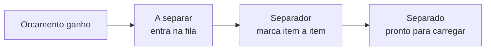

# Separação no galpão

A **separação** é a primeira etapa interna da logística: preparar o material **antes** de ele sair para a rua. É o momento em que alguém no galpão junta tudo o que aquele pedido precisa, confere a quantidade e deixa pronto para carregar.

No fluxo da logística, ela ocupa as duas primeiras posições — *A separar → Separado* — e só existe se você **ligar a separação interna** no [motor de logística](../configuracoes/motores-operacionais.md). Sem ela, a logística começa direto na entrega ou retirada.


**Por que isso vale a pena:** separar de forma organizada acaba com o "achei que tinha mandado" e com a caixa que volta porque faltou item. O pedido só sai do galpão quando está **completo e conferido** — menos retrabalho, menos viagem repetida, cliente atendido certo da primeira vez.


## A fila do separador

A separação é uma **fila simples, sem atribuição**: o operador abre a tela e pega o orçamento **mais antigo** primeiro. Não há "dividir tarefas" — quem está livre pega o próximo da fila.

Ao abrir um orçamento da fila, o separador vê a **lista consolidada de produtos** — os kits já vêm "explodidos" em seus componentes, e itens iguais aparecem somados, com a quantidade total. Ele marca **cada item** conforme separa; uma barra mostra o progresso (*X de Y separados*).

O botão **Concluir separação** só libera quando **todos os itens** estão marcados. Ao concluir, o pedido passa para *Separado* e está pronto para entrar em um roteiro ou ser carregado.


A separação **não exige escolher um veículo nem um motorista** — ela é só o preparo do material. O despacho (rota, ordem, quem vai) acontece depois, no [planejamento do roteiro](planejando-o-roteiro.md) ou sob demanda.


## O papel Separador

Quem trabalha no galpão recebe o papel **Separador**: ao abrir o app, enxerga **apenas a fila de separação** — não vê o financeiro, o catálogo nem as rotas dos motoristas. É acesso sob medida, que evita confusão e deixa você delegar sem medo.

O papel já vem pronto no LocFlow — basta escolhê-lo ao convidar a pessoa. Veja [Papéis, funções e competências](../conceitos/papeis-funcoes-competencias.md).

## Retirada no balcão

Quando o **cliente retira no galpão** (em vez de a equipe entregar), a separação continua valendo — e fica ainda mais útil. O material é separado e conferido **antes** de o cliente chegar, então a retirada no balcão é rápida: é só entregar o que já está pronto e marcar a saída. Sem rota, sem viagem. A confirmação desse atendimento — e a fila de quem está por vir — fica em [Balcão: retirada e devolução no galpão](balcao.md).

## Quando ligar a separação

A separação é **opcional** justamente porque nem toda operação precisa dela. O gatilho é a operação, não o sistema.

| Porte | Como você usa a separação |
| --- | --- |
| **Começando** | **Desligada.** Você separa "de cabeça" e entrega direto — ligar só criaria cliques. |
| **Crescendo** | **Ligada.** A demanda subiu, há mais itens e mais gente no galpão; a fila garante que nada sai incompleto. |
| **Estruturada** | **Ligada, com papel Separador dedicado** e, na locação, somada à [conferência](conferencia.md) na volta. |


**Vale só para pedidos futuros.** Ao ligar ou desligar a separação, o LocFlow lê essa política **na hora de iniciar a logística** de cada orçamento. Pedidos já em andamento não mudam de fluxo no meio do caminho.


## Situações reais

* **Locadora de festas em alta temporada:** dez pedidos para o mesmo sábado. A fila de separação garante que cada um saia com louça, mesas e toalhas completas — ninguém separa "no olho".
* **Cliente que busca no balcão:** o pedido é separado pela manhã; quando o cliente chega à tarde, está tudo embalado e conferido. Retirada em minutos.
* **Equipe nova no galpão:** o separador recém-contratado abre o app e vê só a fila dele, com a lista exata de itens e quantidades. Aprende a operação sem acesso ao resto do sistema.

## Próximo passo

Com o material separado, veja [Planejando o roteiro](planejando-o-roteiro.md). Na locação, a volta passa pela [Conferência na devolução](conferencia.md).
