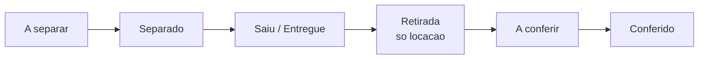

# Visão geral da logística

A logística do LocFlow cuida de **levar os itens até o cliente** e, na [locação](../primeiros-passos/glossario.md), **trazê-los de volta**. Tudo organizado em **roteiros**, com cada etapa visível em tempo real para a equipe.

A ideia central é simples: quando um orçamento é ganho, sua entrega e retirada entram para a fila da logística. A partir daí você decide **quando** e **como** cada operação acontece — sem nunca travar o caminho mais rápido.


**Por que isso te faz faturar mais:** o material que anda sozinho — separado, despachado, entregue e conferido na volta — para de ficar parado no galpão. Menos item esquecido, menos avaria que passa batido, menos viagem desorganizada. A operação enxerga o que está acontecendo, e você entrega mais com a mesma equipe.


## O caminho do material

Cada item percorre um fluxo do galpão à rua e, na locação, de volta ao galpão. As pontas internas — **Separação** e **Conferência** — são **opcionais**: quem está começando entrega direto; quem cresceu liga essas etapas para ganhar controle.

* **A separar → Separado** — a [separação](separacao.md) no galpão (preparar o material antes de sair). *Opcional.*
* **Saiu / Entregue** — o material vai à rua: sai para entrega e é entregue (ou o cliente retira no balcão).
* **Retirada** — só na **locação**: a equipe vai buscar o material de volta (ou o cliente devolve no balcão).
* **A conferir → Conferido** — a [conferência](conferencia.md) na devolução (checar o que voltou). *Opcional, só locação.*


**Separação e Conferência ligam quando valem a pena.** Quem separa "de cabeça" não precisa delas — só criariam cliques. Você liga cada uma na hora em que a demanda cresce e não dá mais para guardar tudo na memória. Mesmo sistema, sem migração. Veja [A filosofia do LocFlow](../primeiros-passos/filosofia.md).


## Duas formas de despachar

O LocFlow sempre **sugere o melhor caminho, mas nunca impede o mais simples**. Por isso há dois jeitos de colocar o material na rua:

| Forma | O que é | Quando usar |
| --- | --- | --- |
| **Planejado (com antecedência)** | Você monta a sequência de paradas de vários orçamentos em um [roteiro](planejando-o-roteiro.md), escolhe a melhor ordem, o veículo e quem vai. | A operação do dia: agrupa entregas e retiradas, economiza tempo e combustível. |
| **Sob demanda** | Uma entrega (ou retirada) de **um** orçamento, criada na hora a partir das ações rápidas do pedido. | Entrega de última hora, ou quem ainda não planeja a rota. |

A **execução em campo é idêntica** para os dois — a distinção existe só para você saber, depois, qual roteiro nasceu de um planejamento e qual foi criado na hora.

## Ida e volta, entrega e retirada

Dentro do roteiro convivem duas ideias que andam juntas mas não são a mesma coisa:

* **Entrega e retirada** dizem respeito ao **material**: na *entrega* os itens vão ao cliente; na *retirada* eles voltam ao galpão.
* **Ida e volta** dizem respeito ao **veículo**: uma parada é de *volta* quando o destino é o galpão-base; caso contrário é de *ida*.

Na prática, uma mesma viagem pode ter paradas dos dois tipos — o motorista entrega num cliente, retira em outro e fecha o trajeto voltando ao galpão.


**Locação x venda:** na **locação** há entrega e depois retirada (o item retorna). Na **venda**, há apenas entrega — o item sai em definitivo, sem retirada nem conferência. Veja [Locação e venda](../conceitos/locacao-e-venda.md).


## A execução em campo

O motorista acompanha o [roteiro pelo aplicativo](execucao-em-campo.md): vê o endereço e o complemento, o responsável e o contato (WhatsApp), as observações internas e o que conferir na hora. A cada parada ele marca o progresso (*saiu para entrega*, *entregue*, *retirado*) e registra a **comprovação** — por exemplo, foto ou confirmação. O status volta para a equipe na hora.

## Exigir fatura antes de iniciar a logística

Você pode condicionar o início da logística à **geração da fatura**: enquanto não houver uma cobrança gerada para o orçamento, o material não entra na fila de separação nem é despachado.

Para decidir, pergunte-se: você começa a preparar e entregar os itens mesmo sem ter gerado uma fatura de cobrança?

* **Sim, entrego antes de cobrar** — deixe a exigência desligada.
* **Não, só libero os itens depois de gerar a fatura** — ligue a exigência.


A fatura apenas **registra uma cobrança em aberto** — ela não significa que o cliente já pagou. A exigência é só uma trava para não despachar material sem que a cobrança exista. Você configura isso no [motor de logística](../configuracoes/motores-operacionais.md).


## Situações reais

* **Venda no balcão:** orçamento vendido, entrega na hora. Sem retirada, sem conferência — o ciclo termina na entrega.
* **Locação de evento:** reservado, separa na véspera, entrega no local, retira no dia seguinte e confere na volta para checar avarias antes de o item liberar o estoque.
* **Entrega de última hora:** pulou o planejamento? Despacha **sob demanda**, uma entrega de cada vez — o sistema não trava o caminho mais simples.
* **Cliente que retira no balcão:** sem rota nenhuma. O material é separado (se você ligou a separação) e o cliente busca no galpão; na locação, devolve no balcão e segue para a conferência.

## Próximo passo

Veja [Separação no galpão](separacao.md), [Planejando o roteiro](planejando-o-roteiro.md) ou [Conferência na devolução](conferencia.md).
