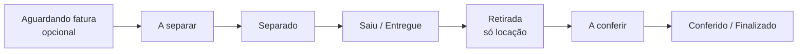
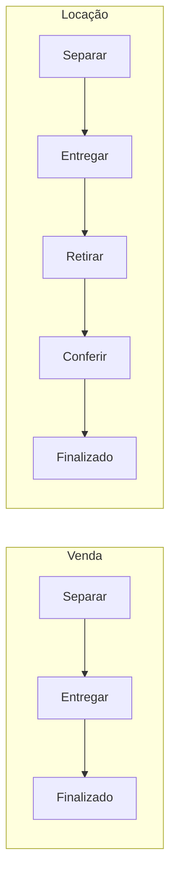

# Visão geral da logística

A logística do LocFlow cuida de **levar os itens até o cliente** e, na [locação](../primeiros-passos/glossario.md), **trazê-los de volta**. Tudo organizado em **roteiros**, com cada etapa visível em tempo real para a equipe.

A ideia central é simples: quando um orçamento é ganho, sua entrega e retirada entram para a fila da logística. A partir daí você decide **quando** e **como** cada operação acontece — sem nunca travar o caminho mais rápido.


**Por que isso te faz faturar mais:** o material que anda sozinho — separado, despachado, entregue e conferido na volta — para de ficar parado no galpão. Menos item esquecido, menos avaria que passa batido, menos viagem desorganizada. A operação enxerga o que está acontecendo, e você entrega mais com a mesma equipe.


## As fases da logística

A logística de cada pedido **espelha o ciclo de vida do pedido** (veja [O ciclo de um pedido](../conceitos/ciclo-de-um-pedido.md)): ela caminha por fases, do galpão à rua e — na locação — de volta ao galpão. Algumas fases são **opcionais** e você liga conforme a operação cresce.

Lendo da esquerda para a direita, cada fase é um momento concreto da operação:

| Fase | O que significa | Quando aparece |
| --- | --- | --- |
| **Aguardando fatura** | A logística ainda não começou porque você exigiu que a cobrança exista antes de mover o material. | Só se você ligar a [exigência de fatura](#exigir-fatura-antes-de-iniciar-a-logistica). |
| **A separar → Separado** | A [separação](separacao.md) no galpão: alguém junta o material do pedido e deixa pronto para carregar. | Só se a separação interna estiver ligada. *Opcional.* |
| **Saiu para entrega → Entregue** | O material vai à rua e chega ao cliente. (Ou o cliente **retira no galpão**, sem rota.) | Sempre. |
| **Saiu para retirada → Retirado** | A equipe vai **buscar o material de volta**. (Ou o cliente **devolve no galpão**.) | Só na **locação**. |
| **A conferir → Conferido** | A [conferência](conferencia.md) na volta: checar o que retornou antes de o item liberar o estoque. | Só na **locação**, e só se a conferência estiver ligada. *Opcional.* |
| **Finalizado** | A logística encerrou. Na venda, ao entregar; na locação, ao concluir a volta. | Sempre. |


**Separação e Conferência ligam quando valem a pena.** Quem separa "de cabeça" não precisa delas — só criariam cliques. Você liga cada uma na hora em que a demanda cresce e não dá mais para guardar tudo na memória. Mesmo sistema, sem migração. Veja [A filosofia do LocFlow](../primeiros-passos/filosofia.md).


### A etapa zero: a logística só começa depois da fatura (opcional)

Antes de qualquer fase de material, há uma **etapa zero financeira**. Você pode condicionar o início da logística à **geração da fatura**: enquanto não houver cobrança gerada para o orçamento, o pedido fica **aguardando fatura** — o material não entra na fila de separação nem é despachado.

Essa trava é **opcional** e você decide pela pergunta:

> Você começa a preparar e entregar os itens mesmo sem ter gerado uma fatura de cobrança?

* **Sim, entrego antes de cobrar** — deixe a exigência desligada. A logística começa assim que o pedido é ganho.
* **Não, só libero os itens depois de gerar a fatura** — ligue a exigência. O pedido espera a cobrança existir.


A fatura apenas **registra uma cobrança em aberto** — ela não significa que o cliente já pagou. A exigência é só uma trava para não despachar material sem que a cobrança exista. Você configura isso no [motor de logística](../configuracoes/motores-operacionais.md).


### Logística interna: separação e conferência

As duas pontas **internas** — dentro do galpão — são onde o material é preparado na ida e conferido na volta. O texto de ajuda do app resume bem:

> Define se existem etapas DENTRO do galpão antes e depois da rua. Separação interna (A separar → Separado): ative se o material é separado/conferido no galpão antes de sair. Conferência na devolução (A conferir → Conferido): só para aluguel — ative se, ao voltar, o material é conferido antes de encerrar.

* A **separação** abre o caminho da ida — detalhes em [Separação no galpão](separacao.md).
* A **conferência** fecha o caminho da volta, só na locação — detalhes em [Conferência na devolução](conferencia.md).

Ambas são governadas pela **política do [motor de logística](../configuracoes/motores-operacionais.md)**: você liga ou desliga cada uma, e o LocFlow lê essa política **na hora de iniciar a logística** de cada pedido. Pedidos já em andamento não mudam de fluxo no meio do caminho.

### Logística externa: entrega e retirada

Entre as pontas internas acontece a **logística externa** — o que vai à rua:

* **Entrega** (*Saiu para entrega → Entregue*): o material chega ao cliente. Se o cliente prefere **retirar no galpão**, não há rota — ele busca no balcão e você só marca a saída.
* **Retirada** (*Saiu para retirada → Retirado*, só locação): a equipe vai buscar o material de volta. Se o cliente prefere **devolver no galpão**, também não há rota — ele entrega no balcão.

A execução em campo dessas fases acontece no [roteiro pelo aplicativo](execucao-em-campo.md).

## Locação x venda: o que muda nas fases

A grande diferença entre **alugar** e **vender** está em quantas fases o pedido percorre — porque na venda o item **sai em definitivo** e na locação ele **volta**.

| | **Venda** | **Locação (aluguel)** |
| --- | --- | --- |
| Separação (se ligada) | Sim | Sim |
| Entrega | Sim | Sim |
| Retirada (volta do material) | **Não existe** | Sim |
| Conferência (se ligada) | **Não existe** | Sim |
| Quando **finaliza** | Logo após a **entrega** | Após a **volta** (e a conferência, se ligada) |


**Locação x venda:** na **venda** há apenas entrega — o item sai em definitivo, sem retirada nem conferência. Na **locação** há entrega e depois retirada (o item retorna), com conferência opcional na volta. Veja [Locação e venda](../conceitos/locacao-e-venda.md).


## Duas formas de despachar

O LocFlow sempre **sugere o melhor caminho, mas nunca impede o mais simples**. Por isso há dois jeitos de colocar o material na rua:

| Forma | O que é | Quando usar |
| --- | --- | --- |
| **Planejado (com antecedência)** | Você monta a sequência de paradas de vários orçamentos em um [roteiro](planejando-o-roteiro.md), escolhe a melhor ordem, o veículo e quem vai. | A operação do dia: agrupa entregas e retiradas, economiza tempo e combustível. |
| **Sob demanda** | Uma entrega (ou retirada) de **um** orçamento, criada na hora a partir das ações rápidas do pedido. | Entrega de última hora, ou quem ainda não planeja a rota. |

A **execução em campo é idêntica** para os dois — a distinção existe só para você saber, depois, qual roteiro nasceu de um planejamento e qual foi criado na hora.

## Ida e volta, entrega e retirada

Dentro do roteiro convivem duas ideias que andam juntas mas não são a mesma coisa:

* **Entrega e retirada** dizem respeito ao **material**: na *entrega* os itens vão ao cliente; na *retirada* eles voltam ao galpão.
* **Ida e volta** dizem respeito ao **veículo**: uma parada é de *volta* quando o destino é o galpão-base; caso contrário é de *ida*.

Na prática, uma mesma viagem pode ter paradas dos dois tipos — o motorista entrega num cliente, retira em outro e fecha o trajeto voltando ao galpão.

## A execução em campo

O motorista acompanha o [roteiro pelo aplicativo](execucao-em-campo.md): vê o endereço e o complemento, o responsável e o contato (WhatsApp), as observações internas e o que conferir na hora. A cada parada ele marca o progresso (*saiu para entrega*, *entregue*, *retirado*) e registra a **comprovação** — por exemplo, foto ou confirmação. O status volta para a equipe na hora.

## Por porte

A logística **abstrai para o pequeno e revela para o grande** — você liga fases conforme a operação pede:

| Porte | Como a logística aparece para você |
| --- | --- |
| **Começando** | Separação e conferência **desligadas**; fatura **não exigida**. Ganhou o pedido, despacha **sob demanda** e entrega direto. Caminho mais curto possível. |
| **Crescendo** | **Separação ligada** para nada sair incompleto; talvez a **conferência** na locação para pegar avaria; roteiros **planejados** para agrupar o dia. |
| **Estruturado** | Tudo ligado, com papéis dedicados (Separador, Conferente, motoristas), fatura exigida antes de despachar e rotas planejadas com veículo e ordem otimizada. |

## Situações reais

* **Venda no balcão:** orçamento vendido, entrega na hora. Sem retirada, sem conferência — o ciclo termina na entrega.
* **Locação de evento:** reservado, separa na véspera, entrega no local, retira no dia seguinte e confere na volta para checar avarias antes de o item liberar o estoque.
* **Entrega de última hora:** pulou o planejamento? Despacha **sob demanda**, uma entrega de cada vez — o sistema não trava o caminho mais simples.
* **Cliente que retira no balcão:** sem rota nenhuma. O material é separado (se você ligou a separação) e o cliente busca no galpão; na locação, devolve no balcão e segue para a conferência.

## Próximo passo

Veja [Separação no galpão](separacao.md), [Planejando o roteiro](planejando-o-roteiro.md) ou [Conferência na devolução](conferencia.md).
