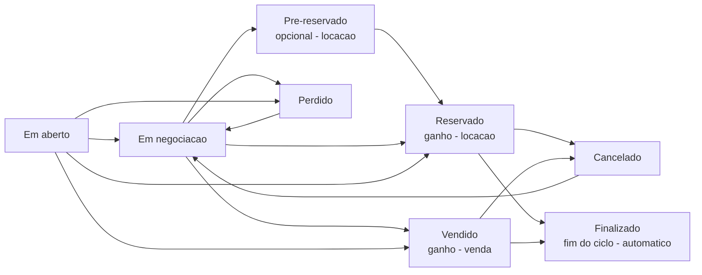
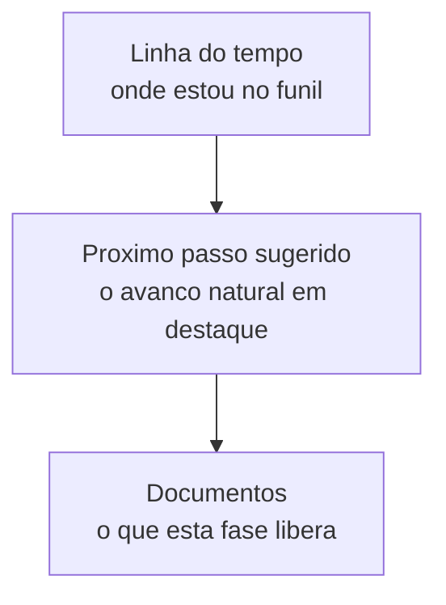

# Acompanhando e fechando

Depois de criar a proposta, você acompanha cada orçamento até o fechamento. A tela de orçamentos tem duas visões: o **funil** (kanban, padrão) — colunas por etapa, onde você arrasta o card para mudar de fase — e a **lista** tradicional, com busca e filtros. Em ambas você abre as **Ações rápidas** de um orçamento para ver onde ele está, o que fazer a seguir e gerar documentos.


O funil é de **uma natureza por vez** — alterne entre **Aluguel** e **Venda** no topo. Cada card mostra a **chance de fechar** (uma estimativa para você priorizar quem cobrar primeiro). Prefere a visão clássica? Alterne para **Lista**.


## Os estados do orçamento

Todo orçamento tem um **estado comercial** — onde ele está no funil. Os estados dependem da natureza (locação ou venda).

| Estado | O que significa | Quando aparece |
| --- | --- | --- |
| **Em aberto** | Criado, ainda sem ação. | Sempre — é onde o orçamento nasce. |
| **Em negociação** | Enviado ao cliente, aguardando a resposta. | Aluguel e venda. |
| **Pré-reservado** | Um "segurar" o aluguel antes de confirmar de vez. | **Opcional**, só locação. |
| **Reservado** | Aluguel confirmado — o **ganho** da locação; o estoque é bloqueado. | Locação. |
| **Vendido** | Venda confirmada — o **ganho** da venda. | Venda. |
| **Perdido** | A proposta não fechou (no funil, antes do ganho). | Aluguel e venda. |
| **Cancelado** | Cancelado **depois** de ganho — já havia compromissos. | Pós-reserva/venda. |
| **Finalizado** | A operação terminou e o ciclo se encerrou. | No fim, automaticamente. |


**Finalizado é automático — você não arrasta para cá.** O LocFlow encerra o ciclo sozinho quando a logística termina: na **venda**, quando a entrega se conclui (ou o cliente retira no balcão); na **locação**, quando os itens voltam — e, se a sua operação usa **conferência**, só depois de conferidos. É o fim natural do pedido. Veja [Visão geral da logística](../logistica/visao-geral.md).



**A pré-reserva é opcional.** Ela serve para "segurar" um aluguel enquanto o cliente decide, sem confirmar de vez. Quem prefere pode **pular** essa etapa e ir direto de Em aberto ou Em negociação para **Reservado**. Use se ajudar a sua operação; ignore se não precisar.


### "Pendente" não é um estado do funil

Você pode ver um orçamento marcado como **Pendente** numa faixa tracejada **acima** das colunas do funil. É fácil confundir com "em aberto" — mas **não é**. "Pendente" é uma **pré-etapa por política**: o orçamento está **congelado aguardando a aprovação** de um responsável (por exemplo, porque o frete passou de um limite que você definiu). Ele continua tendo seu estado comercial normal por baixo (Em aberto, Em negociação…), só não pode avançar enquanto não for aprovado.


Não trate Pendente como "em aberto". Um orçamento Pendente **não está parado por falta de ação sua** — está esperando um **aval**. Aprovado, ele entra (volta) no funil e segue normalmente; rejeitado com motivo, volta para edição. O detalhe de quem aprova e como está em [Aprovação de orçamentos](aprovacao.md).


## A jornada e o próximo passo sugerido

Ao abrir as **Ações rápidas** de um orçamento, a tela é organizada em torno da **jornada** — onde o pedido está e para onde vai naturalmente.

* **Linha do tempo** — a sequência da natureza (Em aberto → Negociação → … → Reserva/Venda), com a etapa atual destacada, as concluídas com um *check* e as futuras numeradas. No celular ela aparece compacta ("etapa X de Y") e expande ao toque; em telas grandes vira um passo a passo horizontal.
* **Próximo passo sugerido** — o avanço natural do funil em destaque (um botão grande com o verbo da ação, ex.: **Reservar**, **Vender**), e as demais transições possíveis como atalhos ("Ou avance de outra forma").
* **Documentos** — os arquivos que aquela fase libera (veja a seção a seguir).


**Por que a jornada te ajuda a faturar:** em vez de uma lista de botões soltos, você vê *um* próximo passo claro. Menos dúvida, menos pedido esquecido no meio do funil — e cada toque te empurra para o fechamento.


### Mudando de fase

Você muda o estado de duas formas, e as duas fazem a **mesma coisa** por baixo:

* **No funil:** arraste o card para outra coluna.
* **Nas Ações rápidas:** toque no próximo passo sugerido (ou num dos atalhos).

Quando a mudança avança o funil, o LocFlow te leva às **Ações rápidas** já com o novo estado, para você confirmar e seguir.

## Quais documentos cada fase libera

O LocFlow só oferece os documentos que **fazem sentido** no estado atual — você não vê um contrato de reserva num orçamento ainda em aberto. A tabela abaixo é o que o sistema mostra hoje, por estado e natureza:

| Estado | Locação | Venda |
| --- | --- | --- |
| **Em aberto** | WhatsApp · Orçamento em PDF | WhatsApp · Orçamento em PDF |
| **Em negociação** | WhatsApp · Orçamento em PDF | WhatsApp · Orçamento em PDF |
| **Pré-reservado** | WhatsApp · Orçamento em PDF · Contrato de pré-reserva | — (não existe na venda) |
| **Reservado** *(ganho)* | Contrato de reserva · **Fatura de locação** · Ordem logística | — |
| **Vendido** *(ganho)* | — | Contrato de venda · Ordem logística |
| **Perdido / Cancelado** | Nenhum (a única ação é **reabrir**) | Nenhum (a única ação é **reabrir**) |

Alguns detalhes úteis:

* **WhatsApp** gera um texto pronto para colar no chat do cliente — você copia ou abre direto.
* **Orçamento em PDF** é o arquivo da proposta, com layout ajustável.
* **Ordem logística** lista os itens com a carga (dimensões, peso e volume) para o galpão e a rota.
* **Fatura de locação** é o documento de cobrança do aluguel (valores, parcelas e vencimentos) — por isso só aparece na locação.


**Gere a cobrança antes da fatura em PDF.** Se você gerar a fatura de locação antes de ter emitido a cobrança, o LocFlow avisa: *"A fatura sai com os valores previstos do orçamento, mas sem parcelas, vencimentos nem situação de pagamento — recomendamos gerar a cobrança antes para refletir os prazos reais."*


### Gerar e enviar sem trocar de tela

A geração é **embutida**: ao clicar num documento, o preparo abre ali mesmo (num painel à direita em telas grandes, numa folha que sobe no celular) — você não sai das Ações rápidas. No preparo você:

* edita o **nome do arquivo**;
* ajusta **opções deste envio** — como apresentar os kits (linha única ou kit "pai" com componentes recuados) e exibir ou ocultar a **coluna de fotos** dos itens, para uma versão mais enxuta;
* vê uma **pré-visualização ao vivo**;
* e finaliza com **Compartilhar** ou **Baixar** (PDF), ou **Copiar / Abrir** (WhatsApp).

## Marcar como ganho (reservado / vendido)

Marcar um orçamento como **ganho** é o momento que liga a operação. Ao reservar (locação) ou vender (venda), o LocFlow encadeia o resto sozinho:

* gera a **fatura** correspondente, com parcelas (veja [Faturas e parcelas](../cobranca/faturas-e-parcelas.md));
* libera a **logística** de entrega e retirada — ou só de entrega, na venda (veja [Logística](../logistica/visao-geral.md)).

Depois do ganho, as Ações rápidas trocam o "próximo passo" por uma seção **Acompanhar operação**, com o estado da **cobrança** e da **logística** lado a lado e o atalho para cada uma.


**Faltou agendar algo?** Antes de reservar ou vender, o LocFlow confere os pré-requisitos (por exemplo, datas de entrega e retirada). Se faltar alguma coisa, ele abre a edição já apontando o que resolver — em **âmbar**, como um aviso — em vez de só recusar a ação. Você ajusta e confirma em um toque.



**Por que isso te faz faturar mais:** no instante em que você ganha o pedido, a cobrança já existe e a equipe já sabe que tem entrega para preparar. Você para de "esquecer de faturar" e de descobrir tarde demais que o material não foi separado. Pedido ganho vira dinheiro entrando e operação rodando — sem retrabalho.


## Editando depois de ganho

Precisou ajustar um orçamento já ganho? Pode editar — o LocFlow reflete a mudança na **fatura** e na **logística** automaticamente, desde que a operação ainda não tenha avançado demais.

O limite é o material já ter saído para entrega:

* **Antes da entrega** — você ainda altera itens, valores, datas e frete; a fatura se ajusta pela diferença.
* **Depois de entregue** — os **itens não podem mais mudar** (já estão com o cliente). Você ainda edita **valores**. Para trocar materiais, o caminho é **criar um novo orçamento**.

> Quando a mudança for grande e os itens já tiverem saído, a recomendação costuma ser **abrir um novo orçamento** em vez de remendar o atual — fica mais limpo para você e para o cliente. O que muda depois de fechado tem uma página própria: [Quando um pedido muda depois de fechado](../logistica/quando-um-pedido-muda.md).

## Perda e cancelamento (com motivo)

Nem todo orçamento fecha — e tudo bem. O LocFlow separa duas situações, e em ambas pede um **motivo** (da lista) ou uma **observação** escrita:

* **Perdido** — a proposta não avançou, **antes** do ganho. Não há compromisso financeiro nem logístico para desfazer.
* **Cancelado** — o negócio cai **depois** de reservado/vendido. Como já existiam fatura e logística, o cancelamento tem consequências a tratar.

| Situação | Quando | Exemplos de motivo |
| --- | --- | --- |
| **Perdido** | Antes do ganho (no funil) | Cliente não respondeu · Preço · Redução de escopo · Desistência do evento · Mudança de data · Fora da área de entrega · Estoque indisponível · Capacidade operacional |
| **Cancelado** | Depois do ganho | Desistência do evento · Mudança de data · Inadimplência · Erro no orçamento · Estoque indisponível · Capacidade operacional |


**Por que registrar o motivo vale a pena:** com o tempo, o motivo das perdas vira um mapa do seu negócio — se "Preço" aparece sempre, talvez sua tabela esteja fora do mercado; se é "Não respondeu", o problema é o follow-up. Saber **por que** você perde é o primeiro passo para perder menos.


Um orçamento **Perdido** ou **Cancelado** pode ser **reaberto** para uma nova tentativa — ele volta para a negociação. Nas Ações rápidas, esses estados aparecem como um aviso convidando a reabrir; nos documentos, nada é oferecido (a única ação é reabrir).

## Por porte: você acompanha do seu jeito

| Porte | Como costuma usar |
| --- | --- |
| **Pequeno** | O funil já basta: arrasta o card, fecha o negócio, gera o PDF/WhatsApp. Sem aprovação, sem fila de Pendentes. |
| **Médio** | Usa o "próximo passo sugerido" para não deixar pedido travado e começa a registrar **motivos de perda** para entender onde escorrega o faturamento. |
| **Grande** | Times separados (vendedor monta, gestor aprova), Pendentes de aprovação como rotina, e os relatórios de perda viram decisão de preço e de área de atendimento. |

## Situações reais

- **Cliente sumiu:** mandou o orçamento, cobrou duas vezes, sem resposta. Marca como **Perdido** com o motivo "Cliente não respondeu" — e, se ele voltar mês que vem, é só **reabrir**.
- **Fechou na hora:** cliente confirmou o aluguel pelo WhatsApp. Você arrasta o card para **Reservado** no funil — a fatura nasce e a entrega já entra na fila.
- **Esperando o aval do gestor:** o orçamento aparece como **Pendente** na faixa de cima porque o frete passou do limite. Não é "em aberto" — está congelado até alguém aprovar. Veja [Aprovação de orçamentos](aprovacao.md).
- **Evento cancelou:** o cliente desmarcou a festa depois de reservar. Você marca **Cancelado** com o motivo "Desistência do evento"; o LocFlow já sabe que há fatura e logística a tratar.

## Próximo passo

Orçamento ganho? Siga para a [cobrança](../cobranca/faturas-e-parcelas.md) ou para a [logística](../logistica/visao-geral.md). Quando um orçamento aparece como **Pendente**, veja [Aprovação de orçamentos](aprovacao.md). Para o quadro geral, volte ao [ciclo de um pedido](../conceitos/ciclo-de-um-pedido.md).
