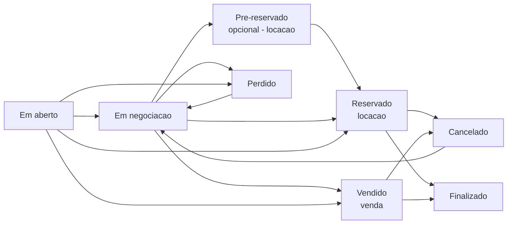

# Acompanhando e fechando

Depois de criar a proposta, você acompanha cada orçamento até o fechamento. A tela de orçamentos tem duas visões: o **funil** (kanban, padrão) — colunas por etapa, onde você arrasta o card para mudar de fase — e a **lista** tradicional, com busca e filtros.

## Os estados do orçamento

| Estado | O que significa | Quando aparece |
| --- | --- | --- |
| **Em aberto** | Criado, ainda sem ação. | Sempre — é onde o orçamento nasce. |
| **Em negociação** | Enviado ao cliente, aguardando a resposta. | Aluguel e venda. |
| **Pré-reservado** | Um "segurar" o aluguel antes de confirmar de vez. | **Opcional**, só locação. |
| **Reservado** | Aluguel confirmado — o **ganho** da locação; o estoque é bloqueado. | Locação. |
| **Vendido** | Venda confirmada — o **ganho** da venda. | Venda. |
| **Perdido** | A proposta não fechou (no funil, antes do ganho). | Aluguel e venda. |
| **Cancelado** | Cancelado **depois** de ganho — já havia compromissos. | Pós-reserva/venda. |
| **Finalizado** | Operação concluída com sucesso. | Fim do ciclo. |


**A pré-reserva é opcional.** Ela serve para "segurar" um aluguel enquanto o cliente decide, sem confirmar de vez. Quem prefere pode **pular** essa etapa e ir direto de Em aberto ou Em negociação para **Reservado**. Use se ajudar a sua operação; ignore se não precisar.


## Marcar como ganho (reservado / vendido)

Marcar um orçamento como **ganho** é o momento que liga a operação. Ao reservar (locação) ou vender (venda), o LocFlow encadeia o resto sozinho:

* gera a **fatura** correspondente, com parcelas (veja [Faturas e parcelas](../cobranca/faturas-e-parcelas.md));
* libera a **logística** de entrega e retirada — ou só de entrega, na venda (veja [Logística](../logistica/visao-geral.md)).


**Faltou agendar algo?** Antes de reservar ou vender, o LocFlow confere os pré-requisitos (por exemplo, datas de entrega e retirada). Se faltar alguma coisa, ele abre a edição já apontando o que resolver — em **âmbar**, como um aviso — em vez de só recusar a ação. Você ajusta e confirma em um toque.



**Por que isso te faz faturar mais:** no instante em que você ganha o pedido, a cobrança já existe e a equipe já sabe que tem entrega para preparar. Você para de "esquecer de faturar" e de descobrir tarde demais que o material não foi separado. Pedido ganho vira dinheiro entrando e operação rodando — sem retrabalho.


## Editando depois de ganho

Precisou ajustar um orçamento já ganho? Pode editar — o LocFlow reflete a mudança na **fatura** e na **logística** automaticamente, desde que a operação ainda não tenha avançado demais.

O limite é o material já ter saído para entrega:

* **Antes da entrega** — você ainda altera itens, valores, datas e frete; a fatura se ajusta pela diferença.
* **Depois de entregue** — os **itens não podem mais mudar** (já estão com o cliente). Você ainda edita **valores**. Para trocar materiais, o caminho é **criar um novo orçamento**.

> Quando a mudança for grande e os itens já tiverem saído, a recomendação costuma ser **abrir um novo orçamento** em vez de remendar o atual — fica mais limpo para você e para o cliente.

## Perda e cancelamento (com motivo)

Nem todo orçamento fecha — e tudo bem. O LocFlow separa duas situações, e em ambas pede um **motivo** (da lista) ou uma **observação** escrita:

* **Perdido** — a proposta não avançou, **antes** do ganho. Não há compromisso financeiro nem logístico para desfazer.
* **Cancelado** — o negócio cai **depois** de reservado/vendido. Como já existiam fatura e logística, o cancelamento tem consequências a tratar.

| Situação | Quando | Exemplos de motivo |
| --- | --- | --- |
| **Perdido** | Antes do ganho (no funil) | Cliente não respondeu, Preço, Encontrou outro fornecedor, Redução de escopo, Desistência do evento, Mudança de data, Estoque indisponível |
| **Cancelado** | Depois do ganho | Desistência do evento, Mudança de data, Inadimplência, Erro no orçamento, Estoque indisponível |


**Por que registrar o motivo vale a pena:** com o tempo, o motivo das perdas vira um mapa do seu negócio — se "Preço" aparece sempre, talvez sua tabela esteja fora do mercado; se é "Não respondeu", o problema é o follow-up. Saber **por que** você perde é o primeiro passo para perder menos.


Um orçamento **Perdido** ou **Cancelado** pode ser **reaberto** para uma nova tentativa — ele volta para a negociação.

## Situações reais

- **Cliente sumiu:** mandou o orçamento, cobrou duas vezes, sem resposta. Marca como **Perdido** com o motivo "Cliente não respondeu" — e, se ele voltar mês que vem, é só **reabrir**.
- **Fechou na hora:** cliente confirmou o aluguel pelo WhatsApp. Você arrasta o card para **Reservado** no funil — a fatura nasce e a entrega já entra na fila.
- **Evento cancelou:** o cliente desmarcou a festa depois de reservar. Você marca **Cancelado** com o motivo "Desistência do evento"; o LocFlow já sabe que há fatura e logística a tratar.

## Próximo passo

Orçamento ganho? Siga para a [cobrança](../cobranca/faturas-e-parcelas.md) ou para a [logística](../logistica/visao-geral.md). Quando uma regra trava o orçamento aguardando uma decisão, veja [Aprovação de orçamento](aprovacao.md). Para o quadro geral, volte ao [ciclo de um pedido](../conceitos/ciclo-de-um-pedido.md).
