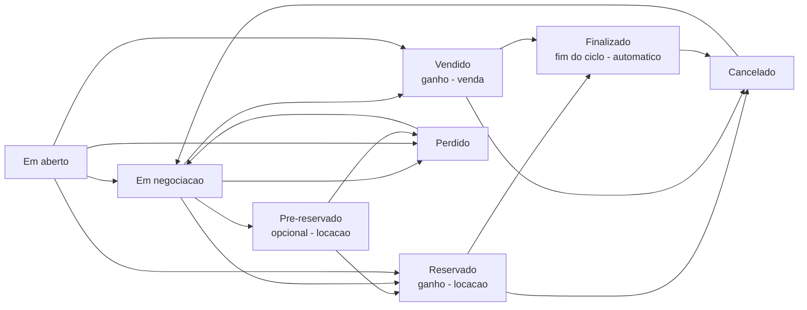
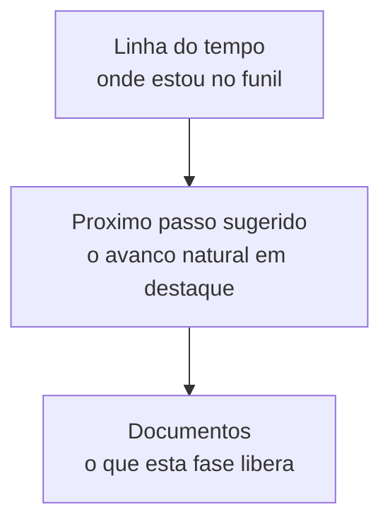

# Acompanhando e fechando

Depois de criar a proposta, você acompanha cada orçamento até o fechamento. A tela de orçamentos tem duas visões: o **funil** (kanban, padrão) — colunas por etapa, onde você arrasta o card para mudar de fase — e a **lista** tradicional. Nas duas há busca e filtros, e em ambas você abre as **Ações rápidas** de um orçamento para ver onde ele está, o que fazer a seguir e gerar documentos.


O funil é de **um tipo de negócio por vez** — alterne entre **Aluguel** e **Venda** no topo. Cada card mostra a **chance de fechar** (uma estimativa para você priorizar quem cobrar primeiro). Prefere a visão clássica? Alterne para **Lista**.


## Buscar e filtrar {#buscar-e-filtrar}

A busca do topo encontra o orçamento pelo **código** (ORC-1), pelo **número que ele tinha no sistema antigo** (se você importou o histórico) ou pelo **nome do cliente**. Ao lado dela, o botão de **filtros** abre um painel com:

| Filtro | O que recorta |
| --- | --- |
| **Tipo de negócio** | Aluguel ou Venda. Trocar o tipo tira do filtro os status e as datas que não existem nele. |
| **Status** | Um ou vários estados (Em aberto, Em negociação, Reservado, Perdido…). |
| **Datas** | Escolha o tipo de data — evento, criação ou vencimento do orçamento, entrega dos itens, retirada ou devolução pelo cliente, retirada pela equipe — e o calendário abre na hora. O **Aplicar** do calendário já aplica o filtro; a linha do período mostra as datas escolhidas. |
| **Procedência** | Só para quem vê os acordos de parceria: **Próprios (sem repasse)** ou **Da rede de parcerias** — e, dentro da rede, **de quais parceiros** (um ou vários). |

Cada filtro aplicado vira um chip com o seu **x**, e o botão mostra quantos estão ativos. O recorte vale no funil e na lista, e fechar o painel não perde nada: o que você marcou já está valendo.


**"Próprio" e "de um parceiro" não combinam.** Próprio é justamente o pedido que não foi repassado a ninguém — por isso, ao trocar para **Próprios**, os parceiros escolhidos saem do filtro.


## Os estados do orçamento

Todo orçamento tem um **estado comercial** — onde ele está no funil. Os estados dependem do tipo de negócio (locação ou venda).

```mermaid
flowchart LR
    AB[Em aberto] --> NEG[Em negociacao]
    NEG --> PR[Pre-reservado<br/>opcional - locacao]
    PR --> RES[Reservado<br/>ganho - locacao]
    NEG --> RES
    AB --> RES
    NEG --> VEN[Vendido<br/>ganho - venda]
    AB --> VEN
    NEG --> PER[Perdido]
    AB --> PER
    PR --> PER
    RES --> CAN[Cancelado]
    VEN --> CAN
    RES --> FIN[Finalizado<br/>fim do ciclo - automatico]
    VEN --> FIN
    FIN --> CAN
    PER --> NEG
    CAN --> NEG
```

| Estado | O que significa | Quando aparece |
| --- | --- | --- |
| **Em aberto** | Criado, ainda sem ação. | Sempre — é onde o orçamento nasce. |
| **Em negociação** | Enviado ao cliente, aguardando a resposta. | Aluguel e venda. |
| **Pré-reservado** | Um acerto comercial antes de confirmar de vez — **não bloqueia estoque**. | **Opcional**, só locação. |
| **Reservado** | Aluguel confirmado — o **ganho** da locação; o estoque é bloqueado. | Locação. |
| **Vendido** | Venda confirmada — o **ganho** da venda. | Venda. |
| **Perdido** | A proposta não fechou (no funil, antes do ganho). | Aluguel e venda. |
| **Cancelado** | Cancelado **depois** de ganho — já havia compromissos. | Pós-reserva/venda (inclusive depois de finalizado). |
| **Finalizado** | A **logística** terminou (o material cumpriu o ciclo). A cobrança segue independente. | No fim da logística, automaticamente. |


**Finalizado é automático — você não arrasta para cá.** O LocFlow encerra o ciclo **da logística** sozinho quando ela termina: na **venda**, quando a entrega se conclui (ou o cliente retira na loja); na **locação**, quando os itens voltam — e, se a sua operação usa **conferência**, só depois de conferidos. Veja [Visão geral da logística](../logistica/visao-geral.md).



**Finalizado não fecha a cobrança.** O "Finalizado" é sobre a **logística**, não sobre o financeiro. Se você entregou sem ter faturado antes, **ainda pode gerar a cobrança** de um pedido já finalizado — os dois eixos são independentes, para você nunca ficar sem como cobrar o que já saiu.



**A pré-reserva é opcional.** Ela registra um aluguel praticamente acertado enquanto o cliente decide, sem confirmar de vez — é uma etapa do funil, não um bloqueio de estoque. Quem prefere pode **pular** essa etapa e ir direto de Em aberto ou Em negociação para **Reservado**, que é onde o estoque de fato fica bloqueado. Use se ajudar a sua operação; ignore se não precisar.


### "Pendente" não é um estado do funil

Você pode ver um orçamento marcado como **Pendente** na **primeira coluna** do funil — tracejada em âmbar, com a legenda *"pré-etapa · aprove p/ entrar"* (em telas largas ela fica à esquerda das etapas; no celular, no topo, antes das outras). Ela só aparece quando há orçamento aguardando, não aceita arrastar, e cada cartão traz **Aprovar** e **Rejeitar**. É fácil confundir com "em aberto" — mas **não é**. "Pendente" é uma **pré-etapa por política**: o orçamento está **congelado aguardando a aprovação** de um responsável (por exemplo, porque o frete passou de um limite que você definiu). Ele continua tendo seu estado comercial normal por baixo (Em aberto, Em negociação…), só não pode avançar enquanto não for aprovado.


Não trate Pendente como "em aberto". Um orçamento Pendente **não está parado por falta de ação sua** — está esperando um **aval**. Aprovado, ele entra (volta) no funil e segue normalmente; rejeitado com motivo, volta para edição. O detalhe de quem aprova e como está em [Aprovação de orçamentos](aprovacao.md).


## Quando o orçamento vence (a validade) {#quando-o-orcamento-vence}

Todo orçamento tem uma **data de validade** — por quantos dias a proposta fica "de pé" a partir da criação (padrão **7 dias**, ajustável no [Motor de Orçamento](../configuracoes/motor-de-orcamento.md#validade-do-orcamento) e alterável em cada orçamento). É o prazo que você combina com o cliente: *"esse valor vale até tal dia."*

Passou dessa data, o orçamento está **vencido** — e vencido tem uma consequência concreta: **ele não avança mais**. Preços, disponibilidade e regras podem ter mudado desde que você montou a proposta, então o LocFlow **não deixa** você marcar como em negociação, pré-reservar, reservar, vender ou reabrir um orçamento fora da validade sem antes resolver isso.

Você reconhece um vencido **de imediato**, sem precisar tentar movê-lo:

* no **funil**, ele sai das colunas normais e se agrupa em **Expirados** (uma faixa âmbar, logo acima de "Fora do funil");
* na **lista**, o card ganha um **selo âmbar "Expirado"** no lugar da chance de fechar;
* ao **abrir** o orçamento, um **aviso no topo** avisa que ele está expirado (com a data em que venceu) e oferece dois botões: **Renovar validade** e **Criar novo**.


**Vencido não é um novo estado do funil** — é a validade que passou. Por baixo, o orçamento continua no estado em que estava (Em aberto, Em negociação…); ele só fica **impedido de seguir** até você agir. Pense nele como um orçamento "dormindo": ainda está ali, mas a proposta daquele jeito não vale mais. (É parecido com o **Pendente** logo acima: uma condição sobre o orçamento, não uma coluna do funil.)


### O que fazer com um orçamento vencido

Você tem três caminhos, conforme a conversa com o cliente:

| Caminho | Quando usar | Como |
| --- | --- | --- |
| **Renovar** | O combinado ainda vale — só passou do prazo. | Edite o orçamento e **estenda a data de validade**. Ele volta a andar, do mesmo ponto. |
| **Criar um novo** | Preços ou proposta mudaram — virou outra conversa. | Faça um **orçamento novo** com os valores atuais e mande ao cliente. O antigo fica de histórico. |
| **Encerrar** | O cliente não voltou e não vai fechar. | Marque como **Perdido** com o motivo *"Cliente não respondeu"* — vira aprendizado no seu funil. |


**Por que a validade te protege:** ela evita que um preço de dois meses atrás feche hoje, no automático. Quando o cliente reaparece com um orçamento vencido na mão, você não fica preso ao número antigo — **atualiza a validade** (se ainda faz sentido) ou **refaz a proposta** com os valores de agora, sem constrangimento: *"esse orçamento já venceu; faço um novo rapidinho e te mando."*



**A pré-reserva não bloqueia estoque.** Ela é um combinado comercial: enquanto o pedido está **Pré-reservado**, os itens continuam disponíveis para outro cliente. O bloqueio começa quando o pedido vira **Reservado** — o que acontece sozinho na quitação do sinal, se a sua operação usa esse gatilho. Se o cliente demorar a pagar, confirme a disponibilidade antes de prometer a data. Veja [Duração, cobrança e bloqueio de uso](duracao-e-bloqueio.md) e o [Motor de Orçamento](../configuracoes/motor-de-orcamento.md#validade-do-orcamento).


## A jornada e o próximo passo sugerido

Ao abrir as **Ações rápidas** de um orçamento, a tela é organizada em torno da **jornada** — onde o pedido está e para onde vai naturalmente.

```mermaid
flowchart TB
    LT[Linha do tempo<br/>onde estou no funil] --> PP[Proximo passo sugerido<br/>o avanco natural em destaque]
    PP --> DOC[Documentos<br/>o que esta fase libera]
```

* **Linha do tempo** — a sequência do tipo de negócio (Em aberto → Negociação → … → Reserva/Venda), com a etapa atual destacada, as concluídas com um *check* e as futuras numeradas. No celular ela aparece compacta ("etapa X de Y") e expande ao toque; em telas grandes vira um passo a passo horizontal.
* **Próximo passo sugerido** — o avanço natural do funil em destaque (um botão grande com o verbo da ação, ex.: **Reservar**, **Vender**), e as demais transições possíveis como atalhos ("Ou avance de outra forma").
* **Documentos** — os arquivos que aquela fase libera (veja a seção a seguir).


**Por que a jornada te ajuda a faturar:** em vez de uma lista de botões soltos, você vê *um* próximo passo claro. Menos dúvida, menos pedido esquecido no meio do funil — e cada toque te empurra para o fechamento.


### Mudando de fase

Você muda o estado de duas formas, e as duas fazem a **mesma coisa** por baixo:

* **No funil:** arraste o card para outra coluna.
* **Nas Ações rápidas:** toque no próximo passo sugerido (ou num dos atalhos).

Quando a mudança avança o funil, o LocFlow te leva às **Ações rápidas** já com o novo estado, para você confirmar e seguir.

## Quais documentos cada fase libera

O LocFlow só oferece os documentos que **fazem sentido** no estado atual — você não vê um contrato de reserva num orçamento ainda em aberto. A tabela abaixo é o que o sistema mostra hoje, por estado e tipo de negócio:

| Estado | Locação | Venda |
| --- | --- | --- |
| **Em aberto** | WhatsApp · Orçamento em PDF | WhatsApp · Orçamento em PDF |
| **Em negociação** | WhatsApp · Orçamento em PDF | WhatsApp · Orçamento em PDF |
| **Pré-reservado** | WhatsApp · Orçamento em PDF · Contrato de pré-reserva | — (não existe na venda) |
| **Reservado** *(ganho)* | Contrato de reserva · **Fatura de locação** · Recibo de pagamento · Ordem logística · Orçamento em PDF · WhatsApp | — |
| **Vendido** *(ganho)* | — | Contrato de venda · Ordem logística · Orçamento em PDF · WhatsApp |
| **Finalizado** | Contrato de locação · Fatura de locação · Recibo de pagamento · Ordem logística · Orçamento em PDF · WhatsApp | Contrato de venda · Ordem logística · Orçamento em PDF · WhatsApp |
| **Perdido / Cancelado** | Orçamento em PDF (além da ação de **reabrir**) | Orçamento em PDF (além da ação de **reabrir**) |

Com **três ou mais** documentos no estado, as Ações rápidas não empilham um cartão por documento: aparece uma linha só, **Gerar documento · N disponíveis neste status**, que abre a lista para você escolher. Com dois, continuam os dois cartões.

Alguns detalhes úteis:

* **WhatsApp** gera um texto pronto para colar no chat do cliente — você copia ou abre direto.
* **Orçamento em PDF** é o arquivo da proposta, com layout ajustável. Ele continua disponível depois do ganho — e também num orçamento perdido ou cancelado, como registro do que foi proposto.
* **Ordem logística** lista os itens com a carga (dimensões, peso e volume) para o galpão e a rota.
* **Fatura de locação** é o documento de cobrança do aluguel (valores, parcelas e vencimentos) — por isso só aparece na locação.
* **Recibo de pagamento** é o comprovante de quitação: valor, forma e data do pagamento. Com a fatura ainda não quitada, ele sai como recibo pendente.


**Gere a cobrança antes da fatura em PDF.** Se você gerar a fatura de locação antes de ter emitido a cobrança, o LocFlow avisa: *"A fatura sai com os valores previstos do orçamento, mas sem parcelas, vencimentos nem situação de pagamento — recomendamos gerar a cobrança antes para refletir os prazos reais."*


### Gerar e enviar sem trocar de tela

A geração é **embutida**: ao clicar num documento, o preparo abre ali mesmo (num painel à direita em telas grandes, numa folha que sobe no celular) — você não sai das Ações rápidas. No preparo você:

* edita o **nome do arquivo**;
* ajusta as **opções deste envio**, conforme o documento:
  * **Lista de itens** — **Normal** (o kit numa linha única) ou **Agrupamento** (o kit "pai" com os componentes recuados);
  * **Fotos dos itens** — com ou sem a coluna de fotos, para uma versão mais enxuta;
  * **Anexo do orçamento** (só no contrato) — **Com anexo**, o contrato sai com a relação completa de itens e valores; **Sem anexo**, ele apenas cita o código do orçamento;
  * **Carga** (na ordem logística) — **Por viagem** (quando há mais de uma), **Agrupada** por produto ou **Com kits**; e, com várias viagens, **qual viagem incluir** (todas ou uma específica);
* vê uma **pré-visualização ao vivo**;
* e finaliza com **Compartilhar** ou **Baixar** (PDF), ou **Copiar / Abrir** (WhatsApp).


**O LocFlow lembra a sua última escolha.** O que você marcou ao gerar um documento — por exemplo, **Agrupamento** e **Com anexo** no contrato — vem pré-marcado da próxima vez, para você, naquele documento. Só vira preferência o que **você** tocou: o que veio sugerido pelo modelo ou definido pela organização continua seguindo a organização.


O padrão da organização para o anexo fica no modelo do contrato, em **Ajustes › Modelos de documento** (a opção **Anexar o orçamento ao contrato**) — e quem gera pode desligá-lo numa geração específica. Veja [Modelos de documento](../documentos/modelos-personalizados.md).

Ao **baixar**, o arquivo entra no cartão de transferências — o mesmo dos envios — com o andamento; enquanto o servidor ainda está montando o documento, a linha diz *"Gerando o PDF…"*.


**Gera sempre o mesmo documento no mesmo momento?** Deixe com uma automação, em **Ajustes › Automações**: por exemplo, *"Quando o cliente fechar → gerar Contrato de locação"* ou *"Quando eu gerar uma cobrança → gerar a Fatura de locação"*, com as mesmas opções de geração. Veja [Automações](../configuracoes/automacoes.md).


### Documentos gerados {#documentos-gerados}

Tudo o que já foi gerado para o pedido fica nas Ações rápidas, na seção **Documentos gerados** — cada arquivo com a data, o tamanho e se já foi copiado para a nuvem (*No Google Drive*, *Não enviado*…). Por documento, você pode **Visualizar** ou **Gerar novamente**; quando o modelo mudou depois da geração, a linha avisa *"Modelo atualizado disponível"*.

* **Vários de uma vez:** marque os documentos e use **Enviar como ZIP** (no celular, também **Compartilhar**) ou **Baixar ZIP** (no computador). Cabem até **50 documentos e 80 MB** por arquivo .zip — passou disso, a tela diz e você baixa em duas levas.
* **Nuvem:** com a [sincronização em nuvem](../configuracoes/sincronizacao-em-nuvem.md) ligada, o botão **Sincronizar a nuvem agora** pede a cópia na hora.
* **Em segundo plano:** quando uma geração roda sozinha — por exemplo, por uma automação —, o cartão aparece como **Gerando…** e vira o documento quando ele fica pronto. Se faltar um dado que só uma pessoa tem, a linha diz o que falta.


**Gerar novamente substitui o arquivo.** O documento é refeito com o modelo ativo e gravado **por cima** do PDF atual — vale também para contrato já assinado ou enviado — e **não há como recuperar** a versão anterior. Por isso o app pede confirmação antes (**Substituir documento**).


## Marcar como ganho (reservado / vendido)

Marcar um orçamento como **ganho** — **Reservado** na locação, **Vendido** na venda — é o momento que liga a operação:

* a **logística** de entrega e retirada (só de entrega, na venda) é liberada **sozinha** — a não ser que o seu Motor de Logística esteja com **Exigir fatura antes** ligado: aí ela fica em **Aguardando cobrança** e começa quando a cobrança for gerada (veja [Logística](../logistica/visao-geral.md));
* a **cobrança** é decisão sua: ela **não** nasce sozinha. Nas Ações rápidas, a linha **Cobrança** fica como **Pendente de gerar**, com o botão **Gerar cobrança** (veja [Emitindo a cobrança](../cobranca/emitindo-a-cobranca.md)).


**Quando a sua operação exige a cobrança para reservar**, o LocFlow junta as duas coisas: ao tocar em **Reservar**, a folha de cobrança abre sozinha e, gerada a cobrança, a reserva é concluída no mesmo passo. Se a exigência for o **sinal**, a cobrança é gerada e a reserva se conclui sozinha quando o sinal for quitado.


Antes do ganho, a linha **Cobrança** já aparece nas Ações rápidas, dizendo em que etapa ela fica disponível — **Disponível na pré-reserva** (ou na reserva, ou na venda) — com o botão para avançar o pedido até lá: é nessa etapa que o cliente já tem um compromisso e o link de pagamento passa a abrir para ele. Um orçamento de valor zero aparece como **Cortesia — sem cobrança**.

Depois do ganho, as Ações rápidas trocam o "próximo passo" por um aviso **Orçamento ganho** e uma seção **Acompanhar operação**, com uma linha para cada frente:

| Linha | O que mostra | Atalho |
| --- | --- | --- |
| **Cobrança** | **Pendente de gerar**, a situação da fatura (em aberto, paga…) ou **Cortesia — sem cobrança** | **Gerar cobrança** ou **Ver cobrança** |
| **Logística** | O passo em que o pedido está — ou **Aguardando cobrança**. Com a carga dividida, conta as viagens. | **Ver** |
| **Repasse a parceiro** | Só para quem tem acordos de parceria: **Compare seus parceiros**, **Nenhum acordo cobre todos os itens** ou, já repassado, a resposta do parceiro (**Aguardando o parceiro decidir**, **Aceito pelo parceiro**, **Prazo de aceite expirou — retome no detalhe**…) | **Repassar** ou **Ver** |

Veja como repassar em [Repassando um pedido](../parcerias/repassando-um-pedido.md).


**Faltou agendar algo?** Antes de reservar ou vender, o LocFlow confere os pré-requisitos (por exemplo, datas de entrega e retirada). Se faltar alguma coisa, ele abre a edição já apontando o que resolver — em **âmbar**, como um aviso — em vez de só recusar a ação. Você ajusta e confirma em um toque.



**Por que isso te faz faturar mais:** no instante em que você ganha o pedido, a equipe já sabe que tem entrega para preparar — e a cobrança fica a um toque, na mesma tela, da pré-reserva em diante, inclusive depois de finalizado. Você para de "esquecer de faturar" e de descobrir tarde demais que o material não foi separado.


## Editando depois de ganho {#editando-depois-de-ganho}

Precisou ajustar um orçamento já ganho? Pode editar — o LocFlow reflete a mudança na **fatura**, na **logística** e no **estoque** automaticamente. Mas há limites, e vale conhecê-los antes de prometer a mudança ao cliente.

### Cada seção diz o que acontece se você mexer {#marcas-da-edicao}

Num pedido ganho, o formulário mostra uma **legenda** no topo e uma **marca** no cabeçalho de cada seção:

| Marca | O que significa | Seções |
| --- | --- | --- |
| *(sem marca)* | Edite à vontade: muda só este orçamento. | Observações e Validade |
| **Repercute** (pontos ligados) | Dá para editar, e a mudança chega no estoque, no roteiro ou na cobrança. O **?** da seção conta o efeito. | Evento, Saída do material, Retorno do material, Frete, cargas e viagens, Duração, Acréscimos e descontos — e os Itens, até o material ser entregue |
| **Travado** (cadeado) | Não muda mais. | Tipo de negócio e Vendedor; os Itens, depois de entregues; no Cliente, o cadastro do cliente — o **responsável** da empresa continua editável |

O **?** de cada seção que repercute diz o efeito em uma frase — por exemplo, mudar o **Evento** *"muda a janela que segura o material no estoque e pode desatualizar o roteiro"*; mexer em **Acréscimos e descontos** *"recalcula a fatura: pode gerar parcela nova ou saldo a devolver"*. Para trocar o **tipo de negócio** ou o **cliente** de um pedido ganho, volte o orçamento para negociação.

### O limite dos itens é a entrega, não o despacho {#limite-dos-itens}

| Momento | Dá para mexer nos itens? |
| --- | --- |
| Antes de despachar (a separar, separado) | **Sim.** |
| **Com o caminhão já na rua** (saiu para entrega) | **Sim** — a diferença vira um movimento novo a encaixar num roteiro. |
| **Material com o cliente** (entregue, retirado na loja) ou já em reversa/conferência | **Não.** *"Os itens não podem ser alterados após o despacho."* Só valores mudam. Para trocar materiais, **crie um novo orçamento**. |

### A edição pode ser recusada por estoque {#recusada-por-estoque}


**Contraintuitivo, mas proposital: só adiar a entrega em dois dias já pode travar o salvamento.** Quando você mexe em **itens** ou em **datas**, o LocFlow refaz a checagem de disponibilidade sobre a **janela nova** (descontando a reserva deste mesmo pedido). Se o material não couber, a edição é recusada:

> *"Não há estoque disponível para todos os itens na janela de uso."*

ou, se a sua regra permite furar com limite, a mensagem do **teto de overbooking**. Ajuste as quantidades, escolha outra data ou reveja as regras em [Galpões e disponibilidade](../estoque/galpoes-e-disponibilidade.md).


Há ainda um terceiro motivo de recusa, mais raro: quando as datas novas **não permitem calcular a janela de bloqueio de uso**, ou quando o **bloqueio manual** que você definiu não cobre a logística nova. Veja [Duração, cobrança e bloqueio de uso](duracao-e-bloqueio.md#politica-de-bloqueio).

### O efeito na operação (e no parceiro) {#efeito-na-operacao}

Toda edição pós-ganho tem efeito colateral do outro lado: o roteiro pode ficar **desatualizado**, a reserva de estoque é reconciliada, e a mudança pode até **quebrar a promessa de outro pedido**. Isso tem uma página própria — leia [Quando um pedido muda depois de fechado](../logistica/quando-um-pedido-muda.md).


**Se o pedido já foi repassado a um parceiro, mexer nos itens devolve a decisão a ele.** O aceite dele era sobre o pedido antigo: mudar os itens faz a operação voltar a "aguardando a decisão do parceiro", e ele pode recusar. Fale com ele antes — veja [O pedido já estava com um parceiro](../logistica/efeitos-na-parceria.md#itens-revogam-o-aval).


> Quando a mudança for grande e os itens já tiverem chegado ao cliente, a recomendação costuma ser **abrir um novo orçamento** em vez de remendar o atual — fica mais limpo para você e para o cliente.

## Perda e cancelamento (com motivo) {#perda-e-cancelamento-com-motivo}

Nem todo orçamento fecha — e tudo bem. O LocFlow separa duas situações, e em ambas pede um **motivo** (da lista) ou uma **observação** escrita:

* **Perdido** — a proposta não avançou, **antes** do ganho. Em geral não há compromisso a desfazer — a exceção é a pré-reserva que já tem cobrança, que segue a mesma regra do dinheiro descrita abaixo.
* **Cancelado** — o negócio cai **depois** de reservado/vendido (dá para cancelar até um pedido já finalizado). Como já existiam compromissos — a logística e, muitas vezes, uma cobrança —, o cancelamento tem consequências a tratar.

| Situação | Quando | Exemplos de motivo |
| --- | --- | --- |
| **Perdido** | Antes do ganho (no funil) | Cliente não respondeu · Preço · Redução de escopo · Desistência do evento · Mudança de data · Fora da área de entrega · Estoque indisponível · Capacidade operacional |
| **Cancelado** | Depois do ganho | Desistência do evento · Mudança de data · Inadimplência · Erro no orçamento · Estoque indisponível · Capacidade operacional |


**Por que registrar o motivo vale a pena:** com o tempo, o motivo das perdas vira um mapa do seu negócio — se "Preço" aparece sempre, talvez sua tabela esteja fora do mercado; se é "Não respondeu", o problema é o follow-up. Saber **por que** você perde é o primeiro passo para perder menos.


### O que é conferido antes de cancelar (ou de voltar atrás) {#travas-do-encerramento}

Depois do ganho já existem compromissos — então o LocFlow confere antes de deixar você encerrar. As regras são **diferentes** nos dois caminhos, e de propósito: cancelar é um **desfecho legítimo** do negócio (pode acontecer até depois da entrega); "voltar para negociação" **apaga a história**, e por isso é mais restrito.

| Situação | **Cancelar** | **Voltar para negociação** |
| --- | --- | --- |
| Há **cobrança em aberto**, sem pagamento | Passa — e, na mesma janela, você confirma o encerramento da cobrança (parcelas abertas e links de pagamento entram junto). | Passa — a cobrança também entra em encerramento, com a sua confirmação. |
| A cobrança já tem **algum pagamento** (total ou parcial) | Passa — mas a janela pede o **Destino do valor**, obrigatório (veja abaixo). | **Barra.** A tela diz quanto já foi recebido e indica **Cancelar orçamento** para dar destino ao dinheiro. |
| A **rota já saiu** (execução iniciada) | Passa — fica registrada a pendência a conciliar. | **Barra.** |
| Material **já entregue ou retirado** | Passa — é justamente o caso do evento que acabou. | **Barra.** Registre a devolução antes. |

**Cancelar um pedido já pago não é barrado: o dinheiro ganha um destino.** Quando o cliente já pagou — tudo ou só o sinal —, a janela de cancelamento (e a de **Perdido**, numa pré-reserva com cobrança) mostra o bloco **Destino do valor**, com duas saídas:

| Destino | O que acontece |
| --- | --- |
| **Vale-locação** | O valor fica como crédito do cliente, para usar numa próxima cobrança. |
| **Devolver ao cliente** | **Solicitar ao provedor** — o LocFlow pede o estorno ao provedor de pagamento e acompanha até ele confirmar (boleto pago pede a conta bancária do cliente). **Registrar devolução externa** — para o que você já devolveu por fora: informe a conta de onde o dinheiro saiu, como foi devolvido, a data e o comprovante. |

Vale já usado na cobrança volta sozinho para a carteira do cliente. Encerrar um pedido que tem cobrança exige a permissão de **cancelar cobranças**: sem ela, a janela pede que alguém com esse acesso conclua. O passo a passo do dinheiro está em [Cancelar uma cobrança com segurança](../cobranca/faturas-e-parcelas.md#cancelar-uma-cobranca-com-seguranca).


**Se o pedido foi repassado a um parceiro, encerrar tem mais um custo.** O repasse é desfeito, o parceiro é avisado com o valor que saiu dos ganhos dele, e um cancelamento **em cima da hora depois do aceite** pesa na sua reputação na rede — a menos que você escolha, na lista, um motivo que descreve um ato do cliente (desistência do evento, mudança de data, preço, achou outro fornecedor ou inadimplência) — motivo escrito à mão não isenta. Leia [Cancelar ou reverter um pedido repassado](../logistica/efeitos-na-parceria.md#cancelar-repassado).


O que o encerramento desfaz na operação (roteiros, projeções, estoque) está detalhado em [Reverter o ganho e cancelar](../logistica/quando-um-pedido-muda.md#reverter-e-cancelar).

Um orçamento **Perdido** ou **Cancelado** pode ser **reaberto** para uma nova tentativa — ele volta para a negociação. Nas Ações rápidas, esses estados aparecem como um aviso convidando a reabrir; nos documentos, continua disponível o **Orçamento em PDF**, como registro do que foi proposto. A exceção é a **validade**: se o orçamento já **venceu**, não dá para reabrir por cima do prazo — antes você **renova a validade** ou parte para um **orçamento novo** (veja [Quando o orçamento vence](#quando-o-orcamento-vence)).

## Por porte: você acompanha do seu jeito

| Porte | Como costuma usar |
| --- | --- |
| **Pequeno** | O funil já basta: arrasta o card, fecha o negócio, gera o PDF/WhatsApp. Sem aprovação, sem coluna Pendente. |
| **Médio** | Usa o "próximo passo sugerido" para não deixar pedido travado e começa a registrar **motivos de perda** para entender onde escorrega o faturamento. |
| **Grande** | Times separados (vendedor monta, gestor aprova), a coluna **Pendente** do funil como rotina, filtros por procedência para separar o que é da rede, e os relatórios de perda viram decisão de preço e de área de atendimento. |

## Situações reais

- **Cliente sumiu:** mandou o orçamento, cobrou duas vezes, sem resposta. Marca como **Perdido** com o motivo "Cliente não respondeu" — e, se ele voltar mês que vem, é só **reabrir** (desde que ainda esteja dentro da validade).
- **Voltou tarde, orçamento vencido:** o cliente reaparece três semanas depois querendo fechar, mas a validade já passou. Você abre o orçamento, vê que está **vencido** e decide: **estende a validade** (se o preço ainda vale) ou **cria um novo** com os valores de agora. O sistema não deixa reservar por cima do prazo vencido — de propósito.
- **Fechou na hora:** cliente confirmou o aluguel pelo WhatsApp. Você arrasta o card para **Reservado** no funil — a entrega já entra na fila, e a cobrança fica a um toque: **Gerar cobrança**, nas Ações rápidas, quando você quiser mandar o link.
- **Esperando o aval do gestor:** o orçamento aparece na coluna **Pendente**, a primeira do funil, porque o frete passou do limite. Não é "em aberto" — está congelado até alguém aprovar. Veja [Aprovação de orçamentos](aprovacao.md).
- **Evento cancelou:** o cliente desmarcou a festa depois de reservar. Você marca **Cancelado** com o motivo "Desistência do evento" — e o LocFlow desfaz a logística sozinho. Se o cliente **já tinha pago** (mesmo só o sinal), a janela pede o **destino desse dinheiro**: deixar como vale-locação para a próxima festa ou devolver ao cliente. Dinheiro do cliente dentro de casa não se apaga por mudança de status — ele sempre ganha um destino.
- **Adiei a entrega e o sistema não deixou salvar:** a data nova caiu numa semana em que o material já está comprometido. Não é bug — é o LocFlow evitando que você prometa o que não tem. Veja [A edição pode ser recusada por estoque](#recusada-por-estoque).

## Próximo passo

Orçamento ganho? Siga para a [cobrança](../cobranca/faturas-e-parcelas.md) ou para a [logística](../logistica/visao-geral.md). Precisou mexer no pedido depois de fechado? [Quando um pedido muda depois de fechado](../logistica/quando-um-pedido-muda.md) responde o que acontece com a rota, o estoque e o parceiro. Quando um orçamento aparece como **Pendente**, veja [Aprovação de orçamentos](aprovacao.md). Para o quadro geral, volte ao [ciclo de um pedido](../conceitos/ciclo-de-um-pedido.md).
