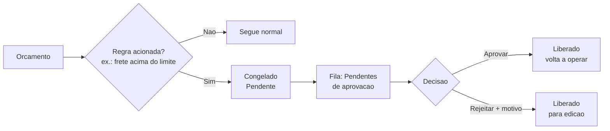

# Aprovação de orçamento

Em algumas operações, certos orçamentos não devem seguir adiante sem o aval de alguém. A aprovação do LocFlow cobre exatamente isso: quando uma **regra** é acionada (por exemplo, um **frete acima do limite** que você definiu), o orçamento é **congelado** e fica aguardando a decisão de um responsável.


**O congelamento é independente do status comercial.** Um orçamento pode estar **Em aberto** ou **Em negociação** e, ao mesmo tempo, congelado aguardando aprovação. Enquanto está congelado, as ações que mudam o orçamento (mudar de status, gerar cobrança, liberar logística) ficam **bloqueadas** até a aprovação. Hoje a regra que congela é o **frete**; outras podem entrar no futuro.


## Como funciona o fluxo

1. **A regra dispara** — o orçamento atinge a condição configurada (ex.: frete acima do limite).
2. **Ele é congelado** como **Pendente** e cai na fila **Pendentes de aprovação**.
3. **Um responsável decide** — pode **aprovar** (libera o orçamento para operar normalmente) ou **rejeitar com um motivo** (libera para edição, para que seja corrigido).

## A fila "Pendentes de aprovação"

Quem tem permissão vê um atalho **Pendentes** na tela de orçamentos. Lá ficam, em um só lugar, todos os orçamentos congelados aguardando decisão — com busca por código (ORC-1) ou nome do cliente. Você abre a ficha, confere os valores e decide ali mesmo:

* **Aprovar** — o orçamento volta a operar e some da fila.
* **Rejeitar** — abre uma janela pedindo o **motivo** da rejeição; ao confirmar, o orçamento é liberado para ser ajustado.

No próprio orçamento (na tela de ações rápidas), enquanto ele estiver congelado, aparece um aviso **"Aguardando aprovação"**, deixando claro por que os botões de status, cobrança e logística estão indisponíveis.

## Papéis: quem vê e quem decide

A aprovação respeita as permissões da sua equipe. Há duas camadas:

| Permissão | O que libera |
| --- | --- |
| **Ver pendências** | Enxergar o atalho e a fila de Pendentes de aprovação. |
| **Aprovar / rejeitar** | Os botões de **aprovar** e **rejeitar** dentro da fila. |

Assim, um vendedor pode até **ver** que um orçamento está aguardando aval, mas só quem tem a permissão de aprovação (tipicamente um gestor) consegue **liberar ou recusar**.

## Por porte: você usa só o que precisa

O LocFlow **abstrai para o pequeno e revela para o grande**. A aprovação é um desses recursos que você liga conforme cresce:

| Porte | Como costuma usar |
| --- | --- |
| **Pequeno** | Sem aprovação. Quem monta o orçamento já decide tudo — nada congela. |
| **Médio** | Uma regra ou outra (ex.: frete acima de um limite) congela só os casos fora do padrão, que o dono confere antes. |
| **Grande** | Aprovação como rotina, com papéis separados: a equipe monta, o gestor aprova. Os exageros nunca passam batido. |


**Por que isso protege o seu faturamento:** sem um freio, um frete errado ou um desconto fora da curva sai sem ninguém perceber — e o prejuízo só aparece no fim do mês. Com a aprovação, o caso fora do padrão **para** e espera um olhar humano antes de virar compromisso. Você cresce delegando a montagem dos orçamentos sem abrir mão do controle sobre o que aperta a margem.


## Situações reais

- **Frete que come a margem:** um pedido distante puxa um frete altíssimo. A regra congela o orçamento; o gestor olha, confirma que o valor faz sentido e **aprova** — ou pede ajuste e **rejeita** com o motivo.
- **Equipe nova montando orçamentos:** você contratou vendedores recém-chegados. Liga a aprovação por frete para ter certeza de que nenhum pedido sai com cálculo errado nas primeiras semanas.
- **Decisão à distância:** o orçamento ficou pendente no fim do dia. O gestor abre a fila **Pendentes de aprovação** do celular, confere e aprova — o pedido segue sem esperar ele chegar ao escritório.

## Próximo passo

Aprovado, o orçamento volta ao fluxo normal — veja [Acompanhando e fechando](acompanhando-e-fechando.md). Para entender o frete que costuma disparar a regra, veja [Logística](../logistica/visao-geral.md). Em dúvida sobre permissões e papéis, veja [onde tirar dúvidas](../primeiros-passos/onde-tirar-duvidas.md).
