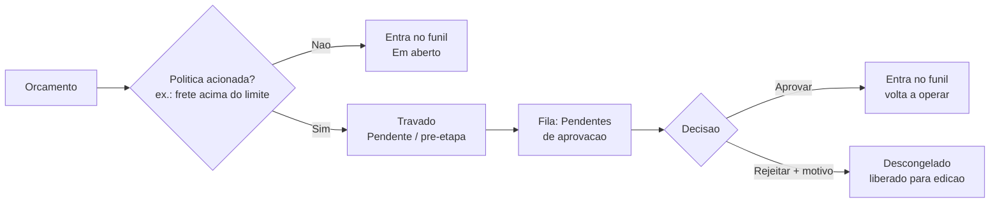

# Aprovação de orçamento

Em algumas operações, certos orçamentos não devem seguir adiante sem o aval de alguém. A aprovação do LocFlow cobre exatamente isso: quando uma **regra que você definiu** é acionada (por exemplo, um **frete acima do limite**), o orçamento fica **travado, aguardando a decisão de um responsável** antes de andar.

Isso vale tanto para **locação** quanto para **venda** — a regra olha o orçamento, não o que acontece com o item no fim.

## "Pendente" é uma pré-etapa do funil

Antes de tudo, vale separar dois nomes que parecem iguais, mas não são:

* **Em aberto** é o **primeiro estágio do funil** — o orçamento já está na esteira, em montagem/negociação, livre para andar.
* **Pendente (aguardando aprovação)** é uma **pré-etapa**: o orçamento está **travado na entrada do funil**, esperando alguém aprovar. Ele ainda **não está em aberto**; está, por assim dizer, na porta.


**Pendente não é "Em aberto".** Pendente é a fila da porta: o orçamento parou ali porque bateu numa regra. **Ao aprovar, ele entra no funil** e passa a se comportar como qualquer outro (em aberto, em negociação, e por aí vai). Por isso, na visão de lista dos seus orçamentos, "Pendente" aparece **destacado, à parte**, como uma pré-etapa — não misturado com as etapas normais.


## Por que um orçamento fica pendente: a política

O que decide se um orçamento trava ou não é uma **política configurável**, definida no **Motor de Orçamento** (em Ajustes › Motores). Você liga a política e escolhe o gatilho.

Hoje o gatilho disponível é o **frete acima de um limite**: você define um valor de corte e, sempre que o frete de um orçamento passar dele, o orçamento entra em **Pendente** automaticamente. Outros gatilhos podem entrar no futuro.


**Sem essa política ligada, nada trava.** A aprovação é opt-in: se você não configurar a regra no Motor de Orçamento, nenhum orçamento fica pendente — todos seguem direto para o funil. Ligue a política só quando quiser esse freio.


Para os detalhes de como configurar o Motor de Orçamento, veja [Motores operacionais](../configuracoes/motores-operacionais.md).

## O travamento é independente do status comercial

Um orçamento pode estar **Em aberto** ou **Em negociação** e, ao mesmo tempo, **travado aguardando aprovação** — são eixos diferentes. Enquanto está travado, as ações que **mudam** o orçamento ficam **bloqueadas**:

* mudar de status (avançar no funil),
* gerar cobrança,
* liberar a logística.

Tudo isso só volta a funcionar depois que alguém **aprovar**.

## Como funciona o fluxo

1. **A política dispara** — o orçamento atinge a condição configurada (ex.: frete acima do limite).
2. **Ele fica Pendente** (pré-etapa) e cai na fila **Pendentes de aprovação**.
3. **Um responsável decide** — pode **aprovar** (o orçamento entra no funil e volta a operar) ou **rejeitar com um motivo** (é descongelado e liberado para edição, para ser corrigido).

## A fila "Pendentes de aprovação"

Quem tem permissão vê um atalho **Pendentes** na tela de orçamentos. Lá ficam, em um só lugar, todos os orçamentos travados aguardando decisão — com busca por **código** (ORC-1) ou **nome do cliente**. Você abre a ficha, confere os valores e decide ali mesmo:

* **Aprovar** — o orçamento entra no funil e some da fila.
* **Rejeitar** — abre uma janela pedindo o **motivo** da rejeição; ao confirmar, o orçamento é liberado para ser ajustado.

A própria tela resume o que ela é: *"Orçamentos congelados aguardando sua decisão."*

### O motivo na rejeição

Ao rejeitar, o **motivo é obrigatório** — o botão "Rejeitar" só habilita depois que você escreve algo. O LocFlow explica, na própria janela, o que acontece em seguida:


*"Informe o motivo da rejeição. Ele descongela o orçamento e o libera para edição."*


Assim quem montou o orçamento sabe **por que** voltou e o que ajustar.

## O aviso no próprio orçamento

Você não precisa abrir a fila para perceber que algo travou. No próprio orçamento — na lista, no funil e na tela de ações — aparece um **selo âmbar "Aguardando aprovação"**. É ele que explica, à primeira vista, por que os botões de status, cobrança e logística estão indisponíveis naquele orçamento.

## Papéis: quem vê e quem decide

A aprovação respeita as permissões da sua equipe. Há **duas camadas**, separadas de propósito:

| Permissão | O que libera |
| --- | --- |
| **Ver pendências** | Enxergar o atalho e a fila de Pendentes de aprovação. |
| **Aprovar / rejeitar** | Os botões de **aprovar** e **rejeitar** dentro da fila. |

Na prática, um vendedor pode até **ver** que um orçamento está aguardando aval, mas só quem tem a permissão de aprovação (tipicamente um gestor) consegue **liberar ou recusar**. Quem só tem "ver" enxerga a fila sem os botões de decisão.

Para configurar essas permissões, veja [Colaboradores e acessos](../configuracoes/colaboradores-e-acessos.md).

## Por porte: você usa só o que precisa

O LocFlow **abstrai para o pequeno e revela para o grande**. A aprovação é um desses recursos que você liga conforme cresce:

| Porte | Como costuma usar |
| --- | --- |
| **Pequeno** | Sem aprovação. Quem monta o orçamento já decide tudo — nada trava, tudo entra direto no funil. |
| **Médio** | Uma regra ou outra (ex.: frete acima de um limite) trava só os casos fora do padrão, que o dono confere antes. |
| **Grande** | Aprovação como rotina, com papéis separados: a equipe monta, o gestor aprova. Os exageros nunca passam batido. |


**Por que isso protege o seu faturamento:** sem um freio, um frete errado ou um caso fora da curva sai sem ninguém perceber — e o prejuízo só aparece no fim do mês. Com a aprovação, o caso fora do padrão **para** e espera um olhar humano antes de virar compromisso. Você cresce delegando a montagem dos orçamentos sem abrir mão do controle sobre o que aperta a margem.


## Situações reais

- **Frete que come a margem:** um pedido distante puxa um frete altíssimo, acima do limite que você configurou. O orçamento fica **Pendente**; o gestor olha, confirma que o valor faz sentido e **aprova** — ou pede ajuste e **rejeita** com o motivo.
- **Equipe nova montando orçamentos:** você contratou vendedores recém-chegados. Liga a política por frete para garantir que nenhum pedido saia com cálculo errado nas primeiras semanas.
- **Venda de mostruário com frete pesado:** não é só locação. Uma venda de itens grandes, com entrega cara, também bate na regra e passa pela aprovação antes de virar fatura.
- **Decisão à distância:** o orçamento ficou pendente no fim do dia. O gestor abre a fila **Pendentes de aprovação** do celular, confere e aprova — o pedido segue sem esperar ele chegar ao escritório.

## Próximo passo

Aprovado, o orçamento entra no funil e segue o fluxo normal — veja [Acompanhando e fechando](acompanhando-e-fechando.md). Para configurar **quando** um orçamento deve travar, veja [Motores operacionais](../configuracoes/motores-operacionais.md). Para entender o frete que costuma disparar a regra, veja [Visão geral da logística](../logistica/visao-geral.md). Para ajustar quem vê e quem aprova, veja [Colaboradores e acessos](../configuracoes/colaboradores-e-acessos.md).
