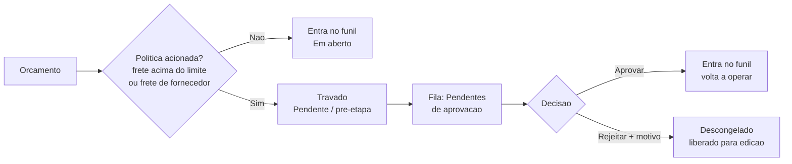

# Aprovação de orçamento

Em algumas operações, certos orçamentos não devem seguir adiante sem o aval de alguém. A aprovação do LocFlow cobre exatamente isso: quando uma **regra é acionada** — seja uma **regra que você definiu** (por exemplo, um **frete acima do limite**), seja um **frete de fornecedor**, que trava por natureza — o orçamento fica **travado, aguardando a decisão de um responsável** antes de andar.

Isso vale tanto para **locação** quanto para **venda** — a regra olha o orçamento, não o que acontece com o item no fim.

## "Pendente" é uma pré-etapa do funil

Antes de tudo, vale separar dois nomes que parecem iguais, mas não são:

* **Em aberto** é o **primeiro estágio do funil** — o orçamento já está na esteira, em montagem/negociação, livre para andar.
* **Pendente (aguardando aprovação)** é uma **pré-etapa**: o orçamento está **travado na entrada do funil**, esperando alguém aprovar. Ele ainda **não está em aberto**; está, por assim dizer, na porta.


**Pendente não é "Em aberto".** Pendente é a fila da porta: o orçamento parou ali porque bateu numa regra. **Ao aprovar, ele entra no funil** e passa a se comportar como qualquer outro (em aberto, em negociação, e por aí vai). Por isso, na visão de lista dos seus orçamentos, "Pendente" aparece **destacado, à parte**, como uma pré-etapa — não misturado com as etapas normais.


## Por que um orçamento fica pendente

Há **duas origens** para um orçamento nascer pendente, e as duas passam pelo frete:

1. Uma **regra por valor** que **você** ligou na sua organização (esta seção).
2. Um **frete de fornecedor**, que trava **por natureza** — mesmo sem você ligar regra nenhuma (veja [Quando o frete é de um fornecedor](#frete-de-fornecedor)).

### A política por valor da organização {#politica-por-valor}

O que decide se o **seu** frete trava é a **política de aprovação do frete**, configurada no **Motor Operacional de Frete** — em **Ajustes › Motores › Operação do frete** (atenção: é a *operação* do frete, não o motor de *cálculo* do valor do frete). Lá você escolhe entre três modos:

| Modo | O que acontece |
| --- | --- |
| **Sempre automático** | O frete **nunca** exige aprovação — todo orçamento entra direto no funil. É o **padrão**. |
| **Manual acima de um limite** | Você define um **valor de corte** (editável). Frete **até** o limite passa direto; **acima** dele, o orçamento fica **Pendente** até alguém aprovar. |
| **Sempre manual** | **Todo** orçamento com frete passa pela aprovação, qualquer que seja o valor. |


**No automático, nada trava — com uma exceção.** Como o padrão é "sempre automático", quem só usa a **própria frota** e não mexe nessa configuração nunca vê um orçamento pendente por valor. A aprovação por valor é um freio **opt-in**: você o liga trocando o modo para *manual acima de um limite* (e definindo o corte) ou *sempre manual*. **Mas** esse "sempre automático" vale só para o **seu** frete — quem usa **fornecedor de frete** pode ver orçamentos pendentes mesmo neste modo (veja [abaixo](#frete-de-fornecedor)).


Para configurar, veja [Motores operacionais](../configuracoes/motores-operacionais.md).

## Quando o frete é de um fornecedor {#frete-de-fornecedor}

Quando você **terceiriza o transporte** — chama um [fornecedor de frete](../parcerias/fornecedores-de-frete.md) para levar o pedido, no lugar da sua frota — entra em jogo uma **quarta política**, que funciona de um jeito diferente das três de cima.

Ela se chama, na prática, **"aguarda resposta do fornecedor"**, e é o **padrão de todo frete terceirizado**: um pedaço do frete que sai de um fornecedor **sempre** trava o orçamento como **Pendente** — **independente do valor** e **independente da política da sua organização**. Ou seja: mesmo que você esteja em **"Sempre automático"**, um frete de fornecedor faz o orçamento nascer pendente.

O motivo é de proteção: o preço e a disponibilidade daquele transporte são **do fornecedor**, não seus. Deixar um frete terceirizado fechar sozinho — sem ninguém do outro lado confirmar — é assumir um compromisso que talvez o fornecedor nem tenha aceitado. Por isso o orçamento **para e espera** a resposta antes de você reservar.


**Você pode ver orçamentos pendentes sem ter ligado nenhuma regra por valor.** Se você usa fornecedor de frete, é normal um orçamento aparecer na fila de Pendentes só por causa da **composição do frete** — mesmo com a política da sua organização em "sempre automático". Não é engano: é o frete terceirizado aguardando o fornecedor.


### O que você vê ao montar o frete {#sinais-no-frete}

O LocFlow avisa **antes** de o orçamento nascer, ainda na tela de composição do frete:

* Na porção do fornecedor, aparece um **selo âmbar "Requer aprovação"** — é ele que marca qual pedaço do frete depende de uma confirmação externa. Veja como o frete se divide entre uma ou várias transportadoras em [Composição do frete](valores.md#composicao-do-frete).
* Se a composição escolhida inclui esse frete, um **banner "O orçamento vai nascer pendente"** explica que aquele orçamento vai aguardar o fornecedor confirmar antes de você reservar. **Você ainda pode enviá-lo assim mesmo** — ele segue para o cliente e fica aguardando a resposta, sem travar o envio.

Uma vez pendente por esse motivo, o orçamento entra na **mesma fila** de Pendentes de aprovação e usa o mesmo selo âmbar **"Aguardando aprovação"** no funil e nas ações — a decisão (aprovar ou rejeitar) segue igual à das regras por valor.


**Uma política por detentor.** Cada frete tem um **detentor** — a sua organização ou um fornecedor. A regra por valor das três configurações de cima é a política da **sua organização**; o "aguarda resposta do fornecedor" é a política de **cada fornecedor**. Num mesmo orçamento com frete dividido entre você e um terceiro, cada parte segue a sua — e basta uma parte de fornecedor para o orçamento nascer pendente.


Os **fornecedores de frete** são o **primeiro passo** da visão de [Parcerias](../parcerias/visao-geral.md): trabalhar com gente **de fora da sua organização**. Por enquanto, o fornecedor é um terceiro **sem login próprio**, que **você** cadastra e administra por inteiro — você monta a frota-espelho dele e o motor de frete dele. O sistema de **parceiros de verdade** — usuários externos, com estrutura e conta próprias — vem a seguir. Para entender o cadastro e a operação, veja [Fornecedores de frete](../parcerias/fornecedores-de-frete.md).

## O travamento é independente do status comercial

Um orçamento pode estar **Em aberto** ou **Em negociação** e, ao mesmo tempo, **travado aguardando aprovação** — são eixos diferentes. Enquanto está travado, as ações que **mudam** o orçamento ficam **bloqueadas**:

* mudar de status (avançar no funil),
* gerar cobrança,
* liberar a logística.

Tudo isso só volta a funcionar depois que alguém **aprovar**.

## Como funciona o fluxo

```mermaid
flowchart LR
    A[Orcamento] --> B{Politica acionada?<br/>frete acima do limite<br/>ou frete de fornecedor}
    B -->|Nao| N[Entra no funil<br/>Em aberto]
    B -->|Sim| P[Travado<br/>Pendente / pre-etapa]
    P --> F[Fila: Pendentes<br/>de aprovacao]
    F --> D{Decisao}
    D -->|Aprovar| AP[Entra no funil<br/>volta a operar]
    D -->|Rejeitar + motivo| RJ[Descongelado<br/>liberado para edicao]
```

1. **A política dispara** — o orçamento atinge a condição configurada (ex.: frete acima do limite).
2. **Ele fica Pendente** (pré-etapa) e cai na fila **Pendentes de aprovação**.
3. **Um responsável decide** — pode **aprovar** (o orçamento entra no funil e volta a operar) ou **rejeitar com um motivo** (é descongelado e liberado para edição, para ser corrigido).

## A fila "Pendentes de aprovação"

Quem tem permissão vê um atalho **Pendentes** na tela de orçamentos. Lá ficam, em um só lugar, todos os orçamentos travados aguardando decisão — com busca por **código** (ORC-1) ou **nome do cliente**. Você abre a ficha, confere os valores e decide ali mesmo:

* **Aprovar** — o orçamento entra no funil e some da fila.
* **Rejeitar** — abre uma janela pedindo o **motivo** da rejeição; ao confirmar, o orçamento é liberado para ser ajustado.

A própria tela resume o que ela é: *"Orçamentos congelados aguardando sua decisão."*

### O motivo na rejeição

Ao rejeitar, o **motivo é obrigatório** — o botão "Rejeitar" só habilita depois que você escreve algo. O LocFlow explica, na própria janela, o que acontece em seguida:


*"Informe o motivo da rejeição. Ele descongela o orçamento e o libera para edição."*


Assim quem montou o orçamento sabe **por que** voltou e o que ajustar.

## O aviso no próprio orçamento

Você não precisa abrir a fila para perceber que algo travou. No próprio orçamento — na lista, no funil e na tela de ações — aparece um **selo âmbar "Aguardando aprovação"**. É ele que explica, à primeira vista, por que os botões de status, cobrança e logística estão indisponíveis naquele orçamento.

## Papéis: quem vê e quem decide

A aprovação respeita as permissões da sua equipe. Há **duas camadas**, separadas de propósito:

| Permissão | O que libera |
| --- | --- |
| **Ver pendências** | Enxergar o atalho e a fila de Pendentes de aprovação. |
| **Aprovar / rejeitar** | Os botões de **aprovar** e **rejeitar** dentro da fila. |

Na prática, um vendedor pode até **ver** que um orçamento está aguardando aval, mas só quem tem a permissão de aprovação (tipicamente um gestor) consegue **liberar ou recusar**. Quem só tem "ver" enxerga a fila sem os botões de decisão.

Para configurar essas permissões, veja [Colaboradores e acessos](../configuracoes/colaboradores-e-acessos.md).

## Por porte: você usa só o que precisa

O LocFlow **abstrai para o pequeno e revela para o grande**. A aprovação é um desses recursos que você liga conforme cresce:

| Porte | Como costuma usar |
| --- | --- |
| **Pequeno** | Sem aprovação. Quem monta o orçamento já decide tudo — nada trava, tudo entra direto no funil. |
| **Médio** | Uma regra ou outra (ex.: frete acima de um limite) trava só os casos fora do padrão, que o dono confere antes. |
| **Grande** | Aprovação como rotina, com papéis separados: a equipe monta, o gestor aprova. Os exageros nunca passam batido. |


**Por que isso protege o seu faturamento:** sem um freio, um frete errado ou um caso fora da curva sai sem ninguém perceber — e o prejuízo só aparece no fim do mês. Com a aprovação, o caso fora do padrão **para** e espera um olhar humano antes de virar compromisso. Você cresce delegando a montagem dos orçamentos sem abrir mão do controle sobre o que aperta a margem.


## Situações reais

- **Frete que come a margem:** um pedido distante puxa um frete altíssimo, acima do limite que você configurou. O orçamento fica **Pendente**; o gestor olha, confirma que o valor faz sentido e **aprova** — ou pede ajuste e **rejeita** com o motivo.
- **Equipe nova montando orçamentos:** você contratou vendedores recém-chegados. Liga a política por frete para garantir que nenhum pedido saia com cálculo errado nas primeiras semanas.
- **Venda de mostruário com frete pesado:** não é só locação. Uma venda de itens grandes, com entrega cara, também bate na regra e passa pela aprovação antes de virar fatura.
- **Frete terceirizado aguardando o parceiro:** o pedido é longe e você aciona um **fornecedor de frete** para levá-lo. Mesmo com a sua organização em "sempre automático", o orçamento **nasce pendente** — o selo âmbar "Requer aprovação" aparece na porção do fornecedor e o banner avisa. Você envia o orçamento assim mesmo; ele fica aguardando o fornecedor confirmar o transporte antes de você reservar.
- **Decisão à distância:** o orçamento ficou pendente no fim do dia. O gestor abre a fila **Pendentes de aprovação** do celular, confere e aprova — o pedido segue sem esperar ele chegar ao escritório.

## Próximo passo

Aprovado, o orçamento entra no funil e segue o fluxo normal — veja [Acompanhando e fechando](acompanhando-e-fechando.md). Para configurar **quando** um orçamento deve travar, veja [Motores operacionais](../configuracoes/motores-operacionais.md). Para entender o frete que costuma disparar a regra, veja [Visão geral da logística](../logistica/visao-geral.md) e a [Composição do frete](valores.md#composicao-do-frete). Se você terceiriza transporte, veja [Fornecedores de frete](../parcerias/fornecedores-de-frete.md). Para ajustar quem vê e quem aprova, veja [Colaboradores e acessos](../configuracoes/colaboradores-e-acessos.md).
