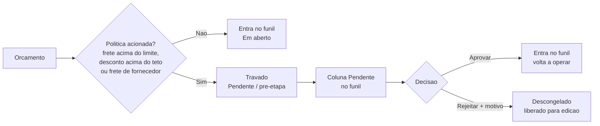

# Aprovação de orçamento

Em algumas operações, certos orçamentos não devem seguir adiante sem o aval de alguém. A aprovação do LocFlow cobre exatamente isso: quando uma **regra é acionada** — um **frete acima do limite**, um **desconto acima do teto**, ou um **frete de fornecedor**, que trava por natureza — o orçamento fica **travado, aguardando a decisão de um responsável** antes de andar.

Isso vale tanto para **locação** quanto para **venda** — a regra olha o orçamento, não o que acontece com o item no fim.

## "Pendente" é uma pré-etapa do funil

Antes de tudo, vale separar dois nomes que parecem iguais, mas não são:

* **Em aberto** é o **primeiro estágio do funil** — o orçamento já está na esteira, em montagem/negociação, livre para andar.
* **Pendente (aguardando aprovação)** é uma **pré-etapa**: o orçamento está **travado na entrada do funil**, esperando alguém aprovar. Ele ainda **não está em aberto**; está, por assim dizer, na porta.


**Pendente não é "Em aberto".** Pendente é a porta de entrada: o orçamento parou ali porque bateu numa regra. **Ao aprovar, ele entra no funil** e passa a se comportar como qualquer outro (em aberto, em negociação, e por aí vai). Por isso ele aparece **destacado, à parte**: no funil, numa coluna própria **antes** da primeira etapa; na lista, com o rótulo **Pendente** em âmbar no lugar da etapa (veja [Onde você aprova](#onde-voce-aprova)).


## Por que um orçamento fica pendente

Há **três origens** para um orçamento nascer pendente:

1. Uma **regra por valor de frete** que **você** ligou na sua organização (esta seção).
2. Um **frete de fornecedor**, que trava **por natureza** — mesmo sem você ligar regra nenhuma (veja [Quando o frete é de um fornecedor](#frete-de-fornecedor)).
3. Um **desconto acima do teto** da organização (veja [logo abaixo](#desconto-acima-do-teto)).


**Uma trava por vez.** Se o mesmo orçamento estourar o limite do frete **e** o teto de desconto, ele congela **uma vez** só, pelo primeiro motivo — e uma única aprovação libera as duas causas. Congelado é congelado.


### A política por valor da organização {#politica-por-valor}

O que decide se o **seu** frete trava é a **política de aprovação do frete**, configurada em **Ajustes › Motores › Operação do Frete** (atenção: é a *operação* do frete, não o motor de *cálculo* do valor do frete). Lá você escolhe entre três cartões:

| Modo | O que acontece |
| --- | --- |
| **Automática** — *"Aprova na hora"* | O frete **nunca** exige aprovação — todo orçamento entra direto no funil. É o **padrão**. |
| **Acima de um valor** — *"Até o limite, aprova direto"* | Você define um **valor de corte** (editável). Frete **até** o limite passa direto; **acima** dele, o orçamento fica **Pendente** até alguém aprovar. |
| **Sempre manual** — *"Todo frete espera"* | **Todo** orçamento com frete passa pela aprovação, qualquer que seja o valor. |


**Na Automática, nada trava — com uma exceção.** Como o padrão é a **Automática**, quem só usa a **própria frota** e não mexe nessa configuração nunca vê um orçamento pendente por valor. A aprovação por valor é um freio **opt-in**: você o liga trocando o modo para **Acima de um valor** (e definindo o corte) ou **Sempre manual**. **Mas** a Automática vale só para o **seu** frete — quem usa **fornecedor de frete** pode ver orçamentos pendentes mesmo neste modo (veja [abaixo](#frete-de-fornecedor)).


Para configurar, veja [Motores operacionais](../configuracoes/motores-operacionais.md).

## Quando o desconto passa do teto {#desconto-acima-do-teto}

A segunda regra que **você** liga não olha para o frete, e sim para o **desconto**. Em **Ajustes › Motores › Operação do Orçamento** existe o **teto de desconto**: o quanto o vendedor abate **sozinho**, sem pedir nada a ninguém.

| Configuração | O que acontece |
| --- | --- |
| **Sem teto** (padrão) | Nenhum desconto trava. |
| **Com teto de X%** | Desconto **acima** de X% congela o orçamento. Exatamente X% passa direto — a régua é "acima de". |
| **Com teto de 0%** | **Qualquer** desconto exige aprovação. |

O teto olha o **desconto do orçamento inteiro** — a soma de tudo que foi abatido, inclusive o que veio das [Regras de desconto](../configuracoes/regras-de-desconto.md) do catálogo.

O vendedor **não é pego de surpresa**: enquanto monta a proposta, o cartão de descontos já avisa em âmbar — *"20% de desconto passa do teto de 15% — ao salvar, o orçamento vai para aprovação."* Ele decide se segue assim mesmo (e o pedido nasce congelado) ou se ajusta o valor antes de salvar.


**Passar do teto não é erro.** Conceder acima do limite é uma decisão comercial legítima — só não é autônoma. O orçamento não é recusado: ele **para e espera** a decisão de quem pode aprovar. Veja como configurar em [Motor de Orçamento](../configuracoes/motor-de-orcamento.md#teto-de-desconto).


## Quando o frete é de um fornecedor {#frete-de-fornecedor}

Quando você **terceiriza o transporte** — chama um [fornecedor de frete](../parcerias/fornecedores-de-frete.md) para levar o pedido, no lugar da sua frota — entra em jogo uma **quarta política**, que funciona de um jeito diferente das três de cima.

Na tela ela se chama **Aguardar o fornecedor** (*"Entra pendente até a resposta"*), e é o **padrão de todo frete terceirizado**: um pedaço do frete que sai de um fornecedor trava o orçamento como **Pendente** — **independente do valor** e **independente da política da sua organização**. Ou seja: mesmo com a sua organização na **Automática**, um frete de fornecedor faz o orçamento nascer pendente.

O motivo é de proteção: o preço e a disponibilidade daquele transporte são **do fornecedor**, não seus. Deixar um frete terceirizado fechar sozinho — sem ninguém do outro lado confirmar — é assumir um compromisso que talvez o fornecedor nem tenha aceitado. Por isso o orçamento **para e espera** a resposta antes de você reservar. (Se, com um fornecedor específico, essa confirmação não fizer sentido, a política dele pode ser trocada em **Operação do Frete**, escolhendo-o como detentor.)


**Você pode ver orçamentos pendentes sem ter ligado nenhuma regra por valor.** Se você usa fornecedor de frete, é normal um orçamento aparecer na coluna **Pendente** do funil só por causa da **composição do frete** — mesmo com a política da sua organização na **Automática**. Não é engano: é o frete terceirizado aguardando o fornecedor.


### O que você vê ao montar o frete {#sinais-no-frete}

O LocFlow avisa **antes** de o orçamento nascer, ainda na tela de composição do frete:

* Na porção do fornecedor, aparece um **selo âmbar "Requer aprovação"** — é ele que marca qual pedaço do frete depende de uma confirmação externa. Veja como o frete se divide entre uma ou várias transportadoras em [Composição do frete](valores.md#composicao-do-frete).
* Se a composição escolhida inclui esse frete, um **banner "O orçamento vai nascer pendente"** explica que aquele orçamento vai aguardar o fornecedor confirmar antes de você reservar. **Você ainda pode enviá-lo assim mesmo** — ele segue para o cliente e fica aguardando a resposta, sem travar o envio.

Uma vez pendente por esse motivo, o orçamento aparece no **mesmo lugar** que os outros pendentes — a coluna **Pendente** do funil, com os mesmos botões — e a decisão (aprovar ou rejeitar) segue igual à das regras por valor. Veja [Onde você aprova](#onde-voce-aprova).


**Uma política por detentor.** Cada frete tem um **detentor** — a sua organização ou um fornecedor. A regra por valor das três configurações de cima é a política da **sua organização**; o **Aguardar o fornecedor** é o padrão de **cada fornecedor**. Num mesmo orçamento com frete dividido entre você e um terceiro, cada parte segue a sua — e basta uma parte de fornecedor que aguarda resposta para o orçamento nascer pendente.


Os **fornecedores de frete** são a porta mais simples da [Rede de Parceiros](../parcerias/visao-geral.md): trabalhar com gente **de fora da sua organização**. O fornecedor é um terceiro **sem login próprio**, que **você** cadastra e administra por inteiro — você monta a frota-espelho dele e o motor de frete dele. Quando o que você precisa é um parceiro com **conta e estrutura próprias**, que monta o roteiro dele e executa o pedido inteiro, isso já existe e é assunto da [Rede de Parceiros](../parcerias/visao-geral.md). Para entender o cadastro e a operação do fornecedor, veja [Fornecedores de frete](../parcerias/fornecedores-de-frete.md).

## O travamento é independente do status comercial

Um orçamento pode estar **Em aberto** ou **Em negociação** e, ao mesmo tempo, **travado aguardando aprovação** — são eixos diferentes. Enquanto está travado, as ações que **mudam** o orçamento ficam **bloqueadas**:

* mudar de status (avançar no funil),
* gerar cobrança,
* liberar a logística.

Tudo isso só volta a funcionar depois que alguém **aprovar**.

## Como funciona o fluxo

```mermaid
flowchart LR
    A[Orcamento] --> B{Politica acionada?<br/>frete acima do limite,<br/>desconto acima do teto<br/>ou frete de fornecedor}
    B -->|Nao| N[Entra no funil<br/>Em aberto]
    B -->|Sim| P[Travado<br/>Pendente / pre-etapa]
    P --> F[Coluna Pendente<br/>no funil]
    F --> D{Decisao}
    D -->|Aprovar| AP[Entra no funil<br/>volta a operar]
    D -->|Rejeitar + motivo| RJ[Descongelado<br/>liberado para edicao]
```

1. **A política dispara** — o orçamento atinge a condição configurada (ex.: frete acima do limite).
2. **Ele fica Pendente** (pré-etapa) e aparece na coluna **Pendente**, a primeira do funil.
3. **Um responsável decide** — pode **aprovar** (o orçamento entra no funil e volta a operar) ou **rejeitar com um motivo** (é descongelado e liberado para edição, para ser corrigido).

## Onde você aprova {#onde-voce-aprova}

Não existe uma tela separada de pendências: o orçamento travado aparece onde você já trabalha, e a decisão é tomada ali mesmo.

| Onde | Como ele aparece | O que dá para fazer |
| --- | --- | --- |
| **Funil** | Na coluna **Pendente**, a primeira do funil — tracejada em âmbar, com a legenda *"pré-etapa · aprove p/ entrar"*. Em telas largas ela fica à esquerda das etapas; no celular, no topo. Ela só aparece quando há orçamento aguardando. | Cada cartão traz **Aprovar** e **Rejeitar**. Tocar no cartão abre a ficha, para você conferir os valores antes. |
| **Lista** | No celular, o cartão fica tracejado em âmbar e mostra **Pendente** no lugar da etapa; em telas largas, os pendentes formam o primeiro grupo da tabela, **Pendente**, com o selo *pré-etapa*. | Os mesmos **Aprovar** e **Rejeitar**. |
| **Ficha e Ações rápidas** | A ficha mostra **Aguardando aprovação**; as Ações rápidas, um aviso âmbar com o mesmo nome. | Conferir. A decisão é no funil ou na lista. |

* **Aprovar** — o app confirma (*"ORC-12 aprovado — Entrou no funil."*) e o cartão passa para a coluna da etapa em que o orçamento está (em geral, **Em aberto**).
* **Rejeitar** — abre a janela **Rejeitar aprovação**, pedindo o **motivo**; ao confirmar, o orçamento é liberado para ser ajustado.


O cartão pendente **não se arrasta**: ele ainda não está no funil. A saída da coluna Pendente é sempre uma decisão — aprovar ou rejeitar.


### O motivo na rejeição

Ao rejeitar, o **motivo é obrigatório** (até 500 caracteres) — o botão "Rejeitar" só habilita depois que você escreve algo. O LocFlow explica, na própria janela, o que acontece em seguida:


*"Informe o motivo da rejeição. Ele descongela o orçamento e o libera para edição."*


Assim quem montou o orçamento sabe **por que** voltou e o que ajustar.

## O aviso no próprio orçamento

Você não precisa procurar para perceber que algo travou. No funil e na lista, ele aparece destacado em âmbar como **Pendente**; na ficha, como **Aguardando aprovação**; e, nas **Ações rápidas**, um aviso âmbar **"Aguardando aprovação"** explica, à primeira vista, por que os botões de status, cobrança e logística estão indisponíveis:

> *"Este orçamento está congelado até que um responsável aprove o frete/valor. As ações de status, cobrança e logística ficam liberadas após a aprovação."*

## Papéis: quem decide

Quem decide é uma **permissão só**: **"Aprovar ou rejeitar orçamento congelado (aguardando aprovação)"**. O papel **Operador / Atendente** já nasce com ela; num papel personalizado, é ela que o gestor precisa ter.

Quem vê orçamentos vê também os que estão aguardando aval — e o cartão mostra os botões **Aprovar** e **Rejeitar**. Mas só quem tem a permissão consegue concluir a decisão: para os demais, o app recusa.


Na lista de permissões aparece também **"Visualizar orçamentos pendentes de aprovação"**. Hoje ela não muda o que a pessoa vê: os orçamentos aguardando aprovação aparecem para todos que podem ver orçamentos. Para controlar **quem decide**, use a permissão de aprovar.


Para configurar as permissões, veja [Colaboradores e acessos](../configuracoes/colaboradores-e-acessos.md).

## Por porte: você usa só o que precisa

O LocFlow **abstrai para o pequeno e revela para o grande**. A aprovação é um desses recursos que você liga conforme cresce:

| Porte | Como costuma usar |
| --- | --- |
| **Pequeno** | Sem aprovação. Quem monta o orçamento já decide tudo — nada trava, tudo entra direto no funil. |
| **Médio** | Uma regra ou outra (ex.: frete acima de um limite) trava só os casos fora do padrão, que o dono confere antes. |
| **Grande** | Aprovação como rotina, com papéis separados: a equipe monta, o gestor aprova. Os exageros nunca passam batido. |


**Por que isso protege o seu faturamento:** sem um freio, um frete errado ou um caso fora da curva sai sem ninguém perceber — e o prejuízo só aparece no fim do mês. Com a aprovação, o caso fora do padrão **para** e espera um olhar humano antes de virar compromisso. Você cresce delegando a montagem dos orçamentos sem abrir mão do controle sobre o que aperta a margem.


## Situações reais

- **Frete que come a margem:** um pedido distante puxa um frete altíssimo, acima do limite que você configurou. O orçamento fica **Pendente**; o gestor olha, confirma que o valor faz sentido e **aprova** — ou pede ajuste e **rejeita** com o motivo.
- **Equipe nova montando orçamentos:** você contratou vendedores recém-chegados. Liga a política por frete para garantir que nenhum pedido saia com cálculo errado nas primeiras semanas.
- **Desconto para fechar na hora:** o cliente pede 20% e o teto da casa é 15%. O vendedor concede — o app avisa antes de salvar — e o orçamento nasce **Pendente**. O gestor confere a margem e aprova; o pedido segue no mesmo dia.
- **Venda de mostruário com frete pesado:** não é só locação. Uma venda de itens grandes, com entrega cara, também bate na regra e passa pela aprovação antes de virar fatura.
- **Frete terceirizado aguardando o parceiro:** o pedido é longe e você aciona um **fornecedor de frete** para levá-lo. Mesmo com a sua organização na **Automática**, o orçamento **nasce pendente** — o selo âmbar "Requer aprovação" aparece na porção do fornecedor e o banner avisa. Você envia o orçamento assim mesmo; ele fica aguardando o fornecedor confirmar o transporte antes de você reservar.
- **Decisão à distância:** o orçamento ficou pendente no fim do dia. O gestor abre o **funil** no celular, vê o cartão na coluna **Pendente**, toca nele para conferir os valores e aprova ali mesmo — o pedido segue sem esperar ele chegar ao escritório.

## Próximo passo

Aprovado, o orçamento entra no funil e segue o fluxo normal — veja [Acompanhando e fechando](acompanhando-e-fechando.md). Para configurar **quando** um orçamento deve travar, veja [Motores operacionais](../configuracoes/motores-operacionais.md). Para entender o frete que costuma disparar a regra, veja [Visão geral da logística](../logistica/visao-geral.md) e a [Composição do frete](valores.md#composicao-do-frete). Se você terceiriza transporte, veja [Fornecedores de frete](../parcerias/fornecedores-de-frete.md). Para ajustar quem vê e quem aprova, veja [Colaboradores e acessos](../configuracoes/colaboradores-e-acessos.md).
