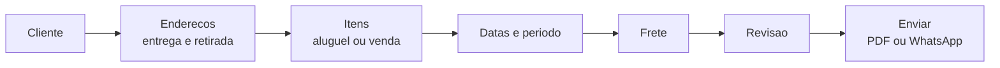

# Criando um orçamento

O orçamento é o ponto de partida de toda operação no LocFlow. Nele você define **o que** será alugado ou vendido, **por quanto**, **para quem** e **quando**. Tudo o que vem depois — cobrança, separação, entrega — nasce daqui.


**Locação ou venda:** o orçamento pode ser de **locação** (com período e retorno do item) ou de **venda** (o item sai em definitivo). Os campos se ajustam à modalidade escolhida — na venda, por exemplo, não há data de devolução. Veja [Locação e venda](../conceitos/locacao-e-venda.md).


## O caminho da proposta

A tela é organizada em blocos (Cliente, Evento/Entrega, Frete, Itens, Valores). Você preenche na ordem que quiser — o LocFlow vai marcando o que ainda falta antes de salvar.

## Passo a passo

1. **Escolha o cliente** — selecione um [contato](../primeiros-passos/glossario.md) já cadastrado ou cadastre um novo na hora, sem sair do orçamento.
2. **Defina os endereços** — na locação há **entrega** e **retirada**; na venda, só a entrega. Cada movimento pode usar o endereço do cliente, um endereço salvo, um endereço digitado na hora, ou ser feito **no galpão** (o cliente busca e devolve no balcão).
3. **Adicione os itens** — informe os bens móveis (produtos e kits), as quantidades e os valores. Você escolhe se é **aluguel** ou **venda**.
4. **Ajuste as datas e o período** — na locação, o período do evento (início e fim) e as datas de entrega e retirada; na venda, a data de entrega. O LocFlow já sugere datas com base na sua configuração — você ajusta se precisar.
5. **Inclua o frete** — calculado pelo motor de frete a partir dos endereços, ou informado manualmente.
6. **Revise os valores** — o LocFlow soma itens, frete, taxa de serviço (mão de obra) e descontos, e mostra o total que o cliente vai ver.


**Seu progresso não se perde.** Enquanto você monta uma proposta nova, o LocFlow salva um **rascunho local** automaticamente. Se você sair sem querer, ao voltar o rascunho é restaurado.


## Responsável da operação

No orçamento você também indica o **responsável** pelo recebimento — nome, celular e se esse número tem WhatsApp. É esse contato que a **logística** usa para combinar a entrega e a retirada no dia. Preencher isso na proposta poupa um vai e volta depois, quando o material já está na rua.

## Salvando e enviando

Ao salvar, o orçamento nasce **Em aberto** e o LocFlow leva você direto para as **ações rápidas**, onde dá para:

* gerar o **PDF** do orçamento (com layout ajustável só para aquele envio) e baixar ou compartilhar;
* gerar o **texto pronto para WhatsApp** e colar no chat do cliente em um toque.

A partir daí você acompanha o status até o fechamento — veja [Acompanhando e fechando](acompanhando-e-fechando.md).


**Por que isso te faz fechar mais:** com cliente, itens e valores num só lugar, você responde o pedido **na hora** — manda o PDF ou o texto de WhatsApp enquanto o cliente ainda está conversando. Proposta rápida é proposta que fecha; orçamento que demora um dia é venda que esfria.


## Situações reais

- **Pedido por WhatsApp:** o cliente manda a lista pelo chat. Você monta o orçamento, gera o texto de WhatsApp e cola na mesma conversa em poucos minutos.
- **Locação de evento com endereço diferente:** o cliente é de um bairro, mas o evento é num salão. Você usa o endereço do cliente no cadastro e digita o **endereço do evento** na entrega — o frete recalcula sozinho.
- **Venda de balcão:** cliente leva o item na hora. Orçamento de **venda**, retirada no galpão, sem data de devolução.

> **Dica:** enquanto a proposta não é aceita, você pode editar itens, valores e datas livremente. Depois de ganho, a edição passa a ser controlada — veja [Acompanhando e fechando](acompanhando-e-fechando.md).

## Próximo passo

Proposta montada? Siga para [Acompanhando e fechando](acompanhando-e-fechando.md). Bateu dúvida em algum termo? Consulte o [glossário](../primeiros-passos/glossario.md) ou veja [onde tirar dúvidas](../primeiros-passos/onde-tirar-duvidas.md).
