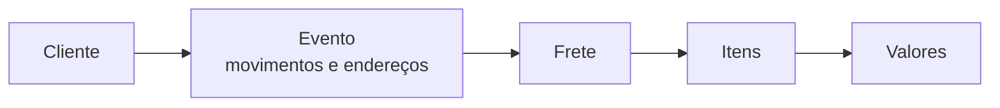

# Criando um orçamento

O orçamento é o ponto de partida de toda operação no LocFlow. Nele você define **o que** será alugado ou vendido, **por quanto**, **para quem** e **quando**. Tudo o que vem depois — cobrança, separação, entrega — nasce daqui.

Esta página é a **porta de entrada**: mostra a tela inteira e o caminho feliz. Cada parte (movimentos, endereços, valores, duração) tem a sua própria página com os detalhes — os links estão ao longo do texto e no fim.

## O que você decide primeiro: a natureza {#natureza}

Antes de qualquer outra coisa, você escolhe a **natureza** do orçamento: **locação** ou **venda**. Essa escolha é **única** — vale para o pedido inteiro. Não se misturam aluguel e venda no mesmo orçamento.

| | Locação | Venda |
| --- | --- | --- |
| **O item** | Vai ao cliente e **volta** | Sai em **definitivo** |
| **Logística** | Entrega **e** retirada | Só entrega |
| **Datas** | Período de uso (início e fim) | Data de entrega |


**Trocar a natureza limpa os itens já adicionados.** Como cada item tem **preços diferentes** para aluguel e para venda, ao trocar de Locação para Venda (ou o contrário) o orçamento **remove os itens** que você já tinha colocado — para garantir que ele use a tabela de preços certa. É o que o próprio app avisa: *"Ao trocar de natureza, os itens já adicionados são removidos para garantir que o orçamento use a tabela de preços correta."*


Precisa **alugar e vender** para o mesmo cliente na mesma ocasião? Faça **dois orçamentos**, um de cada natureza. Cada um segue o seu ciclo e gera a sua própria cobrança. Entenda melhor em [Locação e venda](../conceitos/locacao-e-venda.md).

## Quem é o cliente {#cliente}

O cliente do orçamento é sempre um **contato**. Você busca por nome, CPF/CNPJ, celular ou e-mail e seleciona um já cadastrado — ou **cadastra um novo na hora**, sem sair do orçamento. Ao terminar o cadastro, o LocFlow já volta com o contato vinculado.

### O responsável é do orçamento {#responsavel}

Quando o cliente é uma **empresa (PJ)**, o orçamento pede também o **responsável** pelo recebimento: nome, celular e se esse número tem WhatsApp. Esse responsável **pertence ao orçamento**, não ao cadastro do contato — ou seja, você pode ter um responsável diferente a cada pedido (o chefe de obra de hoje, o produtor do evento da semana que vem).

É esse contato que a **logística** usa para combinar a entrega e a retirada no dia. Preencher na proposta poupa um vai e volta depois, quando o material já está na rua. Para cliente **pessoa física (PF)**, não há campo de responsável — o próprio contato responde.

## O orçamento é dividido em seções {#secoes}

A tela é organizada em seções, e você preenche **na ordem que quiser**. No alto fica um indicador de seções — no celular como abas, em telas grandes como um trilho lateral — que mostra onde você está e **quanto ainda falta** em cada uma:

* uma **bolinha vermelha** marca um erro que impede salvar (algo obrigatório em falta);
* uma **bolinha âmbar** marca um aviso — algo que não trava o salvamento, mas precisa ser resolvido antes de avançar o pedido (por exemplo, para reservar).

| Seção | O que você resolve aqui | Detalhe em |
| --- | --- | --- |
| **Cliente** | Contato, responsável e o vendedor do pedido | esta página |
| **Evento** | Os **movimentos** (entrega/retirada), seus **endereços** e as **datas** | [Movimentos e janelas](movimentos-e-janelas.md) · [Endereços](enderecos.md) |
| **Frete** | Cobrança do deslocamento — automática ou manual | [Valores](valores.md) |
| **Itens** | Os bens móveis (produtos e kits), quantidades e preços | [Catálogo](../cadastros/catalogo-produtos.md) |
| **Valores** | Total, taxa de serviço, descontos e a **duração** da locação | [Valores](valores.md) · [Duração e bloqueio](duracao-e-bloqueio.md) |


**O vendedor já vem preenchido.** Ao criar uma proposta, o LocFlow assume **você** como vendedor. Se outra pessoa fez a venda, basta trocar — útil para acompanhar o desempenho de cada um depois.


## O caminho feliz {#caminho-feliz}

Para a maioria das propostas, o caminho é direto:

1. **Escolha a natureza** — locação ou venda.
2. **Selecione o cliente** (e o responsável, se for empresa).
3. **Defina os movimentos e endereços** — na locação há **entrega** e **retirada**; na venda, só a entrega. Cada movimento pode usar o endereço do cliente, um endereço salvo, um endereço digitado na hora, ou ser feito **no galpão** (o cliente busca e devolve no balcão).
4. **Ajuste as datas e o período** — o LocFlow já sugere datas com base na sua configuração; você ajusta se precisar.
5. **Adicione os itens** — produtos e kits, com quantidades e valores.
6. **Confira o frete e os valores** — o LocFlow soma itens, frete, taxa de serviço e descontos, e mostra o total que o cliente vai ver.
7. **Salve.**


**Por que isso te faz fechar mais:** com cliente, itens e valores num só lugar, você responde o pedido **na hora** — manda o PDF ou o texto de WhatsApp enquanto o cliente ainda está conversando. Proposta rápida é proposta que fecha; orçamento que demora um dia é venda que esfria.


## Seu progresso não se perde {#rascunho}

Enquanto você monta uma proposta nova, o LocFlow salva um **rascunho local automaticamente**. Se você sair sem querer — ou fechar o app — ao voltar o rascunho é restaurado, com a mensagem *"Rascunho local restaurado automaticamente"*. Você não perde o que já tinha digitado.

## Antes de começar: galpão e catálogo {#pre-requisitos}

Para montar o **primeiro** orçamento, o LocFlow precisa de duas coisas já cadastradas:

* pelo menos **um galpão** (de onde os itens saem); e
* pelo menos **um item** no catálogo (um produto **ou** um kit).

Se faltar algum, a tela abre um aviso de **"Cadastros pendentes"** com atalhos para cadastrar na hora. Depois disso, é seguir o caminho normal.

## Por porte: do simples ao detalhado {#por-porte}

A mesma tela atende quem quer rapidez e quem quer controle:

| Se você é… | Como usar |
| --- | --- |
| **Autônomo / pequeno** | Use o caminho feliz e confie nas sugestões (datas, taxa de serviço, frete). Em poucos toques a proposta está pronta para enviar. |
| **Operação média** | Ajuste o vendedor, refine as datas de entrega/retirada e use endereços salvos para clientes recorrentes. |
| **Locadora grande** | Controle cada movimento separadamente, número de viagens, política de duração e descontos — cada seção abre o nível de detalhe que você precisar. |

## Salvando e enviando {#salvar-e-enviar}

Ao salvar, o orçamento nasce **Em aberto** e o LocFlow leva você direto para as **ações rápidas**, onde dá para:

* gerar o **PDF** do orçamento (com layout ajustável só para aquele envio) e baixar ou compartilhar;
* gerar o **texto pronto para WhatsApp** e colar no chat do cliente em um toque.

A partir daí você acompanha o status até o fechamento — veja [Acompanhando e fechando](acompanhando-e-fechando.md).

## Situações reais {#situacoes-reais}

* **Pedido por WhatsApp:** o cliente manda a lista pelo chat. Você monta o orçamento, gera o texto de WhatsApp e cola na mesma conversa em poucos minutos.
* **Locação de evento com endereço diferente:** o cliente é de um bairro, mas o evento é num salão. Você usa o endereço do cliente no cadastro e digita o **endereço do evento** na entrega — o frete recalcula sozinho.
* **Venda de balcão:** cliente leva o item na hora. Orçamento de **venda**, retirada no galpão, sem data de devolução.
* **Cuidado ao trocar a natureza:** se você montou um orçamento de aluguel e só percebe tarde que era venda, ao trocar a natureza o LocFlow **apaga os itens já adicionados** — cada um tem preço diferente nas duas modalidades, então é preciso recadastrá-los. Por isso vale **decidir locação ou venda logo no começo**: você não perde o que já preencheu.


Enquanto a proposta **não é aceita**, você edita itens, valores e datas livremente. Depois de ganho, a edição passa a ser controlada — veja [Quando um pedido muda depois de fechado](../logistica/quando-um-pedido-muda.md).


## Próximo passo {#proximo-passo}

Proposta montada? Siga para [Acompanhando e fechando](acompanhando-e-fechando.md). Bateu dúvida em algum termo? Consulte o [glossário](../primeiros-passos/glossario.md) ou veja [onde tirar dúvidas](../primeiros-passos/onde-tirar-duvidas.md).
