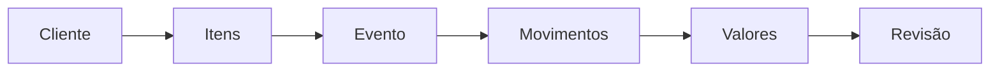

# Criando um orçamento

O orçamento é o ponto de partida de toda operação no LocFlow. Nele você define **o que** será alugado ou vendido, **por quanto**, **para quem** e **quando**. Tudo o que vem depois — cobrança, separação, entrega — nasce daqui.

Esta página é a **porta de entrada**: mostra a tela inteira e o caminho feliz. Cada parte (movimentos, endereços, valores, duração) tem a sua própria página com os detalhes — os links estão ao longo do texto e no fim.

## O que você decide primeiro: a natureza {#natureza}

Antes de qualquer outra coisa, você escolhe a **natureza** do orçamento: **locação** ou **venda**. Essa escolha é **única** — vale para o pedido inteiro. Não se misturam aluguel e venda no mesmo orçamento.

| | Locação | Venda |
| --- | --- | --- |
| **O item** | Vai ao cliente e **volta** | Sai em **definitivo** |
| **Logística** | Entrega **e** retirada | Só entrega |
| **Datas** | Período de uso (início e fim) | Data de entrega |


**Trocar a natureza limpa os itens já adicionados.** Como cada item tem **preços diferentes** para aluguel e para venda, ao trocar de Locação para Venda (ou o contrário) o orçamento **remove os itens** que você já tinha colocado — para garantir que ele use a tabela de preços certa. É o que o próprio app avisa: *"Ao trocar de natureza, os itens já adicionados são removidos para garantir que o orçamento use a tabela de preços correta."*


Precisa **alugar e vender** para o mesmo cliente na mesma ocasião? Faça **dois orçamentos**, um de cada natureza. Cada um segue o seu ciclo e gera a sua própria cobrança. Entenda melhor em [Locação e venda](../conceitos/locacao-e-venda.md).

## Quem é o cliente {#cliente}

O cliente do orçamento é sempre um **contato**. Você busca por nome, CPF/CNPJ, celular ou e-mail e seleciona um já cadastrado — ou **cadastra um novo na hora**, sem sair do orçamento. Ao terminar o cadastro, o LocFlow já volta com o contato vinculado.

### O responsável é do orçamento {#responsavel}

Quando o cliente é uma **empresa (PJ)**, o orçamento pede também o **responsável** pelo recebimento: nome, celular e se esse número tem WhatsApp. Esse responsável **pertence ao orçamento**, não ao cadastro do contato — ou seja, você pode ter um responsável diferente a cada pedido (o chefe de obra de hoje, o produtor do evento da semana que vem).

É esse contato que a **logística** usa para combinar a entrega e a retirada no dia. Preencher na proposta poupa um vai e volta depois, quando o material já está na rua. Para cliente **pessoa física (PF)**, não há campo de responsável — o próprio contato responde.

## Um assistente de 6 etapas {#etapas}

Montar a proposta é um **assistente** (passo a passo) de **6 etapas**, na ordem em que uma decisão depende da anterior:

```mermaid
flowchart LR
    A[Cliente] --> B[Itens]
    B --> C[Evento]
    C --> D[Movimentos]
    D --> E[Valores]
    E --> F[Revisão]
```

| Etapa | O que você resolve aqui | Detalhe em |
| --- | --- | --- |
| **Cliente** | A **natureza** (locação/venda) e o **cliente** (e o responsável, se for empresa) | esta página |
| **Itens** | Os bens móveis (produtos e kits), quantidades e preços | [Catálogo](../cadastros/catalogo-produtos.md) |
| **Evento** | As **datas** do evento — a âncora de tudo que vem depois | [Movimentos e janelas](movimentos-e-janelas.md) |
| **Movimentos** | O **trajeto** e os horários, as **cargas e viagens** e o **frete**, numa etapa só | [Movimentos e janelas](movimentos-e-janelas.md) · [Endereços](enderecos.md) · [Valores](valores.md#frete) |
| **Valores** | A **duração** da locação, os **acréscimos e descontos**, as **observações**, o **vendedor** e a **validade** da proposta | [Valores](valores.md) · [Duração e bloqueio](duracao-e-bloqueio.md) |
| **Revisão** | Confere o **resumo dos totais** e **salva** | esta página |


**Por que os itens vêm antes do evento e do frete.** A logística divide os **materiais** em viagens, e o frete depende do peso e do volume que vão no veículo. Sem itens, as duas etapas ficariam sem base. E juntar trajeto, viagens e frete numa etapa só resolve o incômodo antigo: quem mexia nas viagens só via o efeito no preço uma tela adiante.


Dentro de cada etapa, o formulário se divide em **seções** — Natureza, Cliente, Itens, Evento, Saída do material, Retorno do material, Duração, Acréscimos e descontos, Observações, Vendedor e Validade (na venda não há Retorno do material nem Duração). Cada seção tem um cabeçalho com o nome, um resumo do que há dentro e um selo — e é assim que você percorre a proposta: seção por seção, concluindo cada uma. Veja [Seções retraídas e "Concluir seção"](#concluir-secao).

A cada etapa, o LocFlow mostra **onde você está** e **quanto ainda falta**:

* uma marca **vermelha** aponta um erro que impede salvar (algo obrigatório em falta);
* uma marca **âmbar** aponta um aviso — não trava o salvamento, mas precisa ser resolvido antes de avançar o pedido (por exemplo, para reservar).


**No celular, o assistente é um passo a passo:** uma barra **"Etapa X de N"** no topo mostra o progresso e, no rodapé, os botões **Voltar** e **Avançar** levam você de uma etapa à outra (você também pode deslizar para os lados) — e o **Avançar** também dá a etapa por **concluída** (veja [abaixo](#avancar-conclui)). **Em telas grandes** (tablet e web), as etapas viram uma **barra de abas no alto** — você toca direto na que quiser — e cada uma se organiza em **duas colunas** para aproveitar o espaço.



**O vendedor já vem preenchido.** Ao criar uma proposta, o LocFlow assume **você** como vendedor. Se outra pessoa fez a venda, basta trocar — útil para acompanhar o desempenho de cada um depois.


## Seções retraídas e "Concluir seção" {#concluir-secao}

O formulário **abre com todas as seções retraídas** — ao criar um orçamento e ao reabrir um já salvo para conferir, no celular e no computador. Cada seção é uma linha com o nome, o resumo do que há dentro e um selo; abrir é um toque no cabeçalho. Nada abre sozinho ao entrar na tela.

Só três coisas abrem uma seção:

1. **o seu toque** no cabeçalho;
2. **um erro ou aviso** apontando para ela — a seção abre sozinha e fica aberta até você concluí-la, salvar ou fechá-la pelo cabeçalho (ninguém corrige um campo que não está na tela);
3. o **"Concluir seção"** da seção anterior, que abre a próxima que ainda falta.

### O botão "Concluir seção" {#botao-concluir-secao}

No fim de cada seção há o botão **Concluir seção**. Ele faz três coisas num toque: **marca** a seção como concluída, **retrai** e **abre a próxima que ainda falta** — pulando as já concluídas e as que não aparecem — rolando a tela até ela. Dá para percorrer um orçamento inteiro sem retrair nada à mão: preencheu, concluiu, a próxima já está aberta. Concluída a última, a vez volta para a primeira que ainda estiver pendente lá em cima.


**Concluir não valida nada** — é a sua marca de "já vi". Se a seção ainda tem algo em falta, o selo do cabeçalho avisa (abaixo). O que impede de **salvar** continua sendo o erro em vermelho, como sempre.


Abriu uma seção já concluída para conferir? O botão vira **Reabrir seção**: desfaz a marca e deixa a seção aberta para você mexer.

### O selo do cabeçalho {#selo-da-secao}

Ao lado do nome de cada seção, o selo cruza duas coisas: o que **você** declarou (concluída ou não) e o que o **formulário** vê (completa ou não):

| Estado | Como aparece | O que significa |
| --- | --- | --- |
| **Pendente** | Sem selo — ou um alerta âmbar, se ainda falta algo | Você ainda não concluiu. O âmbar diz "falta você aqui". |
| **Concluída** | Check verde | Você concluiu e o formulário não vê nada em falta. |
| **Concluída com pendência** | Alerta âmbar com a frase do que falta | Você deu por encerrada, mas o formulário ainda vê um buraco — por exemplo, *"Falta o celular ou o e-mail do responsável"* numa empresa sem responsável. |

A frase do "com pendência" diz exatamente o que falta, sem precisar abrir a seção: *"Falta escolher o cliente"*, *"Falta adicionar itens"*, *"Falta a data do evento"*, *"Falta combinar quando o material sai"*, *"Falta a validade da proposta"*…

### No celular: o Avançar conclui a etapa {#avancar-conclui}

No passo a passo do celular, o botão **Avançar** do rodapé faz o papel do "Concluir seção" para a etapa inteira: ele confere a etapa (um erro em vermelho segura você nela) e, estando tudo certo, **conclui todas as seções daquela etapa de uma vez**. As etapas de uma seção só (**Itens** e **Evento**) nem têm o botão próprio — é o Avançar que as conclui. Nas etapas com mais de uma seção (Cliente, Movimentos, Valores), cada seção tem o seu "Concluir seção", e o Avançar conclui o que sobrou. Assim você chega à **Revisão** com os selos certos sem ter apertado nada além do Avançar. Se a próxima seção pendente está na etapa seguinte, ela já recebe você **aberta** quando você chegar lá.

### A conferência fica salva {#conferencia}

O que você concluiu não se perde ao sair da tela:

* **Criando** um orçamento, as seções concluídas viajam junto com o [rascunho local](#rascunho).
* **Reabrindo** um orçamento já salvo para conferir, o que você concluiu fica guardado **neste aparelho, por orçamento** — fechou a tela, voltou ao mesmo orçamento no mesmo aparelho, a conferência retoma de onde parou, com os selos no lugar. Um link **Reiniciar conferência**, logo abaixo do título da tela (aparece quando há alguma seção concluída), zera tudo para você recomeçar; **salvar** a edição também zera — aquela rodada de conferência acabou.


**A conferência é sua, não do orçamento.** Ela **não é enviada ao servidor**: é um marcador de leitura de quem está conferindo. Um colega que abrir o mesmo orçamento em outro aparelho não vê os seus selos — e você não vê os dele.


### Operação pequena: um formulário mais curto {#secoes-opcionais}

Numa organização de **porte pequeno**, três seções que quase nunca mudam ficam **escondidas** (não só retraídas): **Acréscimos e descontos**, **Observações** e **Validade**. O formulário abre mais curto, e o atalho **Mostrar seções opcionais**, no fim do formulário (na etapa **Valores**, no celular), revela as três.

Duas garantias:

* uma seção **com conteúdo** (um desconto dado, uma observação escrita) **ou com erro nunca some** — decisão tomada aparece, retraída, no cabeçalho com o resumo;
* a **validade** continua valendo pelo **prazo padrão** do Motor de Orçamento mesmo escondida — ela é a única que fica oculta mesmo tendo valor, porque o valor não é decisão sua: vem do motor.

Quem decide se essas seções aparecem é o Motor de Orçamento (**Conforme o porte**, **Mostrar** ou **Ocultar**) — veja [Seções opcionais do formulário](../configuracoes/motor-de-orcamento.md#secoes-opcionais). Entenda o porte em [O porte da sua operação](../primeiros-passos/porte.md).

## O caminho feliz {#caminho-feliz}

Para a maioria das propostas, o caminho segue as etapas na ordem — e, a cada seção preenchida, **Concluir seção** (ou o **Avançar**, no celular) leva você à próxima:

1. **Cliente** — escolha a **natureza** (locação ou venda) e **selecione o cliente** (e o responsável, se for empresa).
2. **Itens** — adicione produtos e kits, com quantidades e valores.
3. **Evento** — ajuste as **datas** (o LocFlow já sugere com base na sua configuração; você muda se precisar).
4. **Movimentos** — defina o **trajeto** de cada movimento e os horários, distribua a **carga em viagens** se precisar, e confira o **frete**. Na locação há **entrega** e **retirada**; na venda, só a entrega. Cada movimento pode usar o endereço do cliente, um endereço salvo, um endereço digitado na hora, ou ser feito **no galpão** (o cliente busca e devolve no balcão).
5. **Valores** — revise a **duração** da locação, os **acréscimos** (mão de obra, montagem…), os **descontos** e as **observações**, e confirme o **vendedor** e a **validade** da proposta. Numa operação pequena, acréscimos, observações e validade ficam escondidos até você pedir — veja [acima](#secoes-opcionais).
6. **Revisão** — confira o **resumo dos totais** (itens, acréscimos, frete e descontos somados no total que o cliente vai ver) e toque em **Salvar**.


**O orçamento só é salvo na última etapa.** Percorrer as etapas anteriores não grava nada no servidor — é só na **Revisão**, depois de conferir os números, que você toca em **Salvar** e a proposta nasce. Até lá, seu progresso fica guardado no rascunho local (abaixo).



**Por que isso te faz fechar mais:** com cliente, itens e valores num só lugar, você responde o pedido **na hora** — manda o PDF ou o texto de WhatsApp enquanto o cliente ainda está conversando. Proposta rápida é proposta que fecha; orçamento que demora um dia é venda que esfria.


## Seu progresso não se perde {#rascunho}

Enquanto você monta uma proposta nova, o LocFlow salva um **rascunho local automaticamente**. Se você sair sem querer — ou fechar o app — ao voltar o rascunho é restaurado, com a mensagem *"Rascunho local restaurado automaticamente"*. Você não perde o que já tinha digitado — nem as seções que já tinha [concluído](#conferencia): elas voltam com os selos no lugar.

## Antes de começar: galpão e catálogo {#pre-requisitos}

Para montar o **primeiro** orçamento, o LocFlow precisa de duas coisas já cadastradas:

* pelo menos **um galpão** (de onde os itens saem); e
* pelo menos **um item** no catálogo (um produto **ou** um kit).

Se faltar algum, a tela abre um aviso de **"Cadastros pendentes"** com atalhos para cadastrar na hora. Depois disso, é seguir o caminho normal.

## Por porte: do simples ao detalhado {#por-porte}

A mesma tela atende quem quer rapidez e quem quer controle:

| Se você é… | Como usar |
| --- | --- |
| **Autônomo / pequeno** | Use o caminho feliz e confie nas sugestões (datas, taxa de serviço, frete). O formulário já abre mais curto — acréscimos, observações e validade ficam [escondidos até você pedir](#secoes-opcionais). Em poucos toques a proposta está pronta para enviar. |
| **Operação média** | Ajuste o vendedor, refine as datas de entrega/retirada e use endereços salvos para clientes recorrentes. |
| **Locadora grande** | Controle cada movimento separadamente, número de viagens, política de duração e descontos — cada etapa abre o nível de detalhe que você precisar. Ao reabrir um orçamento para revisar, use o [Concluir seção](#concluir-secao) como lista de conferência: a auditoria retoma de onde parou. |

## Salvando e enviando {#salvar-e-enviar}

Ao salvar, o orçamento nasce **Em aberto** e o LocFlow leva você direto para as **ações rápidas**, onde dá para:

* gerar o **PDF** do orçamento (com layout ajustável só para aquele envio) e baixar ou compartilhar;
* gerar o **texto pronto para WhatsApp** e colar no chat do cliente em um toque.

A partir daí você acompanha o status até o fechamento — veja [Acompanhando e fechando](acompanhando-e-fechando.md).

## Situações reais {#situacoes-reais}

* **Pedido por WhatsApp:** o cliente manda a lista pelo chat. Você monta o orçamento, gera o texto de WhatsApp e cola na mesma conversa em poucos minutos.
* **Locação de evento com endereço diferente:** o cliente é de um bairro, mas o evento é num salão. Você usa o endereço do cliente no cadastro e digita o **endereço do evento** na entrega — o frete recalcula sozinho.
* **Venda de balcão:** cliente leva o item na hora. Orçamento de **venda**, retirada no galpão, sem data de devolução.
* **Cuidado ao trocar a natureza:** se você montou um orçamento de aluguel e só percebe tarde que era venda, ao trocar a natureza o LocFlow **apaga os itens já adicionados** — cada um tem preço diferente nas duas modalidades, então é preciso recadastrá-los. Por isso vale **decidir locação ou venda logo no começo**: você não perde o que já preencheu.
* **Conferir um orçamento grande em duas sentadas:** você reabre a proposta, confere e conclui as primeiras seções, e o balcão chama. Quando voltar ao mesmo orçamento neste aparelho, os selos estarão lá — é só seguir da primeira seção pendente. Terminou e quer conferir de novo do zero? **Reiniciar conferência**.


Enquanto a proposta **não é aceita**, você edita itens, valores e datas livremente. Depois de ganho, a edição passa a ser controlada — veja [Quando um pedido muda depois de fechado](../logistica/quando-um-pedido-muda.md).


## Próximo passo {#proximo-passo}

Proposta montada? Siga para [Acompanhando e fechando](acompanhando-e-fechando.md). Bateu dúvida em algum termo? Consulte o [glossário](../primeiros-passos/glossario.md) ou veja [onde tirar dúvidas](../primeiros-passos/onde-tirar-duvidas.md).
