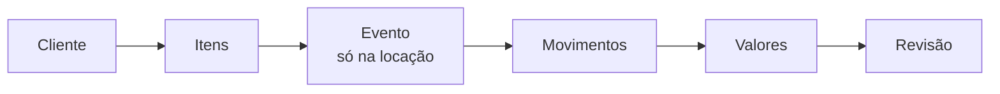

# Criando um orçamento

O orçamento é o ponto de partida de toda operação no LocFlow. Nele você define **o que** será alugado ou vendido, **por quanto**, **para quem** e **quando**. Tudo o que vem depois — cobrança, separação, entrega — nasce daqui.

Esta página é a **porta de entrada**: mostra a tela inteira e o caminho feliz. Cada parte (movimentos, endereços, valores, duração) tem a sua própria página com os detalhes — os links estão ao longo do texto e no fim.

## O que você decide primeiro: o tipo de negócio {#natureza}

Antes de qualquer outra coisa, você escolhe o **tipo de negócio** do orçamento: **Aluguel** (locação) ou **Venda**. Logo abaixo da escolha, o app lembra a consequência: *"Itens voltam para o estoque"* ou *"Itens saem definitivamente"*. Essa escolha é **única** — vale para o pedido inteiro. Não se misturam aluguel e venda no mesmo orçamento.

| | Locação | Venda |
| --- | --- | --- |
| **O item** | Vai ao cliente e **volta** | Sai em **definitivo** |
| **Logística** | Entrega **e** retirada | Só entrega |
| **Datas** | Período de uso (início e fim) | Data de entrega |


**Trocar o tipo de negócio limpa os itens já adicionados.** Como cada item tem **preços diferentes** para aluguel e para venda, trocar com itens no carrinho abre uma confirmação — *"Trocar para venda?"* (ou *"Trocar para aluguel?"*): *"Os 3 itens já adicionados serão removidos: os preços de aluguel e de venda são diferentes, e um orçamento usa uma tabela só."* A troca só acontece se você seguir em **Trocar e limpar itens**.


Precisa **alugar e vender** para o mesmo cliente na mesma ocasião? Faça **dois orçamentos**, um de cada tipo. Cada um segue o seu ciclo e gera a sua própria cobrança. Entenda melhor em [Locação e venda](../conceitos/locacao-e-venda.md).

## Quem é o cliente {#cliente}

O cliente do orçamento é sempre um **contato**. Você busca por nome, CPF/CNPJ, celular ou e-mail e seleciona um já cadastrado — ou **cadastra um novo na hora**, sem sair do orçamento. Ao terminar o cadastro, o LocFlow já volta com o contato vinculado.

Com o cliente escolhido, o cartão dele traz três atalhos: o **+** (cadastrar outro contato), o **lápis** (editar este cliente) e o **x** (tirar este cliente do orçamento); tocar no próprio cartão abre a busca para trocar de cliente. O lápis abre a ficha do cliente **sem sair do orçamento** — útil quando você descobre ali que o telefone mudou ou que o e-mail da proposta está errado. Ao voltar, o cartão já mostra o cadastro corrigido, e o que você tinha preenchido continua na tela.


**Telefone que já é de outro contato.** Corrigindo o celular de um cliente para um número que já pertence a outro contato, o app avisa e oferece **Abrir cadastro existente** — ele não troca o cliente do orçamento por conta própria. Já cadastrando um contato **novo** a partir do orçamento, o mesmo aviso oferece **Usar este contato**, para seguir com quem já existe. Veja [Contatos](../cadastros/contatos.md).


Depois que o pedido é **ganho**, o cliente fica travado e os três atalhos somem — o cadastro continua corrigível pela tela de Contatos.

### O responsável é do orçamento {#responsavel}

Quando o cliente é uma **empresa (PJ)**, o orçamento pede também o **responsável** pelo recebimento: nome, celular e se esse número tem WhatsApp. Esse responsável **pertence ao orçamento**, não ao cadastro do contato — ou seja, você pode ter um responsável diferente a cada pedido (o chefe de obra de hoje, o produtor do evento da semana que vem).

É esse contato que a **logística** usa para combinar a entrega e a retirada no dia. Preencher na proposta poupa um vai e volta depois, quando o material já está na rua. Para cliente **pessoa física (PF)**, não há campo de responsável — o próprio contato responde.

## Os itens do pedido {#itens}

Na etapa **Itens**, toque em **Buscar produto ou kit…**: a folha **Adicionar itens** abre com o cursor **já no campo de busca** — é abrir e digitar. Em cada resultado, **Adicionar** coloca o item no carrinho, e o topo da folha conta quantos você já adicionou. No carrinho, você ajusta as quantidades, vê o subtotal de cada linha e o aviso de estoque.

Faltou um produto no catálogo? O **+** ao lado da busca cadastra um novo sem sair do orçamento — e, com o catálogo ainda vazio, a própria folha oferece **Cadastrar meu primeiro produto**.

### Venda de seminovo e usado {#condicao-na-venda}

Num orçamento de **venda**, um produto com preço em mais de uma condição — **Novo**, **Seminovo**, **Usado** — aparece na busca com um chip por condição, cada um com o seu preço; tocar no chip adiciona aquela condição. (Com uma condição só, o próprio preço já diz qual é — *"R$ 50,00 · Usado"*.) No carrinho, cada condição é uma **linha própria**:

* o preço da linha diz a condição — *"R$ 50,00 / un · Usado"* — e os chips logo abaixo trocam de condição. A ordem é sempre Novo → Seminovo → Usado, e o padrão é o **Novo** (quando ele tem preço);
* adicionar de novo a mesma condição **soma** na mesma linha; trocar uma linha para uma condição que já está no carrinho **junta** as quantidades;
* o estoque é conferido **por condição**: a linha *Usado* olha o estoque de usados, nunca o de novos — e um kit segue a condição do kit;
* ao reabrir uma venda para editar, cada linha continua com a condição à vista e as opções de troca.

A nota fiscal de venda leva a condição na descrição do item (por exemplo, *"Cadeira dourada (Usado)"*); o novo sai sem sufixo. Entenda o cadastro das condições em [Estoque por natureza e condição](../cadastros/estoque-por-natureza-e-condicao.md) e a nota em [Nota fiscal na venda](../conceitos/nota-fiscal-na-venda.md).

## Um assistente de 6 etapas (5 na venda) {#etapas}

Montar a proposta é um **assistente** (passo a passo) de **6 etapas na locação** e **5 na venda**, na ordem em que uma decisão depende da anterior. A venda não tem a etapa **Evento**: o item sai em definitivo, então não há período de uso a marcar.

```mermaid
flowchart LR
    A[Cliente] --> B[Itens]
    B --> C[Evento<br/>só na locação]
    C --> D[Movimentos]
    D --> E[Valores]
    E --> F[Revisão]
```

| Etapa | O que você resolve aqui | Detalhe em |
| --- | --- | --- |
| **Cliente** | O **tipo de negócio** (aluguel/venda) e o **cliente** (e o responsável, se for empresa) | esta página |
| **Itens** | Os bens móveis (produtos e kits), quantidades e preços | [Os itens do pedido](#itens) · [Catálogo](../cadastros/catalogo-produtos.md) |
| **Evento** *(só locação)* | As **datas** do evento — a âncora de tudo que vem depois | [Movimentos e janelas](movimentos-e-janelas.md) |
| **Movimentos** | A **saída** e o **retorno** do material (quem leva, para onde e quando), as **cargas e viagens** e o **frete**, numa etapa só | [Movimentos e janelas](movimentos-e-janelas.md) · [Endereços](enderecos.md) · [Valores](valores.md#frete) |
| **Valores** | A **duração** da locação, os **acréscimos e descontos**, as **observações**, o **vendedor** e a **validade** da proposta | [Valores](valores.md) · [Duração e bloqueio](duracao-e-bloqueio.md) |
| **Revisão** | Confere o **resumo dos totais** e **salva** | esta página |


**Por que os itens vêm antes do evento e do frete.** A logística divide os **materiais** em viagens, e o frete depende do peso e do volume que vão no veículo. Sem itens, as duas etapas ficariam sem base. E juntar trajeto, viagens e frete numa etapa só resolve o incômodo antigo: quem mexia nas viagens só via o efeito no preço uma tela adiante.


Dentro de cada etapa, o formulário se divide em **seções** — Tipo de negócio, Cliente, Itens, Evento, Saída do material, Retorno do material, Frete, cargas e viagens, Duração, Acréscimos e descontos, Observações, Vendedor e Validade (na venda não há Evento, Retorno do material nem Duração). Cada seção tem um cabeçalho com o nome, um resumo do que há dentro e um selo — e é assim que você percorre a proposta: seção por seção, concluindo cada uma. Veja [Seções retraídas e o "Concluir" de cada seção](#concluir-secao).

A cada etapa, o LocFlow mostra **onde você está** e **quanto ainda falta**:

* uma marca **vermelha** aponta um erro que impede salvar (algo obrigatório em falta);
* uma marca **âmbar** aponta um aviso — não trava o salvamento, mas precisa ser resolvido antes de avançar o pedido (por exemplo, para reservar).


**No celular, o assistente é um passo a passo:** uma barra **"Etapa X de N"** no topo mostra o progresso e, no rodapé, os botões **Voltar** e **Avançar** levam você de uma etapa à outra (você também pode deslizar para os lados) — e, na etapa Evento, o **Avançar** também dá a seção por **concluída** (veja [abaixo](#avancar-conclui)). **No tablet**, as etapas viram uma **barra de abas no alto** — você toca direto na que quiser. **No computador** (telas a partir de cerca de 1024 px de largura), o orçamento é uma **folha contínua, sem abas**: o passo a passo fica no topo para você saltar de uma parte a outra, e uma **coluna lateral** — que você alarga arrastando a divisória — mostra o carrinho e o resumo ao vivo, o botão **Salvar** e o navegador de pendências.



**O vendedor já vem preenchido.** Ao criar uma proposta, o LocFlow assume **você** como vendedor. Se outra pessoa fez a venda, basta trocar — útil para acompanhar o desempenho de cada um depois.


## Seções retraídas e o "Concluir" de cada seção {#concluir-secao}

O formulário **abre com as seções retraídas** — ao reabrir um orçamento já salvo para conferir, **todas**; ao criar um orçamento novo, **Tipo de negócio** e **Cliente** já nascem abertas (é por onde toda proposta começa) e o resto retraído, no celular e no computador. Cada seção é uma linha com o nome, o resumo do que há dentro e um selo; abrir é um toque no cabeçalho. Fora dessas duas, na criação, nada abre sozinho ao entrar na tela.

Só quatro coisas abrem uma seção:

1. **o seu toque** no cabeçalho;
2. **um erro ou aviso** apontando para ela — a seção abre sozinha e fica aberta até você concluí-la, salvar ou fechá-la pelo cabeçalho (ninguém corrige um campo que não está na tela);
3. o **"Concluir"** da seção anterior, que abre a próxima que ainda falta;
4. na criação de um orçamento novo, ser **Tipo de negócio** ou **Cliente** — as duas seções de partida.

### O botão "Concluir" {#botao-concluir-secao}

O botão **Concluir** (com o ícone de check) existe nas seções em que você toma **várias decisões** — e só você sabe se ainda vai voltar a elas: **Evento**, **Saída do material**, **Retorno do material**, **Frete, cargas e viagens**, **Duração** e **Acréscimos e descontos**. Ele faz três coisas num toque: **marca** a seção como concluída, **retrai** e **abre a próxima que ainda falta** — pulando as já concluídas e as que não aparecem — rolando a tela até ela. Dá para percorrer um orçamento inteiro sem retrair nada à mão: preencheu, concluiu, a próxima já está aberta. Concluída a última, a vez volta para a primeira que ainda estiver pendente lá em cima.

Nas outras seções — **Tipo de negócio**, **Cliente**, **Itens**, **Observações**, **Vendedor** e **Validade** — não há botão: preencheu, está pronta. O check verde aparece sozinho assim que a informação está lá (a seção de Itens, por exemplo, fica pronta quando há itens no carrinho).

O painel **Frete, cargas e viagens** tem o seu **Concluir** no rodapé do próprio painel — e ele some junto com o painel quando o cliente retira e devolve na loja (na venda, basta retirar), porque aí não há transporte a combinar. Ao concluir a última seção, o botão só volta ao início se ainda houver seção **incompleta**; com tudo completo, nada abre — os selos dizem o que ficou sem carimbo. Com um erro em vermelho dentro da seção, o botão fica desabilitado até você corrigir. Se a próxima estiver em outra etapa do celular, um aviso diz qual é; a troca de etapa é sua, pelo Avançar.


**Concluir não valida nada** — é a sua marca de "já vi". Se a seção ainda tem algo em falta, o selo do cabeçalho avisa (abaixo). O que impede de **salvar** continua sendo o erro em vermelho, como sempre.


Abriu uma seção já concluída para conferir? O botão vira **Desfazer** (com o ícone de seta): tira a marca e deixa a seção aberta para você mexer.

### O selo do cabeçalho {#selo-da-secao}

Ao lado do nome de cada seção, o selo cruza duas coisas: o que **você** declarou (concluída ou não) e o que o **formulário** vê (completa ou não):

| Estado | Como aparece | O que significa |
| --- | --- | --- |
| **Pendente** | Sem selo — ou um alerta âmbar, se ainda falta algo | Você ainda não concluiu. O âmbar diz "falta você aqui". |
| **Concluída** | Check verde | Você concluiu e o formulário não vê nada em falta. |
| **Concluída com pendência** | Alerta âmbar com a frase do que falta | Você deu por encerrada, mas o formulário ainda vê um buraco — por exemplo, *"Falta o celular ou o e-mail do responsável"* numa empresa sem responsável. |

A frase do "com pendência" diz exatamente o que falta, sem precisar abrir a seção: *"Falta escolher o cliente"*, *"Falta adicionar itens"*, *"Falta a data do evento"*, *"Falta combinar quando o material sai"*, *"Falta a validade da proposta"*…

Nas seções **sem** botão, o selo tem só dois estados: o check verde, quando a informação está lá, ou o alerta âmbar dizendo o que falta. O "com pendência" é coisa de quem tem o Concluir — é ali que você pode declarar uma seção encerrada enquanto o formulário ainda vê um buraco.

### No celular: o Avançar conclui a etapa Evento {#avancar-conclui}

No passo a passo do celular, a etapa **Evento** é uma seção só e não mostra o botão "Concluir": ali o **Avançar** do rodapé faz esse papel — confere a etapa (um erro em vermelho segura você nela) e, estando tudo certo, conclui a seção e segue. A etapa **Itens** também é uma seção só, mas não tem o que concluir: ela fica pronta sozinha quando há itens no carrinho.

Nas etapas com mais de uma seção (Cliente, Movimentos, Valores), o Avançar **só muda de etapa** — ele não dá nenhuma seção por concluída em seu nome, nem mesmo numa operação pequena, em que a etapa Valores fica mais curta. Cada seção com decisões tem o próprio Concluir.

### A conferência fica salva {#conferencia}

O que você concluiu não se perde ao sair da tela:

* **Criando** um orçamento, as seções concluídas viajam junto com o [rascunho local](#rascunho).
* **Reabrindo** um orçamento já salvo para conferir, o que você concluiu fica guardado **neste aparelho, por orçamento** — fechou a tela, voltou ao mesmo orçamento no mesmo aparelho, a conferência retoma de onde parou, com os selos no lugar. Um link **Reiniciar conferência**, logo abaixo do título da tela (aparece quando há alguma seção concluída), zera tudo para você recomeçar; **salvar** a edição também zera — aquela rodada de conferência acabou.


**A conferência é sua, não do orçamento.** Ela **não é enviada ao servidor**: é um marcador de leitura de quem está conferindo. Um colega que abrir o mesmo orçamento em outro aparelho não vê os seus selos — e você não vê os dele.


### Operação pequena: um formulário mais curto {#secoes-opcionais}

Numa organização de **porte pequeno**, três seções que quase nunca mudam ficam **escondidas** (não só retraídas): **Acréscimos e descontos**, **Observações** e **Validade**. O formulário abre mais curto, e o atalho **Mostrar seções opcionais**, no fim do formulário (na etapa **Valores**, no celular), revela as três.

Duas garantias:

* uma seção **com conteúdo** (um desconto dado, uma observação escrita) **ou com erro nunca some** — decisão tomada aparece, retraída, no cabeçalho com o resumo;
* a **validade** continua valendo pelo **prazo padrão** do Motor de Orçamento mesmo escondida — ela é a única que fica oculta mesmo tendo valor, porque o valor não é decisão sua: vem do motor.

Quem decide se essas seções aparecem é o Motor de Orçamento (**Conforme o porte**, **Mostrar** ou **Ocultar**) — veja [Seções opcionais do formulário](../configuracoes/motor-de-orcamento.md#secoes-opcionais). Entenda o porte em [O porte da sua operação](../primeiros-passos/porte.md).

## O caminho feliz {#caminho-feliz}

Para a maioria das propostas, o caminho segue as etapas na ordem — e, a cada seção preenchida, **Concluir** (ou o **Avançar**, no celular) leva você à próxima:

1. **Cliente** — escolha o **tipo de negócio** (aluguel ou venda) e **selecione o cliente** (e o responsável, se for empresa).
2. **Itens** — adicione produtos e kits, com quantidades e valores.
3. **Evento** *(só na locação)* — ajuste as **datas** (o LocFlow já sugere com base na sua configuração; você muda se precisar).
4. **Movimentos** — na **Saída do material** (e, na locação, no **Retorno do material**), diga quem leva e quem traz de volta, para onde e quando; monte as **cargas e viagens** se precisar e confira o **frete**. Na locação há **entrega** e **retirada**; na venda, só a entrega. Cada movimento pode usar o endereço do cliente, um endereço salvo, um endereço digitado na hora, ou ser feito **na loja** (o cliente retira e devolve lá).
5. **Valores** — revise a **duração** da locação, os **acréscimos** (mão de obra, montagem…), os **descontos** e as **observações**, e confirme o **vendedor** e a **validade** da proposta. Numa operação pequena, acréscimos, observações e validade ficam escondidos até você pedir — veja [acima](#secoes-opcionais).
6. **Revisão** — confira o **resumo dos totais** (itens, acréscimos, frete e descontos somados no total que o cliente vai ver) e toque em **Salvar**.


**No celular e no tablet, o orçamento só é salvo na última etapa.** Percorrer as etapas anteriores não grava nada no servidor — é só na **Revisão**, depois de conferir os números, que você toca em **Salvar orçamento** e a proposta nasce. No computador, o botão fica sempre à mão na coluna lateral. Até salvar, seu progresso fica guardado no rascunho (abaixo).



**Por que isso te faz fechar mais:** com cliente, itens e valores num só lugar, você responde o pedido **na hora** — manda o PDF ou o texto de WhatsApp enquanto o cliente ainda está conversando. Proposta rápida é proposta que fecha; orçamento que demora um dia é venda que esfria.


## Seu progresso não se perde {#rascunho}

Enquanto você monta uma proposta nova, o LocFlow guarda o que você digita como **rascunho, neste aparelho**. Mas ele **não volta sozinho**: se você sair sem querer — ou fechar o app —, ao voltar a tela abre em branco, e o rascunho fica à sua espera.

1. Quando há rascunho guardado, aparece no topo do formulário a pílula **N rascunhos salvos**.
2. Ela abre a folha **Rascunhos salvos** — *"Toque em um para retomar de onde parou"* —, com o nome do cliente (quando já escolhido), quantos itens tem e há quanto tempo cada um foi mexido. Ali também dá para apagar um rascunho ou **Começar um novo**.
3. Escolhido o rascunho, o app avisa *"Rascunho restaurado — Continue de onde parou."* — com o que você tinha digitado e as seções que já tinha [concluído](#conferencia), selos no lugar.

Na **lista de orçamentos**, uma faixa **N rascunhos não enviados · Retomar** lembra do que ficou pela metade — com um rascunho só, ela leva direto a ele.


O rascunho vale **só neste aparelho e neste navegador**, e o LocFlow guarda até **10** por vez: passou disso, o mais antigo sai. Ele só começa a ser gravado quando você preenche algo de fato.


## Antes de começar: um galpão {#pre-requisitos}

Para montar o **primeiro** orçamento, o LocFlow precisa de **um galpão** cadastrado — o local de onde seus itens saem. Sem ele, a tela abre o aviso **Cadastros pendentes** — *"Antes de criar um orçamento, cadastre um galpão: o local de onde seus itens saem."* — com o botão **Cadastrar galpão**. Depois disso, é seguir o caminho normal.

O catálogo **não** é pré-requisito: o produto que faltar você cadastra na hora, pelo **+** da busca de itens (veja [Os itens do pedido](#itens)).

## Por porte: do simples ao detalhado {#por-porte}

A mesma tela atende quem quer rapidez e quem quer controle:

| Se você é… | Como usar |
| --- | --- |
| **Autônomo / pequeno** | Use o caminho feliz e confie nas sugestões (datas, taxa de serviço, frete). O formulário já abre mais curto — acréscimos, observações e validade ficam [escondidos até você pedir](#secoes-opcionais). Em poucos toques a proposta está pronta para enviar. |
| **Operação média** | Ajuste o vendedor, refine as datas de entrega/retirada e use endereços salvos para clientes recorrentes. |
| **Locadora grande** | Controle cada movimento separadamente, número de viagens, política de duração e descontos — cada etapa abre o nível de detalhe que você precisar. Ao reabrir um orçamento para revisar, use o [Concluir](#concluir-secao) de cada seção como lista de conferência: a auditoria retoma de onde parou. |

## Salvando e enviando {#salvar-e-enviar}

Ao salvar, o orçamento nasce **Em aberto** (ou **Pendente**, se bateu numa [regra de aprovação](aprovacao.md)) e o LocFlow leva você direto para as **ações rápidas**, onde dá para:

* gerar o **PDF** do orçamento (com layout ajustável só para aquele envio) e baixar ou compartilhar;
* gerar o **texto pronto para WhatsApp** e colar no chat do cliente em um toque.

A partir daí você acompanha o status até o fechamento — veja [Acompanhando e fechando](acompanhando-e-fechando.md).

## Situações reais {#situacoes-reais}

* **Pedido por WhatsApp:** o cliente manda a lista pelo chat. Você monta o orçamento, gera o texto de WhatsApp e cola na mesma conversa em poucos minutos.
* **Locação de evento com endereço diferente:** o cliente é de um bairro, mas o evento é num salão. Você usa o endereço do cliente no cadastro e digita o **endereço do evento** na entrega — o frete recalcula sozinho.
* **Venda de balcão:** o cliente leva o item na hora. Orçamento de **venda**, com o cliente retirando **na loja** — sem devolução.
* **Cuidado ao trocar o tipo de negócio:** se você montou um orçamento de aluguel e só percebe tarde que era venda, ao trocar o tipo de negócio o LocFlow pede confirmação e **apaga os itens já adicionados** — cada um tem preço diferente nas duas modalidades, então é preciso adicioná-los de novo. Por isso vale **decidir aluguel ou venda logo no começo**: você não perde o que já preencheu.
* **Rascunho da véspera:** você começou uma proposta ontem e o cliente sumiu. Hoje, a lista de orçamentos mostra **1 rascunho não enviado · Retomar** — um toque e a proposta volta de onde parou.
* **Conferir um orçamento grande em duas sentadas:** você reabre a proposta, confere e conclui as primeiras seções, e o balcão chama. Quando voltar ao mesmo orçamento neste aparelho, os selos estarão lá — é só seguir da primeira seção pendente. Terminou e quer conferir de novo do zero? **Reiniciar conferência**.


Enquanto a proposta **não é aceita**, você edita itens, valores e datas livremente. Depois de ganho, a edição passa a ser controlada — cada seção ganha uma marca dizendo se a mudança repercute ou se ficou travada. Veja [Editando depois de ganho](acompanhando-e-fechando.md#editando-depois-de-ganho) e [Quando um pedido muda depois de fechado](../logistica/quando-um-pedido-muda.md).


## Próximo passo {#proximo-passo}

Proposta montada? Siga para [Acompanhando e fechando](acompanhando-e-fechando.md). Bateu dúvida em algum termo? Consulte o [glossário](../primeiros-passos/glossario.md) ou veja [onde tirar dúvidas](../primeiros-passos/onde-tirar-duvidas.md).
