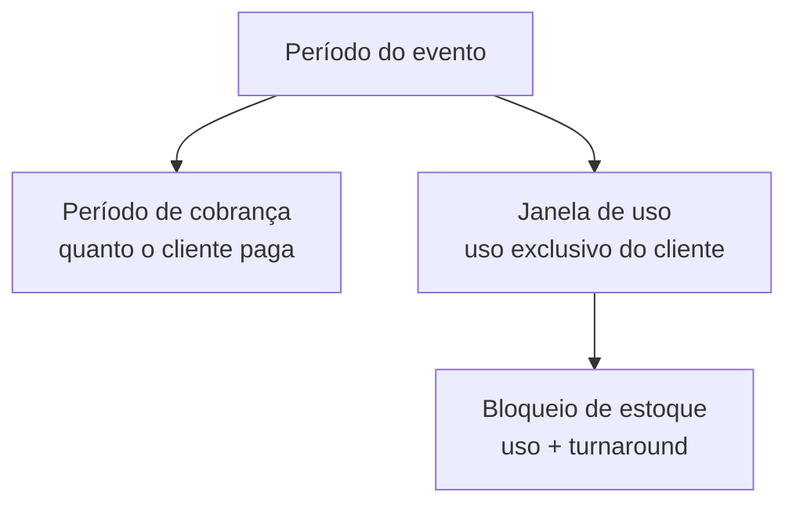
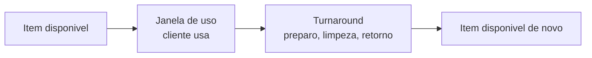

# Duração, cobrança e bloqueio de uso

Na locação, "duração" é três coisas ao mesmo tempo — e elas **não** precisam ser iguais. Quem entende essa diferença cobra certo, não fura agenda e não deixa item parado à toa. Quem mistura tudo, ou cobra a menos, ou trava estoque que poderia estar girando.


Esta página é sobre **locação**. Na **venda**, o item sai em definitivo: não há período de uso nem bloqueio para devolver — só a baixa do estoque. Veja [Locação e venda](../conceitos/locacao-e-venda.md).


## A tríade da locação

Pense em três relógios diferentes correndo sobre o mesmo pedido:

| O relógio | Pergunta que responde | Onde mexe |
| --- | --- | --- |
| **Período de cobrança** | Por quantas locações o cliente paga? | Quanto você fatura |
| **Janela de uso** | Quando o cliente pode usar o item? | A janela de bloqueio de uso |
| **Bloqueio de estoque** | Quando o item fica indisponível para outro cliente? | A disponibilidade no galpão |



O ponto-chave: **o bloqueio de estoque é sempre maior ou igual à janela de uso**, porque depois que o item volta ele ainda precisa de um tempo para ficar pronto de novo. E o **período de cobrança** é independente dos dois — você pode cobrar uma diária por dia de evento mesmo que o item fique bloqueado por mais tempo.

## Período de cobrança

É o bloco **"Período de cobrança"** dentro da seção **Duração** do orçamento. Ele responde a uma pergunta só: **quantas locações cobrar** sobre o valor dos itens.

No caminho feliz, você não mexe em nada: o padrão é **uma locação** (×1) — o cliente paga uma vez pelo valor dos itens. Quando precisar cobrar mais de uma, ligue **"Cobrar mais de um aluguel"** e escolha entre dois jeitos:

- **Quantidade fixa de locações** — você digita o número (ex.: 3 locações). Útil para combinados redondos, sem amarrar a datas.
- **Cálculo por diária** — o sistema conta as diárias a partir do **início e do fim do evento** (definidos na seção Evento). Cada dia vira uma locação cobrada.

Um chip mostra o resultado em tempo real — por exemplo, **×3 · 3 locações cobradas** — para você conferir antes de fechar.


**Por que isso te faz faturar certo:** locação de 4 dias cobrada como "uma diária" é dinheiro que escorre. Com o cálculo por diária, o valor sobe sozinho conforme o evento dura mais — você nunca subfatura por esquecimento.



**"Com recorrência" (em breve):** há um terceiro modo desligado na tela. Ele vai permitir gerar faturas automáticas e ordens de entrega/retirada conforme um contrato de renovação periódica — ainda não está disponível.


## Janela de uso

A **janela de uso** é o período em que os itens ficam destinados ao **uso exclusivo daquele cliente** — quando o uso começa a contar e quando termina. No LocFlow ela aparece no bloco **"Janela de bloqueio de uso"**, logo abaixo do período de cobrança.

Você quase nunca precisa preencher isso: os campos já vêm **pré-preenchidos pela política da sua locadora**. Eles são quatro — *uso exclusivo a partir de* / *até* (datas) e a *hora de início* / *fim* (opcionais). Sem horário, vale o dia inteiro.

### Janela de bloqueio de uso


Este é o texto de ajuda que aparece no "?" da própria tela:

> O período em que os itens ficam destinados ao uso exclusivo deste cliente — quando o uso começa a contar e quando termina. **Não é** o bloqueio total de estoque — o módulo de estoque ainda soma, sobre esta base, o **turnaround** (preparo, limpeza e a logística reversa de disponibilizar o material de novo).
>
> Os campos vêm pré-preenchidos pela política da sua locadora. Você pode ajustar aqui para este orçamento específico, ou alterar a política padrão no Motor de Estoque.
>
> É este período que aparece como **"Bloqueio de uso"** na fatura de locação do cliente.


### Uso × turnaround

Aqui mora a confusão mais comum. A **janela de uso** é o que o cliente "leva". O **bloqueio de estoque** é o que *você* tira de circulação — e ele é maior, porque inclui o **turnaround**:



O cliente vê e paga pela **janela de uso**. O seu galpão fica indisponível pela **janela de uso + turnaround**. Por isso, quando você consulta a disponibilidade de um item, a data em que ele "volta a aparecer" é depois do retorno físico — não no instante em que o cliente devolve.


**Não enxugue o turnaround para parecer mais disponível.** Se você zerar a folga de preparo, o sistema vai oferecer o item para o próximo cliente cedo demais — e você corre o risco de prometer um item que ainda está sujo, quebrado ou na estrada de volta. O turnaround existe para proteger a sua promessa.


## Política de bloqueio

Quem decide **como** a janela de uso vira bloqueio de estoque é a sua política, configurada no **Motor de Estoque** (veja [Motores operacionais](../configuracoes/motores-operacionais.md)). Você escolhe uma vez, e ela vale como padrão para todo orçamento de locação:

| Política | O que ela faz |
| --- | --- |
| **Apenas o período do evento** | A janela de uso é exatamente o período do evento. Sem folga. |
| **Período do evento + folga de preparo** | O período do evento, esticado por uma **folga** antes e depois (o turnaround), configurada no motor. |
| **Derivada das janelas de entrega/retirada** | A janela vem das **datas e horários reais** de entrega e retirada que você agendou, mais a folga de rota. É a mais precisa para quem agenda logística. |
| **Definição manual por orçamento** | O sistema **sempre pede** que você informe a janela à mão, orçamento a orçamento. |

A política preenche os campos sozinha. Você só vê o resultado — e, se quiser conferir qual está valendo, o "?" da janela mostra a **política atual** e um atalho para ajustá-la (se você tiver permissão).

### Ajuste manual por orçamento

Independentemente da política, **você pode sobrescrever a janela em um orçamento específico**. Basta editar qualquer um dos quatro campos: o sistema passa a tratar aquela janela como **manual** e o seu ajuste vence sobre a derivação automática.


Mexeu sem querer? Aparece o link **"Restaurar a janela padrão da organização"** — um toque e os campos voltam a seguir a política, como se você nunca tivesse tocado.


Use o ajuste manual quando um cliente específico precisa do item por mais tempo (ou menos) do que a regra geral — sem ter que mudar a política para todo mundo.

## Por porte

A mesma tela serve do MEI ao operador grande — o que muda é o quanto você mexe nela.

| Seu porte | Como usar a tríade |
| --- | --- |
| **Autônomo / micro** | Deixe tudo no padrão. Cobre ×1, aceite a janela que a política preenche. Você nem precisa pensar em turnaround — o sistema cuida. |
| **Médio** | Ligue o **cálculo por diária** para eventos de vários dias e ajuste a **folga de preparo** no motor para refletir o seu tempo real de limpeza e retorno. |
| **Grande** | Use a política **derivada das janelas de entrega/retirada** para casar o bloqueio com a logística minuto a minuto, e o **ajuste manual** para contratos especiais — controle fino sem virar exceção para o resto da operação. |

---

## Para quem quer os números

A partir daqui é detalhe para quem gosta de saber a conta por trás. Você **não** precisa disso para usar o LocFlow.

### O multiplicador de cobrança

O período de cobrança vira valor através de um **multiplicador** que incide sobre o **subtotal dos itens** (não sobre o frete nem sobre a taxa de serviço):

```
valor dos itens a cobrar = subtotal dos itens × multiplicador
```

E o multiplicador é decidido assim:

| Situação | Multiplicador |
| --- | --- |
| "Cobrar mais de um aluguel" **desligado** | **1** |
| Quantidade fixa de locações | o **número** que você digitou (mínimo 1) |
| Cálculo por diária | o **número de diárias** do evento (mínimo 1) |

A diária conta **as duas pontas do evento**: um evento de segunda a quarta = **3 diárias** (segunda, terça e quarta). Não é "diferença de dias" (que daria 2) — é "dias usados", incluindo o primeiro e o último.

### Como a janela de bloqueio é calculada

Cada política calcula a janela de uso de um jeito. O bloqueio de estoque é sempre essa janela com a folga de turnaround somada nas bordas:

- **Apenas o período do evento:** início = início do evento; fim = fim do evento. Folga zero.
- **Período do evento + folga:** início = início do evento − folga antes; fim = fim do evento + folga depois. A folga é configurada no Motor de Estoque (medida em tempo e aplicada em dias civis, arredondando para cima, de forma conservadora).
- **Derivada das janelas de entrega/retirada:** início = horário-base da **entrega** − folga de rota antes; fim = horário-base da **retirada** + folga de rota depois. Quando não há horário definido no movimento, a borda vale o **dia inteiro**.
- **Definição manual:** exatamente as datas e horários que você informou no orçamento.


**De onde vem a folga:** tanto a folga de preparo quanto a folga de rota são definidas no **Motor de Estoque**, junto da política. Mudou ali, muda em todos os orçamentos novos — exceto os que você ajustou manualmente.


## Situações reais

- **Locação de 3 dias cobrada como uma diária.** Você liga "Cobrar mais de um aluguel" → "Cálculo por diária". O chip mostra ×3 e o valor dos itens triplica — sem você fazer conta.
- **"O item sumiu da disponibilidade até depois da devolução."** É o turnaround. O bloqueio de estoque vai além da janela de uso para cobrir o preparo. Para encurtar, ajuste a folga no Motor de Estoque — não force a janela de uso.
- **Cliente VIP precisa do palco por uma semana extra.** Em vez de mudar a política para todo mundo, edite os campos da janela só naquele orçamento. O ajuste manual vence a política. Depois é só "Restaurar a janela padrão" nos próximos.
- **Devolução combinada para a tarde, não para o dia todo.** Na política derivada das janelas, defina o horário da retirada — o bloqueio fecha na hora certa, liberando o item mais cedo para o próximo evento.

## Próximo passo

- Configure a sua política padrão em [Motores operacionais](../configuracoes/motores-operacionais.md).
- Veja como o bloqueio afeta o que você pode prometer em [Galpões e disponibilidade](../estoque/galpoes-e-disponibilidade.md).
- Monte uma proposta do início ao fim em [Criando um orçamento](criando-um-orcamento.md).
- Entenda as duas modalidades em [Locação e venda](../conceitos/locacao-e-venda.md).
