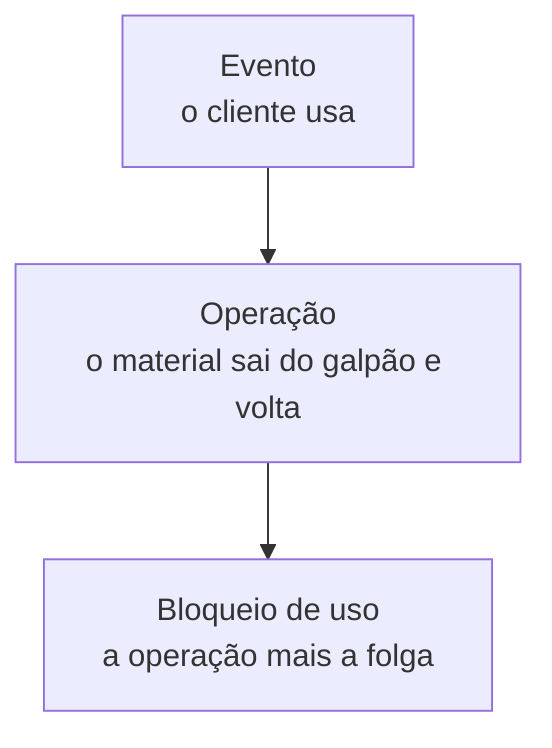

# Duração, cobrança e bloqueio de uso

Na locação, "duração" é três coisas ao mesmo tempo — e elas **não** são iguais. Quem entende essa diferença cobra certo, não fura agenda e não promete um item que ainda está na rua. Quem mistura tudo, ou cobra a menos, ou trava estoque que poderia estar girando.


Esta página é sobre **locação**. Na **venda**, o item sai em definitivo: não há retorno nem bloqueio para devolver — só a baixa do estoque. Veja [Locação e venda](../conceitos/locacao-e-venda.md).


## As três durações

Pense em três relógios diferentes correndo sobre o mesmo pedido:

| O relógio | Pergunta que responde | Onde mexe |
| --- | --- | --- |
| **Período de cobrança** | Por quantas locações o cliente paga? | Quanto você fatura |
| **Evento** | Quando o cliente usa os itens de fato? | A data que o cliente te deu |
| **Bloqueio de uso** | Quando o item fica indisponível para outro cliente? | A disponibilidade no galpão |

Entre o evento e o bloqueio existe uma quarta coisa, e é ela que amarra tudo: a **operação** — o vai e volta real do material, do instante em que ele sai do galpão até o instante em que volta.


```mermaid
flowchart TB
    EV["Evento<br/>o cliente usa"] --> OP["Operação<br/>o material sai do galpão e volta"]
    OP --> BL["Bloqueio de uso<br/>a operação mais a folga"]
```

Leia de baixo para cima e você tem a regra da casa: **o bloqueio cobre a operação, e a operação cobre o evento**. O **período de cobrança** é independente dos três — você pode cobrar uma diária por dia de evento mesmo que o item fique bloqueado por mais tempo.

## Período de cobrança {#periodo-de-cobranca}

É o bloco **"Período de cobrança"** dentro da seção **Duração** do orçamento. Ele responde a uma pergunta só: **quantas locações cobrar** sobre o valor dos itens.

No caminho feliz, você não mexe em nada: o padrão é **uma locação** (×1) — o cliente paga uma vez pelo valor dos itens. Quando precisar cobrar mais de uma, ligue **"Cobrar mais de um aluguel"** e escolha entre dois jeitos:

- **Quantidade fixa de locações** — você digita o número (ex.: 3 locações). Útil para combinados redondos, sem amarrar a datas.
- **Cálculo por diária** — o sistema conta as diárias a partir do **início e do fim do evento** (definidos na seção Evento). Cada dia vira uma locação cobrada.

Um chip mostra o resultado em tempo real — por exemplo, **×3 · 3 locações cobradas** — para você conferir antes de fechar.


**Por que isso te faz faturar certo:** locação de 4 dias cobrada como "uma diária" é dinheiro que escorre. Com o cálculo por diária, o valor sobe sozinho conforme o evento dura mais — você nunca subfatura por esquecimento.



**"Com recorrência" (em breve):** há um terceiro modo desligado na tela. Ele vai permitir gerar faturas automáticas e ordens de entrega/retirada conforme um contrato de renovação periódica — ainda não está disponível.


## Janela de bloqueio de uso {#janela-de-bloqueio-de-uso}

A **janela de bloqueio de uso** é o período em que os itens ficam reservados **àquele cliente** e, portanto, **indisponíveis para qualquer outro**. No orçamento ela aparece no bloco de mesmo nome, logo abaixo do período de cobrança.

Você quase nunca precisa preencher isso: os campos já vêm **calculados pela política da sua locadora**. São quatro — *uso exclusivo a partir de* / *até* (datas) e a *hora de início* / *fim* (opcionais). Sem horário, vale o dia inteiro.


Este é o texto de ajuda que aparece no "?" da própria tela:

> O período em que os itens ficam destinados ao uso exclusivo deste cliente — quando o uso começa a contar e quando termina.
>
> Os campos vêm pré-preenchidos pela política da sua locadora. Você pode ajustar aqui para este orçamento específico, ou alterar a política padrão no Motor de Estoque.
>
> É este período que aparece como **"Bloqueio de uso"** na fatura de locação do cliente.


### A regra de ouro: o bloqueio segue a saída e a volta, não o evento

Este é o ponto que mais gera confusão — e o que mais custa caro quando se erra.

O que tira um item de circulação **não é o evento**. É o **caminhão saindo do galpão**. O material sai **antes** de o evento começar (para dar tempo de montar) e volta **depois** de ele acabar (porque alguém precisa ir buscar). Se você ancorar o bloqueio no evento, cria um buraco dos dois lados:

| Momento real | Ancorado no evento, o sistema diria | A verdade no galpão |
| --- | --- | --- |
| Sexta de manhã, o material sai para a montagem | "Ainda está livre" | Já saiu. **Não está livre.** |
| Sábado, o evento acontece | "Ocupado" | Ocupado — só aqui os dois batem |
| Domingo, a equipe vai recolher | "Já está livre" | Ainda está na rua. **Não está livre.** |

São essas duas bordas que produzem a reserva dupla: o sistema oferece ao próximo cliente um item que fisicamente não está no galpão. Por isso, no LocFlow, **o bloqueio sempre ancora na operação** — do momento em que o material sai até o momento em que volta —, e a configuração só decide **quanta folga** somar em volta disso.

### Quando a ponta é do cliente, vale o dia todo

Há uma diferença importante entre **sua equipe** levar/buscar e o **cliente** retirar/devolver no galpão:

- **Sua equipe leva ou busca** — existe uma janela de horário agendada. O bloqueio usa o **início da janela de entrega** e o **fim da janela de recolhimento**. É preciso ao minuto.
- **O cliente retira ou devolve no galpão** — existe uma **data contratada**, mas **não existe hora garantida**. O cliente aparece quando aparece. Nesse caso o LocFlow considera **o dia inteiro**: a retirada abre o bloqueio à meia-noite daquele dia, e a devolução só o fecha no fim do dia.


Isso é proposital, não excesso de zelo. Se o cliente combinou devolver "na segunda" e o sistema liberasse o item às 9h da manhã de segunda, bastaria ele aparecer às 17h para você ter dois pedidos brigando pelo mesmo item. Sem hora combinada, o dia todo é a única leitura honesta.


### E o preparo depois que o item volta?

Voltar ao galpão não é o mesmo que estar pronto para sair de novo. Depois do retorno ainda vêm conferência, limpeza e eventual manutenção — o **preparo**.

No **Motor de Estoque** existe um campo de **tempo de preparo**, em minutos, e ele tem efeito real no cálculo. Funciona como um **piso**: vale para os produtos que não têm um tempo de manutenção próprio cadastrado (quando o produto tem o seu, o dele vence). Enquanto o preparo corre, o item ainda **não conta como disponível** — é isso que faz a data em que ele "reaparece" na previsão ser um pouco depois do retorno físico.


Quer ver esse efeito na prática? É a **Data de Liberação** que aparece em [Posição e previsão de estoque](../estoque/posicao-e-previsao.md).


## Política de bloqueio {#politica-de-bloqueio}

Quem decide **quanta folga** o bloqueio ganha em volta da operação é a sua política, configurada no **Motor de Estoque** (veja [Motores operacionais](../configuracoes/motores-operacionais.md#motor-de-estoque)). Você escolhe uma vez e ela vale como padrão para todo orçamento de locação. São **duas** opções:

| Política | O que ela faz | Quando usar |
| --- | --- | --- |
| **Mínimo justo** | O bloqueio é **exatamente** a operação: da saída do material até a volta dele. Sem nenhuma folga. | Operação muito previsível, com horário confirmado nas duas pontas. |
| **Com folga** *(recomendada)* | A operação **mais um tempo extra** antes e depois, para absorver atraso. | Praticamente todo mundo. É o padrão de uma locadora nova. |


**Prefira "Com folga".** O "Mínimo justo" assume que tudo acontece no horário — e trânsito, cliente atrasado e caminhão que quebra não avisam antes. Sem nenhuma margem, o LocFlow oferece o item ao próximo cliente no minuto seguinte ao previsto para o retorno, e um atraso pequeno vira problema de dois pedidos em vez de um.


### As duas folgas: equipe e cliente

A folga não é um número só, porque **o atraso não tem a mesma natureza nas duas formas de operar**:

| A folga de… | Cobre o quê | Ordem de grandeza típica |
| --- | --- | --- |
| **Equipe** (você entrega e recolhe) | Trânsito, rota mais lenta que o previsto, uma parada que demorou, imprevisto no caminho. | De dezenas de minutos a poucas horas |
| **Cliente** (ele retira e devolve no galpão) | O cliente que aparece mais tarde, remarca, ou devolve só no dia seguinte. | De algumas horas a um dia |

Cada uma tem **um valor antes e um valor depois**, sempre **em minutos**. E — este detalhe importa — a folga é escolhida **por ponta**: numa operação **mista** (sua equipe entrega, mas o cliente devolve no galpão), a abertura do bloqueio usa a folga de **equipe** e o fechamento usa a folga de **cliente**.


Uma locadora nova já nasce com **1 hora de folga de equipe antes e 1 hora depois**, e **zero** de folga de cliente. As de cliente nascem em zero porque a ponta do cliente **já vale o dia inteiro** — só configure ali se quiser cobrir o cliente que atrasa para o **dia seguinte**.


### Como estimar a sua folga (mesmo sem ter os dados)

Você não precisa de relatório para acertar. Três perguntas resolvem:

1. **"Qual foi o pior atraso comum do último mês?"** Não o desastre isolado — o atraso que se repete toda semana. Se as entregas costumam sair meia hora depois do previsto, sua folga de equipe é de pelo menos **30** minutos.
2. **"Quanto tempo leva uma volta extra até o galpão?"** Se o retorno de rota leva 45 minutos, ponha **45** na folga de equipe *depois*. É o tempo real entre "terminou de carregar" e "está no pátio".
3. **"Com que frequência o cliente devolve no dia seguinte?"** Se acontece de vez em quando, uma folga de cliente *depois* de **1440** minutos (um dia inteiro) evita que você prometa a alguém um item que ainda está com o cliente anterior.


**Comece conservador e vá apertando.** Folga demais custa alguns pedidos que você poderia ter aceitado; folga de menos custa um cliente na mão no dia do evento. Comece com folga sobrando, veja onde a agenda realmente aperta e só então reduza — nessa ordem.


### Ajuste manual por orçamento

Independentemente da política, **você pode ajustar a janela em um orçamento específico**. Basta editar qualquer um dos quatro campos: o sistema passa a tratar aquela janela como **manual** e o seu ajuste vence o cálculo automático.

Use quando um cliente específico precisa do item por mais tempo do que a regra geral — sem mudar a política para todo mundo.


**Dá para esticar, não dá para encolher.** O ajuste manual só é aceito se a janela continuar **cobrindo a operação inteira**. Encolher o bloqueio para menos do que o vai e volta real seria dizer que o item está no galpão enquanto ele está num caminhão — e é exatamente isso que o LocFlow passou a impedir.



Mexeu sem querer? Aparece o link **"Restaurar a janela padrão da organização"** — um toque e os campos voltam a seguir a política, como se você nunca tivesse tocado.


## A regra que o LocFlow cobra de você {#a-regra-que-o-locflow-cobra-de-voce}

Junte tudo e sobra uma frase:

> **O bloqueio cobre a operação. A operação cobre o evento.**

Não é preferência de configuração, é ordem física. O material precisa estar **fora do galpão** durante todo o evento, e precisa **constar bloqueado** durante todo o tempo em que está fora. O LocFlow verifica isso e, quando algo não fecha, **avisa e pede correção antes de você seguir** — em vez de deixar passar calado, como acontecia antes.

| O que você fez | O que o LocFlow diz |
| --- | --- |
| Ajustou a janela à mão para menos do que o vai e volta real | *A janela de bloqueio do estoque não cobre toda a operação. O material sai do galpão e volta dentro desse período, então ele não pode constar livre.* |
| Agendou o recolhimento **antes** de o evento terminar | *A operação não cobre o evento. O material precisa ser entregue antes do evento começar e recolhido depois que ele terminar.* |
| Deixou o bloqueio menor que o evento, sem a logística ainda definida | *A janela de bloqueio do estoque não cobre o evento. O estoque precisa ficar reservado durante todo o evento.* |
| Agendou o retorno para **antes** da saída | *O retorno do material está agendado antes da saída. Corrija as datas para que o material volte depois de sair.* |
| Ainda não definiu quando o material sai (ou volta) | *Defina quando o material sai do galpão para o estoque poder ser reservado.* |

Esses avisos aparecem como **pendências** do orçamento: você vê o que está errado, corrige o dado e segue. Nada do que você já preencheu é perdido no caminho.


**Isso é proteção, não burocracia.** Cada um desses avisos representa um pedido que você teria fechado prometendo um item indisponível. É muito mais barato corrigir uma data agora do que ligar para o cliente na véspera do evento.


## Por porte

A mesma tela serve do MEI ao operador grande — o que muda é o quanto você mexe nela.

| Seu porte | Como usar as durações |
| --- | --- |
| **Autônomo / micro** | Deixe tudo no padrão: cobre ×1 e aceite a janela que a política calcula, com a folga de 1 hora que já vem configurada. Você não precisa pensar em bloqueio — o sistema cuida. |
| **Médio** | Ligue o **cálculo por diária** para eventos de vários dias e ajuste as **folgas** para refletir o seu atraso real de rota. Se você também atende no balcão, configure a folga de cliente. |
| **Grande** | Afine as quatro folgas separadamente (equipe e cliente, antes e depois) para casar o bloqueio com a operação minuto a minuto, e use o **ajuste manual** em contratos especiais — controle fino sem virar exceção para o resto da operação. |

---

## Para quem quer os números

A partir daqui é detalhe para quem gosta de saber a conta por trás. Você **não** precisa disso para usar o LocFlow.

### O multiplicador de cobrança

O período de cobrança vira valor através de um **multiplicador** que incide sobre o **subtotal dos itens** (não sobre o frete nem sobre a taxa de serviço):

```
valor dos itens a cobrar = subtotal dos itens × multiplicador
```

E o multiplicador é decidido assim:

| Situação | Multiplicador |
| --- | --- |
| "Cobrar mais de um aluguel" **desligado** | **1** |
| Quantidade fixa de locações | o **número** que você digitou (mínimo 1) |
| Cálculo por diária | o **número de diárias** do evento (mínimo 1) |

A diária conta **as duas pontas do evento**: um evento de segunda a quarta = **3 diárias** (segunda, terça e quarta). Não é "diferença de dias" (que daria 2) — é "dias usados", incluindo o primeiro e o último.

### Como a janela de bloqueio é calculada {#como-a-janela-de-bloqueio-e-calculada}

A conta tem três passos, sempre nesta ordem.

**Passo 1 — achar a abertura (quando o material sai):**

| Como o material sai | Abertura da operação |
| --- | --- |
| Sua equipe entrega, com janela de horário | O **início** da janela de entrega |
| Sua equipe entrega, sem horário definido | O **começo do dia** da entrega |
| O cliente retira no galpão | O **começo do dia** contratado (vale o dia todo) |

**Passo 2 — achar o fechamento (quando o material volta):**

| Como o material volta | Fechamento da operação |
| --- | --- |
| Sua equipe recolhe, com janela de horário | O **fim** da janela de recolhimento |
| Sua equipe recolhe, sem horário definido | O **fim do dia** do recolhimento |
| O cliente devolve no galpão | O **fim do dia** contratado (vale o dia todo) |

**Passo 3 — aplicar a folga da política:**

- **Mínimo justo:** nenhuma folga. O bloqueio é exatamente a abertura → fechamento dos passos 1 e 2.
- **Com folga:** recua a abertura pela folga *antes* e adia o fechamento pela folga *depois* — **cada borda usando a folga do grupo que opera aquela ponta** (equipe ou cliente).

Um exemplo com a configuração padrão (1 hora de folga de equipe dos dois lados):

```
Entrega pela equipe        sexta,   janela 08:00–12:00
Recolhimento pela equipe   domingo, janela 14:00–18:00

Operação   →  sexta 08:00  ..  domingo 18:00
Bloqueio   →  sexta 07:00  ..  domingo 19:00      (−60 min / +60 min)
```

E o mesmo pedido, mas com o cliente devolvendo no galpão na segunda (folga de cliente em zero):

```
Operação   →  sexta 08:00  ..  segunda, fim do dia
Bloqueio   →  sexta 07:00  ..  segunda, fim do dia   (−60 min de equipe / +0 de cliente)
```


**Quando você ajusta à mão**, a janela é exatamente a que você informou — a folga da política **não** é somada por cima, senão você nunca conseguiria definir o período que pediu. Mas a verificação continua valendo: a janela precisa cobrir a operação.



**De onde vêm as folgas:** as quatro (equipe antes/depois, cliente antes/depois) são definidas no **Motor de Estoque**, junto da política. Mudou ali, muda em todos os orçamentos novos — exceto os que você ajustou manualmente.


## Situações reais

- **Locação de 3 dias cobrada como uma diária.** Você liga "Cobrar mais de um aluguel" → "Cálculo por diária". O chip mostra ×3 e o valor dos itens triplica — sem você fazer conta.
- **"O item some da disponibilidade antes de o evento começar."** Está certo. Ele sai do galpão na véspera para a montagem — e a partir daí não está disponível para mais ninguém, mesmo que o evento só comece amanhã.
- **"O item continua bloqueado depois da devolução."** É o **preparo**: conferência e limpeza antes de ele contar como disponível de novo. Para encurtar, ajuste o tempo de preparo no Motor de Estoque.
- **Cliente VIP precisa do palco por uma semana extra.** Em vez de mudar a política para todo mundo, **estique** a janela só naquele orçamento. O ajuste manual vence a política — e esticar sempre é aceito.
- **"Tentei encurtar a janela e o sistema não deixou."** Porque ela ficaria menor que o vai e volta real do material. Se a operação mudou de verdade, ajuste as datas de entrega e recolhimento — o bloqueio acompanha sozinho.
- **Cliente busca sexta e devolve segunda, no balcão.** As duas pontas são dele, então valem os dias inteiros: o bloqueio vai do começo de sexta ao fim de segunda. Se parece muito, é porque é — mas é o preço de não ter hora combinada. Marque um horário com ele e a janela aperta sozinha.

## Próximo passo

- Configure a sua política e as folgas em [Motores operacionais](../configuracoes/motores-operacionais.md#motor-de-estoque).
- Veja como o bloqueio afeta o que você pode prometer em [Galpões e disponibilidade](../estoque/galpoes-e-disponibilidade.md).
- Entenda de onde saem as datas da operação em [Movimentos, janelas e galpão de origem](movimentos-e-janelas.md).
- Monte uma proposta do início ao fim em [Criando um orçamento](criando-um-orcamento.md).
- Entenda as duas modalidades em [Locação e venda](../conceitos/locacao-e-venda.md).
